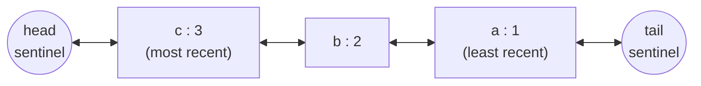

# LRU Cache — L4 (Mid-level / SDE2) LLD Interview

> **Level expectation:** implement `get` and `put` in O(1) with a hash map and a doubly linked list, handle edge cases (update existing key, capacity 1, missing keys), explain the complexity, and know the `LinkedHashMap` shortcut.

> 🆕 New to LRU caches? Read [00-understand-the-product.md](00-understand-the-product.md) first. It explains caches and eviction using things you use every day.

Legend: **🧑‍💼 Interviewer** · **🧑‍💻 Candidate** · **📝 Note** = commentary for you.

---

## 1. Clarifying requirements

**🧑‍💼 Interviewer:** Implement an LRU cache.

**🧑‍💻 Candidate:** Let me confirm the contract:
- `get(key)` returns the value or "not found", and counts as a *use* (makes the key most recent)?
- `put(key, value)` inserts or updates; if the cache is full, evict the least recently used entry first?
- Does `put` on an existing key count as a use?
- Required complexity: O(1) for both?
- Single-threaded for now?
- Can values be `null`?

**🧑‍💼 Interviewer:** Yes to all; `put` on an existing key updates and counts as a use. Single-threaded first. No nulls.

**🧑‍💻 Candidate:** So:
- **Functional:** `get`, `put`, eviction of the LRU entry at capacity, update-in-place.
- **Non-functional:** O(1) time for `get` and `put`; O(capacity) memory.

> 📝 **Note:** "Does `get` count as a use?" is the question that shows you know what LRU means. Asking about `null` values shows you've thought about the API: if `null` were allowed, `get` returning `null` would be ambiguous ("missing" or "cached null"?).

---

## 2. Core entities

**🧑‍💻 Candidate:**
- `Cache<K, V>`: interface (so other policies can come later).
- `LruCache<K, V>`: the implementation.
- `Node<K, V>`: private inner class: key, value, `prev`, `next`.

Why the node stores the **key** too: when I evict the last node in the list, I need its key to remove it from the map.

---

## 3. Interface

```java
public interface Cache<K, V> {
    Optional<V> get(K key);
    void put(K key, V value);
    boolean remove(K key);
    int size();
    int capacity();
}
```

`Optional<V>` instead of `null` makes "not found" explicit in the type.

---

## 4. Design: why HashMap + doubly linked list

**🧑‍💻 Candidate:** I need two things fast:
1. **Find** an entry by key → `HashMap`: O(1).
2. **Track order** and **move** an entry to the front / **remove** the oldest → doubly linked list: O(1) *if I already have a reference to the node*.

The map gives me that reference. Together, everything is O(1). ([Hash map & linked list](../../concepts/hashmap-and-linked-list.md).)



**🧑‍💼 Interviewer:** Why doubly linked? Wouldn't singly linked be enough?

**🧑‍💻 Candidate:** To remove a node from the middle I must update the *previous* node's `next` pointer. In a singly linked list, finding the previous node means walking from the head: O(n). With `prev` pointers, it's O(1).

**🧑‍💼 Interviewer:** What are `head` and `tail`?

**🧑‍💻 Candidate:** **Sentinel** nodes: dummies that are always there and hold no data. Without them, every insert/remove needs special cases: "is the list empty?", "is this the first node?", "is this the last node?". With sentinels, every real node always has a non-null `prev` and `next`, so `unlink` and `addAfterHead` are 4 lines each with no `if`s.

---

## 5. Code

Full file: [LruCache.java](java/src/lrucache/LruCache.java) (it also has TTL, stats and a listener, which are L5 additions; the core is below).

```java
public final class LruCache<K, V> implements Cache<K, V> {
    private static final class Node<K, V> {
        final K key;
        V value;
        Node<K, V> prev, next;
        Node(K key, V value) { this.key = key; this.value = value; }
    }

    private final int capacity;
    private final Map<K, Node<K, V>> index = new HashMap<>();
    private final Node<K, V> head = new Node<>(null, null);   // most recent side
    private final Node<K, V> tail = new Node<>(null, null);   // least recent side

    public LruCache(int capacity) {
        if (capacity <= 0) throw new IllegalArgumentException("capacity must be > 0");
        this.capacity = capacity;
        head.next = tail;
        tail.prev = head;
    }

    public Optional<V> get(K key) {
        Node<K, V> node = index.get(key);
        if (node == null) return Optional.empty();
        moveToFront(node);                       // a read makes it recent
        return Optional.of(node.value);
    }

    public void put(K key, V value) {
        Node<K, V> existing = index.get(key);
        if (existing != null) {                  // update in place, don't grow
            existing.value = value;
            moveToFront(existing);
            return;
        }
        if (index.size() == capacity) {          // full: evict least recent
            Node<K, V> lru = tail.prev;
            unlink(lru);
            index.remove(lru.key);               // this is why the node stores its key
        }
        Node<K, V> node = new Node<>(key, value);
        index.put(key, node);
        addAfterHead(node);
    }

    private void moveToFront(Node<K, V> node) { unlink(node); addAfterHead(node); }

    private void addAfterHead(Node<K, V> node) {
        node.prev = head;
        node.next = head.next;
        head.next.prev = node;
        head.next = node;
    }

    private void unlink(Node<K, V> node) {
        node.prev.next = node.next;
        node.next.prev = node.prev;
    }
}
```

**🧑‍💻 Candidate:** Walking through `put` when full, capacity 3, list `c, b, a`, putting `d`:
1. `d` not in map.
2. Size 3 == capacity → `lru = tail.prev` = `a` → unlink → remove `"a"` from map.
3. Create node `d`, add to map, insert after head → `d, c, b`.

### Complexity

| Operation | Time | Why |
|---|---|---|
| `get` | O(1) | Map lookup + 4 pointer changes + 4 more |
| `put` | O(1) | Map lookup/insert + pointer changes (+ O(1) eviction) |
| Space | O(capacity) | One map entry + one node per item |

(HashMap is O(1) **on average**: a hash collision makes it slower, but Java's HashMap degrades to O(log n) per bucket in the worst case, not O(n). See [big-O complexity](../../concepts/big-o-complexity.md).)

---

## 6. Follow-ups

**🧑‍💼 Interviewer:** Is there a shortcut in the JDK?

**🧑‍💻 Candidate:** Yes. `LinkedHashMap` is literally a hash map plus a doubly linked list. With `accessOrder = true` it moves entries on every `get`, and overriding `removeEldestEntry` makes it evict ([LinkedHashMap](../../libraries/java/linkedhashmap.md)):

```java
Map<K, V> lru = new LinkedHashMap<>(16, 0.75f, true) {
    @Override protected boolean removeEldestEntry(Map.Entry<K, V> eldest) {
        return size() > capacity;
    }
};
```

That's [LinkedHashMapLruCache.java](java/src/lrucache/LinkedHashMapLruCache.java). In real code I'd use this (or Caffeine). Interviewers usually want the hand-written one to see that I understand *why* it's O(1). The test `handWrittenMatchesLinkedHashMap` runs 100,000 random operations against both and checks they always agree.

**🧑‍💼 Interviewer:** How would you test it?

**🧑‍💻 Candidate:** Edge cases first, since that's where LRU bugs live:
- evict order with no reads; then with a `get` that should save an old key
- `put` on an existing key: value updated, size unchanged, becomes most recent
- capacity 1
- `remove` of a missing key
- then a randomized comparison against a trusted reference (`LinkedHashMap`): it finds bugs I didn't think to write tests for.

**🧑‍💼 Interviewer:** In JavaScript?

**🧑‍💻 Candidate:** A JS `Map` remembers insertion order, so "move to newest" is `delete` then `set`, and the oldest key is `map.keys().next().value`. Twenty lines, O(1) ([LRU with Map](../../libraries/js/lru-with-map.md), code in [js/lruCache.js](js/lruCache.js)). The file also has the hand-written linked-list version.

**🧑‍💼 Interviewer:** What if two threads use this cache?

**🧑‍💻 Candidate:** It breaks: two threads relinking nodes at the same time can corrupt the list (lost nodes, cycles, `NullPointerException`). Simplest fix: wrap every method, **including `get`**, in a lock. `get` moves the node, so it's a write. That's the [L5](L5-senior.md) discussion.

---

## 7. What the interviewer was evaluating (L4)

- [ ] Clarified that `get` counts as use and how updates behave
- [ ] Chose HashMap + doubly linked list and explained why each is needed
- [ ] Sentinels (or correct handling of empty/first/last cases)
- [ ] Node stores its key (needed for eviction)
- [ ] Correct update-in-place without growing
- [ ] Stated complexity, including "average O(1)" for the map
- [ ] Knew `LinkedHashMap` as the production shortcut
- [ ] Sensible tests, especially edge cases

## 8. Common mistakes at this level

| Mistake | Why it's wrong |
|---|---|
| `ArrayList` or `LinkedList` + `indexOf`/`remove(Object)` | O(n) per operation |
| Timestamps in a `HashMap`, scan for the oldest on eviction | O(n) eviction |
| Singly linked list | O(n) to unlink from the middle |
| Forgetting to remove the evicted key from the map | Map grows forever; `get` returns evicted values |
| `put` on an existing key adds a second node | Size grows, list corrupts |
| `get` that doesn't move the node | That's FIFO, not LRU |
| `java.util.LinkedList` for the list | Its `remove(node)` is O(n): it doesn't give you node references |

➡️ Next: [L5-senior.md](L5-senior.md)
