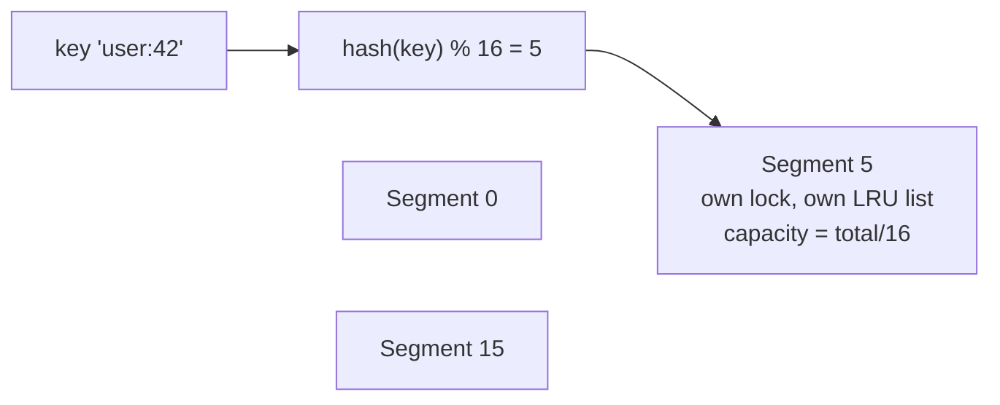

# LRU Cache — L5 (Senior) LLD Interview

> **Level expectation:** the O(1) structure is a given. You make it a usable component: thread-safe (and you know *why* reads need the lock), scalable under contention (lock striping), time-aware (TTL with an injected `Clock`), observable (stats, eviction listener), and extensible (LFU behind the same interface). You prove correctness with a property test and a contention test. Read [L4-mid.md](L4-mid.md) first.

Legend: **🧑‍💼 Interviewer** · **🧑‍💻 Candidate** · **📝 Note** = commentary for you.

---

## 1. Requirements

**🧑‍💻 Candidate:** I'll assume this is an in-process cache inside a web service (e.g. caching user profiles in front of a DB):
- Used by **~200 request threads** concurrently.
- Entries go stale: **TTL**, e.g. 5 minutes.
- Some data is accessed by *frequency* more than recency → possibly **LFU**.
- Ops needs **hit rate** and **eviction** metrics.
- Callers want to react to evictions (e.g. close a resource, emit a metric).

---

## 2. Thread safety: `get` is a write

**🧑‍💼 Interviewer:** Make it thread-safe.

**🧑‍💻 Candidate:** The key insight first: **in an LRU cache, `get` modifies the structure.** It unlinks the node and relinks it at the front. So a "read-write lock" (many readers, one writer) doesn't help: every `get` needs the *write* lock. ([Thread-safety basics](../../concepts/thread-safety-basics.md), [locks](../../libraries/java/locks-and-synchronized.md).)

What happens without a lock: two threads call `get` on neighbouring nodes at the same time, each rewrites `prev`/`next` pointers based on what it read, and the list ends up with a node pointing at a node that's no longer in the list. The result is lost entries, cycles (infinite loops) or `NullPointerException`s.

> 📝 **Note:** We verified this: removing the lock in the contention test (32 threads × 20,000 ops) produces **600,000+ errors** every run.

### Option 1: Decorator with one lock — [SynchronizedCache.java](java/src/lrucache/SynchronizedCache.java)

```java
public final class SynchronizedCache<K, V> implements Cache<K, V> {
    private final Cache<K, V> delegate;
    private final Object lock = new Object();

    public Optional<V> get(K key) { synchronized (lock) { return delegate.get(key); } }
    public void put(K key, V value) { synchronized (lock) { delegate.put(key, value); } }
    ...
}
```

- **Decorator** pattern ([design patterns](../../concepts/design-patterns.md)): `LruCache` stays simple and single-threaded; thread safety is added by wrapping. The same wrapper works for `LfuCache`. Single responsibility.
- Critical sections are tiny (a map lookup + a few pointer writes), so one lock handles **millions of ops/sec** when uncontended.

### Option 2: Lock striping — [StripedCache.java](java/src/lrucache/StripedCache.java)

**🧑‍💼 Interviewer:** 200 threads all queue on one lock. Can you do better?

**🧑‍💻 Candidate:** Split the cache into N **segments**, each its own `LruCache` with its own lock. A key always maps to the same segment by hash:



```java
private Cache<K, V> segmentFor(K key) {
    int h = key.hashCode();
    h ^= (h >>> 16);                       // mix high bits into low bits, like HashMap does
    return segments.get(Math.floorMod(h, segments.size()));
}
```

- Threads using keys in different segments never block each other → contention drops roughly N×.
- **Trade-off:** LRU order is now per segment. The cache evicts the least recent entry *in that segment*, not globally. With a good hash and many entries that's statistically very close to true LRU ("approximately LRU"), and it's what most production caches do.
- **Why mix the hash bits:** many `hashCode()`s differ only in high bits; `% 16` only looks at low bits → everything lands in a few segments.
- Capacity is split so the total is exact (`stripedCacheRespectsTotalCapacity`).

**🧑‍💼 Interviewer:** Why not just use `ConcurrentHashMap` + `ConcurrentLinkedDeque`?

**🧑‍💻 Candidate:** Each is thread-safe on its own, but "move this node to the front" touches both, and that compound operation isn't atomic. You'd get a map entry pointing at a node another thread just removed from the deque. Also `ConcurrentLinkedDeque.remove(Object)` is O(n). Combining two concurrent structures doesn't make the combination thread-safe; this is the most common senior-level mistake on this question. ([Concurrent collections](../../libraries/java/concurrent-collections.md).)

> 📝 **Note:** Caffeine solves this differently: reads go into a lock-free ring buffer, and the LRU list is updated *later* in batches by one thread. Reads never wait for the list. Mentioning that idea (without having to implement it) is a strong signal. See [L6](L6-staff.md) and [Caffeine](../../libraries/java/caffeine-and-guava-cache.md).

---

## 3. TTL with an injected clock

```java
public LruCache(int capacity, Duration ttl, Clock clock, EvictionListener<K, V> listener)

// on put:  node.expiresAtMillis = clock.millis() + ttl.toMillis();
// on get:  if (clock.millis() >= node.expiresAtMillis) { remove it; count a miss; return empty; }
```

- **Lazy expiry:** checked on `get`. No background thread scanning millions of entries.
- **Downside of lazy-only:** expired entries that nobody reads sit in memory until LRU eviction pushes them out. Since capacity is bounded, that's acceptable. (Caffeine adds a timer wheel for proactive cleanup.)
- **`Clock` injected** ([time & clock](../../libraries/java/time-and-clock.md)): the test advances a `MutableClock` by 5 minutes instead of sleeping (`ttlExpiresLazily`).
- **TTL from write** (expire 5 min after `put`) vs **from access** (5 min after last `get`, a "session" timeout). I implemented from-write. From-access would update `expiresAt` in `get`.

---

## 4. Observability: stats and eviction listener

```java
public record CacheStats(long hits, long misses, long evictions) {
    public double hitRate() { ... }
}

@FunctionalInterface
public interface EvictionListener<K, V> {
    enum Cause { CAPACITY, EXPIRED, REPLACED, REMOVED }
    void onEviction(K key, V value, Cause cause);
}
```

**🧑‍💻 Candidate:** Hit rate is *the* cache metric. A cache at 30% hit rate is mostly overhead. Evictions by cause tell you *why*: lots of `CAPACITY` evictions with a low hit rate → cache too small; lots of `EXPIRED` → TTL too short.

The listener is called while the lock is held (in the synchronized wrapper), so it must be fast: emit a metric, don't do I/O.

---

## 5. Another policy: LFU — [LfuCache.java](java/src/lrucache/LfuCache.java)

**🧑‍💼 Interviewer:** Some keys are popular all day; a burst of one-off keys shouldn't evict them. Ideas?

**🧑‍💻 Candidate:** That's the weakness of LRU: a **scan** (one-off reads of many keys) flushes popular entries. **LFU** (least *frequently* used) keeps a count per key and evicts the lowest count. O(1) design:

```text
values   : key -> value
counts   : key -> access count
buckets  : count -> LinkedHashSet<key>   (keys with that count, oldest first)
minCount : the smallest count present
```

- `get`: move key from bucket `c` to bucket `c+1`; if bucket `c` became empty and `c == minCount`, `minCount++`.
- Evict: first key of `buckets.get(minCount)` (least frequent; among ties, the oldest). That's the LRU tie-break.
- New key: count 1, `minCount = 1`.

LFU has its own problem: **old popularity never fades**. A key read 10,000 times yesterday is never evicted. Real systems decay counts over time. More in [cache eviction policies](../../concepts/cache-eviction-policies.md).

Both implement `Cache<K, V>`, so callers choose a policy at construction: the **Strategy** idea, applied at the class level.

---

## 6. Testing

| Test | What it proves |
|---|---|
| `evictsLeastRecentlyUsed`, `getRefreshesRecency`, `putExistingKeyUpdatesAndRefreshes`, `capacityOne` | Core semantics and edge cases |
| `handWrittenMatchesLinkedHashMap` | **Property test**: 100,000 random get/put/remove ops; must match `LinkedHashMap` after every op. Finds bugs you didn't think of |
| `ttlExpiresLazily` | TTL with a fake clock, no sleeping |
| `evictionListenerAndStats` | Causes in order: `REPLACED`, `CAPACITY`, `REMOVED`; 50% hit rate |
| `lfuEvictsLeastFrequentThenOldest` | Frequency, then recency tie-break |
| `synchronizedCacheSurvivesContention` | 32 threads × 20,000 ops: no exceptions, size never above capacity |
| `stripedCacheRespectsTotalCapacity` | Segments add up to exactly the configured capacity |

> 📝 **Note:** The property test (random operations compared against a trusted reference) is a senior-level testing technique worth naming in interviews. It's how you test data structures properly.

---

## 7. What the interviewer was evaluating (L5)

- [ ] Recognised that `get` mutates → read-write locks don't help
- [ ] Decorator for thread safety, keeping the core single-threaded
- [ ] Lock striping, with the "approximately LRU" trade-off and hash mixing
- [ ] Explained why two concurrent collections ≠ a thread-safe combination
- [ ] TTL: lazy expiry, injected `Clock`, write vs access TTL
- [ ] Stats and eviction causes, and what they tell you operationally
- [ ] LFU in O(1), its tie-break and its weakness (no aging)
- [ ] Property-based and contention tests

## 8. Common mistakes at this level

| Mistake | Why it hurts at L5 |
|---|---|
| `ReadWriteLock` with `get` under the read lock | `get` mutates the list → corruption |
| `ConcurrentHashMap` + `ConcurrentLinkedDeque` "so it's thread-safe" | Compound operations aren't atomic; `remove(Object)` is O(n) |
| A background thread per entry for TTL | Millions of timers; use lazy expiry (plus a sweeper if needed) |
| `System.currentTimeMillis()` hard-coded | Untestable TTL |
| Calling slow listeners while holding the lock | Every thread waits on your metrics backend |
| LFU without a tie-break rule | Non-deterministic eviction, flaky tests |

⬅️ Previous: [L4-mid.md](L4-mid.md) · ➡️ Next: [L6-staff.md](L6-staff.md)
