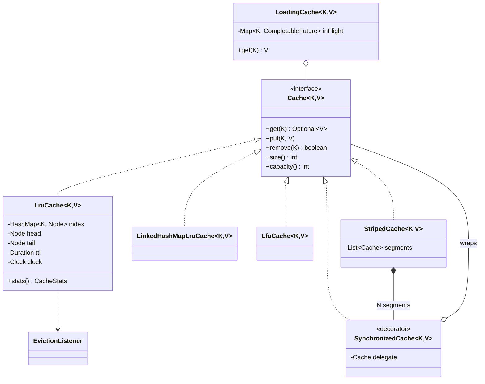

# LLD Interview: Design an LRU Cache

> "Implement a cache with a fixed capacity that evicts the least recently used entry when full. `get` and `put` must be O(1)."

Often asked as a coding question, but at senior levels it becomes a design question: thread safety (where `get` is secretly a write), TTL, other eviction policies, stampedes, and when you should just use Caffeine. It's also the "inside" of every cache box you draw in HLD interviews (the in-process cache in the [URL shortener](../../../HLD/interviews/url-shortener/L5-senior.md#54-caching--beyond-add-redis)).

## How to read this folder

> 👉 **New to caches or "LRU"? Start with [00-understand-the-product.md](00-understand-the-product.md).** It shows LRU in IntelliJ's Recent Files, your phone's app switcher, Redis and Kubernetes image cleanup before any code.

| File | Level | What "good" looks like |
|---|---|---|
| [00-understand-the-product.md](00-understand-the-product.md) | Everyone, first | Understand caches, eviction, and why the naive versions are O(n) |
| [L4-mid.md](L4-mid.md) | Mid / SDE2 | Hand-written HashMap + doubly linked list with sentinels, O(1), correct edge cases, knows `LinkedHashMap` |
| [L5-senior.md](L5-senior.md) | Senior | Thread safety (why reads need the lock), lock striping, TTL with `Clock`, LFU, eviction listener + stats, property-based test |
| [L6-staff.md](L6-staff.md) | Staff | Stampede protection (single-flight), memory sizing by weight, GC cost, scan resistance (W-TinyLFU), local vs distributed cache, build vs Caffeine |

## Code (runnable, no dependencies)

| | Run | Files |
|---|---|---|
| ☕ Java 21 | `./java/run.sh` | [java/src/lrucache/](java/src/lrucache/): `LruCache`, `LinkedHashMapLruCache`, `LfuCache`, `SynchronizedCache`, `StripedCache`, `LoadingCache`, tests in `CacheTests.java` |
| 🟨 Node 22 | `cd js && node --test` | [js/lruCache.js](js/lruCache.js): `MapLruCache` (Map insertion order), `LinkedLruCache` (hand-written) |

## Class diagram

## Libraries & concepts used

**Java:** [LinkedHashMap](../../libraries/java/linkedhashmap.md) · [Caffeine & Guava Cache](../../libraries/java/caffeine-and-guava-cache.md) · [CompletableFuture](../../libraries/java/completablefuture.md) · [References & GC](../../libraries/java/references-and-gc.md) · [Locks & synchronized](../../libraries/java/locks-and-synchronized.md) · [ConcurrentHashMap](../../libraries/java/concurrent-hashmap.md) · [Time & Clock](../../libraries/java/time-and-clock.md)

**JS:** [LRU with Map](../../libraries/js/lru-with-map.md) · [Map vs Object](../../libraries/js/map-vs-object.md) · [Classes & private fields](../../libraries/js/classes-and-private-fields.md)

**Concepts:** [Hash map & linked list](../../concepts/hashmap-and-linked-list.md) · [Cache eviction policies](../../concepts/cache-eviction-policies.md) · [Big-O complexity](../../concepts/big-o-complexity.md) · [Design patterns (Decorator, Strategy)](../../concepts/design-patterns.md) · [Thread-safety basics](../../concepts/thread-safety-basics.md)

**System-level view:** [Caching strategies](../../../HLD/concepts/caching-strategies.md) · [Redis](../../../HLD/technologies/redis.md)

## The core insight

1. **HashMap for "find", doubly linked list for "order".** Neither alone gives O(1) for both.
2. **In an LRU cache, `get` is a write.** It moves the node, so concurrent readers need the lock too. This surprises people.
3. **In production, use Caffeine.** Writing it yourself is for understanding (and interviews).
