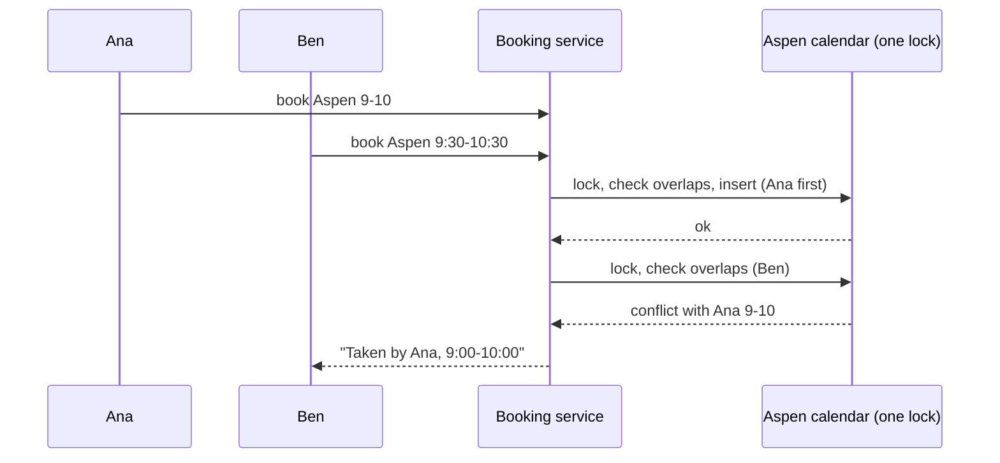

# Understand the product: meeting-room and hotel-room booking

> Read this before the interview files. It explains room booking **as a user experiences it**, so each design decision has a situation you can picture. No prior knowledge assumed.

## 1. The problem as a short story

Ana needs a room for a 9:00 design review with five people. She walks to "Aspen", finds Ben's team already inside, and spends ten minutes hunting for another room. Next week she tries a shared spreadsheet; two people type into the same cell at once and both turn up at 9:00.

A **room booking system** is a shared calendar for *things people can't be in twice*: rooms, projectors, parking spots, and, at a hotel, beds. It has one job: **never let two people hold the same room at the same time**, while making it quick to find a free one.

A hotel is the same story with a twist: the guest doesn't care *which* room, only that a "king room with a sea view" exists on each of the next three nights.

## 2. Where you have already seen it

- **Google Calendar / Outlook:** when you create an event, the *Rooms* tab (Google) or *Room Finder* (Outlook) lists rooms free at that time, with capacity and equipment. Accepting the invite books the room.
- **Hotel and travel sites** (Booking.com, Airbnb, airline-style "only 2 rooms left"): you choose dates, see a price per night, and pay or reserve.
- **Work:** the Zoom/Meet link that appears with "Aspen (8) - HQ 3rd floor"; the badge reader outside a room that shows today's schedule; a shared "staging environment" you must reserve before testing (same problem: one exclusive resource, many requesters).
- **Infra:** a **lease** on a lock, a CI runner reserved for a release, a maintenance window per cluster that must not collide.

## 3. Each feature, through a situation

| Situation | Feature | Interview question it leads to |
|---|---|---|
| Ana books 9-10; Ben's meeting runs 10-11 in the same room. Both are fine, but 9:30-10:30 is not | **Conflict detection**; "back to back" is allowed | How do you represent a time range, and what exactly is "overlap"? (half-open intervals) |
| Two people click "Book" on the last free slot at the same second | **No double booking** | Check-then-insert race; lock per room; who wins? |
| "I need a room for 8 with a video-conference camera at 2pm" | **Search by capacity and features** | Entities, filtering, "best fit" (smallest room that fits) |
| "What's free in Aspen today?" | **Availability view** | Turning bookings into gaps |
| "Find me any 90 minutes tomorrow in any room on floor 3" | **First free slot** | Merging busy intervals; sweep over many rooms |
| The weekly Monday stand-up, 52 weeks | **Recurring meetings** | Expanding a rule into occurrences; what if week 17 is taken? |
| London and New York colleagues: "9:00 on Monday" | **Time zones and daylight saving** | Store UTC instants, convert at the edges |
| Ana is typing attendees; the slot should not vanish, but should not be locked forever if she closes the tab | **Hold with expiry** | Temporary reservation, TTL, injected clock |
| Nobody shows up to the 10:00 meeting | **Auto-release** | Check-in and no-show policies |
| Hotel: "3 nights, deluxe room" | **Inventory by room type** | Counting instead of searching; all nights or none |
| Hotel: "sold out" the night before, yet 5 rooms are empty after midnight | **Overbooking** | Selling more than you have, betting on no-shows |
| Hotel: "free cancellation until 2 days before" | **Cancellation policy** | Strategy pattern; refunds |
| 50,000 employees, 800 buildings | **Scale** | Sharding by building, database constraints |

## 4. The key mechanism in plain words: a booking is an interval on a timeline

A booking says "room R is mine from `start` up to **but not including** `end`". Write it `[9:00, 10:00)`. The round bracket on the right means "10:00 itself is *not* part of my meeting", so Ben can start at 10:00 without a clash. Two bookings clash exactly when each starts before the other ends.

```mermaid
gantt
    title Room Aspen, Monday (one row = one room's timeline)
    dateFormat HH:mm
    axisFormat %H:%M
    section Bookings
    Ana design review (9-10)   :a1, 09:00, 1h
    Ben planning (10-11)       :a2, 10:00, 1h
    Dee 1:1 (13-13:30)         :a3, 13:00, 30m
    section Free gaps
    free until Ben             :done, 08:00, 1h
    free between               :done, 11:00, 2h
```





The whole difficulty is that "check" and "insert" must happen as **one step**; otherwise both requests pass the check and both insert.

## 5. Try it yourself

You can't poke the internals of Google's system, but you can see the same ideas on real tools.

1. **Google Calendar "Find a time" / room suggestions** (or Outlook "Scheduling Assistant"): create an event, add two colleagues and open the *Rooms* tab. Notice that rooms are filtered by capacity and features, and that a room booked 10:00-11:00 still shows as free for 9:00-10:00.
2. **Calendar files (ICS).** Every calendar app exchanges `.ics` text files. Save this as `standup.ics` and import it into any calendar:

```
BEGIN:VCALENDAR
VERSION:2.0
PRODID:-//demo//EN
BEGIN:VEVENT
UID:standup-1@example.com
DTSTAMP:20300101T000000Z
DTSTART;TZID=America/New_York:20300304T090000
DTEND;TZID=America/New_York:20300304T093000
RRULE:FREQ=WEEKLY;COUNT=4
SUMMARY:Standup
LOCATION:Aspen
END:VEVENT
END:VCALENDAR
```

`RRULE:FREQ=WEEKLY;COUNT=4` is the whole recurring series in one line: "every week, four times". `DTEND` is the exclusive end of a half-open interval.

3. **See daylight saving move a "9:00" meeting.** In New York the clocks jump forward on 10 March 2030, so a Monday 9:00 meeting is at a different UTC instant before and after. Real output of GNU `date` on the machine used to write this:

```
$ TZ=UTC date -d 'TZ="America/New_York" 2030-03-04 09:00'
Mon Mar  4 14:00:00 UTC 2030
$ TZ=UTC date -d 'TZ="America/New_York" 2030-03-11 09:00'
Mon Mar 11 13:00:00 UTC 2030
```

Same wall-clock time, one hour apart in UTC. This is why recurring meetings are expanded in the *local* zone and stored as UTC instants.

4. **Calendar on the command line:** if your system has `cal` or `ncal`, run `ncal -w 2030` to see week numbers; useful to picture "every second Monday". (Not installed on the machine used for this page, so no output is quoted.)

## 6. Experience to requirements

| What the user experiences | Functional requirement | Non-functional requirement |
|---|---|---|
| Room is mine, nobody else gets it | Reject overlapping bookings per room | Correct under concurrency: exactly one winner |
| Back-to-back meetings work | Half-open `[start, end)` | Precise boundary semantics, tested |
| Find me a room | Search by capacity, features, time | Fast (O(log n) checks), best-fit choice |
| Weekly meetings | Recurrence rule, conflict report | All-or-nothing series |
| Works across zones | Store UTC, display local | DST-safe |
| I'm still filling in the form | Hold with expiry | Expired holds free themselves (no cleanup job needed) |
| Hotel nights | Count by room type per night, price, cancel | Overbooking allowance is configurable |
| Company-wide | Many buildings | Shard by building, DB-level guard against double booking |

## 7. Mini glossary

- **Interval / slot:** a start and an end on the timeline. **Half-open:** includes start, excludes end.
- **Overlap / conflict:** two intervals share some time. Touching ends do not overlap.
- **Hold:** a temporary reservation that expires on its own unless confirmed. **TTL** (time to live): how long it lasts.
- **RRULE:** the iCalendar one-line syntax for repeating events. **ICS:** the file format calendars exchange.
- **UTC instant:** one point in time, the same everywhere; local time is just how it's displayed.
- **Room type / inventory:** hotels sell "a deluxe room", not room 412. Inventory is a count per type per night.
- **Overbooking:** accepting more reservations than rooms, expecting some **no-shows** (guests who never arrive).
- **Walked guest:** a guest who arrives with a valid reservation and no room left; the hotel pays for a room elsewhere.

➡️ Next: [README.md](README.md)
