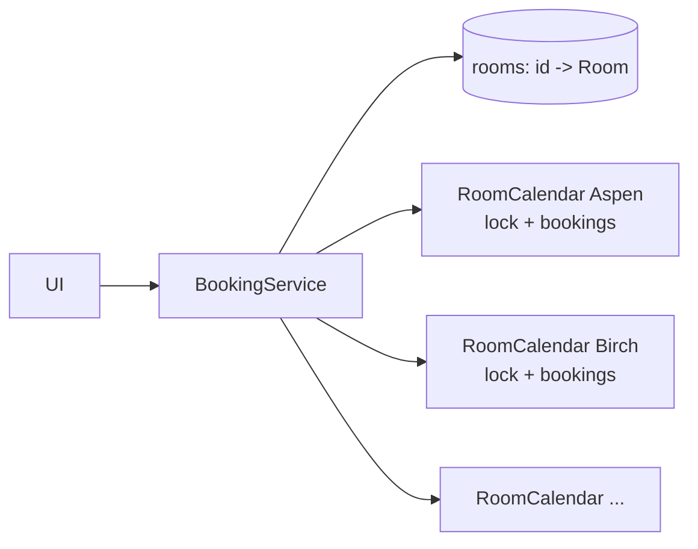

# Meeting-Room Booking: L4 (Mid-level / SDE2) LLD Interview

> **Level expectation:** a clean model (`Room`, `Booking`, `TimeSlot`, `User`), a correct overlap test with an explanation of **half-open intervals**, book and cancel, availability for a room on a day, find-any-free-room by capacity and features, and **thread safety** (lock per room, check-and-insert as one step). You are not expected to know TreeMap neighbour checks, recurring meetings or time zones in depth; these are L5. But you should notice that time zones and double clicks exist.

> 🆕 New to room booking? Read [00-understand-the-product.md](00-understand-the-product.md) first.

Legend: **🧑‍💼 Interviewer** · **🧑‍💻 Candidate** · **📝 Note** = commentary for you.

---

## 1. Clarifying requirements

**🧑‍💼 Interviewer:** Design a meeting-room booking system.

**🧑‍💻 Candidate:** Some questions first:
- **Granularity?** Any start and end, or 30-minute blocks? I'll allow any instant, which also covers blocks.
- **One company, one time zone?** I'll store UTC instants and leave display to the UI.
- **Do rooms differ?** Yes: capacity and equipment (TV, video conferencing).
- **Can bookings repeat?** Later extension, not now.
- **Who may cancel?** The owner. I'll note authorisation as out of scope.

**🧑‍💼 Interviewer:** Single time zone, no recurrence for now. Book, cancel, see what's free, find a room.

**🧑‍💻 Candidate:**

**Functional:** add rooms; book a room for `[start, end)`; cancel a booking; list a room's free gaps in a time window; find and book any room that has enough capacity and the required features for a slot.

**Non-functional:** two people never hold the same room at the same time, even when they click at the same instant; back-to-back meetings are allowed; failures say why ("taken by Ana 9:00-10:00"); deterministic and testable.

> 📝 **Note:** "Back-to-back is allowed" is stated up front because it decides the interval convention. Interviewers like candidates who pin down boundary behaviour before coding.

---

## 2. Core entities

| Entity | Responsibility |
|---|---|
| `Room` | `id`, `building`, `capacity`, `features` (set of strings). Immutable |
| `User` | Just a `userId` string here; later gets name, email, permissions |
| `TimeSlot` | `start`, `end` as `Instant`s; rejects `start >= end`; knows `overlaps` |
| `Booking` | `id`, `roomId`, `userId`, `slot`. Immutable |
| `RoomCalendar` | All bookings of one room, plus the lock that protects them |
| `BookingService` | The facade the UI calls: `book`, `cancel`, `availability`, `bookAnyRoom` |

> 💡 **Instant:** a single point on the global timeline (Java `java.time.Instant`), independent of any time zone; see [Java time API](../../libraries/java/java-time-api.md). **Record:** an immutable data class with generated `equals`/`hashCode` ([records & immutability](../../libraries/java/records-and-immutability.md)).

**🧑‍💼 Interviewer:** Why does `TimeSlot` reject `start >= end`?

**🧑‍💻 Candidate:** An empty or backwards slot overlaps nothing (or everything, depending on the formula) and would let someone "book" a room without blocking it. Failing at construction means the rest of the code never sees an invalid slot.

### Why half-open `[start, end)`?

**🧑‍💼 Interviewer:** Is a meeting 9:00-10:00 and one 10:00-11:00 in the same room a conflict?

**🧑‍💻 Candidate:** No. I model a slot as **half-open**: it includes `start` and excludes `end`. Think of `substring(9, 10)` in Java: it ends before index 10. The slot `[9:00, 10:00)` covers every moment from 9:00 up to but not including 10:00, so `[10:00, 11:00)` starts exactly where it stops, with no shared moment. If I used closed intervals, `[9:00, 10:00]` and `[10:00, 11:00]` would share 10:00 and I would need "minus one second" hacks. Half-open also makes length `end - start` and lets adjacent slots merge cleanly.

> 📝 **Note:** Be able to say this in two sentences. The full treatment is in [intervals and overlap](../../concepts/intervals-and-overlap.md).

---

## 3. API / interfaces

```java
public record TimeSlot(Instant start, Instant end) {
    public TimeSlot {
        if (!start.isBefore(end)) throw new IllegalArgumentException("start must be before end");
    }
    public boolean overlaps(TimeSlot o) { return start.isBefore(o.end) && o.start.isBefore(end); }
}

public final class BookingService {
    void addRoom(Room r);
    Result book(String roomId, String userId, TimeSlot slot);      // ok, or conflicts say why
    boolean cancel(String bookingId);
    List<TimeSlot> availability(String roomId, TimeSlot window);   // free gaps
    Optional<Booking> bookAnyRoom(String userId, int minCapacity, Set<String> features, TimeSlot slot);
}
```

**🧑‍💼 Interviewer:** Why return a `Result` rather than throw an exception when the slot is taken?

**🧑‍💻 Candidate:** "Slot taken" is a normal outcome of a busy office, not a bug. A result with the blocking booking lets the UI say "taken by Ana 9:00-10:00, try 10:00". I'd keep exceptions for programming errors like an unknown room id or a malformed slot.

---

## 4. The overlap test and the high-level design

**🧑‍💼 Interviewer:** Write the overlap check.

**🧑‍💻 Candidate:** Two half-open intervals overlap **when each starts before the other ends**:

```java
boolean overlaps(TimeSlot a, TimeSlot b) {
    return a.start().isBefore(b.end()) && b.start().isBefore(a.end());
}
```

Reasoning: they are disjoint only if `a` is entirely before `b` (`a.end <= b.start`) or entirely after (`b.end <= a.start`). Negating gives the formula. It handles partial overlap, containment in either direction and identical slots with no special cases. For touching slots `[9,10)` and `[10,11)`: `9 < 11` is true but `10 < 10` is false, so no overlap.

| a | b | `a.start < b.end` | `b.start < a.end` | Overlap? |
|---|---|---|---|---|
| [9,10) | [10,11) | 9 < 11 yes | 10 < 10 **no** | no (touching) |
| [9,11) | [10,12) | 9 < 12 yes | 10 < 11 yes | yes (partial) |
| [9,12) | [10,11) | 9 < 11 yes | 10 < 12 yes | yes (contains) |
| [9,10) | [9,10) | 9 < 10 yes | 9 < 10 yes | yes (identical) |

> 📝 **Note:** A common wrong answer is "new start is inside the old slot, or new end is inside the old slot". It misses the case where the new slot **swallows** the old one. Showing the table above avoids this.



The service finds the room's calendar and asks it to add the booking. Everything about conflicts lives inside `RoomCalendar`.

---

## 5. Deep dives

### 5.1 Book, cancel, availability

**🧑‍💻 Candidate:** The simplest `RoomCalendar` is a list of bookings:

```java
synchronized Optional<Booking> tryAdd(Booking nb) {
    for (Booking b : bookings)
        if (b.slot().overlaps(nb.slot())) return Optional.of(b);   // conflict: return who blocks us
    bookings.add(nb);
    return Optional.empty();
}
```

It is O(n) per booking, fine for one room's day (a room has a handful of bookings). I'd mention a sorted structure for later. `cancel` removes by id.

**Availability for a day:** sort the room's bookings by start, keep a cursor at the window start, and every time the next booking starts after the cursor, the stretch between them is free:

```java
List<TimeSlot> free = new ArrayList<>();
Instant cursor = window.start();
for (Booking b : sortedBookingsInWindow) {
    if (b.slot().start().isAfter(cursor)) free.add(new TimeSlot(cursor, b.slot().start()));
    if (b.slot().end().isAfter(cursor)) cursor = b.slot().end();
}
if (cursor.isBefore(window.end())) free.add(new TimeSlot(cursor, window.end()));
```

Example: bookings 10-11, 11-12, 15-16 in the window 9-18 give gaps 9-10, 12-15, 16-18. Note 10-11 and 11-12 touch, and no zero-length gap appears between them because I only add a gap when the next start is strictly after the cursor.

> 📝 **Note:** Watch for the edge cases the interviewer will probe: a booking that starts before the window (clip it), back-to-back bookings (no empty gap), an empty day (whole window free).

### 5.2 Find any free room

**🧑‍💼 Interviewer:** "I need a room for 6 people with video conferencing, 2-3pm."

**🧑‍💻 Candidate:** Filter rooms by `capacity >= 6 && features.containsAll({"vc"})`, sort by **capacity ascending** (best fit: don't waste the 20-seat boardroom on a 6-person meeting), and try to book each in turn; the first success wins.

```java
for (Room r : matching(minCapacity, features)) {      // smallest fitting room first
    Result res = book(r.id(), userId, slot);
    if (res.ok()) return Optional.of(res.one());
}
return Optional.empty();
```

**🧑‍💼 Interviewer:** Why not first call "isFree" on each room, pick one, and then book?

**🧑‍💻 Candidate:** That is check-then-act: between my check and my book, someone else can take the room. By calling the atomic `book` directly and moving on to the next room when it fails, correctness comes from `book`, not from my earlier look.

### 5.3 Thread safety

**🧑‍💼 Interviewer:** Two users book Aspen 9-10 at the same moment. What happens?

**🧑‍💻 Candidate:** Without protection: thread 1 checks (no conflict), thread 2 checks (no conflict), both insert, and the room is double booked. The fix is to make **check and insert one atomic step**. I'd use **one lock per room**: `synchronized` on the calendar, or a `ReentrantLock` ([locks & synchronized](../../libraries/java/locks-and-synchronized.md)). Why per room, not one global lock? Booking Aspen and booking Birch are independent, so a global lock would make them wait for each other for no reason. Why not just a `ConcurrentHashMap`? It makes single operations safe, but "check then put" is two operations; a concurrent collection alone doesn't close that gap ([thread-safety basics](../../concepts/thread-safety-basics.md)).

```java
final class RoomCalendar {
    private final ReentrantLock lock = new ReentrantLock();
    Optional<Booking> tryAdd(Booking b) {
        lock.lock();
        try {
            Booking c = findConflict(b.slot());
            if (c != null) return Optional.of(c);
            insert(b);
            return Optional.empty();
        } finally { lock.unlock(); }
    }
}
```

**Test:** 32 threads released at the same instant all book Aspen 9-10; exactly one `ok`. I'd repeat that in a loop (200 rounds), because a race may only show up once in a while.

> 📝 **Note:** Say "the lock covers the check **and** the insert" out loud. Interviewers listen for exactly that. Also mention the lock is held only for a few microseconds, so contention is low.

---

## 6. Interviewer follow-ups / curveballs

**🧑‍💼 Interviewer:** The company has offices in London and New York. What changes?

**🧑‍💻 Candidate:** Store everything as UTC `Instant`s; convert to a `ZoneId` only when showing times or when a user types "9:00 tomorrow". A booking 9:00-10:00 London is a different instant from 9:00-10:00 New York, and each is simply a point on the shared timeline, so the overlap test needs no changes.

**🧑‍💼 Interviewer:** How would you make "find a room" fast with 5,000 rooms?

**🧑‍💻 Candidate:** Index rooms by building first (people want their own building), then filter by capacity and features. Per room, checking a slot should not scan all its bookings: keep them sorted and check only the neighbours. That's the next level.

**🧑‍💼 Interviewer:** A user books a meeting that ends in the past. Allow?

**🧑‍💻 Candidate:** Reject at the service boundary: `slot.start` must not be before `now` (using an injected `Clock`), with a small grace period for "I'm booking this room right now".

**🧑‍💼 Interviewer:** What if the user wants a 15-hour meeting?

**🧑‍💻 Candidate:** Add a business rule, a maximum duration (say 8 hours), as a validation step before the calendar is touched, so rules and conflicts stay separate.

---

## 7. What the interviewer was evaluating

- [ ] Asked about boundaries (back-to-back) and time zones before coding
- [ ] Immutable entities; `TimeSlot` validates itself
- [ ] **Half-open interval** chosen and justified in a sentence or two
- [ ] Correct overlap test, including containment and identical slots; tests for touching
- [ ] Availability handles empty day, clipped bookings, no zero-length gaps
- [ ] "Find any room" picks the smallest fitting room and relies on atomic booking
- [ ] Identified the check-then-insert race and fixed it with a lock covering both
- [ ] Lock per room (not global), with a concurrency test
- [ ] Failure results carry a reason; exceptions only for bugs
- [ ] Can name what's next: sorted storage, recurrence, time zones, holds

---

## 8. Common mistakes at this level

| Mistake | Why it's wrong |
|---|---|
| `<=` in the overlap test | Back-to-back meetings are rejected |
| Checking only whether the new start/end lies inside the old slot | A new slot that contains an old one is accepted |
| `isFree(room, slot)` then `book(room, slot)` as two calls | Race: both callers see "free" |
| `synchronized` on the whole service | All rooms serialised behind one lock |
| Using `ConcurrentHashMap` and calling the problem solved | Check-then-put is still two steps |
| Storing `LocalDateTime` | No time zone: 9:00 means different instants for different offices |
| Allowing `start >= end` | Zero-length bookings that block nothing |
| Throwing for "slot taken" | Normal outcome treated as an error; no reason for the UI |
| Not removing a cancelled booking from every structure | Slot stays blocked after cancel |

➡️ Next: [L5-senior.md](L5-senior.md) (TreeMap checks, sweep line, recurrence, holds)
