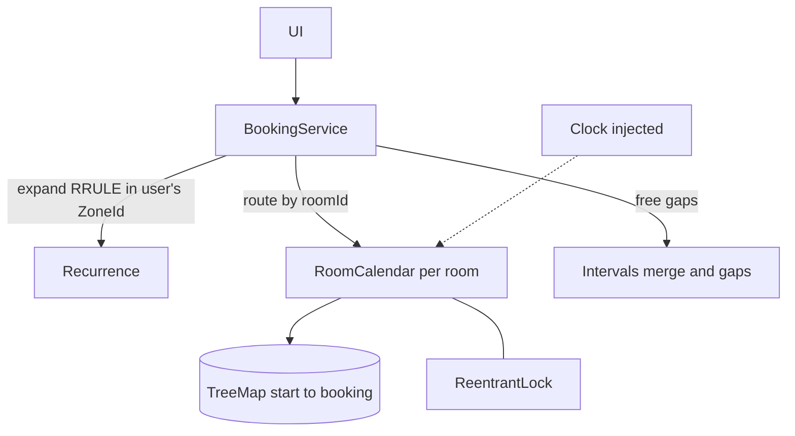

# Meeting-Room Booking: L5 (Senior) LLD Interview

> **Level expectation:** everything in L4, plus efficient per-room storage (**TreeMap** with floor/higher checks, interval trees named), "first free slot of length D" across rooms (**merge + sweep**), **recurring meetings** with a conflict report, **time zones** done right, a convincing **concurrency** story (one winner among many), and **holds with expiry**. You drive the design and explain trade-offs without prompting.

> 🆕 Read [L4-mid.md](L4-mid.md) first for the entities and the overlap test; terms from [00-understand-the-product.md](00-understand-the-product.md).

Legend: **🧑‍💼 Interviewer** · **🧑‍💻 Candidate** · **📝 Note** = commentary for you.

---

## 1. Clarifying requirements

**🧑‍💼 Interviewer:** Take the room-booking design further: it's used by a 5,000-person company across time zones, with weekly meetings, and people need a few minutes to finish the invite form.

**🧑‍💻 Candidate:**

**Functional:** book/cancel; availability per room; best-fit "any room" search; **first free slot** of a given length in a window across matching rooms; **recurring** series (daily/weekly, interval, count or until) with a clear report when any occurrence clashes; **holds** while the user confirms.

**Non-functional:** exactly one winner for a contested slot; O(log n) conflict check per room; DST-safe recurrence; expired holds never block anyone, and don't need a cleanup job to be correct; deterministic tests with an injected clock.

**Out of scope for now:** permissions, approval workflows, cross-service notifications (L6).

> 📝 **Note:** "A series is all-or-nothing, and the user sees which weeks clash" is a product decision worth stating; the alternative (book what fits, skip the rest) is also valid but must be explicit.

---

## 2. Core entities (changes from L4)

| Entity | Change |
|---|---|
| `Booking` | adds `holdUntil` (null = confirmed). A hold is a booking that ignores itself after that instant |
| `RoomCalendar` | `TreeMap<Instant, Booking>` keyed by start, plus an id index; one `ReentrantLock` |
| `Recurrence` | parsed RRULE subset: `FREQ`, `INTERVAL`, `COUNT` or `UNTIL`; expands into `TimeSlot`s |
| `Result` / `Conflict` | all-or-nothing outcome; each `Conflict` pairs a requested slot with the booking in the way |
| `Clock` | injected (`java.time.Clock`) so holds and "past" checks are testable ([time & clock](../../libraries/java/time-and-clock.md)) |

---

## 3. API

```java
Result book(String roomId, String userId, TimeSlot slot);
Result hold(String roomId, String userId, TimeSlot slot, Duration ttl);
boolean confirm(String bookingId);                   // false if unknown or expired
Result bookRecurring(String roomId, String userId, TimeSlot first, ZoneId zone, String rrule);
List<TimeSlot> availability(String roomId, TimeSlot window);
Optional<Found> firstFreeSlot(Duration length, TimeSlot window, int minCap, Set<String> features);
Optional<TimeSlot> firstCommonFreeSlot(Collection<String> roomIds, Duration length, TimeSlot window);
```

---

## 4. High-level design



---

## 5. Deep dives

### 5.1 From O(n) to O(log n): neighbours in a TreeMap

**🧑‍💼 Interviewer:** Your L4 check scanned every booking. A shared "demo room" has 10,000 future bookings. Fix it.

**🧑‍💻 Candidate:** Per room, bookings never overlap (that's the invariant we protect). Store them in a [`TreeMap<Instant, Booking>`](../../libraries/java/treeset-and-priorityqueue.md) keyed by start, a sorted map with O(log n) lookups of "the entry at or before X" and "the entry after X". A new slot `[s, e)` can only clash with two bookings:

1. `floorEntry(s)`: the booking starting at or before `s`. It clashes if its **end is after `s`** (still running when the new one starts).
2. `higherEntry(s)`: the first booking starting after `s`. It clashes if its **start is before `e`**.

Why nothing else matters: every other booking is separated from the new slot by one of these two, and bookings don't overlap each other. Example: existing `[9,10)`, `[11,12)`; new `[10,11)` → floor is `[9,10)` with end 10, not after 10; higher is `[11,12)` with start 11, not before 11; no clash, and touching works.

```java
Map.Entry<Instant, Booking> before = byStart.floorEntry(s.start());
if (before != null && before.getValue().slot().end().isAfter(s.start())) return before.getValue();
Map.Entry<Instant, Booking> after = byStart.higherEntry(s.start());
if (after != null && after.getValue().slot().start().isBefore(s.end())) return after.getValue();
return null;
```

**🧑‍💼 Interviewer:** Why `higherEntry` and not `ceilingEntry`?

**🧑‍💻 Candidate:** A booking starting at exactly `s` is already returned by `floorEntry(s)` (floor means "at or before"), and it clashes because its end is after `s` (slots are non-empty). `higherEntry` is strictly after, so each booking is seen once.

**🧑‍💼 Interviewer:** When would TreeMap not be enough?

**🧑‍💻 Candidate:** When intervals are allowed to overlap, for example a personal calendar that shows all your meetings including double-booked ones, or "which of 1 million bookings in the company overlap Tuesday 2pm?". Then the sorted-start trick breaks (a long meeting that started early can hide behind many short ones). An **interval tree** stores in every node the maximum end in its subtree and prunes any subtree whose max end is before the query start: O(log n + k). The JDK has no interval tree; I'd write an augmented tree or lean on the database's GiST index ([intervals and overlap](../../concepts/intervals-and-overlap.md)). For one room's non-overlapping bookings, TreeMap is simpler and enough.

> 📝 **Note:** The level signal: you state the invariant ("no overlaps within a room") that makes the cheap structure valid, and you know when it stops being valid.

### 5.2 First free slot of length D between X and Y across N rooms

**🧑‍💼 Interviewer:** "Find me 90 minutes tomorrow between 9 and 6 in any room that seats 3 or more."

**🧑‍💻 Candidate:** For each matching room compute its **free gaps** in the window, take the first gap at least D long (gaps are in time order, so the first fit is that room's earliest), and return the earliest candidate across rooms.

**Gaps from busy intervals (a sweep):** collect the room's bookings that overlap the window, sort by start (the TreeMap already does), keep a cursor at the window start, and each time the next booking starts after the cursor emit `[cursor, next.start)` as a gap, then move the cursor to `max(cursor, next.end)`. After the last booking emit `[cursor, window.end)` if non-empty. Cost per room: O(log n + k) for the k bookings inside the window.

Worked example (window 9-18, 90 minutes wanted):

| Room | Bookings | Gaps | First fit |
|---|---|---|---|
| A | 9-11 | 11-18 | 11:00-12:30 |
| B | 9-9:30, 10-11 | 9:30-10, 11-18 | 11:00-12:30 (the 9:30-10 gap is only 30 min) |
| C | 9-13 | 13-18 | 13:00-14:30 |

Answer: room A (or B) at 11:00; ties broken by smaller capacity.

**🧑‍💼 Interviewer:** And "a slot when *all three* rooms are free" (a workshop needing Aspen, Birch and Cedar)?

**🧑‍💻 Candidate:** Different question: merge the busy intervals of **all** rooms into one list (sort by start, extend the current block while the next starts at or before its end), then the gaps of the merged list are the times when every room is free. O(m log m) for m bookings. The same sweep with `+1`/`-1` events answers "how many rooms are in use at once?" (peak concurrency, handy for capacity planning).

### 5.3 Recurring meetings

**🧑‍💼 Interviewer:** "Every Monday 9:00-9:30 for 10 weeks." What do you store?

**🧑‍💻 Candidate:** Two options: (a) store the **rule** and compute occurrences on demand; (b) **expand** into concrete bookings. Option (a) is compact but conflict checks, availability and cancel-one-occurrence all have to understand rules. I choose (b) for the in-memory design: expand up to a bounded horizon (here COUNT/UNTIL are required, never "forever"; for infinite series I'd expand a rolling window, say 12 months, and extend it nightly) and keep a `seriesId` so the UI can edit the whole series (the sample code skips this field).

Support a deliberate **subset of RRULE** (the iCalendar rule syntax): `FREQ=DAILY|WEEKLY`, `INTERVAL`, `COUNT` or `UNTIL`; reject the rest loudly rather than guess (BYDAY, monthly, EXDATE are extensions). See [cron and recurring schedules](../../concepts/cron-and-recurring-schedules.md) for how recurring schedules are modelled elsewhere.

**All-or-nothing with a report:** under the room's lock, check **every** occurrence, collecting all clashes; if there are none, insert all; else insert nothing and return the list.

```java
List<Conflict> tryAddAll(List<Booking> bs) {
    lock.lock();
    try {
        List<Conflict> clashes = new ArrayList<>();
        for (Booking b : bs) { Booking c = findConflict(b.slot(), now); if (c != null) clashes.add(new Conflict(b.slot(), c)); }
        if (clashes.isEmpty()) bs.forEach(this::put);
        return clashes;
    } finally { lock.unlock(); }
}
```

Result: "Weekly stand-up not booked: 2030-01-21 11:00 is taken by Dee 11:00-12:00." The user fixes one week or picks another room. Holding the lock for the whole check keeps the series atomic: nobody can book week 3 between my check of week 3 and my insert of week 1.

### 5.4 Time zones and daylight saving

**🧑‍💼 Interviewer:** The stand-up is "9:00 New York time every Monday". The clocks change on 10 March. Problem?

**🧑‍💻 Candidate:** Yes, if I add 7×24 hours to the first instant: after the change the meeting would land at 10:00 local. So expand in the **user's zone**: take the first start as a `ZonedDateTime` in `America/New_York`, add *weeks* (not hours), then convert each occurrence to an `Instant`. Real values: 4 March 9:00 is 14:00 UTC (EST) and 11 March 9:00 is 13:00 UTC (EDT). Storage and overlap checks remain pure UTC instants; zones only matter when expanding rules and when displaying. Never store `LocalDateTime` for bookings: it names no instant. Edge cases to acknowledge: a local time that doesn't exist (2:30 on the spring-forward day: Java shifts it forward) or happens twice (autumn: Java picks the earlier offset).

> 📝 **Note:** The sentence "store instants, expand rules in the zone, display in the viewer's zone" is the whole lesson. Mention the rule's zone must be stored with the series, since the organiser may travel.

### 5.5 Concurrency: exactly one winner

**🧑‍💼 Interviewer:** 32 people click "Book Aspen 9-10" together. Prove it's right.

**🧑‍💻 Candidate:** Correct by construction: the check and the insert are inside one critical section guarded by the room's lock, so the second thread's check sees the first's insert. Different rooms use different locks and never block each other. Evidence: a test releases 32 threads from a latch at once, counts successes (must be exactly 1) and repeats 200 rounds with a fresh service each time; a second test runs 8 threads doing random book and cancel on 3 rooms, then verifies by **brute force** that no two bookings in any room overlap. I also check the tests can fail: I removed the lock on a scratch copy and both tests failed (the first in 3 of 3 runs, the random one in 2 of 3).

**🧑‍💼 Interviewer:** Why a lock and not optimistic (version number, retry)?

**🧑‍💻 Candidate:** Critical section is microseconds and contention per room is tiny; locking is simple and cannot livelock. Optimistic concurrency helps when the check is slow (a remote call) or the data lives in a database; I'd use it there ([optimistic vs pessimistic](../../concepts/optimistic-vs-pessimistic-locking.md)). No deadlocks here either, since a booking takes exactly one room lock; the series takes one room lock for the whole series.

### 5.6 Holds with expiry

**🧑‍💼 Interviewer:** The invite form takes two minutes. How do you stop someone else grabbing the slot meanwhile, without locking forever if she closes the tab?

**🧑‍💻 Candidate:** A **hold** ([holds, reservations and TTL](../../concepts/holds-reservations-and-ttl.md)): insert a booking with `holdUntil = now + ttl`. For conflict checks an expired hold counts as absent; the checker deletes it when it bumps into one (lazy cleanup), so correctness never depends on a background job (a sweeper only reclaims memory). `confirm` flips `holdUntil` to null if `now < holdUntil`, under the same lock. "Now" comes from an injected `Clock`, so the test advances a `MutableClock` instead of sleeping: hold 5 minutes; at +4 confirm succeeds; in another test at +5 (exactly `holdUntil`) confirm fails and another user can book. Expiry is half-open in time too: a hold lives in `[created, holdUntil)`.

---

## 6. Interviewer follow-ups / curveballs

**🧑‍💼 Interviewer:** Edit a booking (move 9-10 to 9:30-10:30) without losing the room if the new time is taken?

**🧑‍💻 Candidate:** Under the lock: temporarily ignore the booking's own entry, check the new slot, and replace only if free; otherwise keep the old one. Never "cancel then book" (someone can slip in between).

**🧑‍💼 Interviewer:** Cancel one occurrence of a series?

**🧑‍💻 Candidate:** With expanded bookings sharing a `seriesId`, cancel the one booking. For "this and following", cancel those with start ≥ X. That's the benefit of expansion.

**🧑‍💼 Interviewer:** Fairness: someone books every room every day at 9am.

**🧑‍💻 Candidate:** Policy layer before the calendar: per-user limits and a maximum booking horizon, plus auto-release of unconfirmed bookings (L6).

**🧑‍💼 Interviewer:** The service restarts. What's lost?

**🧑‍💻 Candidate:** In memory everything; I'd persist bookings (L6) and rebuild each calendar on startup. Holds can be dropped on restart (they expire anyway).

---

## 7. What the interviewer was evaluating

- [ ] Stated the invariant (no overlaps within a room) and used it for O(log n) floor/higher checks
- [ ] Knows when TreeMap isn't enough and names interval trees (max-end augmentation)
- [ ] First-free-slot via gaps, with a worked example; merge for the "all rooms free" variant
- [ ] Recurrence: bounded expansion, all-or-nothing, conflicts reported per occurrence
- [ ] UTC instants stored, rules expanded in the zone (weeks, not 168 hours), DST example
- [ ] Concurrency argued (critical section) **and** tested (many threads, repeated; brute-force invariant)
- [ ] Holds as bookings with expiry, lazy cleanup, injected clock
- [ ] Edit as atomic replace, not cancel then book
- [ ] Verified tests can fail (mutation check)

---

## 8. Common mistakes at this level

| Mistake | Why it's wrong |
|---|---|
| Using `ceilingEntry` for the after-neighbour and forgetting the exact-start case | Misses a booking starting at the same instant, or double-handles it |
| Adding `7*24h` to repeat weekly | Meetings drift an hour after DST changes |
| Booking occurrences one by one without rollback | A failed series leaves a half-booked mess |
| Stopping at the first clash of a series | The user fixes one week, then discovers the next |
| Separate `isFree` then `book` calls | Race |
| Cleaning expired holds only with a timer thread | Between timer ticks the slot looks taken; correctness depends on the timer |
| `Thread.sleep` in hold tests | Slow and flaky; inject the clock |
| One concurrency test run once | A race may show up one run in a hundred; loop it |
| Unbounded recurrence expansion | "Forever" becomes an out-of-memory error |
| Global lock "for safety" | All rooms serialised |

➡️ Next: [L6-staff.md](L6-staff.md) (hotel variant, overbooking, database constraints, scale)
