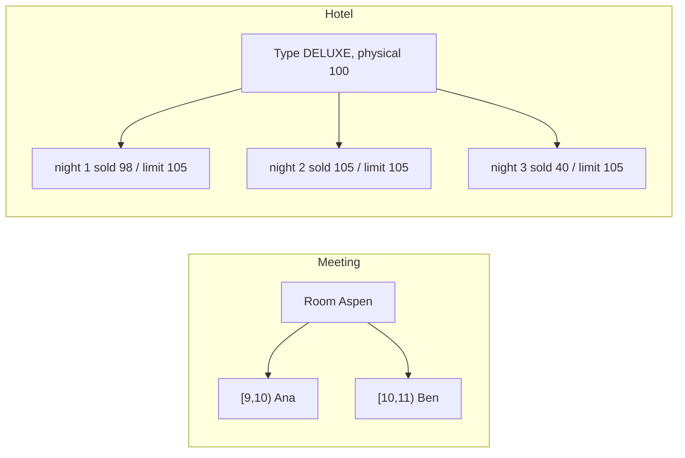

# Meeting-Room Booking: L6 (Staff) LLD Interview

> **Level expectation:** you reframe the problem. A hotel is **counting**, a meeting room is **scheduling**; you model both and say why. You reason with numbers (overbooking), push correctness into the database (**exclusion constraints**), design for 50,000 employees or a hotel chain (**sharding**, read paths, failure modes), integrate with calendars (**ICS/CalDAV**), handle no-shows, and describe a testing strategy that would catch the bugs that matter.

> 🆕 Read [L4-mid.md](L4-mid.md) and [L5-senior.md](L5-senior.md) first; terms are in [00-understand-the-product.md](00-understand-the-product.md).

Legend: **🧑‍💼 Interviewer** · **🧑‍💻 Candidate** · **📝 Note** = commentary for you.

---

## 1. Clarifying requirements

**🧑‍💼 Interviewer:** Your meeting-room design works for one office. The company now wants it for 50,000 employees in 800 buildings, and the hospitality division wants the same engine for hotels. Go.

**🧑‍💻 Candidate:** Questions that change the design:
- **Is the guest choosing a specific room, or a room type?** Meeting rooms: specific. Hotels: type (deluxe king), the hotel assigns the number at check-in.
- **Can the hotel oversell?** Typically yes, a controlled amount.
- **Peak load?** Meeting rooms peak at 9:00 on the hour boundaries; hotels at promotions.
- **Source of truth?** Our database, or do Google/Outlook own the calendars? (Integration.)
- **Consistency?** A double-booked room is an incident; a stale availability view is merely annoying.

**Numbers (back-of-envelope):** 50,000 employees × 4 meetings/day = 200,000 bookings/day. Over a 9-hour working day that is 200,000 ÷ (9 × 3,600 s) ≈ 6 per second on average; peak at the top of the hour maybe 20× = ~120/s. Rooms: 800 buildings × 40 rooms = 32,000 rooms. Storage: 200,000 × 365 = 73 million bookings/year × ~200 bytes ≈ 15 GB/year: one database could hold it, so sharding is for isolation and latency, not capacity. Reads (searches, availability views) outnumber writes maybe 50:1: ~6,000/s at peak.

> 📝 **Note:** Concluding "the data fits on one machine, so shard for blast radius and locality, not capacity" is the staff-level move; most candidates shard reflexively.

---

## 2. Model: two shapes of inventory

| | Meeting room | Hotel room type |
|---|---|---|
| What is sold | A specific room for `[start, end)` | `k` rooms of a type for nights `[checkIn, checkOut)` |
| Representation | Timeline of intervals per room | Counter per (type, night) |
| Availability question | "Any overlap on this room?" | "`sold + k <= limit` on **every** night?" |
| Conflict | Overlapping interval | Counter would exceed limit |
| Assignment | Immediate | Late (at check-in) |
| Concurrency unit | The room | The (type, night) counters touched |



**🧑‍💼 Interviewer:** Why not model hotel rooms as specific rooms with intervals too?

**🧑‍💻 Candidate:** You can, and some systems do (to allow "I want room 412"), but for the default product it over-constrains: with 100 deluxe rooms and stays of different lengths, a first-fit assignment can leave fragments ("room 7 free nights 1-2 and room 8 free nights 3-4, but a 4-night guest fits nowhere") although the *count* of free rooms on each night would allow the stay. Count-based sales avoid that; the hotel solves the assignment puzzle later, with full knowledge, and can reshuffle. (This is a bin-packing flavour of problem; counting is the relaxation that sells the most.)

### 2.1 Count-based availability (the code)

```java
// stay = nights [checkIn, checkOut); the check-out day itself is free for the next guest
synchronized Optional<Reservation> reserve(String type, LocalDate checkIn, LocalDate checkOut, int rooms) {
    for (LocalDate d = checkIn; d.isBefore(checkOut); d = d.plusDays(1))
        if (available(type, d) < rooms) return Optional.empty();   // ANY full night rejects the whole stay
    for (...) sold.merge(d, rooms, Integer::sum);                   // otherwise take all nights
    ...
}
```

Same ideas as before: half-open `[checkIn, checkOut)` over dates, all-or-nothing, check and update inside one critical section. The same shape as the series booking, and as the multi-seat hold in [movie booking](../movie-booking/README.md).

### 2.2 Overbooking with arithmetic

**🧑‍💼 Interviewer:** Hotels sell more rooms than they own. Why, and how many?

**🧑‍💻 Candidate:** Some guests never arrive (**no-shows**) or cancel late; an empty room is revenue lost forever. So we allow `limit = floor(physical × factor)`; with 100 rooms and factor 1.05 we sell up to 105. The cost is on nights when more than 100 guests arrive: the hotel must **walk** (relocate at its expense) the extra guests.

Suppose historic no-show rate `p = 6%` and each reservation shows up independently:
- Expected arrivals with 105 sold: 105 × 0.94 = 98.7, under 100.
- But averages hide the tail. Overflow happens when arrivals > 100, i.e. no-shows ≤ 4. With a binomial distribution (n = 105, p = 0.06) I computed P(no-shows ≤ 4) ≈ **23.8%**: roughly one night in four someone is walked. That is probably too aggressive.
- Factor 1.02 (sell 102): overflow needs no-shows ≤ 1; P ≈ **1.4%**.
- If the no-show rate is 10% instead, selling 105 gives P(no-shows ≤ 4) ≈ **1.7%**.

So the factor is a function of the **no-show rate and the cost ratio**: choose the largest limit where `P(overflow) × walk_cost` is below `P(empty room) × room_revenue`. Illustrative inputs (not hotel data): walk cost ≈ 1.5-2× the room rate (rebooking elsewhere, transport, goodwill); the factor is set per room type, per season and per day of week (weekday business travellers cancel late, leisure guests no-show less), from data, and reviewed. Never a global constant. (The 6% and 10% rates are examples I chose; the probabilities are straight binomial arithmetic, not hotel data.)

**Tests:** 100 rooms at 1.05 sell exactly 105 and refuse the 106th; a 2-night stay is refused if the second night is full, and the first night's counter is unchanged afterwards (no leaked partial reservation).

> 📝 **Note:** Interviewers love "overbooking" because it exposes whether you reason with probability. State the independence assumption and its weakness: a snowstorm makes no-shows correlated, which fattens the tail.

### 2.3 Price and cancellation policy

- **Price per night:** a `RatePlan` returns the price for (type, date): base rate × weekday/season multiplier × demand adjustment. A stay's total is the **sum over nights**, computed and frozen on the reservation at booking time (so later rate changes don't alter it). Store money in minor units (cents) or `BigDecimal`, never `double` ([BigDecimal & money](../../libraries/java/bigdecimal-and-money.md)).
- **Cancellation policy** is a **Strategy** ([design patterns](../../concepts/design-patterns.md)): `refund(reservation, cancelDate)`. Example in the code: free until 2 days before check-in, afterwards the first night is charged. Others: non-refundable (cheaper rate), flexible (until 18:00 on the day). The policy used is fixed at booking time, as part of the rate plan, not looked up at cancel time.
- Inventory is released at cancellation *before* money moves, and refunds are idempotent (retries are safe; see [idempotency](../../../HLD/concepts/idempotency-and-delivery-semantics.md)).

---

## 3. Scaling the meeting-room side

### 3.1 Let the database refuse double bookings

**🧑‍💼 Interviewer:** You have many app servers. Your per-room `ReentrantLock` lives in one JVM.

**🧑‍💻 Candidate:** Right: a lock in memory protects one process. With N servers, two requests for Aspen can land on different servers and both pass their local check. Options: (1) route all requests for a room to the same server (consistent hashing by room id; fragile during rebalancing); (2) a distributed lock ([distributed locks and leases](../../../HLD/concepts/distributed-locks-and-leases.md)), adding a dependency and failure modes; (3) **let the database be the arbiter**, which is what I'd pick. In [PostgreSQL](../../../HLD/technologies/postgresql.md):

```sql
CREATE EXTENSION IF NOT EXISTS btree_gist;
CREATE TABLE booking (
  id       bigserial PRIMARY KEY,
  room_id  int         NOT NULL,
  user_id  int         NOT NULL,
  during   tstzrange   NOT NULL,                 -- half-open [start, end) by default
  hold_until timestamptz,
  EXCLUDE USING gist (room_id WITH =, during WITH &&)
);
```

Plainly: "reject any new row for which some existing row has the **same room** and a **time range that overlaps**." `tstzrange` is a timestamp-with-time-zone range, and Postgres ranges are half-open by default, matching our `[start, end)`. `&&` is the overlap operator. A **GiST index** (a generalised search tree that can answer "overlaps?" questions, effectively an interval tree) backs the constraint, so the check is fast and, crucially, **atomic across all clients**: when two inserts race, one fails with an exclusion violation, which the service maps to "slot taken". The application code shrinks to `INSERT` and catch the error. `btree_gist` lets the plain integer `room_id` take part in a GiST index.

Holds in the database: the row carries `hold_until`; a plain exclusion constraint can't know about the clock, so either (a) delete expired holds first inside the same transaction (`DELETE ... WHERE hold_until <= now()` for this room) and then insert, or (b) keep holds in Redis with a TTL for the soft block and write only confirmed bookings to Postgres (the hold is advisory, the constraint is the truth). Related: [transactions and isolation](../../concepts/transactions-and-isolation.md) explains why a plain "SELECT, then INSERT" at READ COMMITTED isolation still races.

MySQL has no exclusion constraints; there you `SELECT ... FOR UPDATE` the room row (or a per-room lock row), check overlaps, insert, commit: pessimistic locking at the database level ([optimistic vs pessimistic](../../concepts/optimistic-vs-pessimistic-locking.md)).

Recurring series: one transaction inserting all occurrences; if any violates the constraint, the whole transaction rolls back, and we re-query to report which occurrences clashed.

### 3.2 Sharding and read paths

- **Shard key: building (or hotel).** A booking touches one room, a room belongs to one building, so every write is single-shard and the constraint works inside one database. Searches are mostly "in my building"; cross-building search ("any room in the Pune campus") fans out to a few shards. See [sharding and replication](../../../HLD/concepts/sharding-and-replication.md).
- **Hot spot:** everyone books at 9:00 on the hour; one building's shard takes its own load only, which is the point of sharding by building. A hotel chain shards by hotel; a mega-event in one city loads one shard, and that is acceptable.
- **Reads:** availability views are cached per (room, day) with a short TTL (30 s) and invalidated on write; a stale "free" is caught by the constraint on write, so the cache can be loose. This is the standard split: **fast approximate reads, strict writes**.
- **Multi-region:** a building's data lives in its home region; bookings from far-away employees pay one cross-region round trip, which is fine for a human click.

### 3.3 Failure modes

| Failure | Behaviour |
|---|---|
| App server dies mid-request | Transaction rolls back or commits; client retry uses an idempotency key (a unique token per click) so no double insert |
| Shard primary down | Writes to that building fail fast with a clear message; other buildings unaffected; failover to a replica |
| Clock skew between servers | All expiry decisions use the database's `now()` or one time source, not each server's clock |
| Cache serves stale free | Write is rejected by the constraint; UI refreshes |

---

## 4. Calendar integration (ICS / CalDAV / Google / Microsoft)

Most users never open our UI; they invite a room as an attendee in Google Calendar or Outlook. So rooms are **resource calendars**: the invite arrives (an email with an ICS attachment, or a webhook/push notification from the calendar provider); our service runs the booking, then **accepts or declines** on behalf of the room. **ICS** (iCalendar) is the text format of events (`BEGIN:VEVENT`, `DTSTART`, `DTEND`, `RRULE`); **CalDAV** is the protocol for reading and writing calendars on a server (HTTP with extra verbs such as `REPORT`); Google and Microsoft expose their own REST APIs for the same. Design points:
- **Idempotent sync:** the event `UID` plus a sequence number identify an event; re-delivered messages must not create duplicates.
- **Source of truth:** ours for room availability; the user's calendar shows a copy. Updates flow both ways; conflicts resolved in favour of "the room is booked only if we accepted".
- **Rate limits and polling:** prefer push notifications over polling; back off on 429s ([retries and backoff](../../../HLD/concepts/retries-backoff-and-dlq.md)).
- **Recurring events from outside:** parse `RRULE` plus `EXDATE` (excluded dates) and `RECURRENCE-ID` (an edited single occurrence); that's why a real RRULE parser is a library job, not a weekend project.

---

## 5. No-shows and auto-release

**🧑‍💼 Interviewer:** Rooms are booked but empty. How do you free them?

**🧑‍💻 Candidate:** Policy: if nobody **checks in** (door sensor, badge, or a "confirm" tap in the app) within 10 minutes of the start, release the booking. Mechanism: a delay queue or a scheduled job keyed by `start + grace` ([timers and delay queues](../../concepts/timers-delay-queues-and-timing-wheels.md)) emits a "check-in due" event; the handler re-reads the booking and releases it only if still unconfirmed (re-checking is what makes duplicate or late events harmless). Release shortens the booking to zero use: `cancel` with reason `NO_SHOW`, then notify the organiser, and optionally the waitlist ("room freed, 3 people are waiting"). Hotel analogue: the night-audit job releases unclaimed reservations at a cut-off hour (often 18:00 or 22:00 unless late arrival is guaranteed) and records the **no-show rate** that feeds the overbooking factor in 2.2.

Abuse: repeated no-shows lower a user's quota; recurring series are checked for actual use and trimmed after three misses.

---

## 6. Testing strategy

| Layer | What | Why |
|---|---|---|
| Unit | Overlap table: touching, partial, containment, identical, 1 ms overlap; zero-length rejected | The classic off-by-one is in the boundary |
| Property-based | Generate random bookings; invariant: no two bookings of a room overlap; any accepted booking, if re-submitted, is rejected; cancel then re-book works | Finds cases humans don't think of; the brute-force pairwise check is the oracle |
| Concurrency | 32 threads, one slot, 200 rounds → exactly 1 winner; random mixes; run in CI many times | Races are probabilistic |
| Mutation | Replace `<` with `<=`, remove the lock; tests must fail | Proves the tests can fail. I did both: `<=` fails 2 tests, no lock fails the concurrency tests |
| Time | Injected clock for holds, no-show, policy windows; DST dates (spring-forward, autumn), year boundary | No `sleep`, deterministic |
| DB integration | Real Postgres in a container; two connections racing; the constraint fires | The in-memory lock isn't what protects production |
| Load | Replay a 9:00 spike against a staging shard | Finds lock and index contention |
| Chaos | Kill the app between "insert" and "reply"; retry with the same idempotency key | At-least-once clients are a fact |

**Metrics to watch (like any service you'd put on-call):** booking latency p99, conflict rate (high = UX problem, people don't see availability), constraint-violation rate (should be low; high means stale caches), hold expiry rate, no-show rate, overbooking overflow nights, walk cost.

---

## 7. What the interviewer was evaluating

- [ ] Recognised the two shapes of inventory (timeline vs counts) and why
- [ ] Count-based reservation: all nights or none, check-out day free, one critical section
- [ ] Overbooking reasoned with a distribution, not a hunch; assumptions and tail risk named; per-type/season factor
- [ ] Price frozen at booking, money in minor units; cancellation policy as a Strategy fixed at booking time
- [ ] Moved the invariant into the database (exclusion constraint) and can explain it plainly
- [ ] Shard key justified (building/hotel), capacity numbers computed, read/write split, failure modes
- [ ] Calendar integration: ICS, CalDAV, idempotent sync, push over polling
- [ ] No-show release as a re-checking delayed event; feeds back into overbooking
- [ ] Testing strategy beyond happy paths, including mutation and DB-level tests

---

## 8. Common mistakes at this level

| Mistake | Why it's wrong |
|---|---|
| Modelling hotel rooms as interval timelines by default | Fragmentation: fewer sales, complexity; counts are enough |
| Overbooking with a fixed 10% everywhere | Ignores no-show rate, season and cost ratio; walks pile up |
| Using the average no-show rate to claim "zero risk" | The tail decides the walk count |
| A per-JVM lock in a multi-server deployment | Two servers both pass the check |
| Distributed lock when the database can enforce it | More moving parts than the one constraint |
| Sharding by user or by time | A booking and its room conflict across shards; cross-shard transaction needed |
| Reading cache-only availability on the write path | Stale reads cause double bookings; the write must check the source of truth |
| Re-pricing at cancellation using today's rates | Refunds must use the frozen booked price |
| Expiring holds with each server's own clock | Skew shows as phantom availability |
| Trusting that ICS parsing is trivial | Time zones, `EXDATE`, `RECURRENCE-ID` and folded lines bite |

➡️ Back to: [README.md](README.md)
