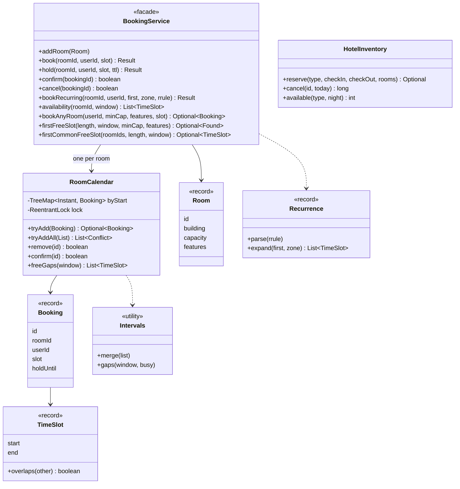

# LLD Interview: Design a Meeting-Room (and Hotel-Room) Booking System

> "Employees book meeting rooms for a time slot. Two people must never hold the same room at the same time. They can search by capacity and equipment, ask for the first free slot, and set up weekly meetings. Then: how would this work for a hotel, and for 50,000 employees?"

Looks like CRUD (create, read, update, delete), but the heart is **time-interval reasoning**: when do two bookings overlap, how do you find free gaps quickly, and how do you stay correct when two people click at once. L4 is the **core model and the overlap test**. L5 is the **efficient, concurrent, feature-complete service**: TreeMap neighbour checks, sweep-line search, recurring meetings, time zones, holds. L6 is the **platform and the hotel variant**: count-based inventory, overbooking maths, database constraints, sharding, calendar integration.

Roadmap pair: [Ad click aggregation (HLD)](../../../HLD/interviews/ad-click-aggregation/README.md).

> 💡 **Terms in one line each:** **Half-open interval `[start, end)`**: includes the start instant, excludes the end, so back-to-back meetings don't clash. **Sweep line**: sort interval boundaries and walk through once while keeping a counter. **TreeMap**: a Java map kept sorted by key, with O(log n) neighbour lookups. **Hold**: a temporary reservation that expires by itself. **RRULE**: the one-line iCalendar syntax for a repeating event. **Exclusion constraint**: a database rule saying "no two rows may overlap".

## How to read this folder

> 👉 **New to calendars and room booking? Start with [00-understand-the-product.md](00-understand-the-product.md).**

| File | Level | What "good" looks like |
|---|---|---|
| [00-understand-the-product.md](00-understand-the-product.md) | Everyone, first | The product as a user sees it; why `[start, end)`; try ICS and a DST experiment |
| [L4-mid.md](L4-mid.md) | Mid / SDE2 | `Room`, `Booking`, `TimeSlot`; **half-open interval and why**; overlap test `a.start < b.end && b.start < a.end`; book/cancel; availability for a day; find a free room by capacity and features; one lock per room with check-and-insert as one step |
| [L5-senior.md](L5-senior.md) | Senior | Per-room `TreeMap` with floor/higher checks (O(log n)); interval trees named; first free slot via merge and sweep; recurring meetings with a conflict report; UTC instants and DST; 32 threads, one winner; holds with expiry and an injected clock |
| [L6-staff.md](L6-staff.md) | Staff | Hotel: inventory by room type per night, overbooking with arithmetic, price and cancellation policy; Postgres exclusion constraint; sharding by building; ICS/CalDAV integration; no-show auto-release; testing strategy |

## Code (runnable, no dependencies)

| | Run | Files |
|---|---|---|
| ☕ Java 21 | `./java/run.sh` | [java/src/booking/](java/src/booking/): `TimeSlot` (record, overlap test), `Room`, `Booking` (hold or confirmed), `RoomCalendar` (TreeMap + one lock), `Intervals` (merge, gaps), `Recurrence` (RRULE subset), `BookingService` (facade), `HotelInventory`, `MutableClock`, `Result`/`Conflict`; 23 tests in `BookingTests.java`; `Demo.java` |
| 🟨 Node 22 | `cd js && node --test` | [js/booking.js](js/booking.js), [js/booking.test.js](js/booking.test.js): sorted-array calendar with binary search, same service features, hotel inventory; 9 tests |

**Design decisions in the code:** a booking is an immutable `TimeSlot` plus owner; a **hold is just a booking with `holdUntil`**, treated as absent once the clock passes it, so no cleanup job is needed (expired entries are deleted when a later check bumps into them). Each room has its **own** `RoomCalendar` with its own lock, so booking room A never waits for room B. Check and insert run under that one lock; the service never does "look, then call book". Searching "any room" is a snapshot, so it tries rooms in best-fit order and relies on the atomic add to win. A recurring series is checked as a whole and inserted only if no occurrence clashes. The hotel is a different model on purpose: counters per (type, night), not a timeline per room.

**Tests:** touching, partial, containment, identical and one-minute overlaps; zero-length slot rejected; conflict names its blocker; cancel frees the slot; availability gaps; best-fit room selection; first free slot across rooms and common free slot; interval merging; weekly series, a clashing series (named occurrence, nothing kept), DST in `America/New_York`, INTERVAL/UNTIL; hold confirm and expiry with an injected clock (expiry is exactly at `holdUntil`); **32 threads on one slot, 200 rounds, exactly one winner**; 8 threads of random book/cancel with a brute-force pairwise overlap check; hotel all-nights-or-nothing, 105 sold of 100, price and refund. **Mutation checks** (on copies, reverted): `<=` in the overlap test fails 2 tests (touching, and the random brute-force); removing the room lock fails the 32-thread test and/or the random test in every run (3 of 3).

Sample demo output:

```
> Ana books Aspen 09:00-10:00, Ben tries 09:30-10:30 and then 10:00-11:00
Ana: true
Ben (overlap): false, blocked by ana 09:00-10:00
Ben (touching): true
> first free 90 min for 3+ people: Birch 10:00-11:30
series ok: false, clashing occurrences: [2030-01-21T11:00:00Z]
other user while held: false
confirm after 6 min: false, other user now: true
> hotel: 100 deluxe rooms, 105% allowed, sold 105 for one night
```

## Class diagram (matches the code)



## Libraries & concepts used

**Java:** [TreeSet, TreeMap & PriorityQueue](../../libraries/java/treeset-and-priorityqueue.md) · [Locks & synchronized](../../libraries/java/locks-and-synchronized.md) · [Records & immutability](../../libraries/java/records-and-immutability.md) · [Time & Clock](../../libraries/java/time-and-clock.md) · [Java time API](../../libraries/java/java-time-api.md) · [Executors & threads](../../libraries/java/executors-and-threads.md)

**Concepts:** [Intervals and overlap](../../concepts/intervals-and-overlap.md) · [Holds, reservations & TTL](../../concepts/holds-reservations-and-ttl.md) · [Optimistic vs pessimistic locking](../../concepts/optimistic-vs-pessimistic-locking.md) · [Transactions & isolation](../../concepts/transactions-and-isolation.md) · [Cron & recurring schedules](../../concepts/cron-and-recurring-schedules.md) · [Thread-safety basics](../../concepts/thread-safety-basics.md) · [Big-O](../../concepts/big-o-complexity.md)

**Related LLD interviews:** [Movie booking](../movie-booking/README.md) (holds, all-or-nothing) · [Task scheduler](../task-scheduler/README.md) (recurring jobs) · [Parking lot](../parking-lot/README.md) (allocating one of many identical resources)

**Related HLD:** [PostgreSQL](../../../HLD/technologies/postgresql.md) · [Sharding & replication](../../../HLD/concepts/sharding-and-replication.md)

## The core insight

1. **Pick the interval convention first.** `[start, end)` turns every boundary argument into one comparison, and makes merge, length and adjacency trivial.
2. **Overlap is one expression**: `a.start < b.end && b.start < a.end`. If you write more than that, you are probably missing a case or handling one twice.
3. **Check and insert are one step.** Every double-booking bug is a gap between "is it free?" and "mark it taken". Close the gap with a lock per room in code and, at scale, a constraint in the database.
4. **Sorted storage turns a scan into two lookups.** Non-overlapping bookings in a `TreeMap` need only the neighbour before and the one after.
5. **A hold is a booking that expires by the clock.** Make "now" injectable and you can test expiry without sleeping.
6. **A hotel is counting, a meeting room is scheduling.** If the guest doesn't care which room, don't model rooms on a timeline.
