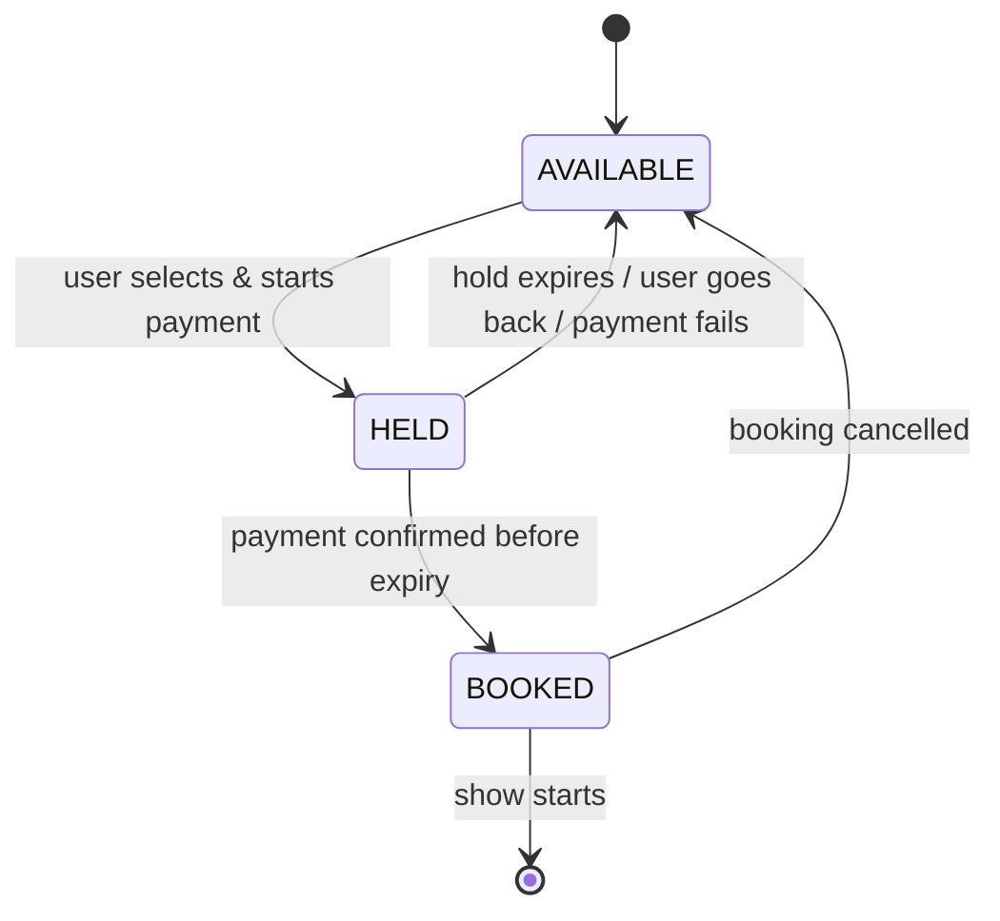
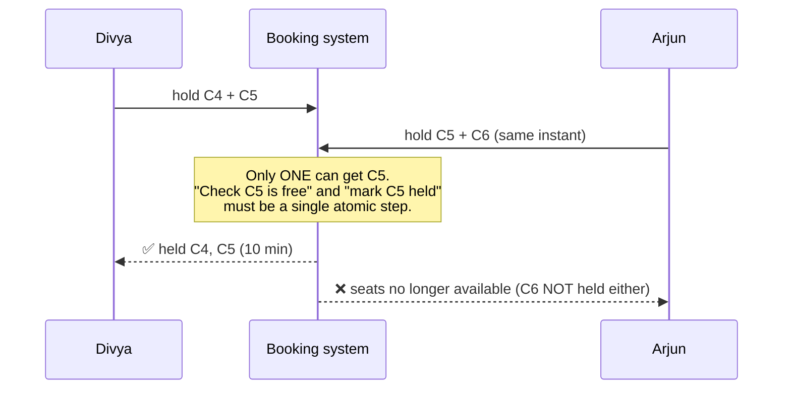

# Start Here: How Does BookMyShow Stop Two People Buying the Same Seat? (Before the Interview)

> Booking a movie ticket feels simple: pick seats, pay, done. But when a big film opens, thousands of people stare at the same seat map at the same second. This page walks through a booking and shows the one hard problem behind it: **holding seats safely while someone pays**.
>
> Time: ~10 minutes. Then: [L4](L4-mid.md) → [L5](L5-senior.md) → [L6](L6-staff.md).

---

## 1. One booking, step by step

Divya wants two recliner seats for *Interstellar*, Friday 6:30 pm.

| What Divya sees | What the system is doing |
|---|---|
| A seat map: grey = taken, white = free, coloured = recliner/premium | Reads the **state of every seat for this show** |
| She taps C3 and C4 | Nothing reserved yet: just a selection on her phone |
| She taps **Pay ₹1,200**: "Seats held for you: 09:59" timer starts | The seats are **held** for her: nobody else can take them for 10 minutes |
| Meanwhile Arjun sees C3, C4 greyed out | Held seats are shown as unavailable to everyone else |
| She pays via UPI; "Booking confirmed 🎟️" + QR code | The **hold becomes a booking** |
| (Alternative) Her UPI app hangs; after 10 minutes: "Session expired" | The **hold expires**; C3, C4 become free again for others |
| (Alternative) She tries C4 + C5 but Arjun just got C5: "Selected seats are no longer available" | **All-or-nothing**: she doesn't get a half-booking with only C4 |
| She cancels on Wednesday: "₹1,200 refunded" | Seats freed; refund depends on how close to showtime |

Two things make this hard:
1. **The hold**: seats must be reserved during payment, but not forever.
2. **Many people at once**: when bookings open for a blockbuster, thousands click the same seats within the same second.

---

## 2. Where you've seen it

| Place | Same pattern |
|---|---|
| **BookMyShow, PVR, Paytm movies** | Seat maps, timed holds, convenience fees |
| **Concert tickets** (e.g. huge concert sales in India where millions queued) | "You're in queue, position 23,451". A **virtual waiting room** in front of the booking system |
| **IRCTC Tatkal** | Massive spike at exactly 10:00 am; seat (berth) allocation under extreme contention |
| **Flight check-in seat selection** | Seat map, hold during payment for paid seats |
| **E-commerce flash sales** | "Item reserved in your cart for 15 minutes" |
| **Infra: leases** | Kubernetes `Lease` objects, DHCP IP leases: a resource is yours **until a time**, unless you renew. A seat hold is a lease on a seat |

---

## 3. The features, one situation at a time

### 3.1 Shows, screens, seats
A **screen** has a fixed seat layout (A1…J20). A **show** is one screening of a movie in a screen at a time. Seat availability is **per show**: C3 can be booked for the 6:30 show and free for the 9:45 show.

👉 Interview: *model layout (shared) separately from availability (per show).*

### 3.2 Seat types and prices
Regular ₹250, Premium ₹350, Recliner ₹600, and prices can differ by show (weekend evening vs weekday morning).

👉 Interview: *price per seat type per show; money as integers (paise).*

### 3.3 The hold (with a timer)
Seats are reserved while you pay, then either confirmed or released automatically.

👉 Interview: *seat states AVAILABLE → HELD → BOOKED, and expiry* ([holds & TTL](../../concepts/holds-reservations-and-ttl.md), [state machines](../../concepts/state-machines.md)).

### 3.4 All-or-nothing
Asking for 4 seats together: if even one is taken, you get none, because a family doesn't want 3 seats.

👉 Interview: *atomic multi-seat operations, and rolling back partial work.*

### 3.5 Many people, same seats
At 10:00:00 when bookings open, 200 people tap the same two middle seats.

👉 Interview: ***concurrency***. Exactly one must win. Lock the whole show, or each seat? What about deadlocks? ([optimistic vs pessimistic locking](../../concepts/optimistic-vs-pessimistic-locking.md), [deadlocks](../../concepts/deadlocks-and-lock-ordering.md).)

### 3.6 Payment confirmation arrives late, or twice
The payment gateway calls back after the hold expired, or calls back twice.

👉 Interview: *idempotent confirm; what to do with a payment for an expired hold (refund).*

### 3.7 Cancellation and refunds
"100% refund up to 24 h before, 50% up to 2 h before, then nothing." Different theatres, different rules.

👉 Interview: *refund policy as a swappable rule* (**Strategy**).

---

## 4. The key mechanism: a seat's life

And the race the whole interview is about:

---

## 5. Try it yourself (real, 5 minutes)

1. Open **BookMyShow** (or any cinema app) and start booking any show. Select seats and proceed to payment: notice the **countdown timer**. Let it run out (or go back) and check that the seats show as free again.
2. Open the same show on **two devices** (phone + laptop). Hold seats on one, then refresh the seat map on the other: they appear taken.
3. Read the app's **cancellation/refund policy** page: those rules are your `RefundPolicy`.
4. **Infra:** `kubectl get leases -n kube-system` shows leases used for leader election: the same "yours until renewed or expired" idea as a seat hold.

---

## 6. From experience to requirements

| What you experienced | Requirement | Type |
|---|---|---|
| Seat map per show | Seat states per show; layout per screen | Functional |
| Prices by seat type | Pricing per show and seat type | Functional |
| "Seats held 09:59" | Hold with TTL | Functional |
| "Booking confirmed" | Confirm hold → booking after payment | Functional |
| Cancel + refund | Cancellation with refund policy | Functional |
| Never two people in one seat | **Exclusive, atomic** seat claims | Non-functional (correctness) |
| Get all seats or none | **All-or-nothing** multi-seat holds | Non-functional (correctness) |
| Payment callback retried | **Idempotent** confirm | Non-functional |
| Thousands clicking at once | **Safe and fast under contention** | Non-functional |

---

## 7. Mini glossary

| Term | Meaning in plain words |
|---|---|
| **Show** | One screening: movie + screen + start time |
| **Hold** | A temporary reservation of seats while you pay; expires automatically |
| **TTL** | Time to live: how long a hold lasts |
| **All-or-nothing (atomic)** | Either every requested seat is reserved, or none is |
| **Pessimistic locking** | Lock first, then check and change; others wait |
| **Optimistic locking** | Try to change; if someone else changed it first, detect it and fail/retry; nobody waits |
| **CAS (compare-and-set)** | "Change this value only if it's still what I last saw", done as one atomic step |
| **Deadlock** | Two threads each waiting for something the other holds, forever |
| **Idempotent** | Doing it twice has the same effect as doing it once |
| **Virtual waiting room** | A queue page that lets users into the booking flow at a controlled rate |

➡️ **Now design it:** [L4-mid.md](L4-mid.md)
