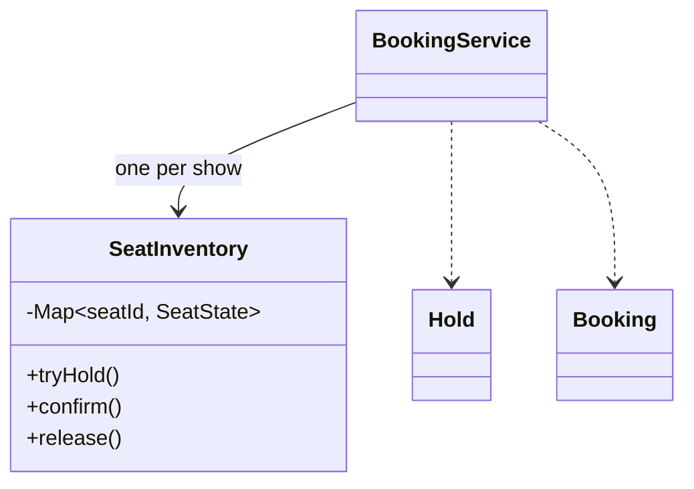

# Movie Booking — L4 (Mid-level / SDE2) LLD Interview

> **Level expectation:** model movies, screens, shows and seats cleanly; implement hold → confirm with a timeout; make multi-seat holds all-or-nothing; make it safe when two users book at once. A single lock per show is a perfectly good L4 answer if you can explain why.

> 🆕 New to how seat holds work? Read [00-understand-the-product.md](00-understand-the-product.md) first.

Legend: **🧑‍💼 Interviewer** · **🧑‍💻 Candidate** · **📝 Note** = commentary for you.

---

## 1. Clarifying requirements

**🧑‍💼 Interviewer:** Design BookMyShow.

**🧑‍💻 Candidate:** Questions:
- Scope: browsing (cities, theatres, movies) or the booking flow?
- Do users pick specific seats, or just a quantity?
- Is there a hold while paying? How long?
- Payments: do I integrate a gateway, or assume "payment succeeded" is a callback?
- Cancellations and refunds?

**🧑‍💼 Interviewer:** Focus on booking. Users pick specific seats. 10-minute hold during payment. Payment is a callback. Cancellation with refunds is nice to have.

**🧑‍💻 Candidate:**

**Functional**
1. See free seats for a show.
2. Hold selected seats for 10 minutes: **all or none**.
3. Confirm a hold into a booking after payment.
4. Release a hold (user goes back / payment fails); expired holds free their seats.
5. *(nice to have)* Cancel a booking with a refund.

**Non-functional**
1. **A seat is never held/booked by two users at once.**
2. Correct when many users act concurrently.
3. Testable (time-dependent logic without waiting 10 minutes).

> 📝 **Note:** Separating browsing (read-heavy catalogue, caching) from booking (the concurrency problem) keeps the interview focused on the part they actually want to see.

---

## 2. Core entities

| Entity | Kind | Why |
|---|---|---|
| `Movie`, `Theatre`, `Screen` | catalogue data | Mostly static; here a show just carries the movie name and seats |
| `Seat` | **record** `(id, type)` | Physical seat in a screen, e.g. "C7", RECLINER |
| `SeatType` | enum | REGULAR / PREMIUM / RECLINER |
| `Show` | **record** | Movie + screen layout + start time + prices per seat type |
| `SeatState` | AVAILABLE / HELD / BOOKED | **Per show**: C7 can be booked at 6:30 and free at 9:45 |
| `Hold` | record | id, show, user, seats, expiresAt, amount |
| `Booking` | record | id, hold, seats, amount, paymentRef |
| `BookingService` | facade | API the app calls |

**🧑‍💼 Interviewer:** Why isn't "booked" a field on `Seat`?

**🧑‍💻 Candidate:** A `Seat` is part of the screen's layout and is shared by every show in that screen. Availability belongs to the **show**. Putting a status on `Seat` would mean one booking blocks the seat for every show.

---

## 3. API

```java
List<String> freeSeats(String showId);
Hold holdSeats(String showId, String userId, List<String> seatIds);   // throws if any seat isn't free
Booking confirmBooking(String holdId, String paymentRef);              // throws if hold expired
void releaseHold(String holdId);
long cancelBooking(String bookingId);                                  // returns refund in paise
```

---

## 4. Class diagram

Full diagram in the [README](README.md#class-diagram-matches-the-code). Core:



---

## 5. Deep dives

### 5.1 Seat state, including time

```java
public sealed interface SeatState {
    record Available() implements SeatState {}
    record Held(String holdId, Instant expiresAt) implements SeatState {}
    record Booked(String bookingId) implements SeatState {}

    static boolean isFree(SeatState s, Instant now) {
        return s instanceof Available || (s instanceof Held h && !now.isBefore(h.expiresAt()));
    }
}
```

**🧑‍💻 Candidate:** The key trick: **an expired hold counts as free**. I don't need a background job to release expired holds for correctness: every check compares `expiresAt` with the current time. (A cleanup job can still tidy up, but nothing depends on it running on time.) ([Holds, reservations & TTL](../../concepts/holds-reservations-and-ttl.md).)

"Current time" comes from an injected `java.time.Clock`, so tests move time forward instantly instead of waiting 10 minutes ([time & clock](../../libraries/java/time-and-clock.md)).

### 5.2 All-or-nothing hold, made atomic

**🧑‍💻 Candidate:** Holding seats is "check every seat is free, then mark every seat held". If two users run that at the same time, both checks can pass before either marks anything, and both get seat C5. That's the classic **check-then-act** race ([thread-safety basics](../../concepts/thread-safety-basics.md)).

Simplest correct fix: **one lock per show**. [LockingSeatInventory.java](java/src/moviebooking/LockingSeatInventory.java):

```java
public synchronized boolean tryHold(List<String> ids, String holdId, Instant now, Instant expiresAt) {
    for (String id : ids) {
        if (!SeatState.isFree(seats.get(id), now)) return false;      // check ALL first...
    }
    for (String id : ids) seats.put(id, new SeatState.Held(holdId, expiresAt));  // ...then change all
    return true;
}
```

- Checking everything before changing anything makes it **all-or-nothing** without any undo logic.
- The lock is **per show**: users booking different shows never wait for each other.
- Each call takes microseconds; even a busy show sees a handful of bookings per second, so one lock per show is plenty. ([Locks & synchronized](../../libraries/java/locks-and-synchronized.md).)

### 5.3 Confirming

```java
public synchronized boolean confirm(List<String> ids, String holdId, String bookingId, Instant now) {
    for (String id : ids) {
        if (!(seats.get(id) instanceof SeatState.Held h && h.holdId().equals(holdId) && now.isBefore(h.expiresAt())))
            return false;                                   // expired, released, or someone else's
    }
    for (String id : ids) seats.put(id, new SeatState.Booked(bookingId));
    return true;
}
```

The check "still held **by this hold**, and not expired" matters: if Divya's hold expired and Arjun grabbed one of her seats, her late payment must **not** turn Arjun's seat into her booking.

---

## 6. Follow-ups

**🧑‍💼 Interviewer:** The payment gateway calls `confirmBooking` twice for the same payment.

**🧑‍💻 Candidate:** Keep a map `holdId → booking`; if a booking already exists for that hold, return it instead of creating another. The code uses `ConcurrentHashMap.compute()` so two simultaneous callbacks for the same hold can't both create bookings ([ConcurrentHashMap](../../libraries/java/concurrent-hashmap.md)).

**🧑‍💼 Interviewer:** Payment succeeds but the hold already expired.

**🧑‍💻 Candidate:** Confirm fails, the user sees "Session expired", and we **refund** the payment automatically. Taking money without giving a seat is the worst outcome, so the refund path must be reliable (retried until it succeeds).

**🧑‍💼 Interviewer:** Different refund rules for different theatres?

**🧑‍💻 Candidate:** A `RefundPolicy` interface (**Strategy**) passed into the service: `refundPaise(booking, now, showStart)`. The default gives 100% ≥ 24 h before, 50% ≥ 2 h, otherwise 0.

**🧑‍💼 Interviewer:** How would you test the 10-minute expiry?

**🧑‍💻 Candidate:** With a mutable test clock: hold, `clock.advance(10 minutes)`, assert the seats show as free and the late confirm fails. Test `expiredHoldFreesSeatsAndCannotBeConfirmed` does exactly that, in milliseconds.

---

## 7. What the interviewer was evaluating (L4)

- [ ] Focused on the booking flow; clarified hold duration and payment boundary
- [ ] Availability modelled per show, not on the seat
- [ ] Seat states with expiry evaluated lazily against an injected clock
- [ ] All-or-nothing hold: check all, then change all, atomically
- [ ] Per-show lock with a justification
- [ ] Confirm re-checks "my hold, not expired"
- [ ] Idempotent confirm; refund on expired-hold payments

## 8. Common mistakes at this level

| Mistake | Why it's wrong |
|---|---|
| `boolean booked` on `Seat` | Blocks the seat for every show |
| Holding seats one by one without atomicity | Half-held groups; two users with the same seat |
| A background thread that must release holds on time for correctness | If it lags, seats stay blocked; lazy expiry is safer |
| One global lock for all shows | Every booking in the country waits on every other |
| Confirming without checking the hold's owner and expiry | Late payments steal seats |
| `Thread.sleep(600_000)` in tests | Tests take 10 minutes; inject a clock |

➡️ Next: [L5-senior.md](L5-senior.md)
