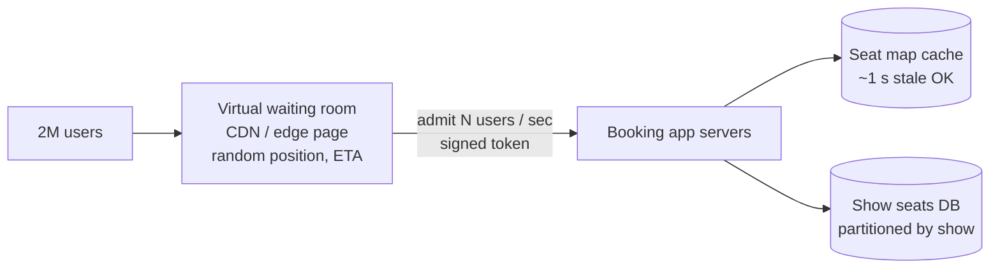

# Movie Booking — L6 (Staff) LLD Interview

> **Level expectation:** the in-memory design (L5) takes ~15 minutes. Then: *"Bookings for the year's biggest film open Friday at noon: 2 million users, 50 cities, payments through a gateway that sometimes times out."* You move the seat logic into the database without losing its guarantees, protect it from the launch spike, make payments reconcile, and handle bots and fairness, still writing the critical SQL. Read [L5-senior.md](L5-senior.md) first.

Legend: **🧑‍💼 Interviewer** · **🧑‍💻 Candidate** · **📝 Note** = commentary for you.

---

## 1. Where the in-memory design stops

| L5 assumption | Reality |
|---|---|
| One JVM holds a show's seats | Many stateless app servers; deploys and restarts |
| Contention = a few threads | A launch = hundreds of thousands of users in minutes |
| Payment confirms quickly | Gateways time out, retry, and call back late |
| Every user is a person | Bots and resellers try to grab seats |

---

## 2. Seat holds in the database

**🧑‍💻 Candidate:** The database becomes the arbiter, with the same "check and change in one step" principle as L5's CAS ([PostgreSQL](../../../HLD/technologies/postgresql.md)):

```sql
CREATE TABLE show_seats (
    show_id     bigint,
    seat_id     text,
    state       text NOT NULL,          -- AVAILABLE | HELD | BOOKED
    hold_id     uuid,
    expires_at  timestamptz,
    booking_id  uuid,
    version     bigint NOT NULL DEFAULT 0,
    PRIMARY KEY (show_id, seat_id)
);
```

**All-or-nothing hold in one statement:**

```sql
UPDATE show_seats
   SET state = 'HELD', hold_id = :holdId, expires_at = now() + interval '10 minutes', version = version + 1
 WHERE show_id = :showId
   AND seat_id = ANY(:seatIds)
   AND (state = 'AVAILABLE' OR (state = 'HELD' AND expires_at <= now()));
-- rows updated == number requested → success, COMMIT.
-- fewer → someone holds one of them → ROLLBACK (nothing changes: all-or-nothing for free).
```

- The row locks taken by `UPDATE` serialise competing transactions on the same seats; the `WHERE` re-checks the condition after waiting, so exactly one wins. That's the database doing what our CAS loop did.
- **Deadlocks:** two transactions updating overlapping seat sets can lock rows in different orders. Postgres detects that and aborts one (it gets an error and retries). To avoid it in the first place, lock in a fixed order first: `SELECT … WHERE … ORDER BY seat_id FOR UPDATE`. The same lock-ordering rule as L5 ([deadlocks](../../concepts/deadlocks-and-lock-ordering.md)).
- **Confirm** = `UPDATE … SET state='BOOKED', booking_id=:b WHERE hold_id=:h AND expires_at > now()`, requiring all rows updated, with a unique `(hold_id)` on the bookings table for idempotency.
- `now()` is the **database's** clock, one clock for all app servers. Never compare a timestamp written by server A with server B's clock.

> 📝 **Note:** "My in-memory compare-and-set becomes a conditional `UPDATE` whose row count tells me if I won" is the key LLD → production bridge. The guarantee is the same; only the enforcer changed.

---

## 3. Surviving the launch spike

**🧑‍💻 Candidate:** 2M users arriving at 12:00:00 for ~50k seats in a city. Letting them all hit the booking DB guarantees an outage, and most of them can't get seats anyway.



- **Virtual waiting room:** users wait on a cheap, cacheable page ([CDN](../../../HLD/technologies/cdn.md)). Admission is paced to what the booking path can handle (say 2,000 users/s), with a **signed admission token** checked by app servers so nobody skips the queue. Order by random draw at opening time (fairer than "who has the fastest connection") or by arrival.
- **Seat maps from cache:** the seat map display can be ~1 second stale (a seat shown free may fail at hold time, which the app handles gracefully). Only *holds* touch the authoritative rows.
- **Partition by show:** different shows never contend; a blockbuster's shows can sit on dedicated database capacity.
- **Load shedding:** if the DB is saturated, the app returns "high demand, retrying…" quickly instead of piling up requests until everything times out.

---

## 4. Payments that reconcile

- Create a **payment intent** with idempotency key = `holdId` before redirecting to the gateway. Retries and double callbacks map to the same intent.
- **Hold TTL > payment timeout**: if the gateway can take up to 8 minutes, a 10-minute hold leaves headroom. Otherwise people pay for seats that expired mid-payment.
- **Late success after expiry** → automatic refund, pushed through a reliable queue with retries ([retries & DLQ](../../../HLD/concepts/retries-backoff-and-dlq.md)), and a clear message to the user.
- **Reconciliation job:** gateway settlement report vs bookings: money without booking → refund; booking without money → investigate/void. With real money, "it usually works" isn't enough.
- The whole flow is a small **saga**: hold → pay → confirm, with compensations (release, refund) at each step ([sagas](../../../HLD/concepts/sagas-and-distributed-transactions.md)).

---

## 5. Bots, fairness and abuse

- **Per-user limits** (max 10 seats per show) enforced at hold time, keyed by verified account and payment instrument, not just user id (resellers create many accounts).
- **Hold abuse:** bots hold seats without paying to block others or to resell. Limit concurrent holds per user/device, shorten TTL for repeated non-payers, CAPTCHA/device attestation in the waiting room.
- **Fairness is a product decision:** random draw vs first-come, regional allocation, fan-club presales. Each changes the admission logic, so keep it configurable per event.

---

## 6. Operating it

- **Metrics per show:** hold success rate, hold → booking conversion, expired-hold rate, refund rate, DB lock wait time. A spike in expired holds often means the payment gateway is slow.
- **Kill switch per show/city:** pause new holds instantly (e.g. pricing error discovered).
- **Load tests that reproduce a launch** (hot seats, waiting-room admission), run before every big release, not just generic throughput tests.

---

## 7. Curveballs

**🧑‍💼 Interviewer:** During a launch, users complain they "got seats then lost them".

**🧑‍💻 Candidate:** Likely payments slower than the hold TTL: holds expire mid-payment, seats go back, and late confirmations fail. Check expired-hold rate and gateway latency percentiles for that window. Fixes: extend TTL dynamically when gateway latency is high; let the app request a one-time **hold extension** while a payment is visibly in progress; and make sure late successes are refunded automatically.

**🧑‍💼 Interviewer:** Could you use Redis for holds instead of the DB?

**🧑‍💻 Candidate:** Yes. A Lua script doing check-and-set over all requested seats atomically, with `PX` expiry, is a common pattern for flash sales because it's fast ([Redis](../../../HLD/technologies/redis.md)). But then the seat state lives in two places (Redis holds, DB bookings), so the confirm step must be careful: write the booking to the DB with constraints that make double-booking impossible even if Redis misbehaves (e.g. a unique `(show_id, seat_id)` on active bookings). Redis for speed, the DB for the final guarantee.

---

## 8. What the interviewer was evaluating (L6)

- [ ] All-or-nothing hold as a single conditional `UPDATE` with row-count check; DB clock
- [ ] Deadlock awareness in SQL; fixed lock order; retry on abort
- [ ] Launch protection: waiting room with signed admission, cached seat maps, partitioning, load shedding
- [ ] Payment intent idempotency, TTL vs gateway timeout, refunds, reconciliation
- [ ] Bots, hold abuse, fairness as configurable policy
- [ ] Per-show operational metrics and kill switches
- [ ] Redis vs DB trade-off with a final constraint as the safety net

## 9. Common mistakes at this level

| Mistake | Why it hurts at L6 |
|---|---|
| `SELECT` to check, then `UPDATE` in separate statements without locking | Two users win the same seat across servers |
| Comparing expiry against each app server's own clock | Clock skew → holds expire early or late |
| No admission control at launch | The DB melts; nobody gets seats |
| Hold TTL shorter than the payment flow | Paid-but-no-seat incidents at scale |
| Redis as the only guard against double booking | One failover away from oversold shows |
| Treating bot protection as an afterthought | Real users lose to scripts; reputational damage |

⬅️ Previous: [L5-senior.md](L5-senior.md) · 🏠 [Problem overview](README.md)
