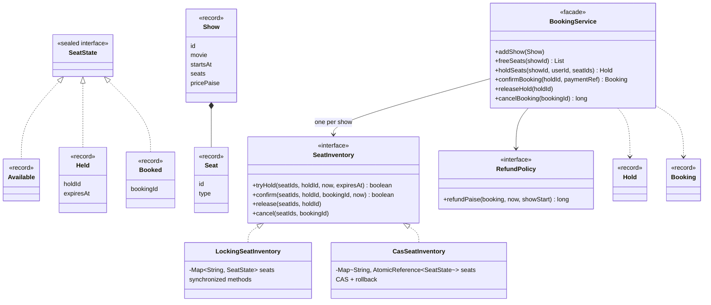

# LLD Interview: Design a Movie Ticket Booking System (like BookMyShow)

> "Users browse shows, pick seats on a seat map, pay, and get tickets. Design the classes and the core booking logic. Two users must never get the same seat."

The modelling is straightforward (movie, screen, show, seat). The interview is really about **concurrency on a shared resource**: temporary **holds with expiry**, **all-or-nothing** multi-seat reservations, **pessimistic vs optimistic** locking, **deadlock** avoidance, and **idempotent** payment confirmation.

## How to read this folder

> 👉 **New to how seat booking works behind the scenes? Start with [00-understand-the-product.md](00-understand-the-product.md).** It walks through one booking, the 10-minute hold timer, and the "200 people want the same seat" race.

| File | Level | What "good" looks like |
|---|---|---|
| [00-understand-the-product.md](00-understand-the-product.md) | Everyone, first | Know the hold → book flow and why it's a concurrency problem |
| [L4-mid.md](L4-mid.md) | Mid / SDE2 | Clean model, seat states per show, all-or-nothing hold under one lock per show, TTL via injected clock, confirm/release |
| [L5-senior.md](L5-senior.md) | Senior | Pessimistic vs optimistic (CAS with rollback), deadlock and lock ordering, expiry races, idempotent confirm, refund Strategy, contention tests on both designs |
| [L6-staff.md](L6-staff.md) | Staff | Holds in the database (conditional updates, `SKIP LOCKED`), payments reconciliation, virtual waiting rooms for launches, caching seat maps, fairness and bots |

## Code (runnable, no dependencies)

| | Run | Files |
|---|---|---|
| ☕ Java 21 | `./java/run.sh` | [java/src/moviebooking/](java/src/moviebooking/): `BookingService`, `SeatInventory` + `LockingSeatInventory` + `CasSeatInventory`, `SeatState`, `RefundPolicy`; tests in `BookingTests.java` run against **both** inventories |
| 🟨 Node 22 | `cd js && node --test` | [js/booking.js](js/booking.js), [js/booking.test.js](js/booking.test.js) |

## Class diagram (matches the code)

## Libraries & concepts used

**Java:** [Atomics & CAS](../../libraries/java/atomics-and-cas.md) · [Locks & synchronized](../../libraries/java/locks-and-synchronized.md) · [ConcurrentHashMap](../../libraries/java/concurrent-hashmap.md) · [Sealed interfaces & pattern matching](../../libraries/java/sealed-interfaces-and-pattern-matching.md) · [Records & immutability](../../libraries/java/records-and-immutability.md) · [Time & Clock](../../libraries/java/time-and-clock.md) · [BitSet & compact state](../../libraries/java/bitset-and-compact-state.md)

**JS:** [node:test runner](../../libraries/js/node-test-runner.md) · [Event loop & concurrency](../../libraries/js/event-loop-and-concurrency.md) · [Classes & private fields](../../libraries/js/classes-and-private-fields.md)

**Concepts:** [Holds, reservations & TTL](../../concepts/holds-reservations-and-ttl.md) · [Optimistic vs pessimistic locking](../../concepts/optimistic-vs-pessimistic-locking.md) · [Deadlocks & lock ordering](../../concepts/deadlocks-and-lock-ordering.md) · [State machines](../../concepts/state-machines.md) · [Thread-safety basics](../../concepts/thread-safety-basics.md) · [Design patterns](../../concepts/design-patterns.md)

**Related:** [Parking lot](../parking-lot/README.md) (claiming spots atomically), [Splitwise](../splitwise/README.md) (idempotency, money as paise), HLD [distributed locks & leases](../../../HLD/concepts/distributed-locks-and-leases.md).

## The core insight

1. **Availability is per show; holds expire.** A seat is AVAILABLE, HELD (until a time) or BOOKED. An expired hold simply counts as available, so no cleanup job is needed for correctness.
2. **Check-all-then-change-all must be atomic.** Either lock the show, or claim seats one by one with compare-and-set and roll back on failure.
3. **Confirm is idempotent and re-checks expiry.** Payment callbacks arrive late and twice.
