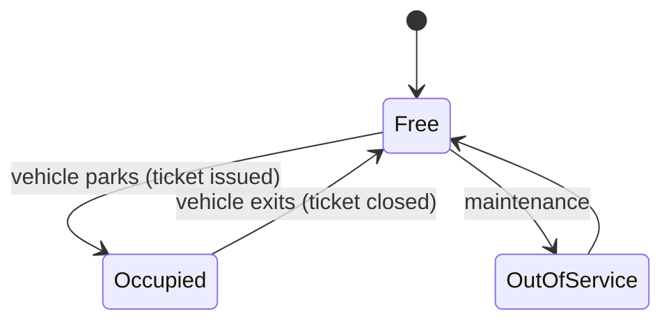
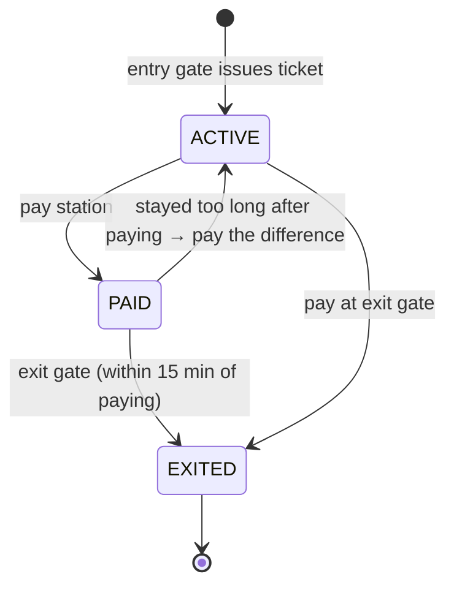

# Start Here: How Does a Parking Lot Actually Work? (Before the Interview)

> "Design a parking lot" sounds like you're designing concrete and paint. You're not: you're designing the **software** that runs a multi-level parking facility: the gates, tickets, spot assignment, display boards and billing. This page walks you through one visit so every class in the interview corresponds to something you've physically seen.
>
> Time: ~10 minutes. Then: [L4](L4-mid.md) → [L5](L5-senior.md) → [L6](L6-staff.md).

---

## 1. One visit to a mall, step by step

Sneha drives her car into a large mall's basement parking on a Saturday.

| Step | What Sneha sees | What the software does |
|---|---|---|
| 1. Arrives at the **entry gate** | A boom barrier, a machine, maybe a camera reading her number plate | Checks there's space for a **car**; records the **plate** and **entry time** |
| 2. Gets a **ticket** | Paper ticket with a barcode / QR, or just "plate recorded" | Creates a **Ticket** with a unique ID, linked to her vehicle and the time |
| 3. Sees **LED boards** | "Level B1: FULL · Level B2: 34 free" | Keeps a **live count of free spots** per floor and size, and updates the boards whenever a car enters/leaves |
| 4. Parks | Some malls show green/red lights above each spot or tell you "go to B2-M17" | **Assigns a spot** (or lets her pick one and detects it with sensors) |
| 5. Shops for 2 h 10 min | — | Nothing. Time passes |
| 6. **Pays** | At a pay station, or at the exit: "₹120" | Computes the **fee** from duration, vehicle type and the **tariff rules** |
| 7. Leaves through the **exit gate** | Scans ticket, barrier opens | **Closes the ticket**, marks the **spot free again**, updates the boards |

Meanwhile, at the same moment:
- 🚗🚗 **Four entry gates** are letting cars in simultaneously. They must never send two cars to the same spot.
- 🏍️ Bikes go to the bike area; a 🚚 delivery truck must only get a large bay.
- 🧾 Someone **lost their ticket** and pays a fixed penalty. Someone else tries to **reuse** an old ticket.

Every one of those is an interview question.

---

## 2. Where you've seen this

| Place | What's special |
|---|---|
| **Malls** | Multiple floors, LED "free spots" boards, pay at exit, grace period ("first 10 minutes free") |
| **Airports** | Short-term vs long-term rates, **daily caps**, large bays for buses/tempo travellers |
| **Hospitals** | Lower rates, reserved/disabled spots near the entrance |
| **Your office basement** | RFID/badge access, **monthly passes** instead of hourly tickets, EV charging bays |
| **Apps that let you pre-book a spot** | **Reservations**: a spot is held for you before you arrive |
| **FASTag/ANPR parking** (camera reads plate, pays automatically) | No paper ticket at all: the plate *is* the ticket |

---

## 3. The features, one situation at a time

### 3.1 Vehicle types and spot sizes
A car can't fit in a bike spot. A bike *can* fit in a car spot, but it's wasteful to put it there while bike spots are free.

| Vehicle | Fits in (preferred first) |
|---|---|
| Motorcycle | small → medium → large |
| Car | medium → large |
| Truck / bus | large only |

👉 Interview: *how do you model vehicle types and spot sizes?* (Enum vs inheritance: the classic modelling question. See [OOP modelling](../../concepts/oop-modeling.md).)

💡 **Enum vs inheritance:** an *enum* is a fixed list of named constants (`CAR`, `BIKE`); *inheritance* means making a subclass per type (`class Car extends Vehicle`). The question is whether types differ in *data* (enum is enough) or in *behaviour* (subclasses may help).

### 3.2 Which spot? (allocation)
"Nearest to the entrance/lift first" is the usual rule. But a mall might prefer "fill the floor with the most free spots" to avoid one congested ramp. An EV must get a charging bay. A disabled badge holder gets reserved spots.

👉 Interview: *how do you make the allocation rule swappable without rewriting the lot?* (**Strategy** pattern.)

💡 **Strategy pattern:** put each rule behind a small interface (`AllocationStrategy`) and hand the lot the one to use, so you swap rules without editing the lot. Same idea as picking a load-balancing algorithm (round-robin vs least-connections) from config.

### 3.3 Tickets
A ticket is proof of "this vehicle entered at this time". It must be **unique**, **single-use** (can't exit twice with one ticket), and a vehicle can't have two active tickets (that's how cloned number plates get caught).

👉 Interview: *ticket lifecycle (active → paid → exited), lost ticket, duplicate exit.*

### 3.4 Pricing (the part people underestimate)
A real tariff board looks like this:

```
CARS         Up to 10 min ............ FREE
             Per hour or part ........ ₹40
             Max per 24 hours ........ ₹300
BIKES        Per hour or part ........ ₹20
             Max per 24 hours ........ ₹150
LOST TICKET  ................................ ₹500
```

Hidden in it: **grace period**, **rounding up** ("or part": 2 h 10 min = 3 hours), **per-vehicle rates**, a **daily cap**, and a **penalty**. Then the mall adds weekend rates, or "first 2 hours free with a cinema ticket".

👉 Interview: *pricing that changes often must be easy to change.* (**Strategy**, configuration; and money must be `BigDecimal` or integer paise, never `double`: see [BigDecimal & money](../../libraries/java/bigdecimal-and-money.md).)

💡 **`BigDecimal` / paise / `double`:** `double` stores numbers in binary and cannot represent values like 0.1 exactly, so sums drift (₹119.99999). `BigDecimal` keeps exact decimal digits; the alternative is counting whole paise (1/100 rupee) in a `long`.

### 3.5 Display boards
"Level B2: 34 free" must update the moment a car parks or leaves. There may be boards at the entrance, on each floor, and in an app.

👉 Interview: *the lot shouldn't know about every kind of board.* (**Observer** pattern.)

💡 **Observer pattern:** the lot publishes "a spot changed" events and any number of boards subscribe to them, so the lot never needs to know who is listening. It is the in-process version of a pub/sub topic or a metrics subscriber.

### 3.6 Many gates at once
Four entry gates, each a separate machine/thread, all asking "give me a free car spot" at the same instant.

👉 Interview: ***concurrency***. Two gates must never get the same spot. This is the same check-then-act race as the [rate limiter](../rate-limiter/README.md): "is it free? → take it" must be one atomic step.

💡 **Concurrency / thread / race / atomic:** a *thread* is one independent line of execution; several run at once. A *check-then-act race* happens when two threads both see "free" before either takes the spot. *Atomic* means the check and the take happen as one indivisible step that no other thread can interleave with (like a compare-and-set on a k8s resource version).

---

## 4. The lifecycle, as a picture





Two separate things have state: the **spot** (free / occupied) and the **ticket** (active / paid / exited). Keeping them separate is part of good modelling.

---

## 5. Try it yourself (5 minutes, all real)

1. **Read a real tariff.** Search "*<your city> airport parking charges*" and open the airport's official page. Find: the grace period, how partial hours are rounded, the daily maximum, the lost-ticket penalty, different rates per vehicle type. Write the rules down: that's your `PricingStrategy` spec. Notice how many edge cases exist.
2. **Next time you're at a mall or airport:** count the entry gates (concurrency!), look for LED boards per floor (observer), the bike area vs car area (spot sizes), and the reserved/EV bays (allocation rules).
3. **Check your ticket:** it usually prints an ID, entry time and gate number. That's the `Ticket` record.

---

## 6. From experience to requirements

| What you experienced | Requirement | Type |
|---|---|---|
| Barrier opens, you get a ticket | `park(vehicle) → Ticket` | Functional |
| Scan ticket, pay, barrier opens | `unpark(ticketId) → Receipt(fee)` | Functional |
| Bike area, car spots, truck bays | Vehicle types, spot sizes, fit rules | Functional |
| "Nearest free spot" / spread across floors | Pluggable **allocation rule** | Functional (extensible) |
| Tariff board with grace, rounding, cap | Pluggable **pricing** | Functional (extensible) |
| "Level B2: 34 free" | Live availability per floor and size | Functional |
| "FULL" sign | Reject when no fitting spot | Functional |
| Four gates at once | **Thread-safe**: no spot ever given twice | Non-functional |
| Old ticket reused / car already inside | Ticket single-use; one active ticket per plate | Non-functional (correctness) |
| Bill is exactly ₹120, not ₹119.99999 | **Exact money arithmetic** | Non-functional (correctness) |

---

## 7. Mini glossary

| Term | Meaning in plain words |
|---|---|
| **Spot / bay** | One parking space |
| **Spot size** | Small (bike), medium (car), large (truck/bus) |
| **Ticket** | Proof of entry: ID, vehicle, spot, entry time |
| **Receipt** | Proof of exit and payment: duration and fee |
| **Tariff** | The pricing rules |
| **Grace period** | Short free time (e.g. 10 min) for people who just drop someone off |
| **Daily cap** | Maximum charge per 24 hours |
| **ANPR** | Automatic Number Plate Recognition: a camera reads the plate |
| **FASTag** | India's electronic toll tag: a windscreen sticker that is read wirelessly so payment needs no cash or ticket |
| **RFID** | Radio-frequency ID: a badge/tag a reader detects without touching, used for office access cards |
| **Thread-safe** | Correct even when many threads call it at the same time |
| **Entry / exit gate** | Barrier + machine; each one is a concurrent caller of the software |
| **Facade** | One simple class (`ParkingLot`) that the gates talk to, hiding the internals |

➡️ **Now design it:** [L4-mid.md](L4-mid.md)
