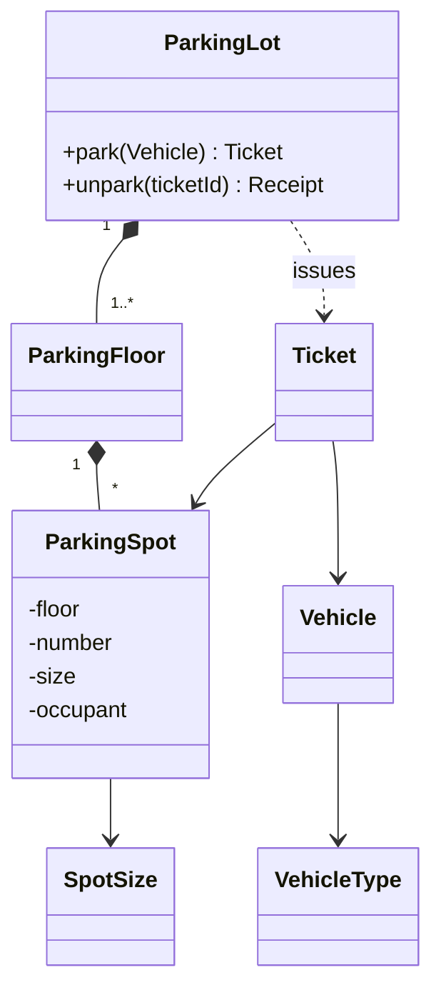

# Parking Lot — L4 (Mid-level / SDE2) LLD Interview

> **Level expectation:** turn the description into clean classes, implement `park` and `unpark` correctly, compute fees exactly, and make it safe for more than one gate. Explain *why* each thing is an enum, record or class.

> 🆕 Never thought about parking-lot software? Read [00-understand-the-product.md](00-understand-the-product.md) first. It walks through one mall visit and the tariff board.

Legend: **🧑‍💼 Interviewer** · **🧑‍💻 Candidate** · **📝 Note** = commentary for you.

---

## 1. Clarifying requirements

**🧑‍💼 Interviewer:** Design a parking lot.

**🧑‍💻 Candidate:** A few questions so I model the right thing:
- One building with multiple floors? Or many lots?
- Which vehicle types? Do spots come in sizes?
- How does pricing work: hourly? per vehicle type?
- Do we assign the spot, or does the driver choose?
- How many entry/exit gates?
- Payment: do I need to model payment methods, or just compute the fee?

**🧑‍💼 Interviewer:** One building, multiple floors. Motorcycles, cars, trucks; small, medium, large spots. Hourly per vehicle type. The system assigns the spot. Several gates. Just compute the fee.

**🧑‍💻 Candidate:** So:

**Functional**
1. `park(vehicle)` → assigns a fitting spot, returns a ticket; rejects if full.
2. `unpark(ticketId)` → frees the spot, returns a receipt with the fee.
3. Vehicle fits in its own size or bigger (a bike can use a car spot; a car can't use a bike spot).
4. Show free spots per size.

**Non-functional**
1. Correct under concurrent gates: a spot is never given to two vehicles.
2. Fees are exact (money).
3. Easy to extend: new vehicle types, new pricing.

> 📝 **Note:** Asking "just compute the fee, or model payments?" saves you from designing a payment system nobody asked for. Scoping out is as important as scoping in.

---

## 2. Core entities

**🧑‍💻 Candidate:** Nouns from the problem → candidate classes ([OOP modelling](../../concepts/oop-modeling.md)):

| Noun | Kind | Why |
|---|---|---|
| `VehicleType` | **enum** | Fixed set; each knows which spot sizes it fits |
| `SpotSize` | **enum** | Fixed set |
| `Vehicle` | **record** (value) | Just a plate + type; two equal plates = the same vehicle |
| `ParkingSpot` | **class** (entity) | Has identity (floor + number) and **changing state** (who's parked) |
| `ParkingFloor` | class | Owns its spots, finds a free one |
| `Ticket` | **record** | An immutable fact: this vehicle entered at this time, in this spot |
| `Receipt` | record | Fact: exit time, duration, fee |
| `ParkingLot` | class | The one entry point the gates call: `park`, `unpark` |

**🧑‍💼 Interviewer:** Why not `Car extends Vehicle`, `Truck extends Vehicle`?

**🧑‍💻 Candidate:** Subclasses make sense when types **behave** differently. Here, a car and a truck differ only in **data**: which spot sizes they fit. That's one field on an enum. A class hierarchy would give me three nearly-empty classes, and adding "EV car" or "van" would mean a new class each time. With an enum, it's one line ([enums](../../libraries/java/enums-and-enummap.md)):

```java
public enum VehicleType {
    MOTORCYCLE(List.of(SpotSize.SMALL, SpotSize.MEDIUM, SpotSize.LARGE)),
    CAR(List.of(SpotSize.MEDIUM, SpotSize.LARGE)),
    TRUCK(List.of(SpotSize.LARGE));

    private final List<SpotSize> fitsIn;   // smallest first = preferred
    VehicleType(List<SpotSize> fitsIn) { this.fitsIn = fitsIn; }
    public List<SpotSize> fitsIn() { return fitsIn; }
}
```

> 📝 **Note:** "Inheritance vs enum/composition" is *the* modelling question in this interview. Interviewers specifically watch for the `Vehicle → Car/Bike/Truck` and `ParkingSpot → SmallSpot/LargeSpot` class explosion.

**🧑‍💼 Interviewer:** Why is `ParkingSpot` a class but `Ticket` a record?

**🧑‍💻 Candidate:** A record is for **values**: immutable, equal if their fields are equal. A ticket never changes after it's printed, so it's a record. A spot's occupant changes all day, and spot F0-M3 is still the same spot whether a car is in it or not. That's an **entity**, so it's a class. ([Records & immutability](../../libraries/java/records-and-immutability.md).)

---

## 3. Interfaces / API

```java
public final class ParkingLot {
    public Ticket park(Vehicle vehicle);          // throws ParkingFullException
    public Receipt unpark(String ticketId);       // throws InvalidTicketException
    public int freeSpots(SpotSize size);
}

public record Vehicle(String licensePlate, VehicleType type) {}
public record Ticket(String id, Vehicle vehicle, ParkingSpot spot, Instant entryTime) {}
public record Receipt(Ticket ticket, Instant exitTime, Duration parkedFor, BigDecimal fee) {}
```

---

## 4. Class diagram



(Filled diamond = **composition**: the lot owns its floors, a floor owns its spots. See [UML class diagrams](../../concepts/uml-class-diagrams.md).)

---

## 5. Deep dives

### 5.1 Parking: finding a spot

**🧑‍💻 Candidate:** Go floor by floor; on each floor try the vehicle's sizes in preference order (smallest fitting first), so a bike doesn't take a car spot while bike spots are free.

```java
for (ParkingFloor floor : floors) {
    for (SpotSize size : vehicle.type().fitsIn()) {
        Optional<ParkingSpot> spot = floor.claimSpot(size);
        if (spot.isPresent()) return spot.get();
    }
}
throw new ParkingFullException(vehicle.type());
```

### 5.2 Pricing, and why not `double`

The tariff: ₹40/hour for cars, "per hour **or part**" (round up), first 10 minutes free, max ₹300 per 24 h.

```java
public BigDecimal feeFor(VehicleType type, Duration parkedFor) {
    if (parkedFor.compareTo(gracePeriod) <= 0) return BigDecimal.ZERO;

    long billableHours = ceilHours(parkedFor);          // 2h10m -> 3
    long fullDays = billableHours / 24;
    long remainingHours = billableHours % 24;

    BigDecimal rate = hourlyRate.get(type);
    BigDecimal cap = dailyCap.get(type);
    BigDecimal remainder = rate.multiply(BigDecimal.valueOf(remainingHours)).min(cap);
    return cap.multiply(BigDecimal.valueOf(fullDays)).add(remainder);
}
```

Full code: [HourlyPricing.java](java/src/parkinglot/HourlyPricing.java). Example: 26 h 05 min → 27 billable hours → 1 day (₹300) + 3 h (₹120) = **₹420**.

**🧑‍💼 Interviewer:** Why `BigDecimal`?

**🧑‍💻 Candidate:** `double` is binary floating point; it can't represent 0.1 exactly. `0.1 + 0.2` is `0.30000000000000004`. For money that leads to bills like ₹119.99999 and totals that don't reconcile. `BigDecimal` is exact decimal arithmetic. Two gotchas: build it from a **string** (`new BigDecimal("0.1")`, not `new BigDecimal(0.1)`), and compare with `compareTo`, because `new BigDecimal("40").equals(new BigDecimal("40.00"))` is **false**. ([BigDecimal & money](../../libraries/java/bigdecimal-and-money.md).) In JavaScript I'd store integer paise instead ([money in JS](../../libraries/js/money-and-numbers-in-js.md)).

**🧑‍💼 Interviewer:** And time?

**🧑‍💻 Candidate:** Entry/exit as `Instant` (a point on the global timeline), duration as `Duration.between(entry, exit)`. Not `LocalDateTime`: on a daylight-saving day, local clock times can make a 2-hour stay look like 1 or 3 hours. And the lot takes a `Clock` in its constructor so tests can control time. ([java.time API](../../libraries/java/java-time-api.md).)

### 5.3 More than one gate

**🧑‍💼 Interviewer:** Two entry gates call `park` at the same moment. What happens?

**🧑‍💻 Candidate:** If "find a free spot" and "mark it occupied" are two separate steps, both gates can find the same free spot and both send a car there: a **check-then-act** race ([thread-safety basics](../../concepts/thread-safety-basics.md)).

Simplest correct fix at this level: make `park` and `unpark` `synchronized`. Only one gate is inside at a time. Each call takes microseconds, and a car takes ~10 seconds to pass a barrier, so a single lock is plenty for a few gates.

```java
public synchronized Ticket park(Vehicle vehicle) { ... }
public synchronized Receipt unpark(String ticketId) { ... }
```

The tickets map should still be a `ConcurrentHashMap` so that read-only calls like `freeSpots` can run without the lock. (The L5 design removes the global lock; see [L5](L5-senior.md#4-deep-dive-concurrency-without-a-global-lock).)

> 📝 **Note:** At L4, a correct coarse lock *with a reason why it's enough* beats a clever lock-free design you can't defend.

---

## 6. Follow-ups

**🧑‍💼 Interviewer:** Someone scans the same ticket at two exit gates.

**🧑‍💻 Candidate:** `unpark` removes the ticket from the active map; `ConcurrentHashMap.remove` is atomic and returns `null` for the second caller → `InvalidTicketException`. A ticket is single-use by construction.

**🧑‍💼 Interviewer:** The same number plate enters twice (cloned plate, or a missed exit).

**🧑‍💻 Candidate:** Keep `activeTicketsByPlate`; on park, `putIfAbsent(plate, …)`. If it returns something, reject and alert security. Normalise plates first: "ka 01 ab 1234" and "KA01AB1234" are the same car (the `Vehicle` record's compact constructor does this).

**🧑‍💼 Interviewer:** Add an "EV" vehicle type that needs a charging spot.

**🧑‍💻 Candidate:** Add `EV_CAR` to `VehicleType` and a `CHARGING` spot size or a `boolean charging` on the spot. Nothing else changes, which is the payoff of the enum design. (If EVs could *also* use normal spots when chargers are full, that's just its `fitsIn` list.)

**🧑‍💼 Interviewer:** Lost ticket?

**🧑‍💻 Candidate:** Look up the active ticket by plate (we have that map), charge the tariff's lost-ticket penalty or the actual fee, whichever is higher, then exit normally.

---

## 7. What the interviewer was evaluating (L4)

- [ ] Scoped (one building, fee only, no payment gateway)
- [ ] Enums for fixed categories; avoided a vehicle/spot class hierarchy, and could explain why
- [ ] Record (value) vs class (entity) chosen correctly
- [ ] Correct allocation with preference order
- [ ] Correct pricing: rounding up, grace, cap; `BigDecimal`; `Instant`/`Duration`
- [ ] Recognised the multi-gate race and fixed it correctly
- [ ] Single-use tickets; duplicate plates

## 8. Common mistakes at this level

| Mistake | Why it's wrong |
|---|---|
| `Car`, `Bike`, `Truck` subclasses + `SmallSpot`, `LargeSpot` subclasses | Class explosion for what is just data |
| `double fee` | Rounding errors on money |
| `LocalDateTime` for entry/exit | Breaks across DST changes and time zones |
| `System.currentTimeMillis()` called inside pricing | Untestable; inject a `Clock` |
| Spot lookup by scanning *all* spots on every park | Works, but O(n) per car; keep free spots per size |
| "Is it free?" then "occupy" as two unsynchronised steps | Two cars, one spot |
| Designing payments, users, admin panels unprompted | Burns the time you need for the core |

➡️ Next: [L5-senior.md](L5-senior.md)
