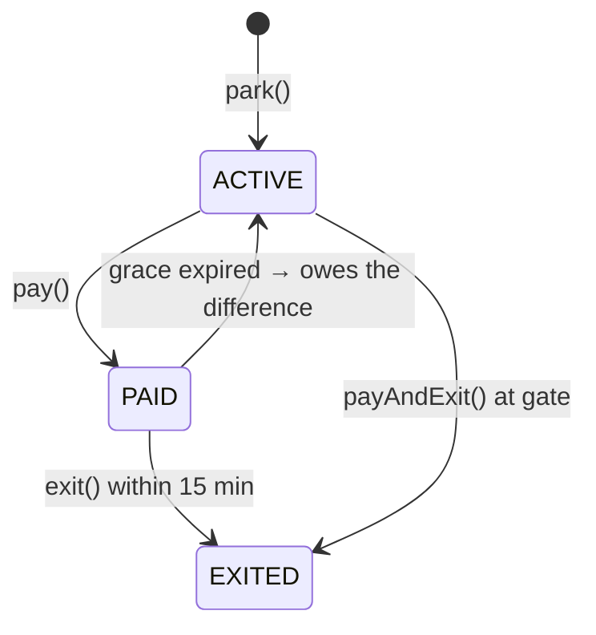

# Parking Lot — L5 (Senior) LLD Interview

> **Level expectation:** a design that survives change. Allocation and pricing are pluggable, display boards are decoupled, concurrency is fine-grained with a clear correctness argument, the ticket lifecycle is explicit, and everything is testable without sleeping. You justify each pattern and skip the ones that don't earn their place. Read [L4-mid.md](L4-mid.md) first.

Legend: **🧑‍💼 Interviewer** · **🧑‍💻 Candidate** · **📝 Note** = commentary for you.

---

## 1. Requirements (what's new vs L4)

**🧑‍💻 Candidate:** On top of L4's park/unpark/pricing:
- **Allocation rules vary by site:** nearest-first, spread across floors, later EV/disabled rules.
- **Tariffs change often:** weekend rates, promos, lost-ticket penalty.
- **Display boards** at entrance, per floor, in an app, all live.
- **Pay before exit:** pay at a station, then exit within 15 minutes.
- **High concurrency:** a stadium lot has 10+ gates emptying at once.
- **Testable:** pricing and time-dependent logic tested without real time passing.

---

## 2. Design and the patterns it uses

Full class diagram: [README](README.md#class-diagram-l5-design-matches-the-code). Code: [java/src/parkinglot/](java/src/parkinglot/).

| Pattern | Where | Why it earns its place ([design patterns](../../concepts/design-patterns.md)) |
|---|---|---|
| **Facade** | `ParkingLot` | Gates call two methods; floors, spots, strategies are hidden |
| **Strategy** | `SpotAllocationStrategy`, `PricingStrategy` | The two things that change most, swappable without touching `ParkingLot` (Open/Closed) |
| **Observer** | `AvailabilityListener` | The lot doesn't know about LED boards, apps or dashboards; they subscribe |
| **State** (lightweight) | `TicketStatus` enum with allowed transitions | Payment rules live in one place instead of `if` checks scattered across gates |
| **Dependency injection** | `Clock`, strategies passed into the constructor | Tests control time and behaviour |

**🧑‍💻 Candidate:** Deliberately **not** used:
- **Singleton `ParkingLot`.** Tempting ("there's only one lot"), but it makes tests share state and blocks running two lots in one process. The application wires one instance instead.
- **Abstract `Vehicle` / `ParkingSpot` hierarchies.** Enums with data (L4).
- **Builder.** The constructor has four arguments. Not worth it.

> 📝 **Note:** Listing what you *didn't* use, and why, is one of the clearest senior signals in LLD rounds. Pattern-stuffing is the most common way strong L4s fail L5 interviews.

### Strategies

```java
public interface SpotAllocationStrategy {
    Optional<ParkingSpot> allocate(List<ParkingFloor> floors, VehicleType type);
}
public interface PricingStrategy {
    BigDecimal feeFor(VehicleType type, Duration parkedFor);
}
```

Two allocation strategies ship: [NearestFirstStrategy](java/src/parkinglot/NearestFirstStrategy.java) and [LeastCrowdedFloorStrategy](java/src/parkinglot/LeastCrowdedFloorStrategy.java) (tries the floor with the most free spots first, to spread load across ramps). `ParkingLot` is identical for both.

**🧑‍💼 Interviewer:** Weekend rates and "first 2 hours free with a cinema ticket"?

**🧑‍💻 Candidate:** Compose strategies instead of growing one class with flags (**Decorator**):

```java
PricingStrategy base = new HourlyPricing(rates, caps, Duration.ofMinutes(10));
PricingStrategy pricing = new WeekendSurcharge(base, new BigDecimal("1.5"), clock);

record CinemaDiscount(PricingStrategy inner, Duration free) implements PricingStrategy {
    public BigDecimal feeFor(VehicleType t, Duration d) {
        return inner.feeFor(t, d.minus(free).isNegative() ? Duration.ZERO : d.minus(free));
    }
}
```

One caveat: `feeFor(type, duration)` doesn't know *when* the stay happened. Weekend or night rates need the entry/exit instants. If those rules are coming, I'd change the signature to take the ticket and exit time, and better to do that now than after five implementations exist.

### Observer for display boards

```java
@FunctionalInterface
public interface AvailabilityListener {
    void onAvailabilityChanged(int floor, SpotSize size, int freeSpots);
}

private final List<AvailabilityListener> listeners = new CopyOnWriteArrayList<>();

private void notifyListeners(ParkingSpot spot) {
    int free = floorOf(spot).freeCount(spot.size());
    for (AvailabilityListener l : listeners) {
        try {
            l.onAvailabilityChanged(spot.floor(), spot.size(), free);
        } catch (RuntimeException e) {
            // A broken display board must never stop a car from entering or leaving.
        }
    }
}
```

Two deliberate details:
- **`CopyOnWriteArrayList`**: listeners are registered once at startup but iterated on every car. Copy-on-write makes iteration lock-free and safe even if someone registers a listener mid-iteration ([concurrent collections](../../libraries/java/concurrent-collections.md)).
- **Exceptions are contained.** The test `unparkFreesSpotAndNotifiesBoards` registers a listener that always throws, and parking still works.

**🧑‍💼 Interviewer:** Listeners run on the gate's thread. What if an app listener is slow?

**🧑‍💻 Candidate:** Then the gate waits on it. For anything doing I/O, the listener should just put the event on a queue and return; a separate thread pushes it to the app. The lot's contract: "listeners must be fast and non-blocking".

---

## 3. Ticket lifecycle (State)



```java
public enum TicketStatus {
    ACTIVE, PAID, EXITED;

    TicketStatus pay() {
        if (this != ACTIVE) throw new IllegalStateException("cannot pay a " + this + " ticket");
        return PAID;
    }
    TicketStatus exit(boolean withinGraceAfterPayment) {
        if (this == PAID && withinGraceAfterPayment) return EXITED;
        throw new IllegalStateException("must pay before exit");
    }
}
```

**🧑‍💻 Candidate:** The `Ticket` itself stays an immutable record (entry facts). The *status* lives next to it: an `AtomicReference<TicketStatus>` per active ticket, so `pay` and `exit` transitions are compare-and-set and two pay stations can't both accept payment for one ticket. (The shipped code models the simpler "pay at exit" flow: `unpark` = pay + exit. [Records & immutability](../../libraries/java/records-and-immutability.md) explains why status shouldn't go inside the record.)

> 📝 **Note:** A full State pattern (a class per state) would be overkill for three states and three transitions. An enum with transition methods gives the same safety with a fraction of the code.

---

## 4. Deep dive: concurrency without a global lock

**🧑‍💼 Interviewer:** L4 used `synchronized park()`. A stadium has 12 exit gates and 30,000 cars leaving in 40 minutes. Still fine?

**🧑‍💻 Candidate:** 30,000 / 2,400 s ≈ 12.5 operations/s. Honestly, still fine: a global lock held for microseconds handles thousands per second. But a global lock also means a slow listener or a GC pause blocks every gate, so I'd like the design to be correct **without** one. The idea: make every shared mutation a single atomic operation on a concurrent structure.

### Claiming a spot: one atomic step

```java
// ParkingFloor: free spots per size, sorted nearest-first
private final Map<SpotSize, ConcurrentSkipListSet<ParkingSpot>> freeSpots = new EnumMap<>(SpotSize.class);
private final Map<SpotSize, AtomicInteger> freeCounts = new EnumMap<>(SpotSize.class);

Optional<ParkingSpot> claimSpot(SpotSize size) {
    ParkingSpot spot = freeSpots.get(size).pollFirst();   // remove-and-return: atomic
    if (spot == null) return Optional.empty();
    freeCounts.get(size).decrementAndGet();
    return Optional.of(spot);
}
```

- `pollFirst()` **removes and returns** the nearest free spot as one atomic operation. Two gates can't both get the same spot: if they race, one gets spot 3, the other gets spot 4 (or `null`). There's no separate "check" to go stale.
- **Why `ConcurrentSkipListSet`:** it's thread-safe *and sorted*, so "nearest first" is just `pollFirst()`. A `ConcurrentLinkedQueue` would be thread-safe but unsorted.
- **Why separate `AtomicInteger` counts:** `ConcurrentSkipListSet.size()` walks the whole set (O(n)). The boards ask for counts on every change.
- **The `EnumMap` itself is never modified after construction**, so it's safe to read from many threads without locks. Only its *values* (concurrent structures) change.

**Defence in depth:** `ParkingSpot.occupy()` is a CAS on `AtomicReference<Vehicle>`:

```java
boolean occupy(Vehicle vehicle) { return occupant.compareAndSet(null, vehicle); }
```

If a future allocation strategy ever hands out an already-occupied spot (e.g. it picked one without going through `claimSpot`), `occupy` returns `false` and `park` fails loudly instead of silently double-booking. ([Atomics & CAS](../../libraries/java/atomics-and-cas.md).)

### Tickets and plates

```java
private final Map<String, Ticket> activeTicketsById = new ConcurrentHashMap<>();
private final Map<String, Ticket> activeTicketsByPlate = new ConcurrentHashMap<>();

// park(): reserve the plate first, atomically
if (activeTicketsByPlate.putIfAbsent(plate, placeholder) != null) throw ...;   // same car can't enter twice
// ... claim spot; on ParkingFullException: activeTicketsByPlate.remove(plate, placeholder)

// unpark(): single-use ticket, atomically
Ticket ticket = activeTicketsById.remove(ticketId);   // second scanner gets null
```

**🧑‍💼 Interviewer:** Is the free count always exactly right?

**🧑‍💻 Candidate:** It's **eventually** consistent with the set, not atomic with it: between `pollFirst()` and `decrementAndGet()` another thread could read a count that's one too high. For a display board that's harmless; it'll be correct a microsecond later. Correctness of *spot assignment* never depends on the count, only on `pollFirst()`. Stating which values are exact and which are approximate is the important part.

`LeastCrowdedFloorStrategy` uses those counts to *order* floors, and then still claims via `pollFirst()`, so a stale count can at worst pick a slightly worse floor, never a wrong spot.

### Proving it

[ParkingLotTests.java](java/src/parkinglot/ParkingLotTests.java) → `concurrentGatesNeverShareASpot`: 64 threads try to park **2,000 cars into 500 spots** at the same instant (released together by a `CountDownLatch`). Asserts exactly 500 tickets, **500 distinct spot IDs**, and a free count of 0.

> 📝 **Note:** "Exactly N tickets, N distinct spots" is a much stronger assertion than "no exception thrown". A good concurrency test checks the *invariant*.

---

## 5. Testability

```java
MutableClock clock = new MutableClock(Instant.parse("2026-10-08T09:00:00Z"));
ParkingLot lot = new ParkingLot(floors, new NearestFirstStrategy(), pricing, clock);

Ticket t = lot.park(new Vehicle("KA01AB1234", VehicleType.CAR));
clock.advance(Duration.ofMinutes(90));
assertMoney("80", lot.unpark(t.id()).fee());   // 1h30 -> 2 hours x ₹40
```

- `java.time.Clock` injected; `MutableClock` in tests ([time & clock](../../libraries/java/time-and-clock.md)).
- Pricing is tested **directly**, without a lot: boundary cases (10 min exactly, 11 min, exactly 1 h, 26 h 05) are where pricing bugs live.
- `assertMoney` uses `compareTo`, because `BigDecimal("40").equals(BigDecimal("40.00"))` is false.

---

## 6. SOLID check

| Principle | Where it shows ([SOLID](../../concepts/solid-principles.md)) |
|---|---|
| Single responsibility | Floor manages its spots; pricing computes fees; lot coordinates |
| Open/closed | New tariff or allocation rule = new class, `ParkingLot` untouched |
| Liskov | Every `PricingStrategy` honours "non-negative fee for non-negative duration" |
| Interface segregation | Listeners implement one method, not a fat `ParkingEventHandler` |
| Dependency inversion | `ParkingLot` depends on `PricingStrategy`/`Clock` abstractions, not `HourlyPricing`/system time |

---

## 7. JavaScript version

[js/parkingLot.js](js/parkingLot.js) mirrors the design. Differences worth saying out loud:
- **Money in integer paise** (`4000` = ₹40). `Intl.NumberFormat('en-IN', {currency: 'INR'})` only for display ([money in JS](../../libraries/js/money-and-numbers-in-js.md)).
- **No locks:** `park` has no `await`, so it runs start-to-finish on the single event-loop thread ([event loop](../../libraries/js/event-loop-and-concurrency.md)). The moment spot state moves to a DB or Redis with `await` in between, the race comes back. That's the [L6](L6-staff.md) topic.
- **Strategies are plain functions**: `(floors, type) => spot`. In JS a one-method interface is just a function.
- `#private` fields and `Object.freeze` for values ([classes & private fields](../../libraries/js/classes-and-private-fields.md)).

---

## 8. What the interviewer was evaluating (L5)

- [ ] Strategy for allocation **and** pricing, with a realistic extension (decorated pricing) and the signature caveat
- [ ] Observer with exception isolation and a non-blocking contract
- [ ] Explicit ticket lifecycle with safe transitions
- [ ] Fine-grained concurrency with a clear argument for *why* it's correct; distinguished exact vs approximate values
- [ ] Invariant-checking concurrency test
- [ ] Injected `Clock`; boundary-value pricing tests; `BigDecimal.compareTo`
- [ ] Rejected Singleton/hierarchies/Builder with reasons

## 9. Common mistakes at this level

| Mistake | Why it hurts at L5 |
|---|---|
| A `PricingStrategy` with 8 boolean flags (`isWeekend`, `hasCinemaTicket`…) | That's the opposite of Strategy; compose small strategies instead |
| `ParkingLot.getInstance()` | Global state, untestable |
| Observer listeners doing network calls on the gate thread | One slow app server stalls every barrier |
| `ConcurrentHashMap` everywhere "for thread safety", but `get` then `put` | Each call is atomic, the pair isn't |
| Lock-free design without being able to explain why it's correct | Worse than a simple lock |
| Ticket status stored as a mutable field inside a record-like class | Mixes immutable facts with lifecycle state |

⬅️ Previous: [L4-mid.md](L4-mid.md) · ➡️ Next: [L6-staff.md](L6-staff.md)
