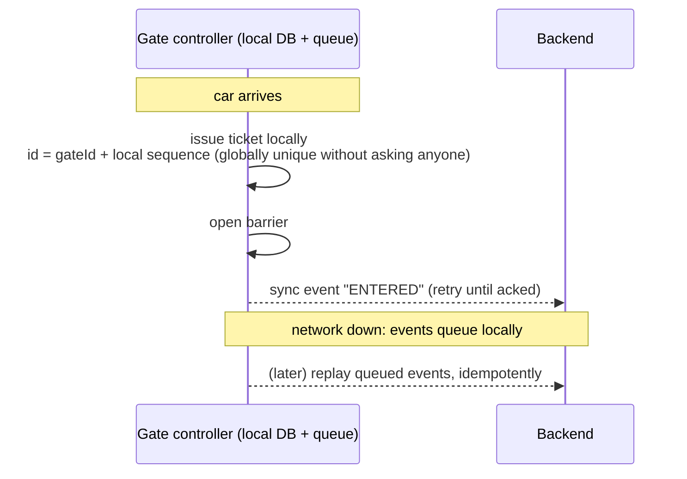

# Parking Lot — L6 (Staff) LLD Interview

> **Level expectation:** the in-memory class design (L5) takes ~15 minutes. Then the interviewer turns it into a real product: *"We run 200 lots across the country, with gates that lose network, prepaid reservations and a pricing team that changes tariffs weekly."* You keep the good class design, and show how it maps onto persistence, distributed atomicity, hardware failure, and team/service boundaries, still at a level where you can write the critical code. Read [L5-senior.md](L5-senior.md) first.

Legend: **🧑‍💼 Interviewer** · **🧑‍💻 Candidate** · **📝 Note** = commentary for you.

---

## 1. Where the in-memory design stops working

**🧑‍💼 Interviewer:** Your L5 design is good. Now: 200 lots, a central backend, gate machines talking to it over the network, a mobile app for reservations and payments. What breaks?

**🧑‍💻 Candidate:** Four things:

| L5 assumption | Reality | Consequence |
|---|---|---|
| State lives in one JVM's memory | Several backend instances; restarts; deploys | State must be in a **database**, and atomicity must come from the DB |
| Gates call `park()` as a method | Gates are devices on flaky networks | **Gates must work offline**; requests must be **idempotent** |
| Spots are free or occupied | Spots can be **reserved** for a future time window | Allocation becomes interval booking |
| Pricing is a Java class | A pricing team changes tariffs weekly, per lot | **Pricing as data**, versioned, evaluated by code |

The domain model (vehicle types, strategies, ticket lifecycle) survives. What changes is *where state lives* and *where atomicity comes from*.

💡 **Idempotent:** doing the same request twice has the same effect as doing it once, so retries are safe (like `kubectl apply`). **JVM:** the Java process; its memory is private to it, so two backend instances cannot see each other's data. **Interval booking:** reserving a spot for a start-to-end time window instead of "right now".

---

## 2. Atomic spot claiming in a database

**🧑‍💻 Candidate:** L5's `pollFirst()` was atomic because one JVM owned the set. With N backend instances, the database is the arbiter. Same idea, "find and take in one step", expressed in SQL ([PostgreSQL](../../../HLD/technologies/postgresql.md)):

```sql
-- Option A: conditional update (optimistic). Claim a specific spot only if still free.
UPDATE spots
   SET occupied_by_ticket = :ticketId, version = version + 1
 WHERE spot_id = :spotId AND occupied_by_ticket IS NULL;
-- 1 row updated → you got it. 0 rows → someone else did; try the next candidate.
```

💡 **Optimistic vs pessimistic:** *optimistic* = don't lock, just attempt the change with a condition and retry if someone beat you. *Pessimistic* = lock the row first so nobody can beat you. Optimistic is cheap when conflicts are rare; pessimistic when they are common.
```sql
-- Option B: pick-and-lock the nearest free spot in one statement (pessimistic, no retries).
WITH candidate AS (
    SELECT spot_id FROM spots
     WHERE lot_id = :lot AND size = ANY(:fittingSizes) AND occupied_by_ticket IS NULL
     ORDER BY size_rank, floor, number
     LIMIT 1
     FOR UPDATE SKIP LOCKED          -- skip rows another gate is claiming right now
)
UPDATE spots s SET occupied_by_ticket = :ticketId
  FROM candidate c WHERE s.spot_id = c.spot_id
RETURNING s.spot_id, s.floor, s.number;
```

**🧑‍💼 Interviewer:** Why `SKIP LOCKED`?

**🧑‍💻 Candidate:** (`FOR UPDATE` locks the selected rows until the transaction ends; `SKIP LOCKED` makes the query ignore rows already locked by others.) Without it, 10 gates all lock the *same* nearest row and queue behind each other. With it, gate 2 skips the row gate 1 is holding and takes the next. That's exactly the semantics of `pollFirst()` on the concurrent set, implemented by the database. It's also the classic "database table as a work queue" pattern ([message queues](../../../HLD/technologies/message-queues.md)).

Plus a **unique constraint** (the database refuses a second row with the same value, here even with a partial index that only covers rows matching the `WHERE`) as the final safety net, the DB-level equivalent of L5's CAS (compare-and-set: change a value only if it is still what you expected) in `occupy()`:

```sql
CREATE UNIQUE INDEX one_active_ticket_per_plate ON tickets(lot_id, plate) WHERE status <> 'EXITED';
CREATE UNIQUE INDEX one_ticket_per_spot        ON tickets(spot_id)         WHERE status <> 'EXITED';
```

The Java domain code barely changes: `ParkingFloor.claimSpot` becomes a repository call (a class that hides database access behind plain Java methods), and `SpotAllocationStrategy` becomes "which `ORDER BY` to use". The **interfaces from L5 survive**, which is the point of having designed them.

> 📝 **Note:** Being able to say "here's the same atomicity guarantee, now enforced by the database, and here's the constraint that catches bugs" is the bridge between LLD and HLD that staff interviews look for.

---

## 3. Gates that lose network

**🧑‍💻 Candidate:** A barrier that won't open because the Wi-Fi blipped creates a traffic jam into the street. So the gate controller (a small computer in the gate machine) must keep working **offline**. That inverts the design:



Design consequences:
- **Ticket IDs generated at the gate**, unique without coordination: `lotId-gateId-sequence` (or UUIDv7, a random-looking 128-bit ID that starts with a timestamp so IDs sort by creation time). Same lesson as [ID generation](../../../HLD/concepts/id-generation.md).
- **Idempotent sync:** the gate retries events until acknowledged, so the backend must treat `(ticketId, event)` as an idempotency key (a unique label per operation so repeats can be recognised) and ignore duplicates ([idempotency](../../../HLD/concepts/idempotency-and-delivery-semantics.md)).
- **Spot assignment offline:** the gate can't atomically claim from the central DB, so it either issues tickets *without* a specific spot (driver picks; sensors report occupancy), or holds a small **lease of spots** (a block of spots handed to this gate for a period, so it can allocate from it without asking anyone) pre-assigned to it (like the token leases in the [rate limiter L6](../rate-limiter/L6-staff.md#4-hybrid-leased-tokens-option-d)).
- **Exit offline:** the gate keeps a local tariff copy (versioned) to compute fees; payment by card/UPI may still need connectivity. The fallback is a fixed fee or "pay later" by plate.
- **Accept rare inconsistency, reconcile later:** two gates offline might over-admit near capacity. A nightly reconciliation (a job comparing two sources of truth and flagging differences) compares entries/exits/payments per plate.

**🧑‍💼 Interviewer:** Isn't that a lot of complexity?

**🧑‍💻 Candidate:** It's driven by a physical constraint: the cost of a closed barrier is a queue of cars on a public road. For a reservations *website* I'd never do this. Knowing which components must be offline-capable is the decision.

---

## 4. Reservations

**🧑‍💻 Candidate:** "Book a spot at the airport from 6 pm Friday to 9 am Monday" turns a spot from *free/occupied now* into *a set of booked time intervals*. Two choices:

| Approach | How | Trade-off |
|---|---|---|
| **Pool reservation** (recommended) | Reserve *capacity* (e.g. "1 car spot at lot X for interval I"), not a specific spot. Check `reserved + walk-ins ≤ capacity` for every overlapping interval | Flexible, simple; the actual spot is assigned at arrival |
| **Specific spot** | Interval overlap check per spot: Postgres exclusion constraint `EXCLUDE USING gist (spot_id WITH =, period WITH &&)` (the database rejects two rows for the same spot whose time ranges overlap) | Users can choose "near the lift"; much harder to keep utilisation high |

No-shows: hold the reservation for 30 minutes past start, then release it and charge per policy. Overbooking (selling more reservations than capacity, like airlines) is a business decision based on no-show rates, and the design should allow a configurable overbook factor per lot.

---

## 5. Pricing as data

**🧑‍💼 Interviewer:** The pricing team wants to change tariffs per lot every week, without engineers.

**🧑‍💻 Candidate:** Then tariffs can't be Java classes. Keep `PricingStrategy` as the interface, but make the main implementation **interpret a versioned tariff definition**:

```json
{
  "tariffId": "BLR-AIRPORT-T2", "version": 14, "effectiveFrom": "2026-11-01T00:00:00+05:30",
  "currency": "INR",
  "rules": [
    { "vehicle": "CAR", "graceMinutes": 10, "unit": "HOUR", "roundUp": true,
      "bands": [ { "upToHours": 2, "pricePerUnit": "50" }, { "pricePerUnit": "80" } ],
      "dailyCap": "600" },
    { "vehicle": "CAR", "condition": { "daysOfWeek": ["SAT","SUN"] }, "multiplier": "1.2" }
  ],
  "lostTicket": "800"
}
```

- **Versioned and immutable** (a published version is never edited; changes create a new version): a ticket records the **tariff version** at entry. If the tariff changes while you're parked, you pay what was on the board when you entered. That's both fair and auditable.
- **Validated + simulated before publish:** "run last month's 1M real tickets through v15 and show the revenue difference and the 20 biggest changes". This catches "₹8,000 for 2 hours" typos before customers do.
- **Money stays `BigDecimal` strings in JSON**, never JSON numbers (which parse as `double`, a binary floating-point type that cannot hold values like 0.1 exactly, in many clients). See [BigDecimal & money](../../libraries/java/bigdecimal-and-money.md).
- Code-based strategies remain for genuinely new *kinds* of rule; data covers new *values*.

> 📝 **Note:** "Configuration for values, code for new behaviour" is the staff-level resolution of the Strategy pattern's limits.

---

## 6. Service boundaries (and how not to over-split)

**🧑‍💻 Candidate:** With 200 lots and several teams, which pieces become services?

| Component | Separate service? | Why |
|---|---|---|
| Lot operations (gates, tickets, spots) | Yes, **one per lot or per region**, deployable near the lot | Latency and offline needs; failure of one lot's backend shouldn't affect others |
| Pricing (tariff management + evaluation library) | Tariff *management* is a service; *evaluation* is a **library** embedded in gates/backend | Gates need prices offline; a network call per exit is a liability |
| Payments | Yes (or a provider) | PCI scope (card-data security rules; fewer systems touching cards means less audit work), idempotent payment intents, refunds |
| Reservations | Yes | Different traffic (web/app), different data model |
| Analytics / occupancy history | Event stream consumer | Read-only, async |

I would **not** split "spot service", "ticket service", "vehicle service" from each other: they change together, and splitting them turns an in-process atomic operation into a distributed transaction (one change spanning several services/databases that must all succeed or all fail, which is slow and hard to get right).

> 📝 **Note:** Knowing where *not* to draw a service boundary (things that must be atomic together stay together) is the most reliable staff signal in design discussions.

---

## 7. Operability

- **Events, not just state:** every entry/exit/payment is an event with lot, gate, plate, tariff version. Occupancy dashboards, reconciliation and fraud checks (same plate entering two lots 5 minutes apart) all come from the stream.
- **Device fleet management:** gate firmware (the low-level software on the device)/config versions, heartbeats (periodic "I'm alive" pings), alerting when a gate has been offline for > 5 minutes or its event queue is growing.
- **Reconciliation jobs:** entries without exits after 7 days; payments without exits; exits without payments. These numbers are the health metrics of the business.
- **Safe rollouts:** new tariff versions and gate software roll out to one lot first.

---

## 8. Curveballs

**🧑‍💼 Interviewer:** The ANPR camera misreads plates 2% of the time.

**🧑‍💻 Candidate:** Plates can't be a strict key then. Treat the ANPR read (automatic number-plate recognition by camera) as a *hint* with a confidence score; the ticket ID (QR/paper or app) is the key. Exit matching: exact plate → fuzzy match (edit distance 1, i.e. one character added, removed or changed; common confusions like O/0, B/8) among active tickets at this lot → fallback to ticket scan or manual. And the "one active ticket per plate" constraint must allow overrides with an audit trail, or one misread blocks a legitimate driver.

**🧑‍💼 Interviewer:** Revenue team says ₹ amounts don't match between gates and payments.

**🧑‍💻 Candidate:** Usual suspects: gates computing with a stale tariff version (fixed by recording tariff version on the ticket); rounding differences between JS (app) and Java (backend), fixed by integer paise or one shared evaluation library with golden test cases (fixed inputs with known correct outputs) run in both languages; duplicate payment events (idempotency keys on payment intents).

---

## 9. What the interviewer was evaluating (L6)

- [ ] Identified exactly which L5 assumptions break and kept the domain model
- [ ] DB-level atomic claiming (`SKIP LOCKED` / conditional update) + unique constraints as safety nets
- [ ] Offline-first gates driven by the physical failure cost; coordination-free IDs; idempotent sync; reconciliation
- [ ] Reservations as capacity over time intervals; overlap enforcement; no-show policy
- [ ] Pricing as versioned data, tariff version on the ticket, simulation before publish
- [ ] Service boundaries drawn by change and atomicity, not by noun
- [ ] Operability: events, device fleet health, reconciliation as business metrics

## 10. Common mistakes at this level

| Mistake | Why it hurts at L6 |
|---|---|
| Keeping the in-memory `synchronized` design "behind a REST API" with 3 replicas | Each replica has its own idea of free spots |
| `SELECT … WHERE free` then `UPDATE` in two statements without locking | The multi-gate race, now across servers |
| Gates that hard-depend on the backend | Network blip = traffic jam into the street |
| Microservice per noun (SpotService, TicketService, VehicleService) | Turns one atomic action into a distributed transaction |
| Tariffs as code requiring deploys | The pricing team becomes an engineering bottleneck |
| Re-pricing parked cars with the new tariff | Customer disputes; can't audit what was charged and why |

⬅️ Previous: [L5-senior.md](L5-senior.md) · 🏠 [Problem overview](README.md)
