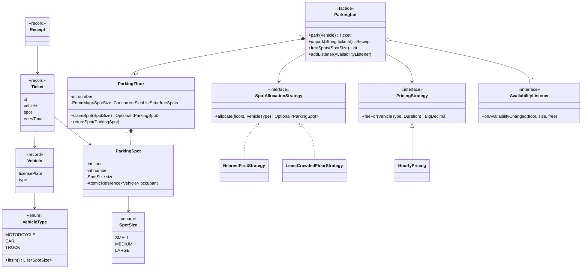

# LLD Interview: Design a Parking Lot

> "Design the software for a multi-floor parking lot: vehicles enter, get a spot and a ticket, pay when they leave. Write the classes and the core code."

The most-asked LLD question. Unlike the [rate limiter](../rate-limiter/README.md) (one algorithm, lots of concurrency), this one is mostly about **modelling**: turning a real-world description into clean classes with the right responsibilities, and leaving room for rules that change (pricing, allocation). Concurrency appears too: many gates, one pool of spots.

## How to read this folder

> 👉 **Never thought about how a parking facility's software works? Start with [00-understand-the-product.md](00-understand-the-product.md).** It walks through one mall visit, explains the tariff board, and maps every step to a class.

| File | Level | What "good" looks like |
|---|---|---|
| [00-understand-the-product.md](00-understand-the-product.md) | Everyone, first | Know the real-world flow, the tariff rules and where concurrency comes from |
| [L4-mid.md](L4-mid.md) | Mid / SDE2 | Clean entities (enums, records vs classes), `park`/`unpark`, correct pricing with `BigDecimal`, basic thread safety |
| [L5-senior.md](L5-senior.md) | Senior | Strategy for allocation and pricing, Observer for boards, lock-free spot claiming, ticket lifecycle, testability with `Clock`, concurrency tests |
| [L6-staff.md](L6-staff.md) | Staff | From one in-memory lot to a real product: persistence and DB-level atomicity, offline gates, reservations, data-driven pricing, multi-lot service boundaries |

## Code (runnable, no dependencies)

| | Run | Files |
|---|---|---|
| ☕ Java 21 | `./java/run.sh` | [java/src/parkinglot/](java/src/parkinglot/): tests in `ParkingLotTests.java`, demo in `Demo.java` |
| 🟨 Node 22 | `cd js && node --test` | [js/parkingLot.js](js/parkingLot.js), [js/parkingLot.test.js](js/parkingLot.test.js) |

## Class diagram (L5 design, matches the code)

New to class diagrams? [UML class diagrams](../../concepts/uml-class-diagrams.md).

## Libraries & concepts used

**Java:** [Enums & EnumMap](../../libraries/java/enums-and-enummap.md) · [Records & immutability](../../libraries/java/records-and-immutability.md) · [BigDecimal & money](../../libraries/java/bigdecimal-and-money.md) · [java.time API](../../libraries/java/java-time-api.md) · [Concurrent collections](../../libraries/java/concurrent-collections.md) · [ConcurrentHashMap](../../libraries/java/concurrent-hashmap.md) · [Atomics & CAS](../../libraries/java/atomics-and-cas.md) · [Time & Clock](../../libraries/java/time-and-clock.md)

**JS:** [Classes & private fields](../../libraries/js/classes-and-private-fields.md) · [Money & numbers in JS](../../libraries/js/money-and-numbers-in-js.md) · [Event loop & concurrency](../../libraries/js/event-loop-and-concurrency.md)

**Concepts:** [OOP modelling](../../concepts/oop-modeling.md) · [UML class diagrams](../../concepts/uml-class-diagrams.md) · [Design patterns (Strategy, Observer, State, Facade)](../../concepts/design-patterns.md) · [SOLID](../../concepts/solid-principles.md) · [Thread-safety basics](../../concepts/thread-safety-basics.md)

## The core insight

1. **Model data as data, behaviour as behaviour.** Vehicle types differ only in *which spots they fit*, so that's an **enum with a field**, not a `Car extends Vehicle` hierarchy.
2. **Isolate what changes.** Pricing and allocation rules change all the time, so they sit behind interfaces. `ParkingLot` never changes when the tariff does.
3. **"Find a free spot and take it" must be one atomic step**, or two gates will send two cars to the same spot.
