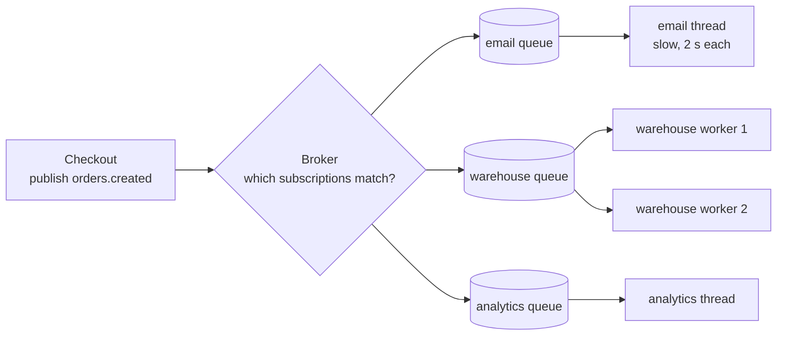
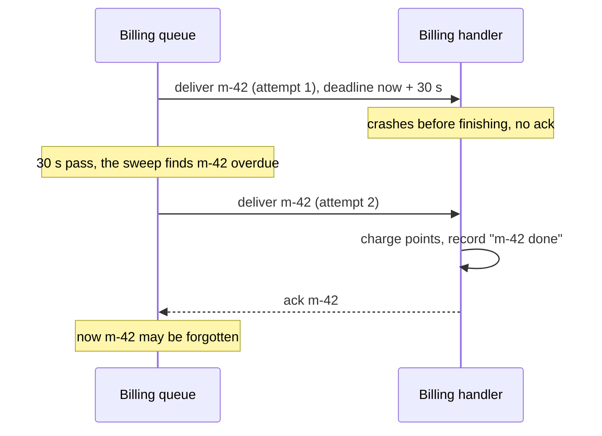

# Start Here: What Is a Pub-Sub / Message Broker? (Before the Interview)

> You've used one even if you never installed Kafka: the "order placed" event that makes the email service, the warehouse and the analytics pipeline all react without the checkout code knowing they exist. This interview asks you to build a small one **inside one process**: publishers send messages to **topics**, subscribers get called back, and the broker keeps a slow or broken subscriber from hurting everyone else.
>
> Time: ~10 minutes. Then: [L4](L4-mid.md) → [L5](L5-senior.md) → [L6](L6-staff.md). The distributed version (Kafka internals) is the [Distributed Message Queue HLD](../../../HLD/interviews/distributed-message-queue/README.md).

---

## 1. The problem as a story

### 1.1 One order, five teams

Meera runs checkout at an online shop. When an order is placed, five things must happen:

1. Send the confirmation **email**.
2. Tell the **warehouse** to pack it.
3. Charge loyalty points in **billing**.
4. Update the **analytics** dashboard.
5. Run a **fraud** check.

Version 1 of `placeOrder()` calls all five directly, one after another. Then the problems start:

| What goes wrong | Why it hurts |
|---|---|
| The email provider is slow (2 s per call) | Every checkout now takes 2 s longer, though the customer doesn't care when the email arrives |
| Analytics throws an exception | The order fails, though analytics is the least important of the five |
| A sixth team (recommendations) wants to know about orders | Meera has to change and redeploy checkout for someone else's feature |
| A Black Friday spike: 50× the usual orders | The warehouse system can take 200/s; checkout pushes 1,000/s at it and it falls over |

Version 2 uses a **message broker** (a component that sits between senders and receivers and passes messages along). Checkout does one thing: **publish** an `orders.created` message to a **topic** (a named channel, like a mailing list address). Every team that cares **subscribes** to the topic and gets its own copy. Checkout doesn't know who they are, doesn't wait for them, and doesn't fail when one of them does. That's **publish/subscribe**, or **pub-sub**.

### 1.2 But the broker now has the hard problems

Moving the calls behind a broker doesn't make the problems vanish; it moves them into the broker, which is what the interview is about:

- The warehouse is slow and its messages pile up. **How big may the pile get, and what happens when it's full?** (back-pressure)
- The billing service crashed halfway through a message. **Does it get the message again?** If yes, **could it charge twice?** (delivery guarantees, idempotency)
- Order 17 was "created" then "cancelled". **Could the warehouse see "cancelled" first?** (ordering)
- The warehouse runs 4 copies of its service. **Does each copy get every order (4 parcels!), or do they share them?** (consumer groups)
- Analytics shipped a bug and computed wrong numbers for a day. **Can it re-read yesterday's orders?** (retained log, replay)

---

## 2. Where you've seen this

| Place | What you saw |
|---|---|
| **Kafka at work** | Topics, **partitions** (a topic split into parallel, separately ordered pieces), consumer groups, "consumer lag" dashboards (how far behind a reader is), `auto.offset.reset=earliest` in a config |
| **RabbitMQ / Amazon SQS** | Queues where a worker takes a job and the job comes back if the worker dies (a **visibility timeout** in SQS) |
| **Google Cloud Pub/Sub, AWS SNS** | One message to a topic, many subscriptions each get a copy |
| **Redis `PUBLISH` / `SUBSCRIBE`** | The simplest pub-sub: fire and forget, nobody listening means the message is gone (try it in §5) |
| **Kubernetes watches** | `kubectl get pods -w`: the API server pushes every change to every watcher. Controllers are subscribers |
| **Prometheus Alertmanager → Slack, PagerDuty, email** | One alert fans out to many receivers, each with its own retry |
| **Your IDE / browser** | Click handlers, `addEventListener`, Node's `EventEmitter`: the in-process **Observer pattern** this design grows from |
| **On-call** | "Consumer lag is growing on topic X": the queue is filling faster than it drains. That page is about back-pressure |

---

## 3. The features, one situation at a time

### 3.1 Topics and publish
Checkout publishes `orders.created` with the order as the **payload** (the message body). It doesn't know or care who listens.

👉 Interview: *`publish(topic, key, payload)`, messages as immutable records (L4).*

### 3.2 Subscribe with a callback (the Observer)
The email service registers "call me for every `orders.created`". The broker calls its **handler** (the callback function) for each message.

👉 Interview: *the Observer pattern; why the broker must not call handlers on the publisher's thread (L4, [observer & event dispatch](../../concepts/observer-and-event-dispatch.md)).*

### 3.3 Fan-out: everyone gets a copy
Email, warehouse and analytics each get **every** order. Adding a sixth subscriber changes nothing for checkout.

👉 Interview: *one queue per subscription so subscribers are isolated; [fan-out](../../../HLD/concepts/fan-out.md) (L4).*

### 3.4 A slow subscriber must not slow everyone
Email takes 2 s per message. Checkout must still return in milliseconds and the warehouse must still get orders immediately.

👉 Interview: *per-subscriber queue + its own dispatcher thread (L4).*

### 3.5 Unsubscribe
The old analytics service is retired. It stops receiving messages, and its thread goes away.

👉 Interview: *removing a subscriber while publishers are iterating over the list; thread shutdown (L4).*

### 3.6 Bounded queues and "what happens when full"
On Black Friday the warehouse queue grows by 800 messages a second. Unbounded, it eats all memory and the whole process dies. Bounded, something must give: **wait**, **drop the new message**, **drop the oldest**, or **return an error** to the publisher.

👉 Interview: *overflow policies as a Strategy (interchangeable algorithms behind one interface); [back-pressure](../../concepts/back-pressure.md) (L5).*

### 3.7 Acknowledgements and redelivery
Billing crashes after reading a message but before finishing. If the broker deleted the message when it handed it out, that order's points are lost. So billing must **acknowledge** ("ack": tell the broker "done, you may forget it") after finishing, and the broker **redelivers** anything not acked within a deadline.

👉 Interview: *at-most-once vs at-least-once; ack timeout; [delivery semantics](../../../HLD/concepts/idempotency-and-delivery-semantics.md) (L5).*

### 3.8 The dead-letter queue
One order has a malformed address. The warehouse handler throws every time. Redelivered forever, it blocks every order behind it. After N attempts it goes to a **dead-letter queue** (DLQ: a side topic for messages that keep failing) where a human looks at it.

👉 Interview: *max attempts → dead-letter topic with "why" headers ([retries, backoff & DLQ](../../../HLD/concepts/retries-backoff-and-dlq.md)) (L5).*

### 3.9 Duplicates and idempotent consumers
Billing finished the work, but the ack got lost (the process restarted just after). The broker redelivers. Without care: points charged twice.

👉 Interview: *dedupe by message id; why "exactly once" is really "at least once + idempotent" (L5).*

### 3.10 Consumer groups: share the work
The warehouse runs 4 instances. They should **share** orders (each order packed once), while email, as a separate subscription, still gets every order. Workers that share one subscription are a **consumer group** (also called **competing consumers**).

👉 Interview: *fan-out between subscriptions vs work-sharing inside one (L5).*

### 3.11 Ordering per key
Order 17: `created`, then `paid`, then `cancelled`. If two warehouse workers grab `created` and `cancelled` at the same moment, the cancel might be processed first. Fix: all messages for order 17 (the same **key**) go to the same worker, in order.

👉 Interview: *partition by key hash; one in-flight message per partition (L5, [message ordering](../../../HLD/concepts/message-ordering-and-sequencing.md)).*

### 3.12 Replay: re-read history
Analytics had a bug for a day. With a queue, yesterday's messages were deleted once acked. With a **retained log** (messages kept for, say, 7 days, whether read or not), analytics just rewinds its position and re-reads.

👉 Interview: *the Kafka model (log + **offsets**, the position numbers of messages in the log) vs the queue model (delete on ack) (L6, [Kafka](../../../HLD/technologies/kafka.md)).*

### 3.13 Wildcard subscriptions
The audit service wants **all** order events: `orders.created`, `orders.paid`, `orders.eu.refunded`. It subscribes to `orders.#` instead of listing every topic.

👉 Interview: *`*` and `#` matching with a **trie** (a prefix tree with one node per word) (L6).*

### 3.14 Lag metrics and graceful shutdown
On-call needs one number per subscriber: **lag** (how far behind it is). And a deploy must not drop the 300 messages sitting in queues: **graceful shutdown** stops new publishes, drains, then exits.

👉 Interview: *backlog/lag metrics; drain with a deadline (L6).*

---

## 4. The key mechanism: a queue per subscriber, and an ack before forgetting

### 4.1 Publish once, a copy per subscription



`publish` only **appends** to each matching queue (microseconds) and returns. Each subscription has its own **dispatcher** (a thread that takes from that queue and calls the handler), so the slow email thread only delays email. The warehouse queue has two workers: that's a consumer group sharing the work.

### 4.2 At-least-once: nothing is forgotten until it's acked



If the handler had finished and only the ack was lost, attempt 2 is a **duplicate**: the "m-42 done" record is how the handler notices and skips it.

---

## 5. Try it yourself (real things, real output)

**Redis pub-sub** (if you have `redis-server` and `redis-cli`; real output from Redis 7.0 below). Open two terminals:

```bash
# terminal 1: subscribe to one topic ("channel" in Redis terms)
redis-cli SUBSCRIBE orders
# terminal 2: subscribe by pattern
redis-cli PSUBSCRIBE 'orders.*'
# terminal 3: publish
redis-cli PUBLISH orders "order-1 created"          # → (integer) 1   one subscriber received it
redis-cli PUBLISH orders.eu "order-2 created"       # → (integer) 1   the pattern subscriber
redis-cli PUBLISH nobody-listens hello              # → (integer) 0   nobody: the message is simply gone
```

Terminal 1 printed `message / orders / order-1 created`; terminal 2 printed `pmessage / orders.* / orders.eu / order-2 created`. Things to notice: **no subscriber, no message** (Redis pub-sub keeps nothing); a subscriber that was offline misses everything; and there is no ack. That is **at-most-once** pub-sub. Redis protects itself from slow subscribers with `client-output-buffer-limit pubsub 32mb 8mb 60` (the default, read with `CONFIG GET client-output-buffer-limit`: a subscriber whose unsent backlog passes 32 MB, or stays above 8 MB for 60 s, is **disconnected**). That's a back-pressure policy: "drop the slow consumer".

**Node's `EventEmitter`** (the in-process Observer; run with `node`, real output):

```js
const { EventEmitter } = require('node:events');
const orders = new EventEmitter();
orders.on('created', (o) => console.log('email   got', o.id));
orders.on('created', (o) => console.log('billing got', o.id));
console.log('emit returned', orders.emit('created', { id: 'order-1' }));
console.log('after emit (listeners already ran, synchronously)');
for (let i = 0; i < 11; i++) orders.on('shipped', () => {});
```
```
email   got order-1
billing got order-1
emit returned true
after emit (listeners already ran, synchronously)
(node:17220) MaxListenersExceededWarning: Possible EventEmitter memory leak detected. 11 shipped listeners added to [EventEmitter]. MaxListeners is 10. Use emitter.setMaxListeners() to increase limit
```

Two lessons in six lines: `emit` calls listeners **synchronously, on the caller's stack** (a slow listener slows the emitter: the problem this design fixes), and forgetting to remove listeners is a classic **leak** that Node warns about.

**Java's `SubmissionPublisher`** (in the JDK since Java 9, 2017; part of the `java.util.concurrent.Flow` API). It gives each subscriber a bounded buffer. With a stuck subscriber and a buffer of 4, `offer` with a drop handler (real output, `java FlowDemo.java`):

```
default buffer: 256
offer tick-1 -> 1
...
offer tick-5 -> 5
  dropped tick-6
offer tick-6 -> -1
```

`offer` returns the estimated **lag** (items waiting) or −1 when it dropped; `submit` would instead **block** the publisher. Same choices you'll implement in L5. (Where exactly the drops begin depends on the JDK's internal buffer sizing; here 5 items fit.)

**Run this folder's code:** `./java/run.sh` prints 18 tests and a guided demo (fan-out, the four overflow policies, ack timeout → DLQ, a consumer group with keys, log replay); `cd js && node --test`.

---

## 6. From experience to requirements

| What you experienced | Requirement | Type |
|---|---|---|
| Checkout publishes once | `publish(topic, key, payload)`; publisher doesn't know subscribers | Functional |
| Email, warehouse, analytics all react | Every subscription gets every matching message (fan-out) | Functional |
| Teams come and go | `subscribe` / `unsubscribe` at runtime, while publishing goes on | Functional |
| `orders.#` | Wildcard topic patterns | Functional |
| Billing crashed mid-message | Ack, ack deadline, redelivery (at-least-once); at-most-once as an option | Functional |
| The poison order | Max attempts, then a dead-letter topic | Functional |
| 4 warehouse instances | Consumer groups: share work inside a subscription | Functional |
| created → paid → cancelled | Per-key ordering | Functional |
| Analytics bug | Retained log, replay from an offset, earliest/latest | Functional (L6) |
| Slow email | One subscriber can't slow the publisher or other subscribers | Non-functional (isolation) |
| Black Friday | Bounded memory; a chosen policy when full; drops counted | Non-functional |
| Many threads publishing | Thread-safe; no lost or duplicated messages under concurrency | Non-functional |
| On-call | Lag and drop metrics per subscription | Non-functional |
| Deploys | Graceful shutdown that drains | Non-functional |

---

## 7. Mini glossary

| Term | Meaning in plain words |
|---|---|
| **Broker** | The middleman that receives messages from publishers and hands them to subscribers |
| **Topic** | A named channel messages are published to (`orders.created`) |
| **Publisher / producer** | Code that sends messages |
| **Subscriber / consumer** | Code that receives them (via a callback here) |
| **Subscription** | One subscriber's registration on a topic, with its own queue; each subscription gets every message |
| **Fan-out** | One message becoming one copy per subscription |
| **Consumer group** | Several workers sharing one subscription; each message goes to one of them |
| **Back-pressure** | A slow consumer making a fast producer slow down (or making the system drop/reject, by choice) |
| **Ack / nack** | "Done, forget it" / "failed, give it to me again" |
| **Ack deadline / visibility timeout** | How long the broker waits for an ack before redelivering |
| **At-most-once / at-least-once** | May lose a message, never duplicates / never loses, may duplicate |
| **Idempotent consumer** | One that gives the same result if it processes a message twice |
| **DLQ (dead-letter queue)** | Where messages go after failing too many times |
| **Partition key** | A field (order id) that decides which lane/worker gets the message, so the same key stays in order |
| **Offset** | A message's position number in a retained log (0, 1, 2, ...) |
| **Lag** | How many messages a consumer still has to process |
| **Retention** | How long a log keeps messages (by count, size or age) |

➡️ **Now build it:** [L4-mid.md](L4-mid.md)
