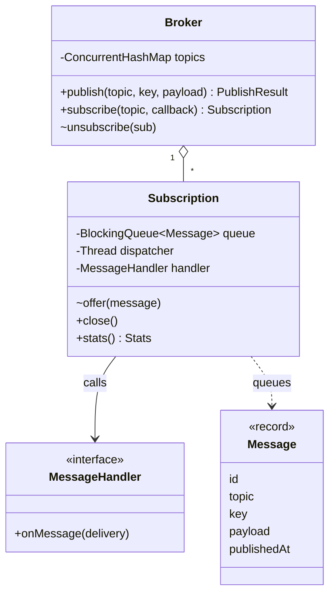
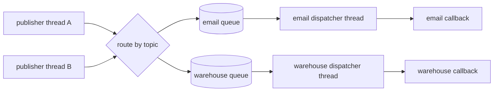

# Pub-Sub Broker — L4 (Mid-level / SDE2) LLD Interview

> **Level expectation:** design an in-process broker with **topics**, `publish`, and `subscribe` with a **callback** (the **Observer pattern**). Every subscriber gets every message (**fan-out**), in publish order. Each subscriber has **its own queue and dispatcher thread**, so a slow subscriber blocks neither the publisher nor the other subscribers. Handle **unsubscribe**, **handler exceptions**, and basic **thread safety** (publishers and subscribe/unsubscribe happening at the same time). Back-pressure, acks and consumer groups come at [L5](L5-senior.md).

> 🆕 Never used a message broker? Read [00-understand-the-product.md](00-understand-the-product.md) first.

Legend: **🧑‍💼 Interviewer** · **🧑‍💻 Candidate** · **📝 Note** = commentary for you.

---

## 1. Clarifying requirements

**🧑‍💼 Interviewer:** Design an in-memory pub-sub system. Publishers send messages to topics, subscribers receive them.

**🧑‍💻 Candidate:** A few questions:
- **In one process, or across machines?** I'll assume one JVM: a library other code calls, like Guava's `EventBus` or a tiny in-process Kafka. No network, no disk.
- **Push or pull?** Do subscribers register a callback (push), or call `poll()` (pull)?
- **Does every subscriber get every message, or do they share?** (Fan-out vs work queue.)
- **Ordering:** must a subscriber see messages in publish order?
- **Delivery:** synchronous (publisher waits until all callbacks ran) or asynchronous?
- **Failures:** what if a callback throws? Must messages survive a crash?
- **Scale:** how many topics, subscribers, messages per second?

**🧑‍💼 Interviewer:** One process. Callbacks. Every subscriber gets every message on its topic, in order. Asynchronous: publishing must be fast even if a subscriber is slow. No persistence. A few hundred subscribers, tens of thousands of messages per second.

**🧑‍💻 Candidate:**

**Functional:** `publish(topic, payload)`; `subscribe(topic, callback)` returns a handle; `unsubscribe` via the handle; every current subscriber of a topic gets each message once, in the order it was published (per publisher thread).

**Non-functional:** `publish` returns in microseconds and never waits for a callback; a slow or throwing subscriber affects only itself; safe when many threads publish and subscribe at once; no persistence (a crash loses in-flight messages: **at-most-once**, meaning a message is delivered zero or one times, never twice).

> 📝 **Note:** "Fan-out or work-sharing?" is the question that separates pub-sub from a job queue. Asking it early, and naming **push vs pull**, shows you know the design space before you draw boxes.

---

## 2. Core entities

**🧑‍💻 Candidate:**

| Entity | Responsibility |
|---|---|
| `Message` (record) | id, topic, key, payload, publish time, headers. A **record** (a Java class whose fields are fixed at construction, with `equals`/`hashCode`/`toString` generated) because the **same object** goes to every subscriber, so nobody may change it ([records & immutability](../../libraries/java/records-and-immutability.md)) |
| `Broker` | Entry point. Keeps topic → subscriptions, routes each published message to them |
| `Subscription` | One subscriber's registration: its callback, its **own queue**, its **own dispatcher thread**. `close()` unsubscribes |
| `MessageHandler` | The callback interface: the **Observer** |

The topic is just a string here; it doesn't need its own class until it carries settings (retention, at L6).

---

## 3. API

```java
public final class Broker implements AutoCloseable {
    public PublishResult publish(String topic, String key, String payload);   // key may be null (used at L5)
    public Subscription subscribe(String topic, Consumer<Message> callback);
    public int shutdown(Duration grace) throws InterruptedException;          // L6
}

public final class Subscription implements AutoCloseable {
    public void close();            // unsubscribe
    public Stats stats();
}
```

`publish` returns a small result (message id, how many subscriptions accepted it) instead of `void`: tests can check "3 copies", and at L5 it carries drops and rejections. `subscribe` returns a handle rather than taking an `unsubscribe(topic, callback)` call, because comparing lambdas for equality is unreliable (two identical-looking lambdas are different objects).

---

## 4. Class diagram



Notation: [UML class diagrams](../../concepts/uml-class-diagrams.md). The full diagram with L5/L6 classes is in the [README](README.md#class-diagram-matches-the-code).

---

## 5. Deep dives

### 5.1 The Observer pattern, and why not just call the callbacks

**🧑‍💼 Interviewer:** Simplest version first. What would you write?

**🧑‍💻 Candidate:** The textbook **Observer** ([observer & event dispatch](../../concepts/observer-and-event-dispatch.md), [design patterns](../../concepts/design-patterns.md)): the subject keeps a list of listeners and calls each one.

```java
void publish(String topic, Message m) {
    for (Consumer<Message> listener : topics.getOrDefault(topic, List.of())) listener.accept(m);
}
```

It's correct for a single thread, and it's what Node's `EventEmitter` and Guava's `EventBus` (by default) do. But it runs every callback **on the publisher's thread**, one after another:

| Problem | Effect |
|---|---|
| One listener takes 2 s (an email API call) | `publish` takes 2 s; checkout is now as slow as the slowest subscriber |
| One listener throws | The loop stops; later listeners never see the message (unless I catch per listener) |
| One listener calls `publish` again | **Re-entrancy**: the nested publish runs in the middle of the outer one, so subscribers can see message 2 before message 1 |
| One listener blocks forever | The publisher is stuck forever |

So the interviewer's "publishing must be fast even if a subscriber is slow" rules out synchronous dispatch.

> 📝 **Note:** Starting from the 3-line version and then **listing its failure modes** is better than jumping to threads. It shows *why* the extra machinery exists, which is what the interviewer is grading.

### 5.2 A queue and a thread per subscription

**🧑‍💻 Candidate:** Decouple with a **queue** per subscription: `publish` only appends to each subscriber's queue; each subscription has its own **dispatcher thread** that takes from its queue and calls the callback. This is the classic **producer-consumer** pattern ([blocking queues & producer-consumer](../../libraries/java/blocking-queues-and-producer-consumer.md)).



L4 sketch with a JDK `BlockingQueue` (a thread-safe queue whose `take()` waits while it's empty):

```java
final class Subscription {
    private final BlockingQueue<Message> queue = new LinkedBlockingQueue<>(1024);   // bounded: see 5.6
    private final Thread dispatcher;

    Subscription(String name, Consumer<Message> callback) {
        dispatcher = Thread.ofPlatform().daemon().name(name).start(() -> {
            while (!Thread.currentThread().isInterrupted()) {
                Message m;
                try { m = queue.take(); } catch (InterruptedException e) { return; }   // close() interrupts us
                try { callback.accept(m); } catch (Exception e) { log(e); }           // 5.5
            }
        });
    }

    boolean offer(Message m) { return queue.offer(m); }    // called on the publisher's thread: never runs the callback
    void close() { dispatcher.interrupt(); }
}
```

A **daemon** thread doesn't keep the JVM alive when `main` ends. **Interrupting** a thread sets a flag and wakes it from blocking calls like `take()` with an `InterruptedException` ([executors & threads](../../libraries/java/executors-and-threads.md)).

The folder's [code](java/src/pubsub/) grows this into `Lane` (a bounded queue with its own lock and conditions, so it can block publishers, evict, track the unacked message) inside [`Subscription`](java/src/pubsub/Subscription.java), but the shape is the same: **publisher appends, dedicated thread delivers**.

**🧑‍💼 Interviewer:** A thread per subscription. What if there are 10,000 subscriptions?

**🧑‍💻 Candidate:** 10,000 **platform threads** (each one is a real OS thread, typically reserving around 1 MB of stack address space) is too many. Options:
1. **Virtual threads** (Java 21: cheap threads managed by the JVM, many thousands are fine) ([virtual threads](../../concepts/virtual-threads.md)): same code, `Thread.ofVirtual()` instead of `ofPlatform()`.
2. A **shared pool** of N threads, where each subscription is a "serial executor": it schedules itself on the pool when its queue becomes non-empty and processes one message at a time, so ordering per subscription is kept. This is how actor libraries (Akka: each "actor" processes its own mailbox one message at a time) and Guava's `AsyncEventBus` with a sequential executor work.

For "a few hundred", one platform thread each is simple and fine.

### 5.3 Thread safety: the topic map and the subscriber list

**🧑‍💼 Interviewer:** Thread A publishes to `orders` while thread B subscribes to `orders`. What can go wrong?

**🧑‍💻 Candidate:** With a plain `HashMap<String, ArrayList<Subscription>>`:
- B's `add` resizes the `ArrayList` while A iterates it: `ConcurrentModificationException`, or worse, silently skipped entries.
- Two threads creating the topic's list at once: one list is lost, along with its subscriber.

Fixes, matching how the data is used (subscribe is rare, publish is constant):

| Structure | Why |
|---|---|
| `ConcurrentHashMap<String, CopyOnWriteArrayList<Subscription>>` + `computeIfAbsent` | `computeIfAbsent` creates a topic's list atomically ([ConcurrentHashMap](../../libraries/java/concurrent-hashmap.md)); a `CopyOnWriteArrayList` copies its array on every write, so readers iterate a **snapshot** with no lock and never see a half-done change ([concurrent collections](../../libraries/java/concurrent-collections.md)) |
| A read-write lock around the routing table | Many publishers read at once; subscribe/unsubscribe take the write lock. The code does this in [`TopicTrie`](java/src/pubsub/TopicTrie.java), because at L6 the routing table becomes a trie for wildcards |

**🧑‍💼 Interviewer:** With the snapshot, a subscriber removed during a publish may still get that one message. OK?

**🧑‍💻 Candidate:** Yes, and I'd document it: "a message published concurrently with `unsubscribe` may or may not be delivered". The alternative (a lock held for the whole publish) makes every publish wait for every subscribe. Same for a new subscriber: it gets messages published **after** `subscribe` returns, and may or may not get one published during the call. (Basics: [thread-safety basics](../../concepts/thread-safety-basics.md).)

### 5.4 Ordering

**🧑‍💼 Interviewer:** Are messages delivered in order?

**🧑‍💻 Candidate:** Per subscription, yes, with a precise meaning: **if one thread publishes m1 then m2, every subscriber sees m1 before m2.** The queue is FIFO (first in, first out) and one dispatcher thread takes from it, so the callback runs m1 to completion before m2. Test `fanOutEverySubscriberGetsEveryMessageInOrder` publishes 1,000 messages to 3 subscribers and checks each got exactly 0..999.

Two things I **don't** promise:
- **Across publishers:** if threads A and B publish "at the same time", subscriber X may see A's first and subscriber Y may see B's first, because each publish visits the subscriptions one by one. A single global order across all subscribers needs a single sequencer: the log with offsets at [L6](L6-staff.md).
- **Across subscribers:** email may handle message 5 while analytics is still on message 2. They're independent; that's the point.

### 5.5 A callback throws

**🧑‍💼 Interviewer:** The analytics callback throws `NullPointerException` on one message.

**🧑‍💻 Candidate:** The dispatcher catches `Exception` around the callback, counts it (`handlerErrors` in the stats), logs it, and moves on. If it didn't, the exception would end the thread's `run` method, the thread would die, and that subscription would silently stop receiving anything, forever. Test `atMostOnceHandlerExceptionLosesOnlyThatMessage`: message 2 throws, 1 and 3 arrive, and the thread is alive.

At L4 the failed message is **lost** (at-most-once). Retrying it is an L5 feature (acks), and it's not free: a message that fails every time would retry forever.

> 📝 **Note:** "Dead dispatcher thread" is the same bug as a thread-pool worker dying from a task's exception ([thread pool L4](../thread-pool/L4-mid.md)). Interviewers like it because it's silent: nothing crashes, a subscriber just stops.

### 5.6 Unsubscribe and the unbounded-queue trap

**🧑‍💼 Interviewer:** How does `close()` work?

**🧑‍💻 Candidate:** In this order:
1. **Remove from the routing table**, so new publishes stop reaching it.
2. **Stop the thread**: mark the queue closed and interrupt the dispatcher. Two standard ways to stop a consumer: a **poison pill** (a special "stop" message put in the queue: everything before it is delivered first) or an **interrupt** (stops soon, discards the rest). `close()` uses interrupt; graceful draining is `Broker.shutdown` at L6.
3. Messages still queued are discarded (they still show in `stats().backlog()`, so the loss is visible).

**🧑‍💼 Interviewer:** You used `new LinkedBlockingQueue<>(1024)`. Why not `new LinkedBlockingQueue<>()`?

**🧑‍💻 Candidate:** The no-argument constructor's capacity is `Integer.MAX_VALUE`: effectively unbounded. If a subscriber is slower than the publishers on average, its queue grows until the JVM throws `OutOfMemoryError`, killing **every** subscriber, not just the slow one. A bound turns "crash later" into a decision: what to do when it's full. At L4 I'd make `publish` wait a short time and then report failure; at L5 that becomes a set of **overflow policies** ([back-pressure](../../concepts/back-pressure.md)).

---

## 6. Follow-ups

**🧑‍💼 Interviewer:** A subscriber subscribes to a topic nobody has published to yet. Then a publisher publishes to a topic nobody subscribes to.

**🧑‍💻 Candidate:** Topics are created on first use, by either side. A publish with no subscribers is accepted and goes nowhere: `PublishResult.accepted() == 0`. Redis pub-sub behaves the same way (`PUBLISH` returns 0). If messages must wait for a future subscriber, that's a **retained log** (L6), not pub-sub.

**🧑‍💼 Interviewer:** Could a subscriber change the message?

**🧑‍💻 Candidate:** The record's fields are final and the headers map is copied with `Map.copyOf` (an unmodifiable copy), so no. If the payload were a mutable object (a `List`), one subscriber could change what another sees: so payloads should be immutable, or bytes/strings.

**🧑‍💼 Interviewer:** How do you test "a slow subscriber doesn't block others" without sleeping?

**🧑‍💻 Candidate:** Make "slow" a **state**, not a duration: the slow callback waits on a `CountDownLatch` (a one-time gate threads wait on until it's opened). Publish 100, wait until the fast subscriber has 100, assert the slow one has exactly 1 (stuck in its callback), then open the gate and wait for 100 (test `slowSubscriberDoesNotBlockPublisherOrOthers`). Waiting **for a condition** with a generous deadline, instead of `Thread.sleep(100)` and hoping, is what keeps concurrency tests from being **flaky** (passing or failing at random).

**🧑‍💼 Interviewer:** Synchronous delivery as an option?

**🧑‍💻 Candidate:** Useful for tests and for "validate before commit" hooks. I'd make it a separate method (`publishSync`) that calls handlers on the caller's thread with a per-handler `try/catch`, and document that a slow handler slows the caller. Mixing both behind one flag invites surprises.

---

## 7. What the interviewer was evaluating (L4)

- [ ] Asked fan-out vs sharing, push vs pull, ordering, sync vs async, persistence
- [ ] Observer as the starting point, and its failure modes when run on the publisher's thread
- [ ] Per-subscription queue + dispatcher thread; `publish` never runs a callback
- [ ] Thread-safe routing table (`ConcurrentHashMap` + `CopyOnWriteArrayList`, or a read-write lock); what a concurrent unsubscribe means
- [ ] Ordering stated precisely: per publisher, per subscription; not global
- [ ] Callback exceptions caught; the dispatcher thread survives
- [ ] Unsubscribe removes routing first, then stops the thread
- [ ] Knows an unbounded queue is a memory leak waiting for a slow subscriber
- [ ] Tests that wait for states, not sleeps

## 8. Common mistakes at this level

| Mistake | Why it's wrong |
|---|---|
| Calling every callback inside `publish` | The publisher is as slow as the slowest subscriber, and one exception stops the rest |
| One shared queue + one thread for all subscribers | A slow subscriber delays everyone behind it (**head-of-line blocking**: the first item in line holds up all the others) |
| `HashMap` + `ArrayList` for topics, no locking | `ConcurrentModificationException` or lost subscribers under concurrent subscribe/publish |
| No `try/catch` around the callback | One bad message kills the dispatcher thread; the subscriber goes silent |
| `new LinkedBlockingQueue<>()` | Unbounded: a slow subscriber eventually takes the whole JVM down |
| Promising "global ordering" | Each subscription is ordered; two publishers racing are not ordered across subscriptions |
| Unsubscribe via `remove(lambda)` | Lambdas don't compare equal reliably; return a handle instead |
| Mutable payloads shared between subscribers | One subscriber's change is visible to the others |

➡️ Next: [L5-senior.md](L5-senior.md)
