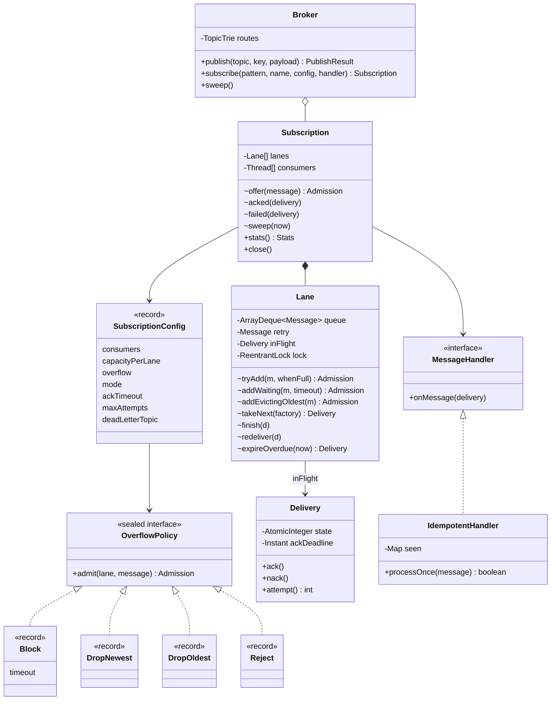
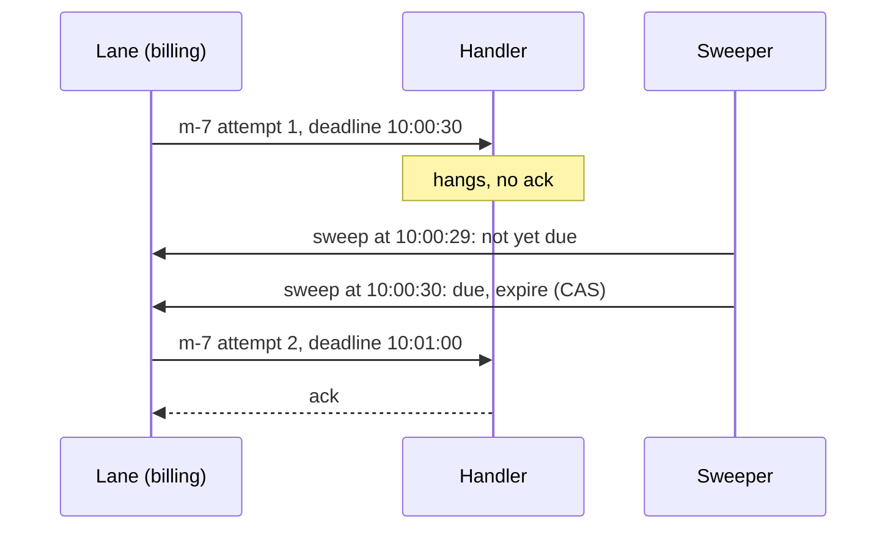
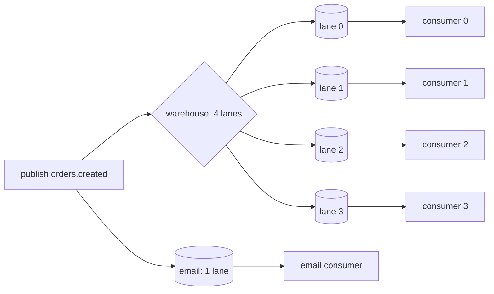

# Pub-Sub Broker — L5 (Senior) LLD Interview

> **Level expectation:** take the L4 broker and make it survive overload and failure. **Bounded queues** with explicit **overflow policies** (block with timeout, drop newest, drop oldest, reject) as a **Strategy**, with every drop counted. **Acknowledgements**: at-most-once vs at-least-once, an **ack deadline** with redelivery (using an injected clock so it's testable), **max attempts → dead-letter topic**. **Consumer groups** (competing consumers inside one subscription) vs fan-out between subscriptions. **Per-key ordering** by hashing the key to a lane, and why only one unacked message per lane. **Idempotent consumers**. Concurrency tests that prove no message is lost or duplicated. Read [L4-mid.md](L4-mid.md) first.

Legend: **🧑‍💼 Interviewer** · **🧑‍💻 Candidate** · **📝 Note** = commentary for you.

---

## 1. Requirements (what's new vs L4)

**🧑‍💼 Interviewer:** Your L4 broker is in production. Three incidents: the warehouse subscriber fell behind on Black Friday and the JVM ran out of memory; billing crashed mid-message and an order's loyalty points were never added; and the warehouse now runs 4 workers that all pack every order.

**🧑‍💻 Candidate:** So:
- **Bounded memory** per subscription, with a **chosen** behaviour when full, per subscription (billing may never lose a message; a live price feed would rather drop old prices).
- **At-least-once** delivery for subscribers that need it: a message is finished only when the handler **acks** it; a crash, an exception or a missed deadline redelivers it. Keep **at-most-once** as an option (cheaper, for metrics).
- **Poison messages** (ones that fail every time) must not block a subscription forever: after N attempts, a **dead-letter topic**.
- **Consumer groups**: workers inside one subscription share messages; different subscriptions still each get all of them.
- **Per-key ordering**: all events for one order are handled in order, even with 4 workers.
- **Duplicates** are now possible (at-least-once), so consumers must be able to be **idempotent**.

---

## 2. Core entities (new ones in bold)

| Entity | Responsibility |
|---|---|
| `Broker` | Routes a published message to every matching subscription; returns a `PublishResult` (accepted / dropped / rejected counts) |
| `Subscription` | Name, pattern, config, handler; **N lanes and N consumer threads** (the consumer group); counters |
| **`SubscriptionConfig`** (record) | consumers, capacity per lane, overflow policy, delivery mode, ack timeout, max attempts, dead-letter topic |
| **`Lane`** | One bounded FIFO queue + the one delivery waiting for an ack + the message waiting for redelivery. Owned by one consumer thread. Has its own lock |
| **`OverflowPolicy`** (sealed interface) | Strategy: `Block(timeout)`, `DropNewest`, `DropOldest`, `Reject`. Decides what happens when a lane is full |
| **`Delivery`** | One attempt to deliver one message: `message()`, `attempt()`, `ack()`, `nack()`, and an ack deadline |
| **`DeliveryMode`** (enum) | `AT_MOST_ONCE`, `AT_LEAST_ONCE` |
| **`IdempotentHandler`** | Decorator that skips message ids it has already processed |
| **`ManualClock`** | A `java.time.Clock` tests move by hand ([time & clock](../../libraries/java/time-and-clock.md)) |

---

## 3. API

```java
Subscription subscribe(String pattern, String name, SubscriptionConfig config, MessageHandler handler);

@FunctionalInterface
interface MessageHandler {
    void onMessage(Delivery d) throws Exception;     // throwing = nack
    static MessageHandler autoAck(Consumer<Message> callback);   // ack if the callback returns normally
}

final class Delivery {
    Message message();
    int attempt();        // 1, 2, 3...
    void ack();           // done: forget it
    void nack();          // failed: redeliver (or dead-letter after maxAttempts)
}

record PublishResult(String messageId, int accepted, int dropped, int rejected, long logOffset) {
    boolean fullyAccepted();
}
```

Example config, for billing:

```java
SubscriptionConfig.defaults()
    .withMode(DeliveryMode.AT_LEAST_ONCE)
    .withConsumers(4)                                   // consumer group of 4
    .withCapacity(1_000)                                // per lane
    .withOverflow(OverflowPolicy.block(Duration.ofSeconds(2)))
    .withAckTimeout(Duration.ofSeconds(30))
    .withMaxAttempts(5)
    .withDeadLetterTopic("orders.dlq");
```

The handler gets a `Delivery`, not just a `Message`, so it can ack **later or from another thread** (hand the work to a pool, ack when the database commit finishes). That's the manual-ack model of RabbitMQ and Google Cloud Pub/Sub.

---

## 4. Class diagram



---

## 5. Deep dives

### 5.1 Bounded lanes and the overflow Strategy

**🧑‍💼 Interviewer:** The warehouse queue is full. What happens to the next publish?

**🧑‍💻 Candidate:** That's a business decision, so it's a per-subscription setting, written as a **Strategy** (an interface with interchangeable implementations, chosen by configuration; [design patterns](../../concepts/design-patterns.md)). Each policy is a tiny record; the subscription just calls `policy.admit(lane, message)` and never needs to know which policy it has:

```java
public sealed interface OverflowPolicy {
    enum Admission { ACCEPTED, EVICTED_OLDEST, DROPPED, REJECTED }
    Admission admit(Lane lane, Message m) throws InterruptedException;

    record Block(Duration timeout) implements OverflowPolicy {
        public Admission admit(Lane lane, Message m) throws InterruptedException { return lane.addWaiting(m, timeout); }
    }
    record DropNewest() implements OverflowPolicy {
        public Admission admit(Lane lane, Message m) { return lane.tryAdd(m, Admission.DROPPED); }
    }
    record DropOldest() implements OverflowPolicy {
        public Admission admit(Lane lane, Message m) { return lane.addEvictingOldest(m); }
    }
    record Reject() implements OverflowPolicy {
        public Admission admit(Lane lane, Message m) { return lane.tryAdd(m, Admission.REJECTED); }
    }
}
```

`sealed` means only these four may implement it, so a `switch` over them is checked by the compiler ([sealed interfaces & pattern matching](../../libraries/java/sealed-interfaces-and-pattern-matching.md)). The lane offers three primitive operations (try, wait, evict); each policy picks one.

| Policy | When full | Use for | Cost |
|---|---|---|---|
| **Block(timeout)** | Publisher's thread waits for space, up to the timeout, then the message is **rejected** | Billing, audit: nothing may vanish silently | The publisher slows to the **slowest** subscriber's pace: back-pressure that reaches the source |
| **DropNewest** | Incoming message discarded | Metrics, samples: the next one replaces it | The most recent data is what's lost |
| **DropOldest** | Oldest waiting message evicted, new one queued | Live prices, positions, "latest state" | Old messages vanish; consumers must not rely on seeing every one |
| **Reject** | Publisher gets an immediate "rejected" in `PublishResult` | APIs that can return HTTP 429/503 ("too many requests" / "unavailable") and let the client retry | The publisher must handle it |

Whatever the policy, **every drop and rejection is counted** in the subscription's stats ([back-pressure](../../concepts/back-pressure.md): silent loss is the worst outcome).

The tests make the effect exact. A subscription with a lane of 5 whose handler is stuck on message 0, then messages 1..19 published:

| Test | Delivered after release | Counted |
|---|---|---|
| `dropNewestDropsExactlyTheOverflow` | 0, 1, 2, 3, 4, 5 | 14 dropped |
| `dropOldestKeepsTheNewest` | 0, 15, 16, 17, 18, 19 | 14 evicted |
| `rejectTellsThePublisher` | 0, 1, 2, 3, 4, 5 | 14 rejections returned to the publisher |
| `blockWaitsForSpaceThenTimesOut` | publisher waits ≥ 250 ms of its 300 ms, then rejected; a second publisher waits and gets in once the handler frees a slot | 0 lost |

20 − 1 (in the handler) − 5 (queued) = **14** in each case.

**🧑‍💼 Interviewer:** Block with fan-out: billing is full, email isn't. The publisher blocks on billing. What does email see?

**🧑‍💻 Candidate:** Email already got its copy (the broker visits subscriptions one by one) but the **next** message reaches email only after the publisher gets past billing. So BLOCK couples the publisher, and indirectly every other subscription, to the slowest blocking subscriber. That's the honest cost of "never lose anything" in the queue model: a separate copy per subscription means "full" is per subscription. Two mitigations: give blocking subscriptions generous capacity and a timeout (so a dead subscriber turns into rejections and an alert, not a frozen checkout), and use a **retained log** (L6) where there's one shared copy and a slow consumer simply falls behind (lag) without pushing back at all.

> 📝 **Note:** Also say what `PublishResult` means for partial success: with 3 subscriptions, a publish can be accepted by 2 and rejected by 1. The publisher learns that from the counts; retrying the whole publish would duplicate it for the 2. Many real brokers sidestep this by making the publish a single append to one log.

### 5.2 Acks: at-most-once vs at-least-once

**🧑‍💼 Interviewer:** Billing crashed mid-message and lost it. Why?

**🧑‍💻 Candidate:** Because the L4 dispatcher removed the message from the queue **before** the handler finished. Where you mark a message "done" decides the guarantee ([idempotency & delivery semantics](../../../HLD/concepts/idempotency-and-delivery-semantics.md)):

| Mode | Marked done | If the handler crashes or throws | Duplicates? |
|---|---|---|---|
| `AT_MOST_ONCE` | When handed to the handler | Message lost | Never |
| `AT_LEAST_ONCE` | When the handler calls `ack()` | Redelivered (after a nack immediately, after silence at the ack deadline) | Possible: work done, ack lost → redelivered |

"Exactly once" isn't a delivery mode a broker can promise by itself: between "did the work" and "told the broker" there's always a moment where a crash leaves the broker unsure. The practical answer is **at-least-once + an idempotent consumer** (§5.7) = effectively once.

In code, a `Delivery` has a small state machine: `PENDING → ACKED | NACKED | EXPIRED`. An `ack()` and the ack-deadline expiry can race (the ack arrives just as the sweeper runs), so the transition is a **compare-and-set** (CAS: "change the value only if it is still what I expect", done atomically by the CPU; [atomics & CAS](../../libraries/java/atomics-and-cas.md)):

```java
public void ack() {
    if (state.compareAndSet(PENDING, ACKED)) subscription.acked(this);    // exactly one of ack/nack/expire wins
}
boolean expireIfDue(Instant now) {
    return !now.isBefore(ackDeadline) && state.compareAndSet(PENDING, EXPIRED);
}
```

A very late ack for attempt 1 after it already expired is a no-op: test `ackTimeoutRedeliversThenDeadLetters` checks `acked == 0` after one.

### 5.3 The ack deadline, with testable time

**🧑‍💼 Interviewer:** The billing process hangs instead of crashing. No exception, no ack. How do you notice?

**🧑‍💻 Candidate:** Every delivery gets a deadline, `clock.instant() + ackTimeout` (30 s here; Google Cloud Pub/Sub's default ack deadline is 10 s and SQS's default **visibility timeout**, its name for the same idea, is 30 s). A **sweep** checks each lane's unacked delivery; if its deadline has passed, it's expired and treated like a nack:



Why a sweep instead of one timer per delivery? One periodic job (`Broker.startSweeper(period)`, a `ScheduledExecutorService` underneath, [scheduled executor service](../../libraries/java/scheduled-executor-service.md)) is cheap and, more importantly, **testable**: time comes from an injected `Clock`, and tests call `broker.sweep()` directly after `clock.advance(...)`. The test advances 29 s, sweeps, and asserts **nothing** was redelivered; advances 1 s more, sweeps, and asserts attempt 2 arrived. No `Thread.sleep(30_000)`. (Very large numbers of timers have better structures: [timers, delay queues & timing wheels](../../concepts/timers-delay-queues-and-timing-wheels.md).)

**🧑‍💼 Interviewer:** The handler is hung on the consumer thread. Who processes attempt 2?

**🧑‍💻 Candidate:** In my code, the same lane's thread, once the hung call returns: attempt 2 waits in the lane's `retry` slot. A real broker redelivers to **another consumer** (the hung one may be a dead process). In-process, the fix is a handler-level timeout (run the work on a pool and give up after a while) or a watchdog that interrupts the stuck thread. I'd mention it rather than build it.

### 5.4 Poison messages and the dead-letter topic

**🧑‍💼 Interviewer:** One order has a malformed address. The warehouse handler throws every time.

**🧑‍💻 Candidate:** Retried forever, it blocks its lane (and with per-key ordering, every message behind it). So: `maxAttempts`, then **dead-letter** ([retries, backoff & DLQ](../../../HLD/concepts/retries-backoff-and-dlq.md)):

```java
void failed(Delivery d) {
    if (d.attempt() < config.maxAttempts()) { d.lane().redeliver(d); return; }
    if (config.deadLetterTopic() != null)
        broker.deadLetter(d.message().copyTo(config.deadLetterTopic(), Map.of(
            "dlq.subscription", name, "dlq.attempts", String.valueOf(d.attempt()), "dlq.originalTopic", d.message().topic())));
    deadLettered.increment();
    d.lane().finish(d);      // only now does the lane move on
}
```

Three details:
1. The DLQ is **just another topic**, so anything can subscribe to it: an alert, a dashboard, a "replay after fix" tool.
2. **Publish to the DLQ before releasing the lane.** If the process died between the two, the worst case is a duplicate in the DLQ, not a lost message.
3. **Headers say why**: which subscription, how many attempts, the original topic. Without them a DLQ is a pile of mystery messages.

In production I'd add **backoff** (wait 1 s, 2 s, 4 s... with random jitter between attempts), so a dependency that's down for a minute isn't hammered, and separate "retryable" errors (timeout) from "permanent" ones (can't parse: dead-letter at once). My code retries immediately to stay small.

### 5.5 Consumer groups vs fan-out

**🧑‍💼 Interviewer:** The warehouse has 4 workers. Each order must be packed once. Email must still get every order.

**🧑‍💻 Candidate:** Two different relationships:

| | Between subscriptions | Inside one subscription |
|---|---|---|
| Who gets a message | **Every** subscription (fan-out) | **One** consumer in the group (competing consumers) |
| Example | email, warehouse, analytics | warehouse workers 1-4 |
| In my code | separate `subscribe` calls, each with its own lanes | `withConsumers(4)`: 4 lanes, 4 threads |
| Kafka name | different consumer groups | consumers in one group |



Test `consumerGroupSharesWorkWithoutDuplicates`: 10,000 messages from 4 publisher threads into a group of 4 and a separate `audit` subscription. Every id is processed exactly once in the group, all 4 consumers did work, and `audit` also got all 10,000.

**🧑‍💼 Interviewer:** Why a lane per consumer and not one shared queue that all 4 take from?

**🧑‍💻 Candidate:** A shared queue (RabbitMQ's model) balances better: an idle worker takes the next message, while with lanes a slow consumer's lane backs up even if others are idle. But a shared queue **can't keep per-key order**: two workers could take order 17's "created" and "cancelled" at once. Lanes (Kafka's partitions) give ordering for free and make each lane single-consumer, so its state needs less coordination. For messages without a key I spread round-robin across lanes.

### 5.6 Per-key ordering

**🧑‍💼 Interviewer:** Order 17: created, paid, cancelled. With 4 consumers, how do you keep them in order?

**🧑‍💻 Candidate:** **The same key always goes to the same lane**, and each lane is consumed by one thread in FIFO order:

```java
private Lane laneFor(Message m) {
    if (m.key() != null) return lanes[Math.floorMod(m.key().hashCode(), lanes.length)];
    return lanes[Math.floorMod(roundRobin.getAndIncrement(), lanes.length)];
}
```

`Math.floorMod` (not `%`) because `hashCode()` can be negative, and `-7 % 4` is `-3` in Java: an invalid array index.

That's necessary but not enough. Two more rules:
1. **At most one unacked delivery per lane.** If the lane handed out "paid" while "created" was still unacked, and "created" then timed out and was redelivered, the handler would see created, paid, created. So `takeNext` waits while `inFlight != null`.
2. **A redelivery goes first.** A nacked or expired message goes into the lane's `retry` slot, which `takeNext` serves before the queue.

```java
while (!closed && (inFlight != null || (retry == null && queue.isEmpty()))) changed.await();
```

Test `perKeyOrderPreservedInConsumerGroup`: 8 publisher threads, 40 keys × 500 sequence numbers, 4 consumers. Each key's numbers arrive 0, 1, 2, ... with no gap or swap, each key is handled by exactly one consumer thread, and all 4 consumers are used. Mutation check: making `laneFor` ignore the key makes this test fail with thousands of out-of-order arrivals.

**🧑‍💼 Interviewer:** What does that cost?

**🧑‍💻 Candidate:**
- **Throughput per lane = one message per handler round-trip.** A lane can't pipeline. More throughput means more lanes (Kafka: more partitions).
- **Head-of-line blocking** (the first item in line holds up everything behind it): a poison message stalls every key in its lane until it's dead-lettered. That's why `maxAttempts` matters more with ordering.
- **Hot keys**: one very busy key (a huge merchant) overloads one lane; you can't split a key without giving up its order.
- **Changing the number of lanes moves keys** (`hash % 4` vs `hash % 5`), so ordering is only guaranteed while the lane count is fixed. Kafka fixes the partition count per topic for this reason; in-flight messages during a **rebalance** (consumers joining or leaving) are the classic duplicate/reorder window ([message ordering](../../../HLD/concepts/message-ordering-and-sequencing.md)).

### 5.7 Idempotent consumers

**🧑‍💼 Interviewer:** At-least-once means duplicates. Billing must not add points twice.

**🧑‍💻 Candidate:** Make processing **idempotent**: running it twice has the same effect as once. Two ways:
1. **Naturally idempotent operations**: "set status = SHIPPED" can be repeated; "add 50 points" can't.
2. **Dedupe by message id**: remember processed ids, skip repeats. `IdempotentHandler` is a **Decorator** (a wrapper with the same interface that adds behaviour) around the real handler:

```java
public synchronized boolean processOnce(Message m) {
    if (seen.containsKey(m.id())) { duplicates++; return false; }
    process.accept(m);
    seen.put(m.id(), Boolean.TRUE);
    return true;
}
```

`seen` is a `LinkedHashMap` with `removeEldestEntry`, so it remembers the last N ids and forgets the oldest ([LinkedHashMap](../../libraries/java/linkedhashmap.md)). The bound must cover the **redelivery window**: a duplicate arriving after N newer messages would slip through. The `synchronized` method keeps two consumer threads from processing the same id at once, at the cost of running all processing one at a time; fine for a demo.

Test `idempotentConsumerAppliesSideEffectOnce`: the handler does the work on attempt 1 but "loses" the ack; at the deadline the message is redelivered; the decorator skips it; the side effect counter is 1, the duplicate counter 1. Mutation check: removing the `seen` check makes it 2.

> 📝 **Note:** The senior point: in production, "mark seen" and "do the side effect" must be **one atomic step**, e.g. insert the message id into a `processed_messages` table with a unique constraint **in the same database transaction** as the points update. If they're separate, a crash between them either loses the effect or applies it twice, and you're back to square one.

### 5.8 The lane's concurrency, and how the tests prove it

**🧑‍💻 Candidate:** Each `Lane` has one `ReentrantLock` (a lock object with timed waits and conditions; [locks & synchronized](../../libraries/java/locks-and-synchronized.md)) and one `Condition` (a "wait here until something changes" queue tied to that lock). Publishers wait on it when the lane is full; the consumer waits when there's nothing to deliver; every change calls `signalAll()`. Two conditions (`notFull`, `notEmpty`) would wake fewer threads, which is what `ArrayBlockingQueue` does; one condition with `signalAll` is simpler to get right and fast enough here.

The handler is always called **outside** the lane lock. Calling unknown code while holding a lock is how you get deadlocks: the handler might publish to the same topic, which needs the same lock.

| What could go wrong | Test |
|---|---|
| Messages lost when queues are full under BLOCK | `blockPolicyLosesNothingUnderConcurrency`: 8 publishers × 5,000 into 3 subscriptions with capacity 8; every publish fully accepted, every subscription acks 40,000, each publisher's order kept |
| Wrong number of drops | the three exact-count tests in §5.1 |
| Redelivery missing or early | `ackTimeoutRedeliversThenDeadLetters` with `ManualClock` |
| Duplicates inside a group | `consumerGroupSharesWorkWithoutDuplicates` |
| Per-key reordering | `perKeyOrderPreservedInConsumerGroup` |

Concurrent tests release threads together with a `CountDownLatch` and **wait for states** (e.g. "acked == 40,000") with a 10 s deadline instead of sleeping. The suite was run 60 times, six copies in parallel to add CPU contention, without a failure; and each important guard was removed on a copy to check that a test fails (list in the [README](README.md#code-runnable-no-dependencies)).

---

## 6. Follow-ups

**🧑‍💼 Interviewer:** Priorities: "payment failed" alerts should jump ahead of "newsletter opened".

**🧑‍💻 Candidate:** Separate topics (or lanes) per priority, with consumers serving high first, is simpler and more predictable than one priority queue: a priority queue breaks FIFO, so it breaks per-key order, and low priority can **starve** (never get served under constant high-priority load). If one queue is required, a `PriorityBlockingQueue` ordered by (priority, sequence number) keeps FIFO within a priority ([TreeSet & PriorityQueue](../../libraries/java/treeset-and-priorityqueue.md)).

**🧑‍💼 Interviewer:** A handler wants to process 10 messages at once to batch database writes.

**🧑‍💻 Candidate:** Then it needs more than one unacked message per lane, which conflicts with rule 1 of §5.6. Options: allow up to N in flight per lane **when the subscription doesn't need ordering** (RabbitMQ's prefetch count, `basic.qos`); or keep one-at-a-time per lane and add lanes. Kafka consumers get batches by polling, and commit the offset after the batch: if they crash, the whole batch is re-read (at-least-once, again).

**🧑‍💼 Interviewer:** Exactly-once?

**🧑‍💻 Candidate:** Only end to end, and only by making the effect idempotent or transactional with the progress marker (Kafka's transactions write the output and the consumer offset in one transaction, but only when the output is also Kafka). Inside this broker I'd say: at-least-once delivery, idempotent consumers, and a test that proves duplicates are harmless.

---

## 7. What the interviewer was evaluating (L5)

- [ ] Bounded per-subscription queues; four overflow policies as a Strategy; drops counted
- [ ] Knows BLOCK couples the publisher to the slowest subscriber; partial fan-out results
- [ ] At-most-once vs at-least-once decided by **where** the ack happens; "exactly once" = at-least-once + idempotency
- [ ] Ack deadline with redelivery; CAS so ack vs expiry has one winner; late acks ignored
- [ ] Injected clock and a callable sweep, so time-based behaviour is tested without sleeping
- [ ] Max attempts → dead-letter topic with headers; DLQ publish before release; backoff mentioned
- [ ] Consumer group vs fan-out clearly separated; lanes vs shared queue trade-off
- [ ] Per-key ordering: hash → lane, `floorMod`, one in flight per lane, redelivery first; costs (head-of-line, hot keys, rebalancing)
- [ ] Idempotent consumer with bounded memory, and "same transaction as the side effect"
- [ ] Handlers never called under a lock; concurrency tests with latches and state waits; mutation checks

## 8. Common mistakes at this level

| Mistake | Why it's wrong |
|---|---|
| Dropping messages without a counter | Silent data loss nobody notices until a customer does |
| Removing the message from the queue before the handler finishes, and calling it at-least-once | A crash mid-handler loses it: that's at-most-once |
| Unlimited retries | A poison message blocks its lane (and its keys) forever |
| Several unacked messages per lane with per-key ordering | A redelivery lands after a newer message: created, paid, created |
| `key.hashCode() % n` | Negative hash → negative index → `ArrayIndexOutOfBoundsException` |
| A shared queue for all consumers, and claiming per-key order | Two consumers take two events of the same key at once |
| Calling the handler while holding the lane lock | A handler that publishes or acks from another thread can deadlock |
| Dedupe set that grows forever | A memory leak; bound it to the redelivery window |
| Dedupe marker written separately from the side effect | A crash between them re-applies or loses the effect |
| `Thread.sleep(31_000)` in an ack-timeout test | Slow and flaky; inject a clock |

➡️ Next: [L6-staff.md](L6-staff.md)
