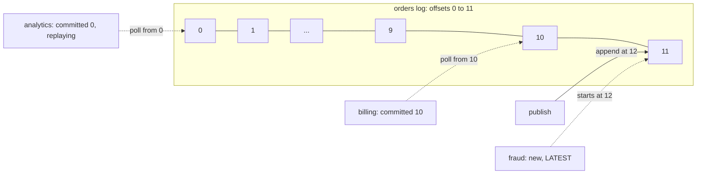
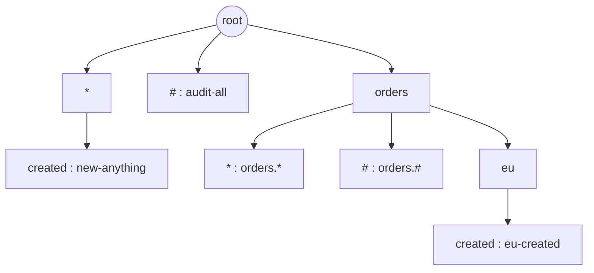

# Pub-Sub Broker — L6 (Staff) LLD Interview

> **Level expectation:** explain the **queue model vs the log model** and when each wins, and add a **retained log with offsets** (replay, start from earliest/latest, commit semantics) with **retention** by count and time. Route **wildcard / hierarchical topics** with a trie. Define the **metrics** that matter (lag above all) and what to alert on. Do **graceful shutdown** properly. Say precisely **what changes when this becomes distributed** (durability, replication, partition leaders, rebalancing, offsets as data), and lay out a **testing strategy for concurrent code** you'd trust. Read [L5-senior.md](L5-senior.md) first; the distributed version is the [Distributed Message Queue HLD](../../../HLD/interviews/distributed-message-queue/README.md).

Legend: **🧑‍💼 Interviewer** · **🧑‍💻 Candidate** · **📝 Note** = commentary for you.

> ⚠️ Product defaults quoted below (Kafka, RabbitMQ, Pub/Sub, SQS, Kubernetes) are from public documentation as I remember it; ones I'm less sure of are marked. Check the current docs before relying on a number.

---

## 1. The question behind the question

**🧑‍💼 Interviewer:** Analytics shipped a bug and computed wrong numbers for a day. They want to reprocess yesterday's orders. Your L5 broker deleted them on ack. Now what?

**🧑‍💻 Candidate:** That's the difference between the two big families of brokers, and the most important design decision in this space:

| | **Queue model** (RabbitMQ, SQS, my L5 broker) | **Log model** (Kafka, Pulsar, Redis Streams, Kinesis) |
|---|---|---|
| What the broker stores | A copy **per subscription**; deleted when acked | **One** append-only log per topic (partition); kept until retention expires |
| Consumer's progress | Per message: acked or not | One number per group per partition: the **offset** (next position to read) |
| Replay | Gone after ack | Move the offset back and re-read |
| A new subscriber | Sees only messages published after it subscribed | Can start from the **earliest** retained message or the **latest** |
| Cost of one more consumer group | One more copy of every message | One more number |
| Slow consumer | Its queue fills: back-pressure or drops (L5) | It falls behind (lag grows); nobody else notices, until retention deletes what it hasn't read |
| Per-message features | Individual ack/nack, per-message retry, DLQ, delay, priority | Weak: progress is a single offset, so one bad message blocks the partition unless the consumer parks it itself |
| Ordering | Per queue, until there are competing consumers | Per partition, always |
| Storage pattern | Random deletes | Sequential appends; whole old segments deleted at once (cheap on disk) |

So: queues for **jobs** (each task done once, retried individually, DLQ'd: "send this email"); logs for **events/facts** many independent teams consume at their own pace and may re-read ("order 17 was created"). Kafka's design (LinkedIn, open-sourced 2011) is explained in Jay Kreps' essay "The Log" (2013) and in [Kafka](../../../HLD/technologies/kafka.md); the queue side in [message queues](../../../HLD/technologies/message-queues.md); both in [pub/sub](../../../HLD/technologies/pub-sub.md).

> 📝 **Note:** The staff signal is choosing **per use case** and naming what you give up: the log gives up per-message retry (you rebuild DLQs on top), the queue gives up replay and cheap extra consumers. "Just use Kafka" without that is a mid-level answer.

---

## 2. The retained log in code

**🧑‍💻 Candidate:** I added the log next to the queue model rather than replacing it: `broker.retain(topic, maxRecords, maxAge)` makes the broker also append that topic's messages to a [`TopicLog`](java/src/pubsub/TopicLog.java). Consumers **pull** from it.

```java
synchronized long append(Message m)                                          // called by the broker; returns the offset: 0, 1, 2, ...
public synchronized List<Record> poll(String group, StartFrom startIfNew, int max)   // from the committed offset; does NOT move it
public synchronized void commit(String group, long nextOffsetToRead)        // "I've processed everything before this"
public synchronized long lag(String group)                                   // endOffset - committed
```



Design decisions:
- **Offsets are positions, never reused.** After retention deletes offsets 0-2, the next message is still 12, not 3. A consumer's "I'm at 10" stays meaningful.
- **`poll` doesn't move the offset; `commit` does.** So the consumer chooses the guarantee: **commit after processing** = at-least-once (crash before commit → re-read); **commit before processing** = at-most-once. Test `logReplaysFromEarliestLatestAndCommittedOffsets` polls twice without committing and gets the same records.
- **New group: EARLIEST or LATEST.** Kafka's setting is `auto.offset.reset` (default `latest`). A new analytics job wants history (earliest); a new alerting job wants only what happens from now on (latest).
- **Replay = commit an older offset.** `commit("billing", 0)` and the next poll re-reads everything retained.
- **One lock per log.** `synchronized` on every method keeps it simple; appends from many publishers get a **single order**, which also answers L4's "no global order across publishers": in the log, offsets **are** the global order for that topic.

### 2.1 Retention

**🧑‍💼 Interviewer:** The log can't grow forever.

**🧑‍💻 Candidate:** Retention deletes from the front by **count** (`maxRecords`) and by **age** (`maxAge`, using the injected clock, enforced on append and on every `sweep()`). Kafka retains by time (default 7 days, `log.retention.hours=168`) and/or size, and deletes whole **segment files** (the log is split into files of ~1 GB by default) instead of single records, which is why deletion is cheap.

A consumer slower than retention **falls off the log**: its committed offset points at deleted records. My `poll` skips it ahead to the earliest offset that still exists, and `lag` counts only records that still exist (test `retentionDeletesByCountAndAge`: keep 5, publish 8, the slow group jumps from 0 to 3; after 61 s every record has aged out and lag is 0). That's **silent data loss for that consumer**, so in production it must be an alert, not a quiet skip. Kafka's equivalent is `auto.offset.reset` firing for an out-of-range offset.

A different retention mode worth naming: **log compaction** (Kafka `cleanup.policy=compact`) keeps only the **latest message per key** forever. That makes a topic a changelog of current state, e.g. "latest address per customer", which a new consumer can read to rebuild a table.

---

## 3. Wildcard and hierarchical topics

**🧑‍💼 Interviewer:** Audit wants every order event, including `orders.eu.refunded` that doesn't exist yet.

**🧑‍💻 Candidate:** Topics are dot-separated words; subscriptions are **patterns**: `*` matches exactly one word, `#` matches zero or more (RabbitMQ's topic-exchange rules; MQTT, a lightweight messaging protocol for IoT devices, uses `+` and `#` the same way; NATS, a lightweight broker, uses `*` and `>`). Routing becomes "find every pattern matching this topic".

Scanning every pattern on every publish is O(patterns × words). A **trie** (prefix tree: one node per word, patterns sharing a prefix share nodes; [tries & prefix search](../../../HLD/concepts/tries-and-prefix-search.md)) makes it roughly O(words), plus the branches that wildcards open:



Matching `orders.eu.created`: from the root, follow `orders` (exact), `*` (one word) and `#` (any number of words) branches as they exist, recursively; at the end of the topic, collect the subscriptions stored at the nodes reached. Here: `orders.#`, `#`, and `orders.eu.created`; **not** `orders.*` (that's one word after `orders`, and there are two).

```java
private void collect(Node<T> n, String[] words, int i, Set<T> out) {
    Node<T> hash = n.children.get("#");
    if (hash != null) for (int j = i; j <= words.length; j++) collect(hash, words, j, out);   // # eats 0..all words
    if (i == words.length) { out.addAll(n.values); return; }
    Node<T> exact = n.children.get(words[i]);
    if (exact != null) collect(exact, words, i + 1, out);
    Node<T> star = n.children.get("*");
    if (star != null) collect(star, words, i + 1, out);
}
```

Results go into a `LinkedHashSet` because overlapping patterns can reach the same subscription twice. The trie is guarded by a `ReentrantReadWriteLock`: many publishers match concurrently (read lock), subscribe/unsubscribe take the write lock. Test `wildcardPatternsMatchLikeATopicExchange` covers `*` vs `#`, `#` matching zero words, and removal.

**🧑‍💼 Interviewer:** Faster?

**🧑‍💻 Candidate:** Most systems publish to a small set of distinct topics many times, so **cache** topic → matched subscriptions and invalidate the cache on any subscribe/unsubscribe. Or make the trie **copy-on-write**: subscribe builds a new trie and swaps a `volatile` reference (a field whose new value every thread sees immediately), so publishers read with no lock at all. Both trade write cost for read speed, the right trade for routing.

---

## 4. Metrics: what on-call needs

**🧑‍💻 Candidate:** Per subscription, `Subscription.stats()` returns a snapshot (counters are `LongAdder`s: counters split across CPU cores to avoid contention, summed on read; [atomics & CAS](../../libraries/java/atomics-and-cas.md)):

| Metric | Meaning | Alert when |
|---|---|---|
| **backlog / lag** | Messages not yet finished (queue model) or `end − committed` (log model) | Growing for N minutes: consumers can't keep up. Better: **lag in seconds** (age of the oldest unprocessed message), which means the same thing for every topic |
| dropped, rejected | Back-pressure policy firing | Any, for BLOCK/REJECT subscriptions; a rate threshold for DROP ones |
| redelivered | Nacks + ack timeouts | A jump: a dependency is failing or handlers are timing out |
| deadLettered | Gave up | Any: a human must look |
| handlerErrors | Exceptions from handlers | Rate threshold |
| delivered − acked | In flight | Stuck near the lane count: handlers are hanging |

These are exactly Kafka's consumer-lag dashboards, SQS's `ApproximateAgeOfOldestMessage`, and Pub/Sub's `oldest_unacked_message_age`. Lag alerts follow the **SLO** approach (service level objective: a promised target such as "99% of orders processed within 60 s"; [alerting & SLOs](../../../HLD/concepts/alerting-and-slos.md), [observability](../../../HLD/concepts/observability.md)): "orders are processed within 60 s" becomes "alert if lag-in-seconds > 60 for 5 min".

> 📝 **Note:** Queue depth alone misleads: 10,000 messages is nothing for a topic doing 50,000/s and a disaster for one doing 10/s. Time-based lag is the metric that means the same everywhere.

---

## 5. Graceful shutdown

**🧑‍💼 Interviewer:** A deploy restarts the service. 300 messages are in queues.

**🧑‍💻 Candidate:** `Broker.shutdown(grace)`:
1. **Stop accepting**: new `publish` calls throw `IllegalStateException`. (Internal dead-letter publishes are still allowed, so a message failing during the drain still reaches its DLQ.)
2. **Drain**: wait until every lane is empty, nothing is unacked and no handler is running, up to the grace deadline.
3. **Close**: stop the consumer threads and the sweeper.
4. **Report** how many messages were still unfinished: in an in-memory broker those are **lost**, and the number should be logged and counted.

Test `gracefulShutdownDrainsThenStops`: 200 queued jobs finish before `shutdown` returns 0; then a stuck handler with a 100 ms grace returns 5.

In Kubernetes the pod gets `SIGTERM` (the polite "please stop" signal), then `SIGKILL` (immediate, uncatchable kill) after `terminationGracePeriodSeconds` (default 30 s). So: call `shutdown` from a JVM shutdown hook (code the JVM runs on `SIGTERM`), keep the grace below the pod's (e.g. 25 s), and stop the **inputs** first (the **readiness probe**, Kubernetes' "send me traffic?" check, starts failing; HTTP server stops taking requests) so nothing new is published while draining. And since an in-memory broker loses everything on `SIGKILL` or a crash, anything that must survive a restart doesn't belong in it (§6).

---

## 6. What changes when this becomes distributed

**🧑‍💼 Interviewer:** Teams love it and want it shared across services. What changes?

**🧑‍💻 Candidate:** Almost every assumption. Mapping my classes to Kafka's distributed versions (details in the [HLD L5](../../../HLD/interviews/distributed-message-queue/L5-senior.md) and [L6](../../../HLD/interviews/distributed-message-queue/L6-staff.md)):

| In-process (this folder) | Distributed | New problem |
|---|---|---|
| `TopicLog` in memory | Log **segments on disk**, appended sequentially | **Durability**: when is a write "safe"? After the OS has it, after `fsync` (forcing data to the physical disk), after replicas have it? ([durability, WAL & snapshots](../../concepts/durability-wal-and-snapshots.md)) |
| One copy | Each partition **replicated** to e.g. 3 brokers; one **leader** takes writes, followers copy; the **ISR** (in-sync replicas) are those caught up | Producer `acks=all` + `min.insync.replicas=2` means a write survives one broker dying ([sharding & replication](../../../HLD/concepts/sharding-and-replication.md)) |
| `Lane[]` inside one subscription | **Partitions** spread across brokers; key → partition by hash | Partition count fixed up front; adding partitions moves keys (§L5 5.6) |
| Lane ↔ consumer thread, fixed | A **group coordinator** assigns partitions to consumer processes; **rebalancing** when one joins, leaves or stops polling (Kafka's `max.poll.interval.ms`, default 5 min) | During a rebalance, unacked work is redone by the new owner: duplicates. "Stop polling" looks the same as "dead" ([gossip & failure detection](../../../HLD/concepts/gossip-and-failure-detection.md)) |
| `committed` map | Offsets stored as data (Kafka's internal `__consumer_offsets` topic) | Commit is a network call that can fail or time out |
| `publish` returns or throws | A network request that can time out after succeeding | Producer retries create duplicates in the log: Kafka's **idempotent producer** (sequence numbers per producer per partition; on by default since Kafka 3.0, 2021) |
| Who's the leader? Obvious | Controller / metadata quorum (ZooKeeper historically; Kafka's own Raft-based **KRaft** now) | Consensus ([consensus & Raft](../../../HLD/concepts/consensus-and-raft.md), [ZooKeeper / etcd](../../../HLD/technologies/zookeeper-etcd.md)) |
| BLOCK back-pressure on a lane | Producer buffer full → `send` blocks (`max.block.ms`); consumers just lag | Back-pressure becomes "lag + retention" for consumers, "buffer + timeout" for producers |
| `IdempotentHandler` in memory | Dedupe table in the consumer's database, same transaction as the effect; or Kafka transactions (offsets + output written atomically, Kafka-to-Kafka only) | Exactly-once is a property of the whole pipeline, not the broker ([idempotency & delivery semantics](../../../HLD/concepts/idempotency-and-delivery-semantics.md)) |

What **doesn't** change: the queue-vs-log choice, per-key ordering through partitioning, at-least-once + idempotent consumers, DLQs and their headers, lag as the key metric. That's why the in-process version is worth building: the ideas transfer, only the failure modes multiply.

**🧑‍💼 Interviewer:** So when is an in-process broker the right call at all?

**🧑‍💻 Candidate:** When producers and consumers live in **one process** and losing in-flight messages on a crash is acceptable: decoupling modules in a monolith (domain events like "user registered" → send welcome email, update search index), fanning out WebSocket updates to connected clients, pipelines inside one service, test doubles for a real broker. The moment a message must survive a restart or cross a process boundary, use a real broker (or write the event to your database in the same transaction and publish it afterwards, the **transactional outbox**; see [sagas & distributed transactions](../../../HLD/concepts/sagas-and-distributed-transactions.md)).

---

## 7. Testing concurrent code you can trust

**🧑‍💼 Interviewer:** How do you know your concurrency tests aren't just lucky?

**🧑‍💻 Candidate:** Layers, from deterministic to statistical:

| Layer | Technique | In this folder |
|---|---|---|
| **Make time a parameter** | Inject `Clock`; expose `sweep()` so the test runs the background job | `ManualClock`: "29 s → not redelivered, 30 s → redelivered", exact, no sleeping |
| **Make slowness a state** | Handlers block on a `CountDownLatch`; tests wait for "thread is TIMED_WAITING" or "inbox has 1" | The overflow tests build "lane exactly full" deterministically |
| **Wait for conditions, never for durations** | `await(condition, 10 s deadline)`, polling every 1 ms | Every async assertion |
| **Invariants under load** | Many threads released together; check conservation (no loss), uniqueness (no duplicates), order per key | 8 × 5,000 under BLOCK; 10,000 in a group; 40 keys × 500 |
| **Repeat under contention** | Run the suite many times, several copies in parallel to steal CPU and shuffle the thread schedule | 60 runs, 6 at a time: 0 failures (one flaky test assertion was found and fixed this way: it checked a count before the consumer thread had started) |
| **Prove the tests can fail** | **Mutation checks**: break one guard on a copy, confirm a test fails | 8 mutations, each caught (list in the [README](README.md#code-runnable-no-dependencies)) |
| **Stress the memory model** | **jcstress** (OpenJDK's harness that runs tiny racy snippets millions of times across CPU cores and reports surprising outcomes) | Not used here; worth it for a lock-free structure |
| **Hang = failure, with evidence** | Global timeout; on timeout print a thread dump (`jstack <pid>`, or `Thread.getAllStackTraces()`) | Tests time out at 10 s; `System.exit` in `main` so a stuck daemon thread can't hang the build |

> 📝 **Note:** Showing the mutation results is the strongest evidence you can give: "here's the line that keeps per-key order; delete it and this test fails with thousands of out-of-order arrivals" says more than a green test run ever can.

---

## 8. Build vs buy (in-process)

| Option | What it is | When |
|---|---|---|
| **This design** | Explicit lanes, policies, acks | You need per-subscriber isolation + back-pressure + retries, and you want to own the behaviour |
| **Guava `EventBus` / `AsyncEventBus`** | Annotation-based in-process pub-sub | Simple decoupling; Guava's own docs now discourage it for new code (as I recall; verify) |
| **Spring `ApplicationEventPublisher`** | Synchronous by default, `@Async` / `@TransactionalEventListener` for after-commit events | Spring apps; "send the email after the transaction commits" |
| **`java.util.concurrent.SubmissionPublisher`** (Java 9+) | A Reactive Streams publisher (a standard for streams where the subscriber asks for N items at a time) with a bounded buffer per subscriber; `submit` blocks, `offer` can drop | Back-pressured pipelines with the JDK only ([00 §5](00-understand-the-product.md#5-try-it-yourself-real-things-real-output)) |
| **Project Reactor / RxJava** | Libraries of reactive streams with `onBackpressureDrop/Latest/Buffer` operators | Already reactive codebases |
| **LMAX Disruptor** (2011) | A pre-allocated **ring buffer** (fixed-size circular array) with sequence numbers instead of locks; millions of events/s per thread | Ultra-low latency (trading); a single-writer design ([single-writer principle](../../concepts/single-writer-principle.md)) |
| **A real broker** | Kafka, RabbitMQ, NATS, Pub/Sub, SQS | Anything that must survive a restart or cross processes |

---

## 9. What the interviewer was evaluating (L6)

- [ ] Queue model vs log model, with what each gives up; picks per use case
- [ ] Retained log: offsets never reused, poll vs commit, earliest/latest, replay, lag
- [ ] Retention by count and time; falling off the log is data loss and needs an alert; compaction named
- [ ] Wildcard routing with a trie (`*` vs `#`), dedupe of overlapping matches, read-write lock or copy-on-write, caching
- [ ] Metrics: lag (in seconds), drops, redeliveries, DLQ rate; alert thresholds tied to an SLO
- [ ] Graceful shutdown: stop inputs, drain with a deadline, report leftovers; SIGTERM/grace period
- [ ] Distributed mapping: durability, replication/ISR, partition leaders, rebalancing duplicates, offsets as data, idempotent producer, exactly-once as a pipeline property
- [ ] When an in-process broker is (and isn't) appropriate; transactional outbox
- [ ] A layered concurrency testing strategy with deterministic seams, stress repetition and mutation checks

## 10. Common mistakes at this level

| Mistake | Why it hurts at L6 |
|---|---|
| "Kafka for everything" (or "RabbitMQ for everything") | Jobs need per-message retry/DLQ; event streams need replay and cheap extra consumers |
| Committing offsets before processing, and claiming at-least-once | A crash after commit loses the batch |
| Offsets as array indexes that shift on deletion | A consumer's saved position silently points at the wrong record after retention |
| Silently skipping ahead when a consumer falls off the log | Data loss nobody hears about |
| Alerting on queue depth instead of lag in seconds | False alarms on busy topics, missed ones on quiet topics |
| Linear scan of all wildcard patterns per publish | Routing cost grows with every subscription |
| Shutdown that just calls `System.exit` | Everything in the queues is lost on every deploy |
| Designing the distributed version as "the same, plus a network" | Durability, rebalancing and retried producer calls are new failure modes, not details |
| Concurrency tests with `sleep` and no mutation checks | Green builds that prove nothing, and flaky ones that get ignored |

⬅️ Previous: [L5-senior.md](L5-senior.md) · 🏠 [Problem overview](README.md)
