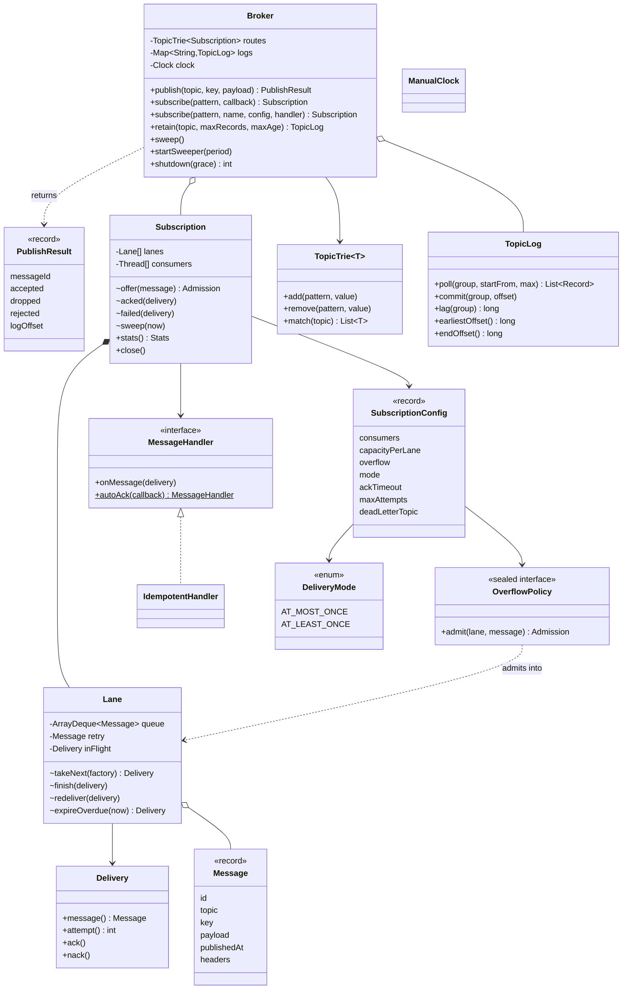

# LLD Interview: Design an In-Memory Pub-Sub / Message Broker

> "Design a pub-sub system inside one process: publishers send messages to topics, subscribers get callbacks. Then: a subscriber is slow, another crashes mid-message, a third runs four workers. Keep it correct."

Think of a tiny in-process Kafka, RabbitMQ or Google Pub/Sub. It looks like a 20-line Observer exercise and turns into a tour of the hard parts of messaging. L4 builds **topics, publish and subscribe with callbacks**, **fan-out** with a **queue and dispatcher thread per subscription** so a slow subscriber hurts nobody, plus unsubscribe and thread-safe routing. L5 adds **bounded queues with overflow policies** (block, drop newest, drop oldest, reject) as a Strategy, **acks** with **at-most-once vs at-least-once**, **ack deadlines and redelivery**, **max attempts → dead-letter topic**, **consumer groups** vs fan-out, **per-key ordering** and **idempotent consumers**. L6 is the **queue model vs the log model**: a **retained log with offsets** (replay, earliest/latest, retention), **wildcard topics** with a trie, **lag** metrics, **graceful shutdown**, what changes when it's **distributed**, and how to **test concurrent code** you can trust.

> 💡 **Terms in one line each** (details in the files):
> **Topic**: a named channel messages are published to. **Subscription**: one subscriber's registration with its own queue; each subscription gets every message. **Fan-out**: one message → one copy per subscription. **Observer**: an object that registers to be called back when something happens. **Dispatcher thread**: the thread that takes messages from a queue and calls the handler. **Back-pressure**: a slow consumer pushing back on a fast producer (or forcing a drop/reject decision). **Ack / nack**: "done, forget it" / "failed, redeliver". **Ack deadline**: how long the broker waits for an ack before redelivering. **At-least-once**: never lost, may be duplicated. **DLQ**: dead-letter queue, where messages go after too many failures. **Consumer group**: workers sharing one subscription's messages. **Lane**: one bounded queue inside a subscription, owned by one consumer thread (Kafka: a partition). **Idempotent**: doing it twice has the same effect as once. **Offset**: a message's position number in a retained log. **Lag**: how far behind a consumer is. **Trie**: a tree with one node per word, used here to match topic patterns.

## How to read this folder

> 👉 **Never used a broker, or only `@KafkaListener`? Start with [00-understand-the-product.md](00-understand-the-product.md).** It walks through one order event and five teams, shows real Redis `PUBLISH`/`SUBSCRIBE`, Node `EventEmitter` and Java `SubmissionPublisher` output, and explains why each feature exists.

| File | Level | What "good" looks like |
|---|---|---|
| [00-understand-the-product.md](00-understand-the-product.md) | Everyone, first | Know the features (topics, fan-out, isolation, bounded queues, acks, DLQ, idempotency, consumer groups, per-key order, replay, wildcards, lag, shutdown) and the situation each one comes from |
| [L4-mid.md](L4-mid.md) | Mid / SDE2 | Observer and why synchronous dispatch fails; a queue + dispatcher thread per subscription; thread-safe routing (`ConcurrentHashMap` + `CopyOnWriteArrayList` or a read-write lock); ordering stated precisely; handler exceptions don't kill the thread; unsubscribe; why unbounded queues are a trap |
| [L5-senior.md](L5-senior.md) | Senior | Overflow policies as a sealed Strategy with exact drop counts; BLOCK couples the publisher to the slowest subscriber; at-most-once vs at-least-once by where the ack happens; ack deadline + CAS + injected clock; max attempts → DLQ with headers; consumer groups vs fan-out (lanes vs shared queue); per-key order (hash → lane, one in flight, redelivery first) and its costs; idempotent consumers |
| [L6-staff.md](L6-staff.md) | Staff | Queue model vs log model; retained log with offsets, poll vs commit, earliest/latest, replay, retention and falling off the log; trie-based `*`/`#` routing; lag in seconds and alerting; graceful shutdown under SIGTERM; mapping to distributed Kafka (durability, ISR, rebalancing, idempotent producer); layered concurrency testing; build vs buy |

## Code (runnable, no dependencies)

| | Run | Files |
|---|---|---|
| ☕ Java 21 | `./java/run.sh` | [java/src/pubsub/](java/src/pubsub/): `Broker` (publish + fan-out, subscribe, `sweep`, `startSweeper`, `retain`, `shutdown`), `Subscription` (lanes, consumer threads, ack/redelivery/DLQ, stats), `Lane` (bounded queue, one in-flight delivery, retry slot, own lock), `OverflowPolicy` (sealed: `Block`, `DropNewest`, `DropOldest`, `Reject`), `Delivery` (ack/nack/expire with CAS, compare-and-set), `SubscriptionConfig`, `DeliveryMode`, `MessageHandler`, `Message`, `IdempotentHandler`, `TopicTrie` (`*` and `#`), `TopicLog` (offsets, poll/commit, lag, retention), `ManualClock`. 18 tests in `PubSubTests.java`; `Demo.java` |
| 🟨 Node 22 | `cd js && node --test` | [js/pubsub.js](js/pubsub.js), [js/pubsub.test.js](js/pubsub.test.js): the same broker on one event loop: async consumer loop per lane, `publish()` returns a Promise that resolves when there's room (Node's answer to "block"), handler Promise resolve = ack / reject = nack / no settle = ack timeout, retries → DLQ, `idempotent()` wrapper, wildcard matching. 10 tests |

**Design decisions in the code:** `publish` runs on the caller's thread but **never runs a handler**: it only offers the message to each matching subscription's lane. Each lane has **one consumer thread** and **at most one unacked delivery**, and a redelivery goes **before** newer messages, which is what makes per-key ordering survive retries. Handlers are always called **outside** the lane's lock. The overflow policy decides per subscription, and every drop/rejection is counted and reported in `PublishResult`. Ack deadlines are checked by a **sweep** (`Broker.sweep()`, run periodically by `startSweeper` or directly by tests) using an injected `Clock`, so no test sleeps for a timeout. Dead-lettering publishes to the DLQ topic **before** releasing the lane (worst case a duplicate, never a loss). The retained log is a separate, **pull-based** structure next to the push subscriptions, so both models can be compared on the same broker. Platform threads (one OS thread each) are used for clarity; virtual threads (cheap JVM-managed threads, Java 21) would be a one-word change.

**Tests:** fan-out to 3 subscribers in order (1,000 messages); a stuck subscriber blocks neither the publisher nor the other subscriber; unsubscribe; at-most-once handler exception loses only that message and the thread survives; **exact drop counts** for drop-newest (14 of 20), drop-oldest (keeps 0, 15-19) and reject (14 rejections returned); block waits then times out, and a waiting publisher gets in when space frees; **8 publishers × 5,000 into 3 subscriptions of capacity 8 under BLOCK: 0 lost, per-publisher order kept**; nack → redelivered → acked; **ack timeout at exactly 30 s (not at 29 s), twice, then DLQ with headers**, a late ack ignored; idempotent consumer: lost ack → redelivery → side effect once; **per-key order with 4 consumers, 40 keys × 500 from 8 publishers**, one consumer per key; **consumer group of 4 shares 10,000 messages with no duplicates** while a second subscription gets all; wildcard matching (trie and broker); log offsets, earliest/latest, poll-without-commit repeats, lag, replay; retention by count and age; graceful shutdown drains (and reports what it couldn't). The suite passed **30 sequential runs and 60 runs with 6 copies in parallel** (one test assertion that raced the consumer thread's start was found this way and fixed).

**Mutation checks** (each on a scratch copy, then deleted): removing ack-timeout redelivery fails the ack-timeout test; making `laneFor` ignore the key fails the per-key test (thousands of out-of-order arrivals); evicting the newest instead of the oldest fails the drop-oldest test; making BLOCK not wait fails the block test and, run alone, the 40,000-message concurrency test (publishes rejected); never dead-lettering fails the DLQ test; letting a lane hand out the next message while one is unacked fails the ack-timeout test (the next message overtakes the unacked one); removing the dedupe check fails the idempotency test (side effect 2×); ignoring retention by age fails the retention test. JS: ignoring the key, retrying never, evicting the newest, rejecting instead of blocking, and removing dedupe each fail at least one test.

Sample demo output (`./java/run.sh`, after the tests):

```
--- 1. Fan-out: every subscription gets its own copy; a stuck one hurts nobody ---
  email     got [order-1, order-2, order-3, order-4, order-5]
  analytics got [order-1] (stuck in its handler, 4 more waiting in its own queue)
  analytics unstuck, now has 5
--- 2. Back-pressure: queue of 3, handler stuck on message 0, then 1..7 published ---
  DropNewest   delivered [0, 1, 2, 3]  dropped=4 rejected(publisher told)=0
  DropOldest   delivered [0, 5, 6, 7]  dropped=4 rejected(publisher told)=0
  Reject       delivered [0, 1, 2, 3]  dropped=0 rejected(publisher told)=4
  Block        delivered [0, 1, 2, 3]  dropped=0 rejected(publisher told)=4
--- 3. At-least-once: a consumer that never acks (ack timeout 30 s, max 3 attempts) ---
  t=+0s delivered pay-42 attempt 1, no ack...
  t=+30s delivered pay-42 attempt 2, no ack...
  t=+60s delivered pay-42 attempt 3, no ack...
  DLQ received pay-42 after 3 attempts
--- 4. Consumer group of 3 with keys: one consumer per key, order kept per key ---
  parcel-A -> tracking-consumer-0 saw [packed, shipped, delivered]
  parcel-B -> tracking-consumer-1 saw [packed, shipped, delivered]
  parcel-C -> tracking-consumer-2 saw [packed, shipped, delivered]
  parcel-D -> tracking-consumer-0 saw [packed, shipped, delivered]
--- 5. The log model: retained, replayable, offsets per group ---
  billing polled offsets [0, 1, 2], commits 3, lag 2
  new group 'fraud' from EARLIEST reads 5 records (history is still there)
  billing replays from offset 0: 5 records
--- 6. Graceful shutdown ---
  unfinished messages at shutdown: 0
```

(In section 2, `Block` waits 20 ms per message for space, then rejects: the publisher is told, nothing vanishes silently.)

## Class diagram (matches the code)



## Libraries & concepts used

**Java:** [BlockingQueue & producer-consumer](../../libraries/java/blocking-queues-and-producer-consumer.md) · [Locks & synchronized](../../libraries/java/locks-and-synchronized.md) · [Atomics & CAS](../../libraries/java/atomics-and-cas.md) · [Concurrent collections](../../libraries/java/concurrent-collections.md) · [ConcurrentHashMap](../../libraries/java/concurrent-hashmap.md) · [Executors & threads](../../libraries/java/executors-and-threads.md) · [ScheduledExecutorService](../../libraries/java/scheduled-executor-service.md) · [Time & Clock](../../libraries/java/time-and-clock.md) · [Records & immutability](../../libraries/java/records-and-immutability.md) · [Sealed interfaces & pattern matching](../../libraries/java/sealed-interfaces-and-pattern-matching.md) · [LinkedHashMap](../../libraries/java/linkedhashmap.md)

**JS:** [Event loop & concurrency](../../libraries/js/event-loop-and-concurrency.md) · [async/await & timers](../../libraries/js/async-await-and-timers.md) · [Classes & private fields](../../libraries/js/classes-and-private-fields.md) · [node:test runner](../../libraries/js/node-test-runner.md)

**Concepts:** [Observer & event dispatch](../../concepts/observer-and-event-dispatch.md) · [Back-pressure](../../concepts/back-pressure.md) · [Design patterns](../../concepts/design-patterns.md) · [Thread-safety basics](../../concepts/thread-safety-basics.md) · [Virtual threads](../../concepts/virtual-threads.md) · [Timers, delay queues & timing wheels](../../concepts/timers-delay-queues-and-timing-wheels.md) · [Single-writer principle](../../concepts/single-writer-principle.md) · [Durability, WAL & snapshots](../../concepts/durability-wal-and-snapshots.md) · [UML class diagrams](../../concepts/uml-class-diagrams.md)

**Related (HLD):** [Distributed Message Queue](../../../HLD/interviews/distributed-message-queue/README.md) (the same ideas as a distributed system: segments, replication, consumer groups) · [Kafka](../../../HLD/technologies/kafka.md) · [Pub/Sub](../../../HLD/technologies/pub-sub.md) · [Message queues](../../../HLD/technologies/message-queues.md) · [Idempotency & delivery semantics](../../../HLD/concepts/idempotency-and-delivery-semantics.md) · [Retries, backoff & DLQ](../../../HLD/concepts/retries-backoff-and-dlq.md) · [Message ordering](../../../HLD/concepts/message-ordering-and-sequencing.md) · [Fan-out](../../../HLD/concepts/fan-out.md) · [Tries & prefix search](../../../HLD/concepts/tries-and-prefix-search.md)

**Related LLD interviews:** [Logging framework](../logging-framework/README.md) (async appender: one bounded queue, one consumer, drop policies) · [Thread pool](../thread-pool/README.md) (producer-consumer, rejection policies, workers surviving exceptions) · [Task scheduler](../task-scheduler/README.md) (retries with dead letters, testable time) · [Parking lot](../parking-lot/README.md) (Observer for display boards, the synchronous version)

## The core insight

1. **Decouple with a queue per subscriber, then bound it.** The Observer pattern is the right idea and the wrong execution model: calling subscribers on the publisher's thread makes everyone as slow and as fragile as the worst subscriber. A queue and a thread per subscription isolate them; a bound plus an explicit overflow policy turns "out of memory at 3 a.m." into a decision you made and a counter you can alert on.
2. **The guarantee lives where you mark a message done.** Done when handed out is at-most-once; done on ack is at-least-once, with redelivery on nack or a missed deadline, a DLQ for poison messages, and idempotent consumers to make duplicates harmless. Per-key order needs the same key in the same lane **and** one unacked message per lane.
3. **Queue or log is the real design decision.** Deleting on ack (queue) gives per-message retry and DLQs; keeping a log with offsets gives replay, cheap extra consumers and a single global order per topic. Kafka chose the log; in-process, you can have both, and the tests (with injected time, state-based waits and mutation checks) prove each guarantee rather than hoping for it.
