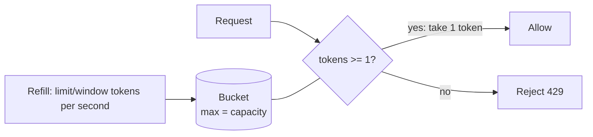

# Rate Limiter — L4 (Mid-level / SDE2) LLD Interview

> **Level expectation:** clarify, design a clean interface, implement **one** algorithm correctly, make it thread-safe, support many users, and show it's testable. Know that other algorithms exist and roughly how they differ.

Legend: **🧑‍💼 Interviewer** · **🧑‍💻 Candidate** · **📝 Note** = commentary for you.

---

## 1. Clarifying requirements

**🧑‍💼 Interviewer:** Design and implement a rate limiter.

**🧑‍💻 Candidate:** A few questions first:
- Is this **in-process** (a class inside one service) or a **distributed** service shared by many servers?
- Limit per what — user, IP, API key?
- What should happen on limit — reject, or queue/delay the request?
- One fixed limit, or different limits for different users?

**🧑‍💼 Interviewer:** In-process, a library class. Per user ID. Reject immediately. Start with one limit for everyone — say 10 requests per second.

**🧑‍💻 Candidate:** So:
- **Functional:** `tryAcquire(userId)` returns `true` (allowed) or `false` (rejected, caller returns HTTP 429). Each user is limited independently.
- **Non-functional:** fast (called on *every* request, so microseconds, no I/O); **thread-safe** (a web server calls it from many threads at once); memory-bounded-ish.

> 📝 **Note:** "In-process vs distributed" is the most important clarifying question. It decides whether this is an LLD problem (classes, concurrency) or an HLD problem (Redis, network). Asking it shows you know both exist.

---

## 2. Core entities

**🧑‍💻 Candidate:**
- `RateLimiter` — limits **one** client. Interface with `tryAcquire()`.
- `TokenBucketLimiter` — the algorithm implementation.
- `KeyedRateLimiter` — holds one `RateLimiter` per user.
- `RateLimitConfig` — limit + window.
- `TimeSource` — where "now" comes from (so tests can fake time).

---

## 3. Choosing an algorithm

**🧑‍💻 Candidate:** The common ones are token bucket, fixed window, sliding window log, and sliding window counter (compared in [README](README.md#the-4-algorithms-in-one-table)). I'll implement **token bucket**:



- A bucket holds up to `capacity` tokens (10).
- Tokens refill at a steady rate (10 per second).
- Each request takes one token; no token → reject.
- It allows a short **burst** (a user idle for a while can do 10 requests instantly), then settles to the steady rate. That's usually what you want for APIs.

**🧑‍💼 Interviewer:** How does the refill work — a background thread adding tokens?

**🧑‍💻 Candidate:** No — with a million users that's a million timers. Instead, **lazy refill**: store `lastRefillTime`. On each request, compute `elapsed × rate` tokens that *would have* been added, cap at capacity, then decide. O(1), no threads.

> 📝 **Note:** "Lazy refill" is the key insight interviewers look for in token bucket. More on schedulers vs lazy computation: [ScheduledExecutorService](../../libraries/java/scheduled-executor-service.md).

---

## 4. Code

### Interface

```java
public interface RateLimiter {
    boolean tryAcquire();
}
```

### Token bucket — full code: [TokenBucketLimiter.java](java/src/ratelimiter/TokenBucketLimiter.java)

```java
public final class TokenBucketLimiter implements RateLimiter {
    private final double capacity;
    private final double tokensPerNano;
    private final TimeSource time;

    private double tokens;          // guarded by "this"
    private long lastRefillNanos;   // guarded by "this"

    public TokenBucketLimiter(RateLimitConfig config, TimeSource time) {
        this.capacity = config.limit();
        this.tokensPerNano = (double) config.limit() / config.window().toNanos();
        this.time = time;
        this.tokens = capacity;
        this.lastRefillNanos = time.nanoTime();
    }

    @Override
    public synchronized boolean tryAcquire() {
        refill();
        if (tokens >= 1) {
            tokens -= 1;
            return true;
        }
        return false;
    }

    private void refill() {
        long now = time.nanoTime();
        long elapsed = now - lastRefillNanos;
        if (elapsed > 0) {
            tokens = Math.min(capacity, tokens + elapsed * tokensPerNano);
            lastRefillNanos = now;
        }
    }
}
```

**🧑‍💼 Interviewer:** Why `synchronized`?

**🧑‍💻 Candidate:** `tryAcquire` reads `tokens`, decides, then writes `tokens`. If two threads both read `tokens = 1`, both see "≥ 1", both decrement → two requests allowed with one token. That's a **check-then-act race** ([thread-safety basics](../../concepts/thread-safety-basics.md)). `synchronized` makes the read-decide-write one indivisible step per bucket. The lock is **per bucket**, so different users never block each other.

**🧑‍💼 Interviewer:** Why `nanoTime` and not `currentTimeMillis`?

**🧑‍💻 Candidate:** `currentTimeMillis` is wall-clock time — it can jump backwards when NTP corrects the clock, which could give negative elapsed time or a sudden flood of tokens. `nanoTime` is **monotonic** — made for measuring intervals. See [time & clock](../../libraries/java/time-and-clock.md).

### Many users — [KeyedRateLimiter.java](java/src/ratelimiter/KeyedRateLimiter.java) (simplified)

```java
public final class KeyedRateLimiter {
    private final Map<String, RateLimiter> limiters = new ConcurrentHashMap<>();
    private final RateLimitConfig config;
    private final TimeSource time;

    public boolean tryAcquire(String userId) {
        RateLimiter rl = limiters.computeIfAbsent(userId, id -> new TokenBucketLimiter(config, time));
        return rl.tryAcquire();
    }
}
```

**🧑‍💼 Interviewer:** Why `ConcurrentHashMap` and `computeIfAbsent`? Why not `HashMap` with `get` then `put`?

**🧑‍💻 Candidate:**
1. `HashMap` isn't thread-safe at all — concurrent `put`s can corrupt it.
2. Even with a thread-safe map, `get` → null → `put(new bucket)` is another check-then-act race: two threads both see null, both create a bucket, one overwrites the other, and the user effectively gets **two** buckets' worth of requests.
3. `computeIfAbsent` on `ConcurrentHashMap` is **atomic** per key: exactly one bucket is created.

Details: [ConcurrentHashMap](../../libraries/java/concurrent-hashmap.md).

### Testability — inject the clock

```java
public interface TimeSource {
    long nanoTime();
    TimeSource SYSTEM = System::nanoTime;
}
```

```java
FakeTimeSource clock = new FakeTimeSource();
RateLimiter rl = new TokenBucketLimiter(RateLimitConfig.of(TOKEN_BUCKET, 10, Duration.ofSeconds(1)), clock);

assertEquals(10, countAllowed(rl, 20));     // burst of 10
clock.advance(Duration.ofMillis(100));      // 0.1 s × 10/s = 1 token
assertEquals(1, countAllowed(rl, 5));
```

No `Thread.sleep` — tests are instant and deterministic. Full tests: [RateLimiterTests.java](java/src/ratelimiter/RateLimiterTests.java).

---

## 5. Follow-ups

**🧑‍💼 Interviewer:** How would a fixed window differ?

**🧑‍💻 Candidate:** Count requests per calendar window (e.g. per second), reset at the boundary. Simpler, but a user can send 10 at 0.999 s and 10 at 1.001 s — **20 requests in 2 ms** with a 10/s limit. Token bucket doesn't have this edge problem as badly because tokens refill gradually. (The test `fixedWindowAllowsDoubleBurstAtBoundary` demonstrates this.)

**🧑‍💼 Interviewer:** What happens to memory with millions of users?

**🧑‍💻 Candidate:** The map grows forever — users who visited once keep a bucket. Need eviction: track last access and periodically remove idle entries (the full `KeyedRateLimiter` does this), or use a cache library with expiry like Caffeine.

**🧑‍💼 Interviewer:** How would the web layer use this?

**🧑‍💻 Candidate:** In a servlet filter / Spring `HandlerInterceptor` (or [Express middleware](../../libraries/js/express-middleware.md) in Node): extract user ID, call `tryAcquire`, return `429 Too Many Requests` with a `Retry-After` header if false.

**🧑‍💼 Interviewer:** Same thing in JavaScript — do you need `synchronized`?

**🧑‍💻 Candidate:** No. Node runs JS on a single thread, and `tryAcquire` has no `await` inside, so it can't be interrupted halfway. A plain `Map` is enough. ([event loop](../../libraries/js/event-loop-and-concurrency.md), code: [js/rateLimiters.js](js/rateLimiters.js).)

---

## 6. What the interviewer was evaluating (L4)

- [ ] Asked in-process vs distributed, key, and behaviour on limit
- [ ] Small, clean interface
- [ ] One algorithm implemented **correctly** (lazy refill, cap at capacity)
- [ ] Identified the race condition and fixed it with appropriate granularity (per bucket, not global)
- [ ] `ConcurrentHashMap.computeIfAbsent`, and could explain why
- [ ] Injected time for tests
- [ ] Knew other algorithms exist and the fixed-window edge problem

## 7. Common mistakes at this level

| Mistake | Why it's wrong |
|---|---|
| A background thread per user to add tokens | Doesn't scale; lazy refill is O(1) with no threads |
| `synchronized` on the whole `KeyedRateLimiter` | One global lock — every user's request waits on every other user's |
| `HashMap` + `get`/`put` | Not thread-safe; duplicate buckets |
| `System.currentTimeMillis()` for intervals | Wall clock can jump; use `nanoTime` |
| Tests using `Thread.sleep(1000)` | Slow and flaky; inject a clock |
| Starting to code before agreeing on in-process vs distributed | May solve the wrong problem |

➡️ Next: [L5-senior.md](L5-senior.md)
