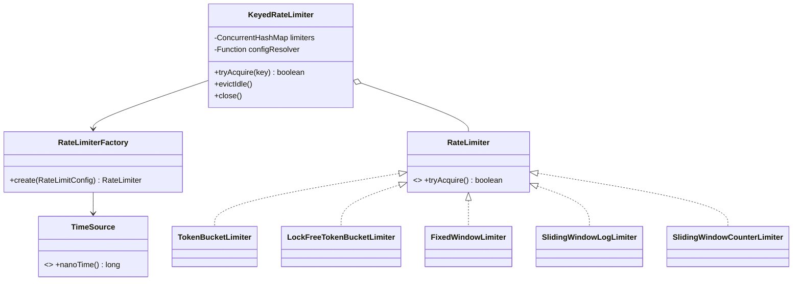

# Rate Limiter — L5 (Senior) LLD Interview

> **Level expectation:** you don't just make one algorithm work — you design a small **extensible library**: pluggable algorithms, per-tier configs, bounded memory, and a reasoned stance on concurrency (locks vs lock-free). You prove correctness under contention with tests. Read [L4-mid.md](L4-mid.md) first; this file covers what's new.

Legend: **🧑‍💼 Interviewer** · **🧑‍💻 Candidate** · **📝 Note** = commentary for you.

---

## 1. Requirements

**🧑‍💻 Candidate:** Proposing scope (in-process library, used by several services in our org):

- `tryAcquire(key)`; key can be user ID, API key, IP — caller decides.
- **Multiple algorithms**, chosen by config — different endpoints need different behaviour (login: exact; public API: bursty is fine).
- **Tiers:** free = 100/min, premium = 10,000/min. Config resolved per key.
- **Bounded memory:** idle keys evicted.
- **Thread-safe, low overhead:** < 1 µs uncontended; no global lock.
- **Testable** without sleeping.
- Out of scope for now: distributed limiting (that's the [L6 discussion](L6-staff.md)), but the interface must not prevent it.

> 📝 **Note:** "The interface must not prevent distributed later" is a senior instinct: design for the next requirement without building it.

---

## 2. Design



**🧑‍💻 Candidate:** Patterns, and why each earns its place ([design patterns](../../concepts/design-patterns.md)):

| Pattern | Where | Why |
|---|---|---|
| **Strategy** | `RateLimiter` interface + 5 implementations | Swap algorithm per endpoint without changing callers (Open/Closed — [SOLID](../../concepts/solid-principles.md)) |
| **Factory** | `RateLimiterFactory.create(config)` | Callers never `new` a concrete class; adding an algorithm touches the enum + factory only |
| **Dependency injection** | `TimeSource` passed in | Tests control time; production uses `System::nanoTime` |

**🧑‍💻 Candidate:** I deliberately *didn't* add: a Singleton (makes testing hard; let the app's DI container own one instance), an abstract base class for "window" algorithms (they share ~3 lines; inheritance would couple them for nothing), or a Builder for a 3-field record.

> 📝 **Note:** Saying what you **didn't** add and why is a strong senior signal. Pattern-stuffing is a common L4→L5 trap.

### Config & tiers

```java
public record RateLimitConfig(Algorithm algorithm, long limit, Duration window) { /* validates in compact constructor */ }

KeyedRateLimiter limiter = new KeyedRateLimiter(
    key -> tierOf(key) == PREMIUM
            ? RateLimitConfig.of(TOKEN_BUCKET, 10_000, Duration.ofMinutes(1))
            : RateLimitConfig.of(TOKEN_BUCKET, 100, Duration.ofMinutes(1)),
    new RateLimiterFactory(TimeSource.SYSTEM),
    TimeSource.SYSTEM,
    Duration.ofMinutes(10),   // idle eviction
    true);
```

The resolver is a `Function<String, RateLimitConfig>` — callers plug in a DB lookup, a config file, a feature flag. The limiter doesn't care. ([KeyedRateLimiter.java](java/src/ratelimiter/KeyedRateLimiter.java))

---

## 3. Deep dive: the four algorithms

All code in [java/src/ratelimiter/](java/src/ratelimiter/). Visualising a limit of 5/second:

```text
limit = 5 per second
time (ms):      0 ............ 900 ... 999 | 1000 ... 1100 ............ 2000
Fixed window:   [ window 1          █████ ] [ █████     window 2           ]
                                    └── 10 requests within ~200 ms ──┘   ⚠ 2× the limit
Sliding window: any 1-second span, wherever you place it, contains at most 5  ✅
```

### Fixed window — [FixedWindowLimiter.java](java/src/ratelimiter/FixedWindowLimiter.java)
`windowIndex = floorDiv(now, windowNanos)`; reset count when the index changes. Two fields. **Edge burst up to 2× limit.**

### Sliding window log — [SlidingWindowLogLimiter.java](java/src/ratelimiter/SlidingWindowLogLimiter.java)
Deque of timestamps; drop those older than `now - window`; allow if `size < limit`. **Exact**, but memory is O(limit) per key: 10,000/hour × 1M users × 8 bytes = 80 GB. Fine for "5 login attempts per 15 min", absurd for high limits.

### Sliding window counter — [SlidingWindowCounterLimiter.java](java/src/ratelimiter/SlidingWindowCounterLimiter.java)
```text
estimate = previousWindowCount × (1 − elapsedFractionOfCurrentWindow) + currentWindowCount
```
E.g. limit 10/s, previous window had 10, we're 25% into the current window → estimate = 10 × 0.75 + current. Only ~2.5 more allowed. Three numbers of state, near-exact (assumes the previous window's traffic was evenly spread).

### Token bucket — [TokenBucketLimiter.java](java/src/ratelimiter/TokenBucketLimiter.java)
Covered in L4. Two params in reality — **capacity** (burst) and **refill rate** — which my config collapses into one (`limit` per `window`). A real API would expose both: "100/min sustained, bursts up to 20".

**🧑‍💼 Interviewer:** Which would you choose as the default?

**🧑‍💻 Candidate:** **Token bucket** for API traffic — bursts are natural (a page load fires 10 calls) and it's what clients expect from AWS/Stripe-style APIs. **Sliding window log** for security-sensitive low limits (login, OTP). **Sliding window counter** when product says "no bursts" at high volume. Fixed window only for coarse quotas (daily/monthly) where the edge doesn't matter.

---

## 4. Deep dive: concurrency

### Option 1 — `synchronized` per limiter (what most implementations use)

Each limiter instance is its own lock. Different keys never contend. Uncontended `synchronized` is ~20 ns on modern JVMs. **This is the right default.** ([locks & synchronized](../../libraries/java/locks-and-synchronized.md))

### Option 2 — lock-free CAS — [LockFreeTokenBucketLimiter.java](java/src/ratelimiter/LockFreeTokenBucketLimiter.java)

```java
private record State(double tokens, long lastRefillNanos) {}
private final AtomicReference<State> state;

public boolean tryAcquire() {
    while (true) {
        State current = state.get();
        long now = time.nanoTime();
        double refilled = Math.min(capacity, current.tokens() + Math.max(0, now - current.lastRefillNanos()) * tokensPerNano);
        if (refilled < 1) return false;
        State next = new State(refilled - 1, Math.max(now, current.lastRefillNanos()));
        if (state.compareAndSet(current, next)) return true;   // else someone else won: retry
    }
}
```

The two fields must change *together*, so they're bundled in one immutable record and swapped with one CAS. ([atomics & CAS](../../libraries/java/atomics-and-cas.md))

**🧑‍💼 Interviewer:** So is lock-free better?

**🧑‍💻 Candidate:** Only in a narrow case: **many threads hammering the same key** (e.g. one huge tenant, or a global limit). There it avoids threads parking. Otherwise it's more complex, allocates a record per call, and under extreme contention CAS retries can spin. I'd ship `synchronized`, keep the CAS version behind the same interface, and switch only if a profiler shows contention. *The interface makes that a one-line config change.*

One subtle line: `Math.max(now, current.lastRefillNanos())`. Two threads can read `nanoTime` in one order and CAS in the other; without the `max`, `lastRefill` could move backwards and grant extra tokens.

### Proving it — a contention test

```java
// 32 threads × 500 calls = 16,000 attempts against a limit of 1,000, time frozen.
// Exactly 1,000 must pass — not 999, not 1,001.
CountDownLatch start = new CountDownLatch(1);   // release all threads together to maximise overlap
...
assertEquals(1_000, allowed.get());
```

Runs for **all five** algorithms ([RateLimiterTests.java](java/src/ratelimiter/RateLimiterTests.java)). Try deleting `synchronized` from a limiter and re-running: the count will usually come out above 1,000. (Race bugs are probabilistic — a test passing once proves little, which is why it uses 32 threads and a latch to maximise overlap.)

> 📝 **Note:** Freezing time with `FakeTimeSource` makes the expected answer exact. With a real clock, tokens would refill during the test and you could only assert "≤ something".

---

## 5. Deep dive: memory — evicting idle keys

```java
private static final class Entry {
    final RateLimiter limiter;
    volatile long lastAccessNanos;   // written by request threads, read by the evictor thread
}

evictor.scheduleWithFixedDelay(this::evictIdleSafely, period, period, MILLISECONDS);

public void evictIdle() {
    long now = time.nanoTime();
    limiters.entrySet().removeIf(e -> now - e.getValue().lastAccessNanos > idleTimeoutNanos);
}
```

Details worth saying out loud:
- **`volatile`** — without it, the evictor thread may never see updates made by request threads (visibility, [thread-safety basics](../../concepts/thread-safety-basics.md)).
- **`scheduleWithFixedDelay`**, not `AtFixedRate` — if a sweep is slow, don't queue up back-to-back sweeps.
- **Catch exceptions** in the scheduled task — an uncaught exception silently cancels all future runs. ([ScheduledExecutorService](../../libraries/java/scheduled-executor-service.md))
- **Daemon thread + `AutoCloseable`** — doesn't block JVM shutdown; tests can close it.

**🧑‍💼 Interviewer:** Is there a race between eviction and `tryAcquire`?

**🧑‍💻 Candidate:** Yes, a benign one. Thread A gets the entry via `computeIfAbsent`; the evictor removes it (it was idle); A uses the now-orphaned limiter; the *next* request creates a fresh, **full** bucket. Worst case, a client that was idle for 10 minutes gets one extra burst — but an idle-for-10-minutes client would have a full bucket anyway. So the race is harmless for token bucket. I'd document it rather than add locking. If it mattered, use `compute()` to re-check idleness atomically per key, or use Caffeine's `expireAfterAccess`, which handles it internally.

**🧑‍💼 Interviewer:** Why not just use Caffeine?

**🧑‍💻 Candidate:** In production I would — and honestly I'd use [Bucket4j or Resilience4j](../../libraries/java/production-rate-limit-libraries.md) instead of writing the algorithms at all. In the interview I wrote it to show I understand what those libraries do.

---

## 6. Extensions the interviewer may ask for

**🧑‍💼 Interviewer:** Clients want to know how many requests they have left.

**🧑‍💻 Candidate:** Change the return type from `boolean` to a result:
```java
public record Decision(boolean allowed, long remaining, Duration retryAfter) {}
```
Map it to headers: `RateLimit-Remaining`, `Retry-After`. For token bucket, `retryAfter = (1 − tokens) / rate`. I'd add it as a new method (`tryAcquireWithInfo`) with `tryAcquire()` as a default method delegating to it, so existing implementations and callers don't break.

**🧑‍💼 Interviewer:** "10 per second AND 1,000 per day."

**🧑‍💻 Candidate:** A `CompositeRateLimiter` holding a list of limiters, allowing only if **all** allow. Careful: if the per-second limiter allows but the daily one rejects, we already consumed a per-second token. Options: check all with a "peek" first then consume, or accept the slight under-count. (This is the Composite pattern.)

**🧑‍💼 Interviewer:** Cost of a request varies — a search costs 5, a read costs 1.

**🧑‍💻 Candidate:** `tryAcquire(int permits)` — token bucket handles it naturally (`tokens >= permits`). Default `tryAcquire()` calls `tryAcquire(1)`.

---

## 7. JavaScript version

[js/rateLimiters.js](js/rateLimiters.js) mirrors the Java design (factory + 4 classes + keyed `Map`). Differences worth knowing:
- **No locks:** single-threaded event loop; `tryAcquire` has no `await`. ([event loop](../../libraries/js/event-loop-and-concurrency.md))
- **But** the moment the state moves to a remote store, `read → await → write` races again — the test `the one race Node CAN have` reproduces it.
- `performance.now()` as the monotonic clock; `setInterval(...).unref()` for eviction so the process can exit.
- `Map`, not a plain object, for the registry ([Map vs Object](../../libraries/js/map-vs-object.md)).
- Plugged into HTTP via [middleware](../../libraries/js/express-middleware.md) — [middleware.js](js/middleware.js), [server.js](js/server.js).

---

## 8. What the interviewer was evaluating (L5)

- [ ] Scoped requirements including tiers, memory, and future distribution
- [ ] Strategy + Factory used **for a reason**; avoided unnecessary patterns
- [ ] Implemented and compared multiple algorithms; recommended per use case
- [ ] Concurrency: per-limiter locking as default; understood when CAS helps; the `max(now, last)` subtlety
- [ ] A contention test with an **exact** expected result
- [ ] Bounded memory: eviction with `volatile`, safe scheduling, and an honest analysis of the eviction race
- [ ] Extended the API without breaking callers
- [ ] Knew to use Bucket4j/Resilience4j in production

## 9. Common mistakes at this level

| Mistake | Why it hurts at L5 |
|---|---|
| Abstract base class + 3 layers of inheritance for 4 small algorithms | Over-engineering; composition/interface is enough |
| Making everything lock-free "for performance" with no measurement | Complexity without evidence |
| Two separate `AtomicLong`s for tokens and timestamp | Each is atomic, but the *pair* isn't — still a race |
| Eviction task that can die silently | Memory leak in production weeks later |
| No concurrency test, or one that only asserts "≤ limit" | Doesn't prove correctness |
| Changing the interface signature for a new feature | Breaks every caller; add a default method instead |

⬅️ Previous: [L4-mid.md](L4-mid.md) · ➡️ Next: [L6-staff.md](L6-staff.md)
