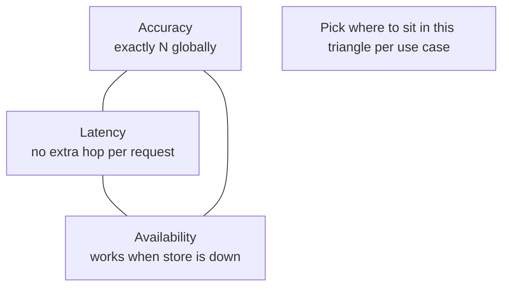
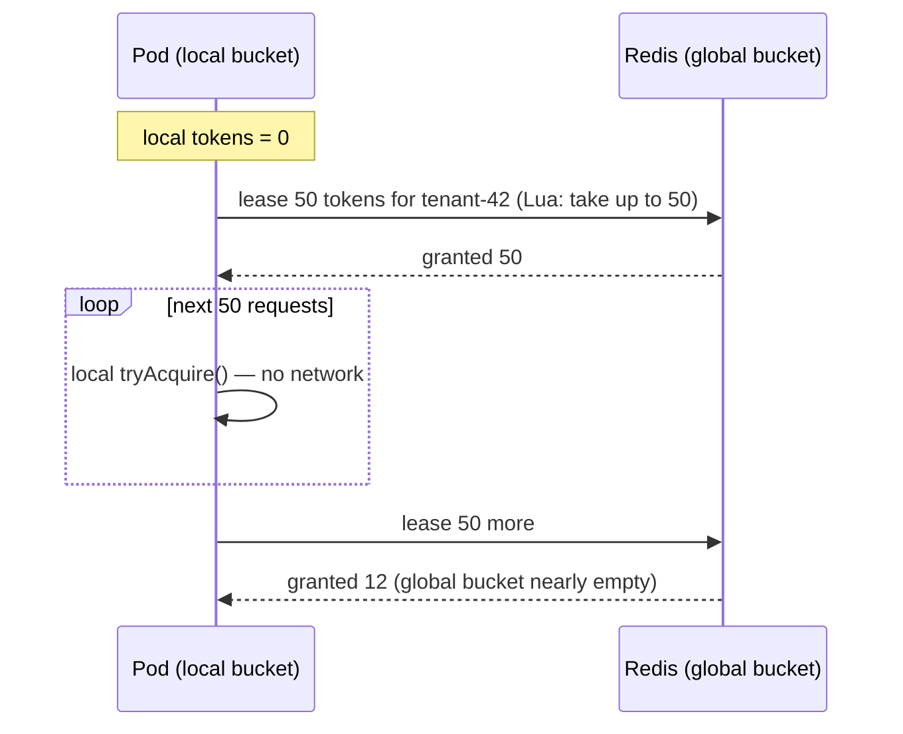
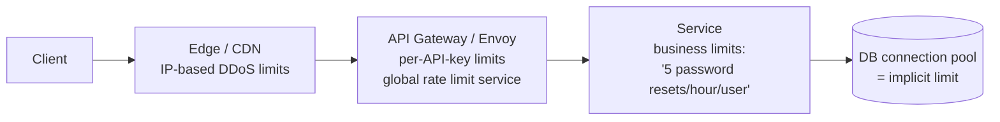

# Rate Limiter — L6 (Staff) LLD Interview

> **Level expectation:** the in-process design (L5) is done in the first ~15 minutes. Then the interviewer says *"we run 50 instances of this service"* and the real interview starts: distributed correctness, the latency/accuracy/availability triangle, failure policy, where in the stack the limiter belongs, and how to roll it out as a **platform** other teams depend on. Still code-focused: you should be able to write the atomic Redis script. Read [L5-senior.md](L5-senior.md) first.

Legend: **🧑‍💼 Interviewer** · **🧑‍💻 Candidate** · **📝 Note** = commentary for you.

---

## 1. The twist

**🧑‍💼 Interviewer:** Nice. Now — our API runs on 50 pods behind a load balancer. A customer's limit is 1,000 requests/minute *total*. Does your design still work?

**🧑‍💻 Candidate:** No. Each pod has its own in-memory buckets, so the customer effectively gets **50 × 1,000**. Before choosing a fix I want to know three things, because they pull in different directions:

1. **How exact must it be?** Is 1,100 instead of 1,000 a problem? Billing/contractual limits → yes. Abuse protection → no.
2. **Latency budget?** Adding a network hop to *every* request costs ~0.5–1 ms.
3. **What happens when the limiter's backing store is down?** Allow everything, or reject everything?



> 📝 **Note:** The staff move is refusing to give one answer before knowing which corner of this triangle matters. Different limits in the same company sit in different corners.

**🧑‍💼 Interviewer:** It's for protecting our backend from abusive tenants. ~5% over is fine. p99 overhead under 2 ms.

---

## 2. Options

| Approach | How | Accuracy | Latency | Availability | Use when |
|---|---|---|---|---|---|
| **A. Local only, limit ÷ N** | Each pod enforces 1000/50 = 20/min | Poor: uneven LB distribution, autoscaling changes N | Best (0 hops) | Best | Rough protection, stable fleet |
| **B. Sticky routing** | LB routes each tenant to the same pod (consistent hash on tenant ID) | Good | Best | Pod loss resets counters; hot tenant → hot pod | Gateway already does key-based routing |
| **C. Central store (Redis), every request** | Atomic check in Redis | Exact | +1 RTT (~0.5 ms) | Depends on Redis | Billing / strict limits |
| **D. Hybrid: local + leased tokens** | Pod leases batches of tokens from Redis, spends locally | Near-exact (bounded by batch size) | ~0 for most requests | Survives short outages | High-QPS tenants |

**🧑‍💻 Candidate:** For this requirement I'd do **C as the baseline**, with **D for the few very high-volume tenants**. Let me build C properly, because it's where people get the code wrong.

---

## 3. Central Redis limiter — and the classic bug

### The wrong way

```java
long count = redis.get(key);          // 1. read
if (count < limit) {                  // 2. decide
    redis.incr(key);                  // 3. write
    return true;
}
return false;
```

**🧑‍💻 Candidate:** It's the same check-then-act race from L4 — just across processes instead of threads. 50 pods read `999` simultaneously, all allow. Java's `synchronized` can't help: the threads are in different JVMs. (The JS test [`the one race Node CAN have`](js/rateLimiters.test.js) reproduces exactly this with an `await` between read and write.)

**Fix: make read-decide-write one atomic operation *inside Redis*.** Redis executes each command — and each Lua script — atomically, single-threaded. ([Redis](../../../HLD/technologies/redis.md))

### Fixed window — one command is enough

```text
count = INCR  rl:{tenant}:{currentMinute}
if count == 1: EXPIRE rl:{tenant}:{currentMinute} 60
allow if count <= limit
```

`INCR` is atomic, so no race. (Small gap: if the pod dies between `INCR` and `EXPIRE`, the key never expires — use a Lua script or `SET key 0 EX 60 NX` first.)

### Token bucket — Lua script

```lua
-- KEYS[1] = bucket key, e.g. "rl:tb:{tenant-42}"
-- ARGV[1] = capacity, ARGV[2] = refill rate (tokens per ms), ARGV[3] = permits requested
local capacity = tonumber(ARGV[1])
local rate     = tonumber(ARGV[2])
local want     = tonumber(ARGV[3])

-- Use Redis' clock, not the caller's: 50 pods' clocks are never perfectly in sync.
local t   = redis.call('TIME')
local now = tonumber(t[1]) * 1000 + math.floor(tonumber(t[2]) / 1000)

local state  = redis.call('HMGET', KEYS[1], 'tokens', 'ts')
local tokens = tonumber(state[1]) or capacity
local ts     = tonumber(state[2]) or now

tokens = math.min(capacity, tokens + math.max(0, now - ts) * rate)

local allowed = 0
if tokens >= want then
  tokens  = tokens - want
  allowed = 1
end

redis.call('HSET', KEYS[1], 'tokens', tokens, 'ts', now)
-- Idle buckets clean themselves up: after (time to refill fully) × 2 the key expires.
redis.call('PEXPIRE', KEYS[1], math.ceil(capacity / rate) * 2)

return { allowed, tostring(tokens) }
```

It's the *same algorithm* as [TokenBucketLimiter.java](java/src/ratelimiter/TokenBucketLimiter.java) — the only change is **where the atomicity comes from** (Redis's single thread instead of `synchronized`) and **where time comes from** (`TIME` instead of `nanoTime`). The Java side becomes:

```java
public final class RedisTokenBucketLimiter implements RateLimiter {   // same interface as L5!
    public boolean tryAcquire() {
        List<?> r = redis.evalsha(scriptSha, List.of(key), List.of(capacity, ratePerMs, "1"));
        return ((Long) r.get(0)) == 1L;
    }
}
```

Callers don't change at all — that's the payoff of the L5 interface.

**Details a staff engineer should mention:**
- **Redis Cluster:** a script may only touch keys in one hash slot. Use a hash tag `{tenant-42}` in the key so related keys co-locate.
- **`EVALSHA`** with the script loaded once, not `EVAL` with the source on every call.
- **Pipelining / batching** isn't possible for one request's decision, so RTT matters → co-locate Redis in the same AZ; ~0.3–0.5 ms.
- **Hot tenant → hot shard.** One tenant at 50k req/s means one Redis key at 50k ops/s. Redis does ~100k ops/s per shard, so that's half a node on one key. → This is what option D solves.

---

## 4. Hybrid: leased tokens (option D)



- Redis calls drop by the batch size (50×).
- **Over-admission is bounded:** at worst, every pod holds an unspent lease → `pods × batch` extra = 50 × 50 = 2,500. If that's too much for small tenants, make batch size proportional to the tenant's limit (e.g. limit / pods / 10), and use plain option C for small tenants.
- Leases expire (e.g. 1 s), so a dead pod's unspent tokens return.

---

## 5. Failure policy — decide it explicitly

**🧑‍💼 Interviewer:** Redis is down. What happens?

**🧑‍💻 Candidate:** There's no universally right answer, so the library must make it **configurable per rule**, with a documented default:

| Limit's purpose | On store failure | Why |
|---|---|---|
| Protect backend from overload | **Fail open** + fall back to local limiter (limit ÷ N) | Rejecting all traffic because the *limiter* is down turns a minor outage into a total one |
| Security (login attempts, OTP) | **Fail closed** | Brute-force protection off = real risk |
| Billing quotas | Fail open, reconcile later from logs | Customer impact > a few free requests |

And mechanically:
- **Timeout ~5 ms** on the Redis call. A limiter that waits 1 s for a dead Redis *is* the outage.
- **Circuit breaker:** after N failures, stop calling Redis for 10 s and use the fallback directly — don't hammer a struggling Redis.
- **Metric + alert** on fallback mode; it shouldn't be silent.

> 📝 **Note:** With your infra background, this is where you shine: timeouts, circuit breakers, and "the limiter must never be the cause of the outage" are exactly the instincts staff interviewers look for.

---

## 6. Where should the limiter live?

**🧑‍💻 Candidate:** Before building a library, I'd ask whether the application should be doing this at all.



| Layer | Knows | Good for |
|---|---|---|
| Edge / CDN / WAF | IP, path | Volumetric abuse, cheap rejection before it costs us anything |
| Gateway (Envoy global ratelimit, Kong, nginx `limit_req`) | API key, route, headers | Per-tenant API quotas — **one implementation for all services** |
| In-service library (this code) | Business context (user plan, action type, cost) | Rules the gateway can't see: "3 free exports/day", cost-weighted requests |

**🧑‍💻 Candidate:** Most per-tenant API limits belong in the gateway — Envoy's global rate limit service is literally option C (gRPC service + Redis). Writing it into every service duplicates logic in many languages. The in-service library is for **business-semantic** limits. ([production libraries](../../libraries/java/production-rate-limit-libraries.md))

---

## 7. Running it as a platform

**🧑‍💼 Interviewer:** Ten teams will use your library. What else do you need?

**🧑‍💻 Candidate:**
1. **Shadow mode.** A new limit first runs in *log-only* mode: "would have rejected X% of tenant Y". Teams see impact before enforcing. Rolling out a limit blind is how you block your biggest customer on a Friday.
2. **Config as data, hot-reloaded** — limits change without deploys; versioned and audited (who raised tenant X's limit and when).
3. **Metrics per rule:** allowed / rejected / fallback / Redis latency. Rejection rate per tenant on a dashboard; alert on sudden spikes (either an attack or a bug in a client).
4. **Standard responses:** `429` + `Retry-After` + `RateLimit-Limit/Remaining/Reset` headers, so client SDKs back off correctly instead of retry-storming.
5. **Client-side guidance:** exponential backoff with jitter in our SDKs. A limiter without well-behaved clients just converts load into 429 load.
6. **Ownership & SLO** for the limiter itself — its p99 overhead and availability are part of every caller's latency budget.

---

## 8. Curveballs

**🧑‍💼 Interviewer:** We're multi-region. Global limit of 1,000/min across US and EU.

**🧑‍💻 Candidate:** A cross-region Redis call (~80–150 ms) on every request is unacceptable. Options: split the limit per region by traffic share (600 US / 400 EU) and rebalance periodically from observed usage; or each region enforces locally and asynchronously gossips counts, accepting brief over-admission. For abuse protection, per-region split is good enough. I'd only build global exactness if the limit is contractual — and then I'd question whether a per-minute limit needs to be global at all versus a daily quota reconciled offline.

**🧑‍💼 Interviewer:** Our clocks across pods differ by up to 200 ms. Problem?

**🧑‍💻 Candidate:** For the Redis version, no — the script uses Redis `TIME`, one clock. For fixed windows keyed by `currentMinute` computed on the pod, yes: pods disagree about which minute it is near the boundary, so two windows are live at once. Compute the window in Redis too, or accept it as part of the 5% slack.

**🧑‍💼 Interviewer:** Code review: a teammate's PR uses `ReentrantLock` with fairness=true on every bucket "to be safe". Thoughts?

**🧑‍💻 Candidate:** Fair locks are significantly slower under contention (they force FIFO handoff, defeating barging), and fairness buys nothing for a sub-microsecond critical section. I'd ask for a benchmark or revert to `synchronized`. ([locks](../../libraries/java/locks-and-synchronized.md))

---

## 9. What the interviewer was evaluating (L6)

- [ ] Immediately saw that per-pod in-memory limits break with N pods
- [ ] Framed the accuracy / latency / availability trade-off and asked which mattered
- [ ] Compared ≥ 3 distributed approaches; chose per use case
- [ ] Wrote an **atomic** Redis implementation; explained why GET-then-INCR is wrong; used the server clock
- [ ] Redis Cluster hash tags, EVALSHA, hot-key analysis with numbers
- [ ] Bounded the over-admission of the hybrid approach
- [ ] Explicit, per-rule fail-open/closed policy with timeouts and circuit breaking
- [ ] Questioned whether the limiter belongs in the app vs gateway vs edge
- [ ] Platform concerns: shadow mode, config, metrics, headers, client backoff
- [ ] The L5 interface survived unchanged — design paid off

## 10. Common mistakes at this level

| Mistake | Why it hurts at L6 |
|---|---|
| "Just put it in Redis" without atomicity | The race just moved from threads to pods |
| Using each pod's clock in a distributed algorithm | Clock skew → inconsistent windows |
| No failure policy, or the same one for every limit | Either an outage amplifier or a security hole |
| Synchronous cross-region calls per request | Blows the latency budget by 100× |
| Building a custom distributed limiter when the gateway (Envoy, Kong) already does it | Staff engineers reduce total system complexity |
| Enforcing new limits without shadow mode | Avoidable customer-facing incident |

⬅️ Previous: [L5-senior.md](L5-senior.md) · 🏠 [Problem overview](README.md)
