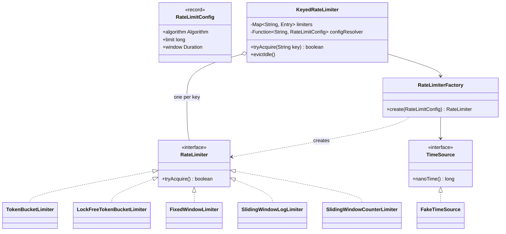

# LLD Interview: Design a Rate Limiter

> "Design a component that limits how many requests a client can make in a time window — e.g. 100 requests per minute per user. Write the code."

A favourite LLD problem because it's small enough to code in 45 minutes but tests **algorithms, OOP design, concurrency, and testability** all at once. It's also directly relevant to infra work: every API gateway, Envoy sidecar and nginx config you've touched has one.

> This is the **LLD** (code-level) version. The URL shortener [HLD interview](../../../HLD/interviews/url-shortener/L5-senior.md) uses a rate limiter as a box in its diagram — this is what's inside that box.

## How to read this folder

> 👉 **Not sure what a rate limiter is, or what "burst", "window" or "429" mean? Start with [00-understand-the-product.md](00-understand-the-product.md).** It connects the idea to things you've already hit: OTP resend timers, login lockouts, API quotas, nginx `limit_req`.

| File | Level | What "good" looks like |
|---|---|---|
| [00-understand-the-product.md](00-understand-the-product.md) | Everyone, first | Know what it does and why, the vocabulary, and the 4 algorithms as everyday pictures |
| [L4-mid.md](L4-mid.md) | Mid / SDE2 | Clean interface, one correct algorithm (token bucket), thread-safe, per-user map, testable clock. |
| [L5-senior.md](L5-senior.md) | Senior | Compares all 4 algorithms, Strategy + Factory, tiers, idle-key eviction, lock-free vs locked trade-off, concurrency tests. |
| [L6-staff.md](L6-staff.md) | Staff | Makes it **distributed**: Redis + Lua atomicity, local/global hybrid, fail-open vs fail-closed, where in the stack it belongs, operating it as a platform library. |

## Code (runnable, no dependencies)

| | Run | Files |
|---|---|---|
| ☕ Java 21 | `./java/run.sh` | [java/src/ratelimiter/](java/src/ratelimiter/) — tests in `RateLimiterTests.java`, demo in `Demo.java` |
| 🟨 Node 22 | `cd js && node --test` · demo: `node server.js` | [js/](js/) — `rateLimiters.js`, `middleware.js`, `server.js`, `rateLimiters.test.js` |

## Class diagram (the final L5 design)

## The 4 algorithms in one table

| Algorithm | Memory per key | Accuracy | Bursts | Typical use |
|---|---|---|---|---|
| **Token bucket** | 2 numbers | Good | Allows bursts up to capacity (by design) | APIs (AWS, Stripe), most common default |
| **Fixed window counter** | 2 numbers | ⚠️ up to 2× limit at window edges | Edge burst | Simple quotas ("1,000/day") where edge bursts don't matter |
| **Sliding window log** | O(limit) timestamps | Exact | None beyond limit | Low limits where exactness matters (login attempts: 5/15 min) |
| **Sliding window counter** | 3 numbers | Approximate (very close) | Smoothed | High-volume APIs wanting accuracy cheaply (Cloudflare uses this) |

## Libraries & concepts used

**Java:** [ConcurrentHashMap](../../libraries/java/concurrent-hashmap.md) · [Atomics & CAS](../../libraries/java/atomics-and-cas.md) · [Locks & synchronized](../../libraries/java/locks-and-synchronized.md) · [ScheduledExecutorService](../../libraries/java/scheduled-executor-service.md) · [Time & Clock](../../libraries/java/time-and-clock.md) · [Production libraries (Guava, Bucket4j, Resilience4j)](../../libraries/java/production-rate-limit-libraries.md)

**JS:** [Event loop & concurrency](../../libraries/js/event-loop-and-concurrency.md) · [Map vs Object](../../libraries/js/map-vs-object.md) · [Express middleware](../../libraries/js/express-middleware.md)

**Concepts:** [Design patterns (Strategy, Factory, …)](../../concepts/design-patterns.md) · [SOLID](../../concepts/solid-principles.md) · [Thread-safety basics](../../concepts/thread-safety-basics.md)

## The core insight

1. **The interface is tiny: `tryAcquire(key) → boolean`.** Everything else is behind it — that's what makes it swappable (in-memory → Redis) without callers changing.
2. **Every algorithm is "read state → decide → update state".** That's a *read-modify-write* — the textbook race condition. Thread safety is not an add-on here; it's the whole problem.
3. **Inject the clock.** Rate limiters are *about time*; without a fake clock you can't test them without `Thread.sleep`.
