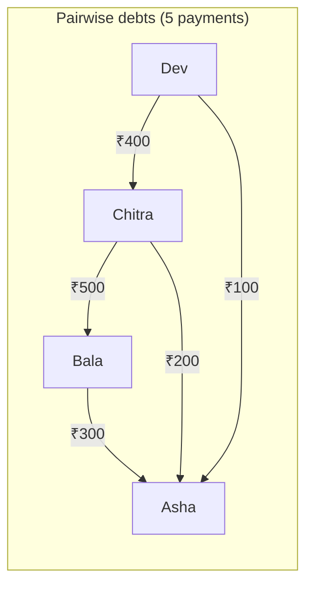
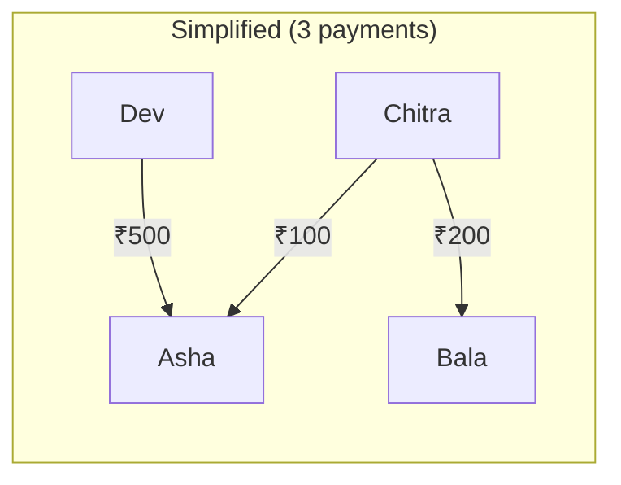
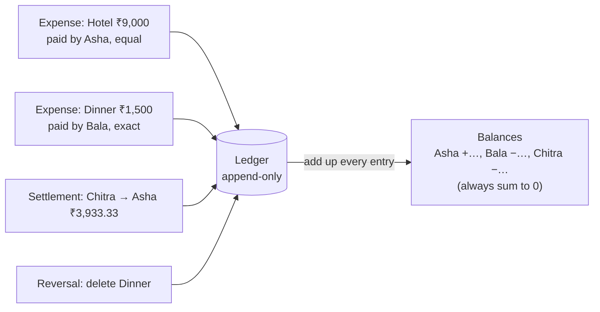

# Start Here: What Does Splitwise Actually Do? (Before the Interview)

> Splitwise looks like a calculator for shared bills. The interesting part is underneath: splitting money without losing a paisa, keeping a history nobody can quietly change, and turning a mess of "I paid for this, you paid for that" into the fewest possible payments. This page walks through a real trip so every class in the interview maps to something you've experienced.
>
> Time: ~10 minutes. Then: [L4](L4-mid.md) → [L5](L5-senior.md) → [L6](L6-staff.md).

---

## 1. A weekend in Goa

Asha, Bala and Chitra go to Goa. Different people pay for different things:

| What happened | Paid by | Who it was for |
|---|---|---|
| Hotel ₹9,000 | Asha | All three, equally |
| Dinner ₹1,500 | Bala | Bala's food ₹500, Chitra's ₹1,000 (Asha skipped dinner) |
| Ice cream ₹100 | Chitra | All three, equally |

By Sunday nobody remembers who owes whom. Without an app:
- Someone makes a spreadsheet. ₹100 ÷ 3 = ₹33.333…, so whose 1 paisa is it?
- They pay each other back in **pairs**: Bala pays Asha, Chitra pays Bala, Chitra pays Asha… more payments than needed.
- Someone edits a number in the spreadsheet and the others don't notice.

With Splitwise, they each add expenses as they go, and at the end the app says:

```
Asha   gets back ₹5,966.66
Bala   owes      ₹2,033.33
Chitra owes      ₹3,933.33

Simplest way to settle:
  Chitra pays Asha ₹3,933.33
  Bala   pays Asha ₹2,033.33
```

Two payments, done. (That's the actual output of `java/run.sh` in this folder.)

---

## 2. Where you've seen this

| Place | What's the same |
|---|---|
| **Splitwise, Tricount** | Groups, expenses, balances, settle up |
| **Google Pay / PhonePe "Split bill"** | Equal split of one payment among friends |
| **Flatmates** | Rent (fixed shares), groceries (whoever buys), electricity (by usage) |
| **Office tea/lunch fund** | Running balances per person |
| **Infra: cloud cost chargeback** | A shared Kubernetes cluster's monthly bill split across teams **by usage share** (CPU-hours, namespaces). That's a "shares" split, and the same rounding problem (the parts must add up to the actual invoice) |
| **Bank statements / accounting** | An append-only list of transactions; your balance is *calculated* from it |

---

## 3. The features, one situation at a time

### 3.1 Groups and expenses
A **group** (Goa trip, Flat 302) has members. An **expense** = who paid, how much, and how it's divided.

### 3.2 Ways to split
| Split type | Real situation | Example |
|---|---|---|
| **Equally** | Hotel room shared by three | ₹9,000 → ₹3,000 each |
| **Exact amounts** | Everyone ordered different dishes | Bala ₹500, Chitra ₹1,000 |
| **Percentages** | Rent where the bigger room pays more | 40% / 30% / 30% |
| **Shares** | Family trip: adults count 2, kids 1 | 2 : 2 : 1 |

👉 Interview: *different split rules behind one interface*: a closed set of variants ([sealed interfaces](../../libraries/java/sealed-interfaces-and-pattern-matching.md)).

### 3.3 The paisa problem
₹100 ÷ 3 = 33.333… Someone must pay ₹33.34. If you round everyone to ₹33.33, the parts add up to ₹99.99 and **1 paisa disappears**. Across millions of expenses, the books don't balance.

👉 Interview: *rounding so parts always add up to the total* ([splitting money & rounding](../../concepts/splitting-money-and-rounding.md)).

### 3.4 Balances: who owes the group, who is owed
For each person: **net = what they paid − what they owed**. Positive means the group owes them money; negative means they owe. All nets add up to **exactly zero** (money doesn't appear or vanish), which makes a great test.

### 3.5 Settle up
Chitra pays Asha ₹3,933.33 by UPI. The app doesn't move money; she **records** that she paid. That's a new entry, not an edit.

### 3.6 Delete / edit, with history
Bala deletes the dinner by mistake. Splitwise shows "Bala deleted 'Dinner'" in the activity feed and you can restore it. Nothing is truly erased: corrections are **new entries** on top of old ones.

👉 Interview: *append-only ledger, balances derived from it* ([ledgers & event sourcing](../../concepts/ledgers-and-event-sourcing.md)).

### 3.7 Simplify debts
With many people and expenses, "who owes whom" becomes a tangle. Splitwise has a group setting called **Simplify debts** that replaces the tangle with fewer payments.





Same final outcome for everyone, fewer bank transfers. Check with net balances: Asha +600 (300 + 200 + 100 before; 500 + 100 after), Bala +200 (gets 500, pays 300 before; gets 200 after), Chitra −300, Dev −500. Every person ends in the same place. With 4 people the greedy method never needs more than 3 payments.

👉 Interview: *a greedy algorithm, and why "the absolute minimum number of payments" is a much harder problem* ([greedy algorithms](../../concepts/greedy-algorithms.md)).

### 3.8 Retries and many users
Chitra taps "Save" on a bad network; the app retries. The expense must not be added twice. Meanwhile, Asha adds another expense from her phone at the same moment.

👉 Interview: *idempotency keys and thread safety.*

---

## 4. The key mechanism: balances are calculated, not stored



Instead of keeping a `balance` number per person and updating it (where one bug or race and the number is wrong forever), the app keeps the **list of what happened** and computes balances from it. Your bank does the same: the statement is the truth; the balance is a sum.

---

## 5. Try it yourself (real, 5 minutes)

1. Install **Splitwise** (free) or use **Google Pay → split a bill**. Create a group with a friend, add one expense split equally with an odd amount (₹100 among 3). See who gets the extra paisa.
2. In a Splitwise group, open **Settings → Simplify debts** and read how it describes the feature. Toggle it on a group with 4+ people and several expenses and watch the "who owes whom" list shrink.
3. Delete an expense and look at the **Activity** tab: the deletion is itself an entry, and you can restore it. That's the append-only ledger.
4. If your team does cloud cost allocation, look at how the shared cluster bill is split between teams. Ask whether the per-team numbers add up exactly to the invoice; often they don't, for exactly the rounding reason in §3.3.

---

## 6. From experience to requirements

| What you experienced | Requirement | Type |
|---|---|---|
| Trip/flat groups | Create group with members | Functional |
| Add a bill | `addExpense(group, payer, total, split)` | Functional |
| Equal / exact / % / shares | Multiple split types | Functional |
| "You owe ₹…" | Per-person balances | Functional |
| UPI payment recorded | Settle up | Functional |
| Delete / restore with history | Append-only corrections | Functional |
| Fewer payments | Simplify debts | Functional |
| Parts add up exactly | **No lost paise**: exact integer money + deterministic rounding | Non-functional (correctness) |
| Balances always consistent | Sum of balances = 0, derived from history | Non-functional (correctness) |
| Retry doesn't double-add | **Idempotent** add | Non-functional |
| Friends adding at once | **Thread-safe** per group | Non-functional |

---

## 7. Mini glossary

| Term | Meaning in plain words |
|---|---|
| **Expense** | One bill: who paid, how much, who it was for |
| **Split** | The rule for dividing an expense among people |
| **Paise / minor units** | The smallest unit of a currency (1 ₹ = 100 paise); storing money as whole paise avoids decimals |
| **Largest remainder method** | Rounding rule: round everyone down, then give the leftover units to whoever was rounded down the most |
| **Net balance** | What you paid minus what you owed; + means you're owed money |
| **Settlement** | A recorded repayment between two members |
| **Ledger** | The full, append-only list of everything that happened |
| **Reversal** | A new entry that cancels an earlier one (how deletes work in a ledger) |
| **Simplify debts** | Replacing many pairwise debts with fewer payments with the same result |
| **Idempotency key** | A unique ID per request so a retry is recognised and not applied twice |

➡️ **Now design it:** [L4-mid.md](L4-mid.md)
