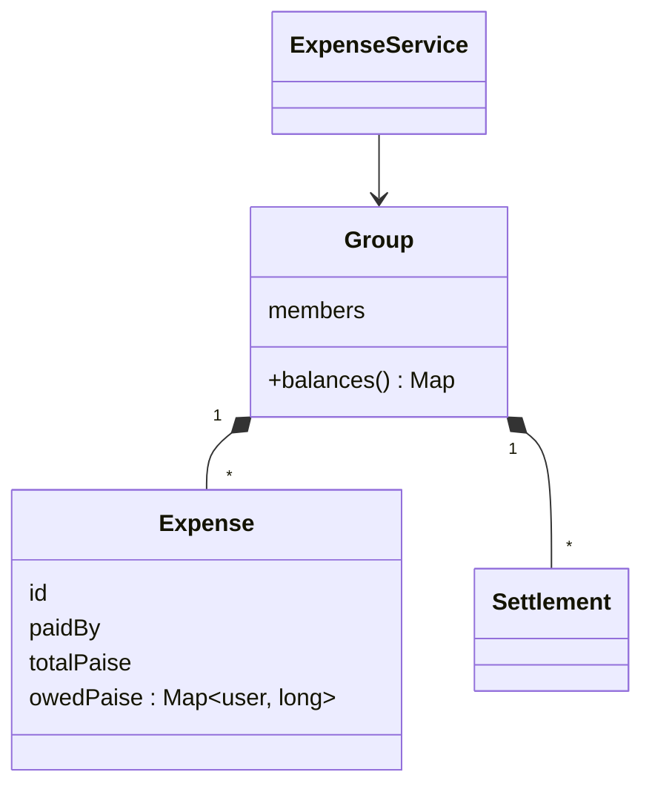

# Splitwise — L4 (Mid-level / SDE2) LLD Interview

> **Level expectation:** model users, groups, expenses and splits cleanly; compute balances correctly with exact money; support settle-up; handle the "₹100 ÷ 3" case; explain your choices. Simplification and concurrency can come up as follow-ups.

> 🆕 New to Splitwise? Read [00-understand-the-product.md](00-understand-the-product.md) first. It walks through a trip and explains the rounding and "simplify debts" problems.

Legend: **🧑‍💼 Interviewer** · **🧑‍💻 Candidate** · **📝 Note** = commentary for you.

---

## 1. Clarifying requirements

**🧑‍💼 Interviewer:** Design Splitwise.

**🧑‍💻 Candidate:** Questions:
- Groups, or also expenses between two people without a group?
- Which split types: equal, exact, percentage, shares?
- One payer per expense, or several people chipping in?
- Single currency?
- Do we need to show "who owes whom", or just each person's total?
- Edit/delete expenses?

**🧑‍💼 Interviewer:** Groups. All four split types. One payer. INR only. Show net balance per person and a settle-up suggestion. Deleting is nice to have.

**🧑‍💻 Candidate:**

**Functional**
1. Create a group with members.
2. Add an expense: payer, amount, split type and details.
3. Show each member's **net balance** in the group.
4. Record a **settlement** (A paid B back).
5. *(nice to have)* delete an expense; suggest who should pay whom.

**Non-functional**
1. **Exact money:** no rounding errors; parts of a split always add up to the total.
2. Clear validation errors (percentages not adding to 100, etc.).
3. Extensible: new split types later.

> 📝 **Note:** "One payer or several?" is a good scoping question: multiple payers complicate the model, and interviewers are happy to cut it.

---

## 2. Core entities

| Entity | Kind | Notes |
|---|---|---|
| `User` | value (`String id` here) | Name, contact: out of scope |
| `Group` | entity | Members + its expenses |
| `Expense` | **record** | Immutable: id, payer, total, how much each person owes |
| `Split` types | Equal / Exact / Percent / Shares | Each knows how to divide a total |
| `Settlement` | record | from, to, amount |
| `ExpenseService` | facade | The API the app calls |

**🧑‍💼 Interviewer:** Why store "how much each person owes" in the expense instead of just the split rule?

**🧑‍💻 Candidate:** Two reasons. The computed amounts are the **facts** everyone agreed to when the expense was added; if the rounding code changes later, old expenses mustn't silently change. And balances become a simple sum over stored numbers, with no re-splitting needed.

---

## 3. Money: integers, not doubles

**🧑‍💻 Candidate:** I'll store money as a `long` number of **paise** (₹1 = 100 paise):

```java
long hotel = Money.parse("9000");     // 900000 paise
Money.format(333334);                 // "₹3333.34"
```

- `double` can't represent 0.1 exactly: `0.1 + 0.2 == 0.30000000000000004`. Money in doubles drifts.
- `BigDecimal` would also work (the [parking lot](../parking-lot/L4-mid.md) uses it). Here there's never a need for fractions of a paisa, so integers are simpler and faster. ([BigDecimal & money](../../libraries/java/bigdecimal-and-money.md).)
- `Money.parse("10.001")` **throws** rather than silently rounding, since an extra decimal is a bug in the caller.

---

## 4. Class diagram

Full diagram in the [README](README.md#class-diagram-matches-the-code). At L4 the simplest version:



---

## 5. Deep dives

### 5.1 Splitting: the ₹100 ÷ 3 problem

**🧑‍💻 Candidate:** Equal split of 10,000 paise among 3 is 3,333.33 each. If each gets 3,333, the parts sum to 9,999 and **one paisa vanishes**. Fix: give the leftover paise, one each, to some participants **deterministically** (same input → same output):

```text
10000 / 3 → floor 3333 each → 9999 assigned → 1 left over → first participant (by id) gets 3334
result: a=3334, b=3333, c=3333   (sums to 10000 ✓)
```

The general rule, used for percentages and shares too, is the **largest remainder method**: round everyone down, then hand the leftovers to whoever lost the most in rounding ([splitting money & rounding](../../concepts/splitting-money-and-rounding.md)). Code: [Splitter.java](java/src/splitwise/Splitter.java).

Validation per type:

| Type | Rule |
|---|---|
| Equal | At least one participant, no duplicates |
| Exact | Amounts ≥ 0 and **sum exactly to the total** |
| Percent | Percentages **sum to 100** |
| Shares | Every share > 0 |

### 5.2 Balances

**🧑‍💻 Candidate:** For each member: **net = total paid − total owed**, plus settlements.

```java
for (Expense x : expenses) {
    net.merge(x.paidBy(), x.totalPaise(), Long::sum);                       // they paid the bill
    x.owedPaise().forEach((user, owed) -> net.merge(user, -owed, Long::sum)); // each owes their part
}
for (Settlement s : settlements) {
    net.merge(s.from(), s.amountPaise(), Long::sum);    // paying back reduces what you owe
    net.merge(s.to(), -s.amountPaise(), Long::sum);
}
```

Goa example: Asha +₹6,000, Bala −₹2,000, Chitra −₹4,000. **The nets always sum to zero**, because every rupee paid by someone is owed by someone. That's my first test.

**🧑‍💼 Interviewer:** Why not keep a `balance` field on each user and update it when expenses are added?

**🧑‍💻 Candidate:** It works until it doesn't: one bug, one crash halfway through an update, or a deleted expense handled wrongly, and the stored balance is wrong forever with no way to tell. Computing from the list of expenses is always correct, and for a group with hundreds of expenses it takes microseconds. (At large scale you cache the result: [L6](L6-staff.md).)

---

## 6. Follow-ups

**🧑‍💼 Interviewer:** How would you suggest who pays whom?

**🧑‍💻 Candidate:** Greedy: take the person owed the most and the person who owes the most; the debtor pays the creditor the smaller of the two amounts; repeat. Each step settles at least one person, so ≤ n−1 payments. Goa: Chitra pays Asha ₹4,000, Bala pays Asha ₹2,000. Details in [L5](L5-senior.md#33-simplify-debts-greedy-and-why-not-optimal).

**🧑‍💼 Interviewer:** Add a new split type: "by item" (a bill with line items).

**🧑‍💻 Candidate:** A new variant of `SplitSpec` and one more branch in the splitter. Item totals become an exact split, with tax/service charge distributed proportionally (a shares split by item totals). Nothing in balances or settlements changes, because they only ever see the final `owedPaise` map.

**🧑‍💼 Interviewer:** Deleting an expense?

**🧑‍💻 Candidate:** Simplest: remove it from the list and balances recompute correctly. Better (and what the code does): keep it and add a **reversal** entry, so the history shows what happened and it can be restored. That's the [L5](L5-senior.md) ledger design.

**🧑‍💼 Interviewer:** In JavaScript?

**🧑‍💻 Candidate:** Same model with integer paise as `Number`s (safe up to ~9 × 10¹⁵ paise). For the splitting arithmetic I use `BigInt` so even `total × weight` can't overflow or lose precision ([money in JS](../../libraries/js/money-and-numbers-in-js.md), [js/splitwise.js](js/splitwise.js)).

---

## 7. What the interviewer was evaluating (L4)

- [ ] Scoped split types, payers, currency
- [ ] Integer minor units (or BigDecimal) for money; strict parsing
- [ ] Deterministic rounding with parts summing to the total
- [ ] Validation per split type with clear errors
- [ ] Correct net balance formula; sums-to-zero invariant
- [ ] Explained stored vs derived balances
- [ ] Reasonable approach to suggesting payments

## 8. Common mistakes at this level

| Mistake | Why it's wrong |
|---|---|
| `double amount` | Rounding drift; totals that don't reconcile |
| Rounding each share independently (`Math.round(total/3)`) | Parts sum to 9,999 or 10,001 |
| Storing only the split rule, recomputing amounts later | Old expenses change when code changes |
| A mutable `balance` per user updated in place | Drifts on bugs/crashes; no history |
| A subclass per split type with duplicated validation | Fine at first; a closed set of variants is cleaner (see L5) |
| Pairwise debt matrix updated on every expense | O(n²) state; still need simplification later |

➡️ Next: [L5-senior.md](L5-senior.md)
