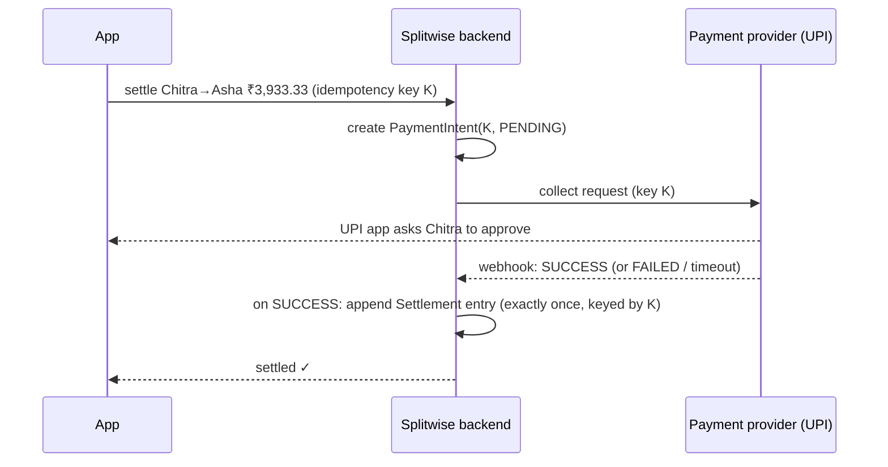

# Splitwise — L6 (Staff) LLD Interview

> **Level expectation:** the L5 design takes ~15 minutes. Then: *"We have 50M users on phones that go offline, people travel abroad, and we want to let them pay each other inside the app."* You keep the ledger core and reason about persistence, offline edits and conflicts, multi-currency, real money movement, and product/legal consequences, still pointing at concrete schema and code changes. Read [L5-senior.md](L5-senior.md) first.

Legend: **🧑‍💼 Interviewer** · **🧑‍💻 Candidate** · **📝 Note** = commentary for you.

---

## 1. What changes at product scale

| L5 assumption | Reality | Consequence |
|---|---|---|
| Ledger in memory | Durable, multi-device | Event store in a DB; snapshots for fast balances |
| Always online | Phones offline on a trek | Offline adds and edits → **sync and conflicts** |
| INR only | Trips abroad | Multi-currency expenses, exchange rates, which currency to settle in |
| Settlement is just a record | "Pay with UPI inside the app" | Real money movement: payments provider, failures, reconciliation, regulation |
| Simplify debts is a pure algorithm | It changes who pays whom | Product consent, explanations, disputes |

---

## 2. Persistence: event store + snapshots

```sql
CREATE TABLE ledger_entries (
    group_id     text,
    seq          bigint,          -- per-group sequence: total order inside a group
    entry_id     uuid,            -- client-generated: doubles as the idempotency key
    kind         text,            -- EXPENSE | SETTLEMENT | REVERSAL
    payload      jsonb,           -- amounts in minor units + currency
    created_by   text,
    created_at   timestamptz,
    PRIMARY KEY (group_id, seq),
    UNIQUE (group_id, entry_id)   -- retries can't insert twice
);

CREATE TABLE balance_snapshots (
    group_id text, upto_seq bigint, balances jsonb,
    PRIMARY KEY (group_id, upto_seq)
);
```

- **Append** = `INSERT … (seq = last+1)`. The `(group_id, seq)` primary key makes two concurrent appends with the same seq fail; the loser retries with the next seq. The DB enforces the L5 per-group lock, so it works across many app servers ([Postgres](../../../HLD/technologies/postgresql.md)).
- **Idempotency** is now a unique constraint, written in the **same transaction** as the entry, so there's no window where the entry exists but the key doesn't.
- **Balances:** read the latest snapshot, then fold the few entries after `upto_seq`. Snapshot every N entries or asynchronously. Snapshots are a cache: delete them all and they rebuild from the log ([ledgers & event sourcing](../../concepts/ledgers-and-event-sourcing.md)).
- A per-user "total across all groups" is a **projection** updated asynchronously from the ledger stream, eventually consistent, rebuildable.

> 📝 **Note:** The design moved from "synchronized method" to "primary key + unique constraint" without changing the domain model. Stating that the *same invariant* is now enforced by the database is the staff-level bridge from LLD to HLD.

---

## 3. Offline edits and conflicts

**🧑‍💼 Interviewer:** Two friends, both offline on a trek, add expenses. One also deletes an expense the other edited.

**🧑‍💻 Candidate:** The ledger makes most of this easy:
- **Adds never conflict.** Each device creates entries with its own UUID; on reconnect they're appended (server assigns `seq`). Order between two offline adds doesn't matter, because balances are a sum, which is **commutative** (order-independent).
- **Delete vs edit of the same expense** is a real conflict: Asha's `Reversal(E1)` and Bala's `Reversal(E1) + Expense(E1')`. Rule: an entry referencing an expense that's already reversed is **rejected on sync**, and the device shows "this expense was deleted by Asha. Re-add your version?" The user decides, because silent automatic merging of money is a support nightmare.
- Each entry records the `seq` the device had last seen (`basedOnSeq`), so the server can detect "you edited something that changed since you last synced".

This is why event logs (rather than mutable rows) are the standard for offline-first money apps: most operations become order-independent appends.

---

## 4. Multi-currency

- Each expense stores its **original currency and amount** (minor units of *that* currency: USD cents, JPY has no minor unit, KWD has 3 decimals). Never convert at entry time and throw away the original.
- **Balances per currency** by default: "Bala owes Asha $40 and ₹1,200". Converting needs a **rate and a date**, and both are user-visible choices.
- Optional "convert all to INR" stores the **rate used** as its own ledger entry (`CurrencyConversion(rate, source, at)`), so the result is reproducible and auditable later, when rates have changed.
- Rounding after conversion again uses largest remainder, so converted parts sum to the converted total.

---

## 5. Moving real money

**🧑‍💼 Interviewer:** Let users settle with UPI inside the app.

**🧑‍💻 Candidate:** Now a `Settlement` is the *result* of a payment, not just a claim. Flow ([sagas](../../../HLD/concepts/sagas-and-distributed-transactions.md)):



- **The ledger entry is written only after the provider confirms.** A pending/failed payment never changes balances.
- **Idempotency end to end:** the same key K for the provider call, webhook handling and the ledger insert, so duplicated webhooks can't settle twice.
- **Reconciliation:** a daily job compares provider reports with settlement entries; mismatches (money moved but no entry, or the reverse) go to an ops queue. With real money, "we'll fix it if someone complains" isn't acceptable.
- **Regulation:** holding money for users makes you a payment aggregator, which needs licences and KYC. Using the provider's direct peer-to-peer collect flow keeps the money out of our hands. This is a product/legal decision that shapes the architecture.

---

## 6. Simplify debts as a product decision

- Simplification makes people who never shared an expense pay each other. Users must **opt in** per group, and the UI should **explain** a suggested payment ("Dev pays Asha because Dev owes the group ₹500 and Asha is owed ₹600").
- Suggestions must be **stable**: recomputing after every tiny expense and reshuffling who pays whom confuses users. Recompute on demand and keep the suggestion until balances change materially.
- Explainability needs the algorithm to be deterministic (L5's tie-breaking) and the inputs to be auditable (the ledger).

---

## 7. Data and privacy

- Expense descriptions are personal data ("Rent", "Hospital bill"). Account deletion must remove/anonymise a user's **identity** while keeping the group's arithmetic consistent for the remaining members. Replace the user with a tombstone identity in entries instead of deleting entries (deleting would break other people's balances).
- Export: users can download their full ledger (it's already an event list), which is a natural fit for data-portability requirements.

---

## 8. Curveballs

**🧑‍💼 Interviewer:** Support says a user's balance "changed by itself overnight".

**🧑‍💻 Candidate:** With an append-only ledger, balances only change when entries are added, so look at the entries after the user's last view: an offline device syncing an old expense, a snapshot rebuilt by a buggy projection version, or a currency view recomputed with a new rate. The ledger makes it explainable; a mutable balance column would make it a mystery. I'd also add the **projection version** to snapshots so a deploy that changes balance logic is visible in the data.

**🧑‍💼 Interviewer:** A group has 300 members (a hostel). Anything break?

**🧑‍💻 Candidate:** Greedy simplification is still O(n log n), no problem. The optimal brute-force is impossible at 2³⁰⁰, which is another reason to stick with greedy. Contention on the per-group seq rises: lots of concurrent appends to one group means retries on the primary key. Fine at human speeds (a few writes per second); for heavier cases, assign seq via a per-group serialised writer (single writer, as in the [elevator system](../elevator-system/L5-senior.md#33-concurrency-commands--a-single-writer)).

---

## 9. What the interviewer was evaluating (L6)

- [ ] Event store schema: per-group seq, idempotency as a unique constraint in the same transaction, snapshots as caches
- [ ] Offline-first: commutative appends, explicit conflict rules for edits/deletes, user-visible resolution
- [ ] Multi-currency: store originals, per-currency balances, recorded conversion rates
- [ ] Real payments: ledger written only on provider confirmation, end-to-end idempotency, reconciliation, regulatory awareness
- [ ] Simplification as a product decision: consent, explainability, stability
- [ ] Privacy without breaking other users' arithmetic
- [ ] Used the ledger to make support issues explainable

## 10. Common mistakes at this level

| Mistake | Why it hurts at L6 |
|---|---|
| Moving to a mutable `balances` table "for performance" | Loses history and correctness; snapshots give the same speed |
| Last-write-wins for offline edits of money | Silent data loss and disputes |
| Converting currencies at entry and discarding the original | Irreproducible numbers; wrong when rates change |
| Writing the settlement before the payment is confirmed | Balances say "paid" when money didn't move |
| Treating "in-app payments" as just an API integration | Licensing, KYC, reconciliation and support are the real work |
| Hard-deleting a user's entries on account deletion | Breaks everyone else's balances |

⬅️ Previous: [L5-senior.md](L5-senior.md) · 🏠 [Problem overview](README.md)
