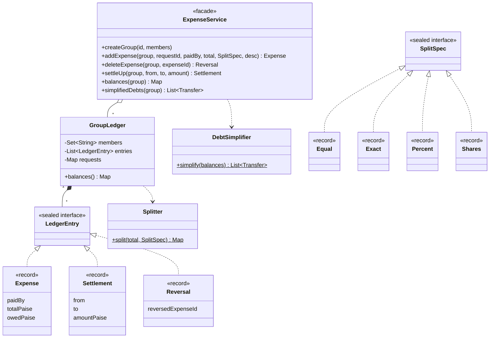

# LLD Interview: Design Splitwise (Expense Sharing)

> "Users create groups and add expenses paid by one person and shared by several. Show who owes whom, support different split types, settling up, and simplifying debts."

A favourite LLD question because the domain is small but full of traps: **money arithmetic** (the lost paisa), **modelling variants** (four split types), **where balances come from** (stored vs derived), an **algorithm** (debt simplification), and **correctness under retries and concurrency**.

## How to read this folder

> 👉 **Never used Splitwise, or not sure why "simplify debts" is interesting? Start with [00-understand-the-product.md](00-understand-the-product.md).** It walks through a Goa trip, the ₹100 ÷ 3 problem, and why balances are calculated from history instead of stored.

| File | Level | What "good" looks like |
|---|---|---|
| [00-understand-the-product.md](00-understand-the-product.md) | Everyone, first | Know the features and the money/rounding problem |
| [L4-mid.md](L4-mid.md) | Mid / SDE2 | Clean model (User, Group, Expense, split types), exact integer money, correct balances, settle up |
| [L5-senior.md](L5-senior.md) | Senior | Sealed split variants + largest-remainder rounding, append-only ledger with reversals, greedy simplification with proof of ≤ n−1, idempotency, per-group concurrency, property tests |
| [L6-staff.md](L6-staff.md) | Staff | Persistence and scale (event store, snapshots), multi-currency, edits across devices, integration with real payments, data/privacy, product trade-offs of simplification |

## Code (runnable, no dependencies)

| | Run | Files |
|---|---|---|
| ☕ Java 21 | `./java/run.sh` | [java/src/splitwise/](java/src/splitwise/): `Splitter`, `SplitSpec`, `LedgerEntry`, `GroupLedger`, `DebtSimplifier`, `ExpenseService`, tests in `SplitwiseTests.java` |
| 🟨 Node 22 | `cd js && node --test` | [js/splitwise.js](js/splitwise.js), [js/splitwise.test.js](js/splitwise.test.js) |

## Class diagram (matches the code)

## Libraries & concepts used

**Java:** [Sealed interfaces & pattern matching](../../libraries/java/sealed-interfaces-and-pattern-matching.md) · [Streams & collectors](../../libraries/java/streams-and-collectors.md) · [BigDecimal & money](../../libraries/java/bigdecimal-and-money.md) · [Records & immutability](../../libraries/java/records-and-immutability.md) · [TreeSet & PriorityQueue](../../libraries/java/treeset-and-priorityqueue.md) · [ConcurrentHashMap](../../libraries/java/concurrent-hashmap.md) · [Locks & synchronized](../../libraries/java/locks-and-synchronized.md)

**JS:** [Money & numbers in JS](../../libraries/js/money-and-numbers-in-js.md) · [Classes & private fields](../../libraries/js/classes-and-private-fields.md)

**Concepts:** [Splitting money & rounding](../../concepts/splitting-money-and-rounding.md) · [Ledgers & event sourcing](../../concepts/ledgers-and-event-sourcing.md) · [Greedy algorithms](../../concepts/greedy-algorithms.md) · [Design patterns](../../concepts/design-patterns.md) · [OOP modelling](../../concepts/oop-modeling.md) · [Thread-safety basics](../../concepts/thread-safety-basics.md)

**Related HLD:** [Idempotency & delivery semantics](../../../HLD/concepts/idempotency-and-delivery-semantics.md)

## The core insight

1. **Money is integers in the smallest unit, and splits use largest-remainder rounding**, so parts always add up to the total.
2. **Store what happened, derive balances.** An append-only ledger (with reversals for deletes) can't drift, gives free history, and makes "balances sum to 0" a checkable invariant.
3. **Simplifying debts is greedy, not optimal.** At most n−1 payments, fast and good. The true minimum is NP-hard, and saying so is part of the answer.
