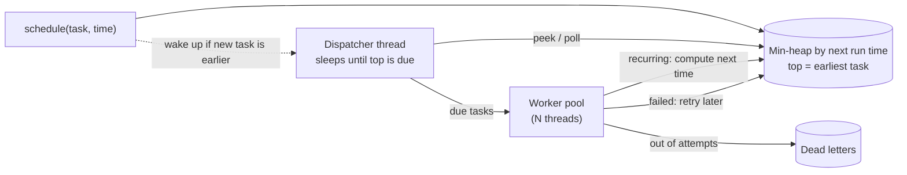

# Start Here: What Is a Task Scheduler? (Before the Interview)

> You've already used several: `crontab` on a Linux box, a Kubernetes **CronJob** that runs a nightly backup, a `@Scheduled` method in a Spring service. This interview asks you to build the engine inside them: something that holds a list of "do X at time T" promises and keeps every one of them, on time, in order, even when tasks fail, overrun, or the clocks change.
>
> Time: ~10 minutes. Then: [L4](L4-mid.md) → [L5](L5-senior.md) → [L6](L6-staff.md).

---

## 1. The problem as a story: "later" and "again"

A shopping app has three small needs:

1. **Later, once.** A user leaves items in the cart. *In 30 minutes*, send "your cart is waiting". If they check out before that, the reminder must **not** go out.
2. **Again, on a calendar.** Every night *at 02:00 IST* (India Standard Time, UTC+5:30; **UTC** is the world's reference time with no offset), build yesterday's sales report.
3. **Again, after failure.** A payment provider's webhook (an HTTP call it expects us to receive, or one we send to a partner) fails with `503`. Try again in 5 s, then 10 s, then 20 s, and if it keeps failing, put it somewhere a human will see it.

Without a scheduler, every team writes its own `while (true) { sleep(60_000); check(); }` loop. Those loops drift, die silently on the first exception, run twice when two pods start, and fire at the wrong hour twice a year. A **task scheduler** does this once, correctly.

---

## 2. Where you've seen this

| Place | What you saw |
|---|---|
| **`crontab`** (Linux) | `0 2 * * * /opt/backup.sh`: five fields (minute, hour, day of month, month, day of week), checked by the `cron` daemon (a background process) every minute |
| **Kubernetes CronJob** | Same five-field schedule in YAML; it creates a **Job** (a pod that runs to completion) at each tick. Has `concurrencyPolicy: Forbid` (don't start a new run while the last is still running) and `startingDeadlineSeconds` (how late a run may still start) |
| **Java `ScheduledExecutorService`** | `schedule(task, 30, MINUTES)`, `scheduleAtFixedRate`, `scheduleWithFixedDelay`: the JDK's in-process scheduler ([ScheduledExecutorService](../../libraries/java/scheduled-executor-service.md)) |
| **Quartz** (Java library) | Jobs + triggers, cron expressions with seconds, **misfire** instructions, and a database-backed mode for clusters |
| **Spring `@Scheduled`** | `@Scheduled(fixedRate = 5000)`, `@Scheduled(cron = "0 0 2 * * *", zone = "Asia/Kolkata")` (Spring cron has a 6th field for seconds) |
| **Sidekiq / Celery beat** | Ruby / Python background-job systems: "run this job in 5 minutes", automatic retries with backoff, a "dead" set for jobs that never succeed |
| **AWS EventBridge Scheduler** | A managed (cloud-hosted) scheduler: one-time, rate-based or cron schedules, with a time zone, a retry policy and a dead-letter queue |

---

## 3. The features, one situation at a time

### 3.1 One-shot delay: "do this once, in 30 minutes"
The cart reminder. You schedule it, you get a **handle** back (an object representing the scheduled task), and you can **cancel** it if the user checks out.

👉 Interview: *the core data structure. How do you always know which task is next among millions?*

### 3.2 Fixed rate vs fixed delay: two meanings of "every 10 seconds"
A metrics exporter runs every 10 s and each run takes 3 s.
- **Fixed rate** (start-to-start): runs start at 0, 10, 20, 30… regardless of how long each run takes. Good for "sample a gauge every 10 s".
- **Fixed delay** (end-to-start): the next run starts 10 s after the previous one *finished*: 0, 13, 26… Good for "poll a queue, rest, poll again" so a slow run doesn't pile up work.

👉 Interview: *what happens when one run takes longer than the period? Two copies at once (overlap), or wait?*

### 3.3 Cron expressions: calendar schedules
"Every weekday at 09:00", "at minute 0 and 30 of hours 8 to 18". A **cron expression** is a compact text format for these, e.g. `*/15 9-17 * * 1-5` = every 15 minutes, 09:00–17:45, Monday–Friday. See [cron & recurring schedules](../../concepts/cron-and-recurring-schedules.md).

👉 Interview: *parse the expression and compute "the next fire time after now".*

### 3.4 Time zones and daylight saving time (DST)
"02:00" means nothing without a **time zone**. India has no DST, so 02:00 IST always exists, exactly once. But many US and European zones shift their clocks twice a year (**daylight saving time**). In `America/New_York` on **2025-03-09**, clocks jump from 01:59:59 EST (Eastern Standard Time, UTC−5) straight to 03:00:00 EDT (Eastern Daylight Time, UTC−4): **02:30 does not exist that day**. On **2025-11-02**, clocks fall back and **01:30 happens twice**.

👉 Interview: *does the "02:30 every night" job run zero, one, or two times on those days? Your choice must be deliberate.* See [Java time API](../../libraries/java/java-time-api.md).

### 3.5 Retries with backoff, jitter, and a dead-letter list
The webhook fails. Retrying immediately hammers a partner that's already struggling. **Exponential backoff** waits longer after each failure (1 s, 2 s, 4 s…). **Jitter** adds randomness so 10,000 failed tasks don't all retry at the same instant. After a maximum number of attempts, the task goes to a **dead-letter list** (DLQ) for a human. See [retries, backoff & DLQ](../../../HLD/concepts/retries-backoff-and-dlq.md).

👉 Interview: *retry policy per task, and what "giving up" looks like.*

### 3.6 Priorities
At 09:00:00 both "page the on-call engineer" and "rebuild the search index" are due, and there's one free worker. The page should go first.

👉 Interview: *ordering among tasks due at the same time: priority, then FIFO (first in, first out).*

### 3.7 Misfires after downtime
The service was being redeployed from 01:58 to 02:05. The 02:00 report was **missed** ("misfired"). Run it now, late? Or skip until tomorrow? For "send a daily digest" you want *run once now*; for "send the 02:00 traffic snapshot" a late one is wrong data, so *skip*.

👉 Interview: *a misfire policy per task.*

### 3.8 No overlapping runs
The nightly report normally takes 20 minutes. One night it takes 26 hours. Should tomorrow's run start while today's is still running? Almost always **no**: two copies would fight over the same files or rows. That's Kubernetes' `concurrencyPolicy: Forbid`, Quartz's `@DisallowConcurrentExecution`.

### 3.9 Graceful shutdown
During a deploy, Kubernetes sends **SIGTERM** (the "please stop" signal) and waits `terminationGracePeriodSeconds` before killing the pod. The scheduler should stop starting new tasks, let running ones finish, and then exit.

---

## 4. The key mechanism: a min-heap + one sleeping dispatcher + a worker pool



- A **min-heap** is a tree-shaped structure that always keeps the smallest item on top: peek the earliest task in O(1) (constant time), add or remove in O(log n) (grows very slowly: ~17 steps for 100,000 tasks) (see [Big-O](../../concepts/big-o-complexity.md)). Java's `PriorityQueue` is one ([TreeSet & PriorityQueue](../../libraries/java/treeset-and-priorityqueue.md)).
- One **dispatcher** thread looks at the top task and **sleeps exactly until it is due**: no busy polling. If someone adds a task that is *earlier* than the current top, the dispatcher must be **woken up** to recompute its sleep, or it oversleeps (the classic bug, see L5).
- Due tasks go to a **worker pool** (a fixed set of threads that run the tasks), so one slow task doesn't delay all the others ([executors & threads](../../libraries/java/executors-and-threads.md)).
- A recurring task's next time is computed **after** its run finishes and it goes back into the heap. That alone guarantees it never overlaps with itself.

The same idea, with different data structures for huge scale, is in [timers, delay queues & timing wheels](../../concepts/timers-delay-queues-and-timing-wheels.md).

---

## 5. Try it yourself (real, 10 minutes)

1. **cron on Linux / macOS:**
   ```sh
   crontab -l                      # your current cron jobs (may be empty)
   ```
   Then open **crontab.guru** and type `*/15 9-17 * * 1-5`: it explains the expression in English and lists the next run times.
2. **Kubernetes** (any test cluster, e.g. `kind` or `minikube`, tools that run a small cluster on your laptop):
   ```sh
   kubectl create cronjob hello --image=busybox --schedule="*/1 * * * *" -- date
   kubectl get cronjob hello -o yaml | grep -E "concurrencyPolicy|schedule|timeZone"
   kubectl get jobs --watch        # a new Job appears every minute
   kubectl delete cronjob hello
   ```
3. **Java, in `jshell`** (Java's interactive shell, ships with the JDK; fixed rate vs fixed delay, with a 3-second "task"):
   ```java
   import java.util.concurrent.*;
   var ses = Executors.newScheduledThreadPool(2);
   long t0 = System.currentTimeMillis();
   ses.scheduleAtFixedRate(() -> { System.out.println("rate  " + (System.currentTimeMillis()-t0)/1000); try { Thread.sleep(3000); } catch (Exception e) {} }, 0, 5, TimeUnit.SECONDS);
   ses.scheduleWithFixedDelay(() -> { System.out.println("delay " + (System.currentTimeMillis()-t0)/1000); try { Thread.sleep(3000); } catch (Exception e) {} }, 0, 5, TimeUnit.SECONDS);
   // watch ~20 s: rate prints 0,5,10,15 ; delay prints 0,8,16
   ses.shutdownNow();
   ```
4. **DST in one line of `jshell`:**
   ```java
   java.time.ZonedDateTime.of(2025,3,9,2,30,0,0, java.time.ZoneId.of("America/New_York"))
   // ==> 2025-03-09T03:30-04:00[America/New_York]   (02:30 doesn't exist; Java shifts it forward)
   ```

---

## 6. From experience to requirements

| What you experienced | Requirement | Type |
|---|---|---|
| Cart reminder, cancelled on checkout | One-shot delay; cancel by handle | Functional |
| Metrics every 10 s; poll-then-rest | Fixed-rate and fixed-delay recurring tasks | Functional |
| "Every weekday at 09:00" | Cron expressions in a given time zone | Functional |
| Webhook 503 → retry → human | Retries with exponential backoff + jitter, max attempts, dead-letter list | Functional |
| Page on-call before reindexing | Priority among due tasks; FIFO among equals | Functional |
| Redeploy at 02:00 | Misfire policy (run once now / skip) | Functional |
| 26-hour report | A recurring task never overlaps itself | Functional |
| Pod gets SIGTERM | Graceful shutdown with a timeout | Functional |
| Tasks start on time | No busy polling; low **lag** (start time − planned time) | Non-functional |
| Millions of reminders | O(log n) per add/remove, memory per task small | Non-functional |
| DST days | Correct, documented behaviour for skipped/repeated hours | Non-functional |
| Tests run in milliseconds | Injectable clock: no `sleep` in tests | Non-functional |

---

## 7. Mini glossary

| Term | Meaning in plain words |
|---|---|
| **Scheduler** | A component that runs tasks at a given time or repeatedly |
| **One-shot task** | Runs once, after a delay or at a given time |
| **Fixed rate** | Recurring, measured start-to-start |
| **Fixed delay** | Recurring, measured from the end of one run to the start of the next |
| **Cron expression** | Five fields (minute hour day-of-month month day-of-week) describing calendar times |
| **Time zone / UTC** | Rules mapping a real moment to local wall-clock time; UTC is the zero-offset reference |
| **DST gap / overlap** | The local hour that is skipped (spring forward) or repeated (fall back) |
| **Min-heap** | A structure that always keeps the smallest item on top; here, the earliest task |
| **Dispatcher** | The thread that waits for the next due task and hands it to a worker |
| **Worker pool** | A fixed set of threads that actually execute tasks |
| **Backoff / jitter** | Waiting longer after each failure / adding randomness to that wait |
| **Dead-letter list (DLQ)** | Where tasks go after failing every allowed attempt |
| **Misfire** | A run that was missed or is now much later than planned |
| **Lag** | How late a task actually started compared to when it was planned |
| **Idempotent** | Running it twice has the same effect as running it once |

➡️ **Now build it:** [L4-mid.md](L4-mid.md)
