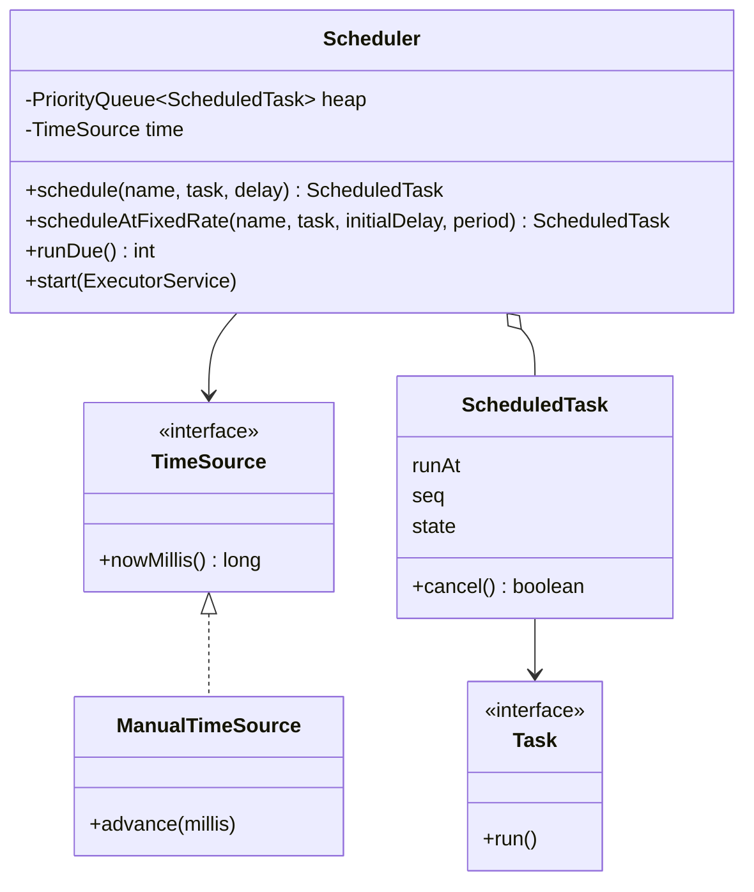
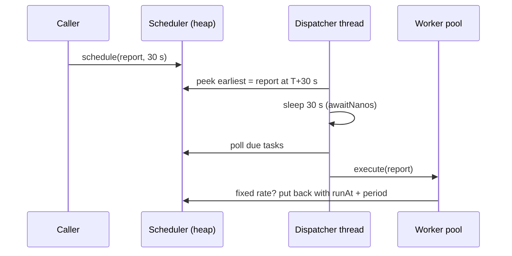

# Task Scheduler — L4 (Mid-level / SDE2) LLD Interview

> **Level expectation:** model the scheduler cleanly (task, scheduled-task handle, scheduler, clock), pick the right data structure (a min-heap ordered by run time with a FIFO tie-break), run tasks with **one dispatcher thread + a worker pool** instead of a thread per task or a polling loop, support cancel, and make it **testable without sleeping**. State the complexity.

> 🆕 Never thought about what's inside cron or `ScheduledExecutorService`? Read [00-understand-the-product.md](00-understand-the-product.md) first.

Legend: **🧑‍💼 Interviewer** · **🧑‍💻 Candidate** · **📝 Note** = commentary for you.

---

## 1. Clarifying requirements

**🧑‍💼 Interviewer:** Design an in-process task scheduler. Callers say "run this in 30 seconds" or "run this every 10 seconds".

**🧑‍💻 Candidate:** A few questions first:
- **In-process** means a library inside one JVM (Java Virtual Machine, the process running our Java code), not a cluster service? Tasks are lost if the process dies?
- One-shot and recurring. For recurring, is "every 10 s" measured start-to-start or end-to-start?
- Can callers **cancel** a scheduled task?
- How many tasks at once, and how precise must timing be?
- Tasks can be slow. Must one slow task delay the others?

**🧑‍💼 Interviewer:** In-process, yes; losing tasks on restart is fine for now. One-shot and fixed-rate (start-to-start). Cancel, yes. Up to ~100,000 pending tasks; within ~10 ms is fine. Slow tasks must not block others.

**🧑‍💻 Candidate:**

**Functional:** `schedule(task, delay)`, `scheduleAtFixedRate(task, initialDelay, period)`, `cancel()`; tasks due at the same time run in the order they were scheduled.

**Non-functional:** adding/cancelling O(log n) or better; no busy polling; a slow task doesn't delay other tasks; safe to call from many threads; deterministic tests (no `Thread.sleep` in tests).

> 📝 **Note:** "start-to-start or end-to-start?" is the fixed-rate vs fixed-delay question. Asking it early shows you know the two differ (L5 goes deep). "In-process" vs "distributed" changes everything (L6), so pin it down first.

---

## 2. Core entities

| Piece | Responsibility |
|---|---|
| `Task` | The work: a functional interface (an interface with one method, so a lambda fits) `void run() throws Exception` |
| `ScheduledTask` | A **handle** returned to the caller: when it runs next (`runAt`), its state, `cancel()` |
| `Schedule` | *When*: `Once(delay)` or `FixedRate(initialDelay, period)` (more kinds at L5) |
| `Scheduler` | Owns the heap, the dispatcher thread and the worker pool |
| `TimeSource` | "What time is it?" One method, `nowMillis()`. Injected so tests can control time |

Keeping `Task` (what) separate from `Schedule` (when) means adding cron later is a new `Schedule` type, not a change to every task.

---

## 3. Interfaces

```java
public interface Task { void run() throws Exception; }
public interface TimeSource { long nowMillis(); }

public final class Scheduler {
    public Scheduler(TimeSource time);
    public ScheduledTask schedule(String name, Task task, long delayMillis);
    public ScheduledTask scheduleAtFixedRate(String name, Task task, long initialDelayMillis, long periodMillis);
    public int runDue();                          // run everything due now, on this thread (tests)
    public void start(ExecutorService workers);   // background mode
}

public final class ScheduledTask {
    public boolean cancel();
    public State state();                         // SCHEDULED, RUNNING, DONE, CANCELLED, DEAD
    public long runAt();
}
```

---

## 4. Class diagram



The full diagram (with cron, retries and misfires) is in the [README](README.md#class-diagram-matches-the-code). Notation: [UML class diagrams](../../concepts/uml-class-diagrams.md).

---

## 5. Deep dives

### 5.1 The data structure: "which task is next?"

**🧑‍💼 Interviewer:** How do you store pending tasks?

**🧑‍💻 Candidate:** The only question the scheduler asks all day is "what's the earliest task?", plus adds and removes. Options ([Big-O complexity](../../concepts/big-o-complexity.md): how cost grows with n tasks):

| Structure | Add | Find earliest | Remove earliest | Verdict |
|---|---|---|---|---|
| Unsorted list | O(1) | O(n) scan | O(n) | Every tick scans 100k tasks |
| Sorted list | O(n) insert | O(1) | O(1) | Adds get slow |
| `TreeSet` / `TreeMap` (balanced tree) | O(log n) | O(log n) | O(log n) | Works; needs unique keys |
| **Min-heap (`PriorityQueue`)** | **O(log n)** | **O(1)** | **O(log n)** | Simplest fit |
| Timing wheel (ring of time buckets) | O(1) | n/a: advances one bucket per tick | O(1) | For millions of timers (L6) |

A **min-heap** is a binary tree stored in an array where every parent is smaller than its children, so the smallest is always at index 0 ([TreeSet & PriorityQueue](../../libraries/java/treeset-and-priorityqueue.md)). log₂(100,000) ≈ 17, so an add is ~17 comparisons.

```java
private static final Comparator<ScheduledTask> BY_TIME =
        Comparator.comparingLong((ScheduledTask t) -> t.runAt)    // a Comparator decides which of two items comes first
                  .thenComparingLong(t -> t.seq);             // tie-break: insertion order
private final PriorityQueue<ScheduledTask> heap = new PriorityQueue<>(BY_TIME);
```

**Why `seq`?** A heap is **not stable**: two tasks with the same `runAt` come out in arbitrary order. A **sequence number** (a counter incremented on every insert) makes ties FIFO (first in, first out). I checked it matters: removing `.thenComparingLong(t -> t.seq)` makes test `equalTimesRunFifo` fail with 20 equal-time tasks coming out as `[0, 19, 18, 17, …]`. It also gives `TreeSet` the unique key it needs if you choose that instead.

> 📝 **Note:** Saying "heap isn't stable, so I add a sequence number" is a small detail that interviewers love, because it shows you've debugged real ordering bugs.

### 5.2 Who runs the tasks?

**🧑‍💼 Interviewer:** Why not start a thread per task that sleeps until its time?

**🧑‍💻 Candidate:** Three designs:

| Design | Problem |
|---|---|
| **A thread per task** (`new Thread(() -> { sleep(delay); run(); })`) | 100k platform threads (classic Java threads, each backed by an operating-system thread) = 100k OS threads, each reserving a stack (default ~1 MB of address space on 64-bit Linux) plus kernel scheduling overhead. No global view: can't order by priority, can't list pending tasks, cancel = interrupting a thread |
| **Poll every second** (`while (true) { runDue(); sleep(1000); }`) | Up to 1 s late; wakes up 86,400 times a day even when nothing is due; precision vs CPU is a bad trade |
| **One dispatcher + worker pool** | The dispatcher sleeps *exactly* until the earliest task is due, then hands due tasks to a fixed pool of threads |

A **thread** is an independent line of execution with its own stack (memory for local variables and calls); a **context switch** is the OS pausing one thread and resuming another, which costs microseconds each. (Java 21 **virtual threads**, lightweight threads managed by the JVM rather than the OS, make sleeping threads cheap, but you'd still want one ordered view of all tasks for priorities, listing and cancel.)



The dispatcher loop (full version in [Scheduler.java](java/src/scheduler/Scheduler.java)):

```java
while (accepting) {
    ScheduledTask head = heap.peek();
    if (head == null) { changed.await(); continue; }                 // empty: sleep until a task is added
    long wait = head.runAt - time.nowMillis();
    if (wait > 0) { changed.awaitNanos(MILLISECONDS.toNanos(wait)); continue; }
    for (ScheduledTask t : takeDue(time.nowMillis())) workers.execute(() -> runOnce(t));
}
```

The **worker pool** is an `ExecutorService` (a JDK object that owns N threads and a queue of work, see [executors & threads](../../libraries/java/executors-and-threads.md)). A 10-minute report then occupies one worker, not the dispatcher.

> 📝 **Note:** This is exactly how the JDK's `ScheduledThreadPoolExecutor` works: a heap (`DelayedWorkQueue`) whose `take()` blocks until the head is due ([ScheduledExecutorService](../../libraries/java/scheduled-executor-service.md)). Saying so connects your design to something real. The subtle part, waking the dispatcher when an *earlier* task arrives, is the L5 deep dive.

**Recurring tasks:** after a run finishes, a fixed-rate task computes `next = plannedTime + period` and is re-inserted. Re-inserting *after* the run, not before, means the same task can never run twice in parallel, even with many workers (test `slowRecurringTaskNeverOverlaps`).

### 5.3 Cancel: lazy deletion

**🧑‍💼 Interviewer:** How does `cancel()` remove the task from the heap?

**🧑‍💻 Candidate:** It doesn't. `PriorityQueue.remove(Object)` is O(n): a linear search through the array. Instead, cancel just flips the state to `CANCELLED` (O(1)); when the task reaches the top, the dispatcher throws it away. That's **lazy deletion**: delete when convenient, not immediately.

```java
if (t.state == State.CANCELLED) continue;      // in takeDue(): skip and drop
```

Trade-off: cancelled tasks occupy memory until their time comes. If a system schedules 1M "timeout in 1 hour" tasks and cancels 99% of them (very common: request timeouts), the heap holds 1M dead entries for an hour. The JDK has the same issue; `ScheduledThreadPoolExecutor.setRemoveOnCancelPolicy(true)` switches to eager removal. A middle ground: rebuild the heap when more than half of it is cancelled.

### 5.4 Testable time

**🧑‍💻 Candidate:** A test that sleeps 30 s to check a 30 s delay is slow and flaky. The scheduler never calls `System.currentTimeMillis()` directly; it asks the injected `TimeSource` ([Time & Clock](../../libraries/java/time-and-clock.md)). Tests move a `ManualTimeSource` and call `runDue()`: schedule tasks at +100 and +300 ms, `clock.set(150)`, and `runDue()` must return 1. `runDue()` and the background dispatcher share the same `takeDue()` / `runOnce()` code, so the deterministic tests exercise the real logic.

### 5.5 Complexity

| Operation | Time |
|---|---|
| `schedule` | O(log n) heap insert |
| `cancel` | O(1) (lazy) |
| Find next due task | O(1) peek |
| Run k due tasks | O(k log n) to poll them |
| Memory | O(n), including not-yet-dropped cancelled tasks |

---

## 6. Follow-ups

**🧑‍💼 Interviewer:** Why not just use `ScheduledExecutorService`?

**🧑‍💻 Candidate:** In production I would for simple cases. Building it shows I understand it, and it lacks things we'll need: retries with backoff, cron and time zones, misfire policies, priorities. One gotcha worth knowing: in `scheduleAtFixedRate`, if the task throws, **all future runs are silently cancelled**, so always catch inside the task.

**🧑‍💼 Interviewer:** What if a task throws in your design?

**🧑‍💻 Candidate:** `runOnce` catches it, so the worker thread survives and the task is rescheduled. At L5 the failure feeds a retry policy and a dead-letter list.

**🧑‍💼 Interviewer:** And in JavaScript?

**🧑‍💻 Candidate:** Node runs our code on one thread (the **event loop**: a loop that runs callbacks one at a time, see [event loop & concurrency](../../libraries/js/event-loop-and-concurrency.md)). The dispatcher becomes **one `setTimeout`**, always re-armed for the earliest task ([async/await & timers](../../libraries/js/async-await-and-timers.md)). Gotcha: delays above 2³¹−1 ms (~24.8 days) overflow and fire immediately, so clamp them ([js/scheduler.js](js/scheduler.js)).

---

## 7. What the interviewer was evaluating (L4)

- [ ] Clarified in-process vs distributed, fixed rate vs fixed delay, cancel, scale
- [ ] Separated *what* (`Task`) from *when* (`Schedule`) and the handle (`ScheduledTask`)
- [ ] Min-heap by run time, with a sequence-number tie-break for FIFO
- [ ] Rejected thread-per-task and polling with concrete reasons
- [ ] Dispatcher + worker pool; recurring task re-inserted after the run (no overlap)
- [ ] Lazy cancel and its memory trade-off
- [ ] Injected clock and `runDue()` for deterministic tests; stated complexity

## 8. Common mistakes at this level

| Mistake | Why it's wrong |
|---|---|
| A thread per task | Doesn't scale; no central ordering, priorities or listing |
| Polling every N ms | Late by up to N, wastes CPU when idle |
| Running tasks on the dispatcher thread | One slow task delays every other task |
| No tie-break in the comparator | Equal-time tasks come out in arbitrary order |
| `heap.remove(task)` on cancel | O(n) per cancel |
| Re-inserting a recurring task *before* running it | Two workers can run it at the same time |
| Letting a task's exception escape | Kills the worker or (in the JDK) silently stops the schedule |
| Tests that `Thread.sleep` | Slow and flaky; inject the clock |

➡️ Next: [L5-senior.md](L5-senior.md)
