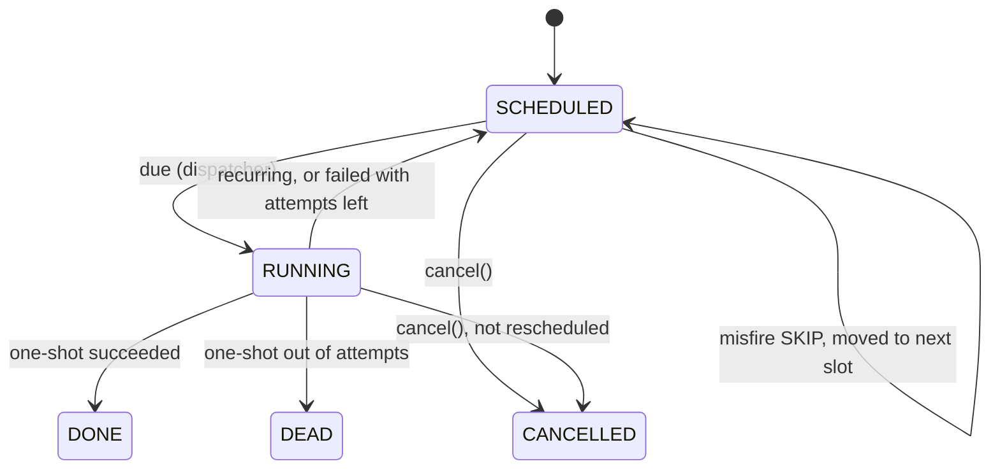
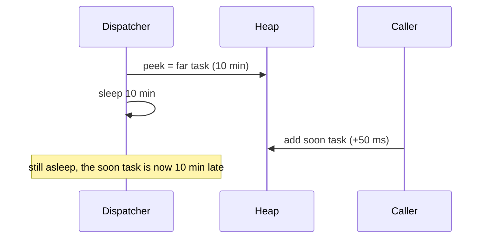

# Task Scheduler — L5 (Senior) LLD Interview

> **Level expectation:** take the L4 heap + dispatcher and make it **correct**: the dispatcher must never oversleep when an earlier task arrives; failures retry with **exponential backoff + full jitter** and end in a **dead-letter list**; you explain **fixed rate vs fixed delay** and what happens when a run is longer than the period; you compute **cron** next-fire times in a **time zone** with a deliberate **DST** policy; you define **misfire** behaviour, **priorities** and **graceful shutdown**, all with tests. Read [L4-mid.md](L4-mid.md) first.

Legend: **🧑‍💼 Interviewer** · **🧑‍💻 Candidate** · **📝 Note** = commentary for you.

---

## 1. Requirements (what's new vs L4)

**🧑‍💻 Candidate:**
- Per-task **retry policy**: max attempts, exponential backoff with jitter; exhausted → **dead-letter list** (DLQ: tasks parked for a human).
- **Fixed delay** as well as fixed rate; a recurring task **never overlaps** itself.
- **Cron** schedules (5 fields) evaluated in a **time zone**, with defined behaviour on DST days (**daylight saving time**: the days a local hour is skipped or repeated).
- **Misfire policy** when a run is found late: run once now, or skip to the next slot.
- **Priority** among tasks due at the same moment.
- **Graceful shutdown** with a timeout.

---

## 2. A task's life (state machine)



Writing the states down as a **state machine** (a fixed set of states and the allowed moves between them, see [state machines](../../concepts/state-machines.md)) makes the edge cases explicit: e.g. cancelling a *running* task lets the current run finish but prevents the next one.

---

## 3. Deep dives

### 3.1 The classic bug: the dispatcher oversleeps

**🧑‍💼 Interviewer:** The heap holds one task due in 10 minutes. The dispatcher is sleeping. Now someone schedules a task for +50 ms. What happens?

**🧑‍💻 Candidate:** In a naive loop, `Thread.sleep(head.runAt - now)` sleeps the full 10 minutes and the new task runs **10 minutes late**. The dispatcher computed its sleep from a head that is no longer the head.



**Fix:** sleep on a **condition** that `schedule()` can signal ([locks & synchronized](../../libraries/java/locks-and-synchronized.md)). A `ReentrantLock` is an explicit lock; a `Condition` is a waiting room attached to it: `awaitNanos(t)` releases the lock and sleeps until signalled *or* `t` passes.

```java
private void enqueue(ScheduledTask t, long runAt) {            // called with the lock held
    t.runAt = runAt; t.seq = nextSeq++;
    heap.add(t);
    if (heap.peek() == t) changed.signal();   // new earliest task: wake the dispatcher
}
// dispatcher: if (wait > 0) { changed.awaitNanos(MILLISECONDS.toNanos(wait)); continue; }
```

Three details make it correct:
1. **Check-then-sleep happens under one lock.** The dispatcher peeks and calls `awaitNanos` while holding `lock`, and `schedule()` needs the same lock to add. So a signal can't slip in between "I looked" and "I'm asleep" (a **lost wake-up**).
2. **Always loop and re-check after waking.** Wake-ups can be **spurious** (the JVM, the Java runtime, may return early with no signal), and a signal only means "something changed". The `continue` re-peeks.
3. **Never run task bodies under the lock.** `runOnce` releases it, so a slow task can't block `schedule()` or the dispatcher.

Test `earlierTaskWakesBackgroundDispatcher` schedules a +10 s task, sleeps 50 ms, schedules +50 ms, and requires it to run within 1 s. I removed the `signal()` line to check the test catches the bug: it fails ("took 1001 ms"). See [thread-safety basics](../../concepts/thread-safety-basics.md).

> 📝 **Note:** The JDK's `DelayQueue` ([blocking queues](../../libraries/java/blocking-queues-and-producer-consumer.md)) solves exactly this: `take()` blocks until the head's delay expires, and `offer()` signals waiting threads when the new element becomes the head. Using `DelayQueue<ScheduledTask>` is a perfectly good answer if you say *why* it works. The JS version has the same bug in a different form: the single `setTimeout` must be cleared and re-armed when an earlier task arrives.

### 3.2 Retries: exponential backoff, full jitter, dead letters

**🧑‍💻 Candidate:** After failure *n*, wait a **random** time between 0 and `cap = min(maxDelay, base × 2^(n−1))`. This is **full jitter** ([retries, backoff & DLQ](../../../HLD/concepts/retries-backoff-and-dlq.md)):

| Failure n | cap (base 1 s, max 60 s) | Actual wait |
|---|---|---|
| 1 | 1 × 2⁰ = 1 s | random 0–1 s |
| 2 | 1 × 2¹ = 2 s | random 0–2 s |
| 3 | 1 × 2² = 4 s | random 0–4 s |
| 7 | min(60, 1 × 2⁶ = 64) = 60 s | random 0–60 s |

Why random: if a partner API is down for a minute, 10,000 webhooks fail together. With fixed backoff they all retry at exactly +1 s, +2 s… in synchronized waves (a **thundering herd**). Jitter spreads them out.

```java
public long backoffMillis(int failures, DoubleSupplier random) {
    long cap = Math.min(maxDelayMillis, baseDelayMillis << Math.min(failures - 1, 30));   // no overflow
    return Math.round(random.getAsDouble() * cap);
}
```

- The random source is **injected**: tests pass `() -> 1.0`, so test `retryWithBackoffThenDeadLetter` checks exact retry times (+1 s, +2 s, +4 s, then dead letter after 4 attempts).
- A retry keeps the occurrence's **planned time** (`nominalAt`), so a recurring task's next regular run stays on its grid.
- After `maxAttempts` the run becomes a `DeadLetter(taskName, attempts, lastError, failedAt)`. A **recurring** task still continues: tonight's report failing must not cancel tomorrow's (test `recurringTaskSurvivesDeadLetter`).
- Retry only **transient** errors (timeouts, 503). A `400 Bad Request` will fail identically every time; send it to the DLQ immediately.

### 3.3 Fixed rate vs fixed delay, and runs longer than the period

**🧑‍💻 Candidate:** Each run takes 3 s, period 10 s (test `fixedRateVsFixedDelay`):

| | Next planned start | Starts at |
|---|---|---|
| **Fixed rate** | previous *planned* start + 10 s | 0, 10, 20, 30… |
| **Fixed delay** | previous *finish* + 10 s | 0, 13, 26, 39… |

Now a run takes **25 s** with fixed rate 10 s. Options:

| Policy | Behaviour | Where you see it |
|---|---|---|
| Allow overlap | Start a new copy every 10 s; up to 3 running at once | k8s `concurrencyPolicy: Allow` (the default) |
| **Forbid, run late** | Wait for the run to finish, then start the next immediately | `ScheduledExecutorService` ("may start late, but will not concurrently execute") |
| Forbid, skip | Drop the slots that passed during the run | k8s `Forbid` |
| Replace | Kill the running copy, start a new one | k8s `Replace` |

**My design never overlaps by construction:** a recurring task is put back in the heap only in `afterRun()`, after its body returns. Slightly late → runs immediately after (like the JDK). Later than the misfire threshold → the **misfire policy** (3.6) decides between "once now" and "skip". Test `slowRecurringTaskNeverOverlaps`: period 20 ms, run 60 ms, 4 workers, max concurrency observed = 1.

### 3.4 Cron: from text to "next fire time"

**🧑‍💻 Candidate:** `minute hour day-of-month month day-of-week`, each field `*`, `5`, `1,15`, `9-17`, `*/15`, `9-17/2` ([cron & recurring schedules](../../concepts/cron-and-recurring-schedules.md)). Parse each field into a boolean array (`minutes[60]`, `hours[24]`…), then search forward from `after + 1 minute`, **jumping by the biggest unit that doesn't match**:

```java
while (t.isBefore(giveUp)) {
    if (!months[t.getMonthValue()]) { t = firstDayOfNextMonth(t); continue; }
    if (!dayMatches(t))             { t = startOfNextDay(t);     continue; }
    if (!hours[t.getHour()])        { t = startOfNextHour(t);    continue; }
    if (!minutes[t.getMinute()])    { t = t.plusMinutes(1);      continue; }
    Instant candidate = toInstant(t, zone);                 // DST policy, 3.5
    if (candidate.isAfter(after)) return candidate.toEpochMilli();
    t = t.plusMinutes(1);
}
```

A yearly job takes about a hundred steps, not half a million. `giveUp` (5 years) catches impossible expressions like `0 0 30 2 *` (30 February). One historical quirk to know: if **both** day-of-month and day-of-week are restricted, cron fires when **either** matches (`0 0 1 * 5` = the 1st of the month *and* every Friday). Test: `cronNextFireTimes`.

### 3.5 Time zones and DST

**🧑‍💼 Interviewer:** A US customer wants their report at 02:30 New York time. How do you store that?

**🧑‍💻 Candidate:** As **the rule plus the zone**: `"30 2 * * *"` + `America/New_York`, never as "07:30 UTC" (UTC: the zero-offset reference time). The UTC offset changes with DST (UTC−5 in winter, UTC−4 in summer), so a stored UTC time would drift by an hour twice a year. Each time, compute the next **local** match, then convert it to a real instant with the zone's current rules ([Java time API](../../libraries/java/java-time-api.md)). `ZoneId.of("America/New_York")` carries the rules; a fixed `ZoneOffset` like `-05:00` doesn't.

Two days per year need a policy:

| Day (America/New_York) | What happens to local time | My policy | Example |
|---|---|---|---|
| **2025-03-09** (spring forward) | 02:00–02:59 doesn't exist | Fire once, when the gap ends | `30 2 * * *` fires at 03:00 EDT (07:00 UTC) |
| **2025-11-02** (fall back) | 01:00–01:59 happens twice | Fire once, at the first occurrence | `30 1 * * *` fires at 01:30 EDT (05:30 UTC), not again at 01:30 EST |

```java
List<ZoneOffset> offsets = rules.getValidOffsets(local);
if (offsets.isEmpty()) return rules.getTransition(local).getInstant();   // gap: when it ends
return local.toInstant(offsets.get(0));                                  // overlap: earlier offset
```

This matches what Vixie-style cron (the classic implementation most Linux distributions ship) does for fixed-time jobs (skipped jobs run right after the change; repeated hours don't run twice). Honest limitation: an "every 15 minutes" job also pauses during the repeated hour in my version. Note that plain Java's `ZonedDateTime.of(2025-03-09 02:30, NY)` gives **03:30**, shifting by the gap length; I chose 03:00 deliberately. Test `cronDaylightSavingGapAndOverlap` pins all four instants. India has no DST, so `0 2 * * *` in `Asia/Kolkata` is always 20:30 UTC the day before (a nice sanity test). Fixed-rate tasks are unaffected: they're defined in elapsed milliseconds, not wall-clock time.

> 📝 **Note:** Nobody expects you to remember DST dates. They expect you to say "the hour can be missing or repeated, here is my rule, here is the test". That's the senior signal.

### 3.6 Misfires: the scheduler was down or busy

**🧑‍💻 Candidate:** When a task is polled more than `misfireThreshold` (1 s by default here; Quartz defaults to 60 s) after its planned time, apply the task's `MisfirePolicy`:

| Policy | Fixed rate 10 s, scheduler back at t = 35 s | One-shot reminder |
|---|---|---|
| `FIRE_ONCE_NOW` | Runs **once** at 35 (the missed runs at 10, 20, 30 collapse into one), then 45, 55… | Runs late |
| `SKIP` | Doesn't run; next at 40 (stays on the original grid) | Dropped |

Retries never count as misfires (`failures == 0` check), otherwise a backoff could be skipped. "Fire every missed run" is a third option (catch-up) that I deliberately don't offer: after a long outage it causes a burst. Kubernetes has related knobs: `startingDeadlineSeconds` is its misfire threshold, and if the controller counts more than 100 missed schedules it refuses to start the Job and logs an error. Tests: `misfireFireOnceNow`, `misfireSkip`.

### 3.7 Priorities among due tasks

**🧑‍💻 Candidate:** The heap orders by time. When the dispatcher polls a **batch** of due tasks, it sorts the batch by priority (higher first), then time, then sequence:

```java
Comparator.comparingInt((ScheduledTask t) -> -t.options.priority()).thenComparing(BY_TIME);
```

So "page on-call" (priority 10, due 200 ms) runs before "report" (priority 0, due 100 ms) when both are already late (test `priorityWinsAmongDueTasks`). Priority doesn't let a task run *early*. Under sustained overload, low-priority tasks could wait forever (**starvation**); the usual fix is **aging**: priority grows with lag ([scheduling algorithms](../../concepts/scheduling-algorithms.md)).

### 3.8 Graceful shutdown

**🧑‍💻 Candidate:** On SIGTERM (Kubernetes' stop signal), `shutdown(timeout)`:
1. Under the lock: `accepting = false`, `signalAll()` → `schedule()` now throws; the dispatcher exits its loop.
2. `workers.shutdown()`: running tasks continue, nothing new starts.
3. `awaitTermination(timeout)`; if it expires, `shutdownNow()` interrupts the stragglers and returns `false`.

Tasks still in the heap are simply not run. That's acceptable only because this is an in-memory scheduler; L6 makes them durable. Keep the timeout below `terminationGracePeriodSeconds` (default 30 s) or Kubernetes kills the pod first (`SIGKILL`: an immediate kill that can't be caught). Test `gracefulShutdown`.

---

## 4. Testing strategy

| Test | Covers |
|---|---|
| `runsInTimeOrder`, `equalTimesRunFifo`, `priorityWinsAmongDueTasks`, `cancelIsLazy` | Heap ordering, tie-breaks, lazy cancel |
| `fixedRateVsFixedDelay`, `slowRecurringTaskNeverOverlaps` | Recurrence semantics, no overlap with 4 workers |
| `retryWithBackoffThenDeadLetter`, `recurringTaskSurvivesDeadLetter` | Exact backoff times, jitter cap, DLQ |
| `cronNextFireTimes`, `cronDaylightSavingGapAndOverlap` | Parser, lists/ranges/steps, DOM-or-DOW, DST gap and overlap |
| `misfireFireOnceNow`, `misfireSkip` | Both policies, threshold boundary |
| `earlierTaskWakesBackgroundDispatcher`, `gracefulShutdown` | Real threads: wake-up signal, drain and reject |

Mutation checks done: removing the `seq` tie-break fails `equalTimesRunFifo`; removing `signal()` fails the wake-up test. JS: the same two mutations each make a `node --test` test stop passing.

---

## 5. Follow-ups

**🧑‍💼 Interviewer:** `synchronized` + `wait`/`notify` instead of `ReentrantLock`?

**🧑‍💻 Candidate:** Works too (`wait(ms)` + `notifyAll()`), with the same loop-and-re-check rule. `Condition` is nicer: several conditions per lock, `awaitNanos` returns the remaining time, and it reads clearly.

**🧑‍💼 Interviewer:** The worker pool is full and tasks queue up. What do you watch?

**🧑‍💻 Candidate:** **Lag** = actual start − planned time, recorded per run (`lastLagMillis`). Rising lag means not enough workers, or one task hogging them. Separate pools per task class (**bulkheads**: isolated compartments, so one leak doesn't sink the ship) stop a slow export from starving reminders.

---

## 6. What the interviewer was evaluating (L5)

- [ ] Spotted the oversleeping dispatcher; fixed with lock + `Condition` (or `DelayQueue`), loop-and-re-check, no task bodies under the lock
- [ ] Exponential backoff with full jitter, injected randomness, max attempts, DLQ; recurring tasks continue
- [ ] Fixed rate vs fixed delay; explicit no-overlap policy
- [ ] Cron parsing and an efficient next-fire search
- [ ] Zone + local rule stored, not UTC; explicit DST gap/overlap policy with tests
- [ ] Misfire threshold and policies; priorities and starvation; graceful shutdown

## 7. Common mistakes at this level

| Mistake | Why it hurts at L5 |
|---|---|
| `Thread.sleep(untilHead)` in the dispatcher | New earlier tasks run late |
| `if` instead of `while` around a wait | Spurious or stale wake-ups run tasks early or not at all |
| Backoff without jitter | Synchronized retry storms against a recovering service |
| Storing "02:30 local" as a UTC time | Off by an hour for half the year |
| Using a fixed offset (`-05:00`) instead of a zone ID | Ignores DST entirely |
| Catch-up of every missed run after downtime | Burst of duplicate work exactly when the system is recovering |
| A dead-lettered nightly job that stops all future runs | One bad night silently kills the job forever |
| `shutdownNow()` straight away | Interrupts half-done work that would have finished in a second |

⬅️ Previous: [L4-mid.md](L4-mid.md) · ➡️ Next: [L6-staff.md](L6-staff.md)
