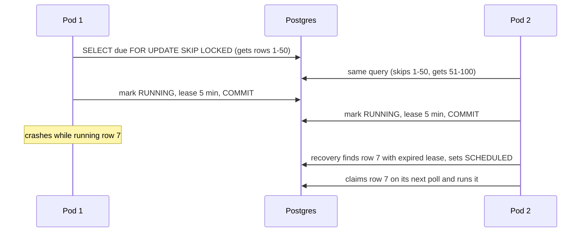
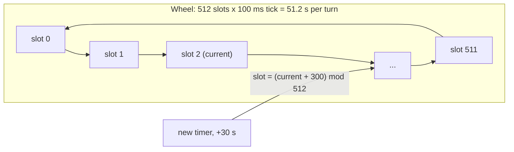

# Task Scheduler — L6 (Staff) LLD Interview

> **Level expectation:** the L5 scheduler lives in one process's memory. Now: *"We run 3 replicas behind a load balancer, deploy 10 times a day, and the nightly billing job must run exactly once, even across restarts. Some teams want millions of short timers."* You reason about durable state, many instances claiming work safely, at-least-once execution and idempotency, timer data structures at scale, clocks that jump, what to measure, and when not to build any of this. Read [L5-senior.md](L5-senior.md) first.

Legend: **🧑‍💼 Interviewer** · **🧑‍💻 Candidate** · **📝 Note** = commentary for you.

---

## 1. The new problems

**🧑‍💼 Interviewer:** You put your L5 scheduler in our service, which runs 3 pods. What breaks?

**🧑‍💻 Candidate:** Two things, immediately:
1. **Every pod runs every task.** Three pods each hold their own heap, so the 02:00 billing job runs **three times**. (A classic incident with Spring `@Scheduled` in a scaled-out service.)
2. **Restarts lose everything.** A deploy at 01:59 kills the heap: one-shot tasks scheduled for 02:00 vanish, retries in progress vanish.

So the schedule must live **outside** the process, and instances must **coordinate** who runs what.

---

## 2. Durable tasks: the database is the heap

```sql
CREATE TABLE scheduled_task (
  id            BIGSERIAL PRIMARY KEY,
  name          TEXT NOT NULL,
  schedule      TEXT NOT NULL,          -- 'once' | 'rate:10000' | 'cron:30 2 * * *'
  zone          TEXT,                   -- 'America/New_York' for cron
  payload       JSONB,                  -- what to do (handler name + arguments), as JSON
  next_run_at   TIMESTAMPTZ NOT NULL,   -- the heap key
  priority      INT NOT NULL DEFAULT 0,
  failures      INT NOT NULL DEFAULT 0,
  state         TEXT NOT NULL,          -- SCHEDULED | RUNNING | DONE | DEAD | CANCELLED
  locked_by     TEXT,                   -- which instance is running it
  lease_until   TIMESTAMPTZ             -- ownership expires at this time
);
CREATE INDEX due_tasks ON scheduled_task (next_run_at) WHERE state = 'SCHEDULED';
```

**🧑‍💻 Candidate:** `next_run_at` with an index plays the role of the heap: "earliest due tasks" is an index range scan, O(log n) like the heap (a database index is a sorted tree). A task's code can't be stored, so `payload` names a **handler** registered in the app ("send-reminder" → a Java class) plus its arguments. Cancel = `UPDATE … SET state = 'CANCELLED'`. After a restart, nothing needs loading: the table is the truth. [PostgreSQL](../../../HLD/technologies/postgresql.md) is a fine home for this; the load is tiny compared with what it handles.

The in-process dispatcher still exists, but instead of sleeping on an in-memory heap it **polls** the table every ~1 s (or keeps a small in-memory heap of the next minute's tasks, refreshed by polling). Polling is back, but now it's cheap: one indexed query per second per instance, not a scan of 100k tasks.

---

## 3. Many instances: claiming due rows safely

**🧑‍💻 Candidate:** Each instance runs this in a transaction:

```sql
SELECT id FROM scheduled_task
 WHERE state = 'SCHEDULED' AND next_run_at <= now()
 ORDER BY priority DESC, next_run_at
 LIMIT 50
 FOR UPDATE SKIP LOCKED;                  -- lock these rows; ignore rows others have locked
UPDATE scheduled_task
   SET state = 'RUNNING', locked_by = 'pod-2', lease_until = now() + interval '5 minutes'
 WHERE id = ANY(:ids);
COMMIT;
```

- `FOR UPDATE` locks the selected rows until commit; **`SKIP LOCKED`** makes other instances *skip* locked rows instead of waiting for them. Three pods polling at once each grab a **different** batch, with no blocking (available since PostgreSQL 9.5; MySQL 8.0 has it too).
- The claim is committed **before** running, so the DB lock is held for milliseconds, not for the task's whole duration.
- A **lease** (`lease_until`) is ownership that expires ([distributed locks & leases](../../../HLD/concepts/distributed-locks-and-leases.md)). If pod-2 crashes mid-task, a recovery query (`state = 'RUNNING' AND lease_until < now()` → back to `SCHEDULED`) lets another pod take over. Long tasks **renew** (heartbeat) their lease.
- On finish: one `UPDATE` sets `next_run_at` (recurring), `failures` + backoff (retry), or `DONE`/`DEAD`. All the L5 logic is unchanged; it just reads and writes rows.



**Alternative: one leader.** **Leader election** means the instances agree that exactly one of them is "in charge" at a time. Elect a single active scheduler (a Kubernetes `Lease` object, ZooKeeper/etcd, or a DB lock as the ShedLock library does for `@Scheduled`) and keep the L5 in-memory design on the leader.

| | Claim rows (`SKIP LOCKED`) | Single leader |
|---|---|---|
| Throughput | All instances execute | One instance dispatches (can still fan out to workers) |
| Failover | Per task, via lease expiry | Whole scheduler, via leader re-election (seconds) |
| Complexity | SQL + leases | Leader election + fencing (a token that lets downstream reject an old leader's late writes) |
| Fits | Many tasks, a job queue | Few cron jobs, "run once per cluster" |

---

## 4. At-least-once, so make tasks idempotent

**🧑‍💼 Interviewer:** Can you guarantee the billing job runs exactly once?

**🧑‍💻 Candidate:** Not the *execution*. Pod-2 can finish charging customers and crash before its `UPDATE … DONE` commits; the lease expires and another pod runs it again. Any lease-based system can also see a "paused" owner (long GC pause, a stop-the-world freeze of the JVM) whose lease expired while it was still working. So execution is **at-least-once** ([idempotency & delivery semantics](../../../HLD/concepts/idempotency-and-delivery-semantics.md)), and we make the **effect** exactly-once:

- Give every run an **idempotency key** = `task_id + nominal time`, e.g. `billing:2026-10-08`. That's why the code keeps `nominalAt` separate from retries' `runAt`: all retries of one occurrence share one key.
- Downstream records the key with a unique constraint (`INSERT … ON CONFLICT DO NOTHING`: a second insert with the same key is silently ignored) or passes it to the payment provider's idempotency header.
- If the task's effect is in the *same* database, do the work and the `next_run_at` update in **one transaction**: then it really is exactly-once.

Kubernetes says the same about CronJobs: in rare cases two Jobs or none may be created, so jobs should be idempotent.

---

## 5. Millions of timers: heaps vs timing wheels

**🧑‍💼 Interviewer:** A team wants a timeout per request: 1M requests in flight, each with a 30 s timer, 99% cancelled when the response arrives.

**🧑‍💻 Candidate:** A heap does O(log n) per insert and O(n) or lazy deletion per cancel: log₂(1,000,000) ≈ 20 comparisons per insert × 30,000 inserts/s (1M timers ÷ 30 s lifetime ≈ 33k/s) ≈ 600k comparisons/s plus 1M dead entries sitting in memory. Workable, but a **timing wheel** fits better ([timers, delay queues & timing wheels](../../concepts/timers-delay-queues-and-timing-wheels.md)):



- A ring of buckets, each holding timers due in that tick. Insert = compute the slot, append: **O(1)**. Cancel = unlink from the bucket's list: **O(1)**. Each tick, fire everything in the current bucket.
- Delays longer than one turn either store a "rounds remaining" counter (Netty's `HashedWheelTimer`, default 100 ms tick × 512 slots) or move up to a coarser wheel: **hierarchical** wheels (seconds → minutes → hours), like a clock's hands. Kafka uses hierarchical wheels for its "purgatory" of delayed requests (Confluent blog, 2015); the idea comes from Varghese & Lauck (1987).
- Price: precision = tick size (±100 ms), and an idle wheel still ticks. Great for timeouts; for "02:00 report" cron jobs the heap or the DB index is simpler.

---

## 6. Clocks that jump

**🧑‍💻 Candidate:** `System.currentTimeMillis()` is **wall-clock** time: what NTP (the network time protocol that syncs machine clocks) says the date is. It can **jump** forward or backward: NTP stepping a drifted clock, a VM resuming after migration, an admin fixing the date. `System.nanoTime()` is **monotonic**: it only moves forward, but it has no relation to the calendar and differs between machines.

| Question | Clock to use |
|---|---|
| "Run in 30 s", backoff, lease durations within one process | Monotonic (`nanoTime`) |
| "At 02:00 New York time" | Wall clock + zone, recomputed after a jump |
| Comparing times across machines (leases in a DB) | The **database's** `now()`, one clock for everyone, plus a safety margin for skew |

My code uses one wall-clock `TimeSource` for simplicity; `Condition.awaitNanos` itself waits on a monotonic clock, but `runAt` is in wall millis, so a backward jump of 1 hour would delay one-shot tasks by an hour. The JDK's `ScheduledThreadPoolExecutor` stores delays in `nanoTime` for exactly this reason; old `java.util.Timer` uses wall time and is affected. Production fix: keep delays in monotonic time and only cron schedules in wall time.

---

## 7. Observability: lag is the number

**🧑‍💻 Candidate:** The key metric is **lag = actual start − planned time** ([observability](../../../HLD/concepts/observability.md)), as a histogram (counts of values per bucket, so you can read percentiles) per task type. It catches every failure mode: too few workers, a dead dispatcher, a stuck DB poll, clock problems. Plus:

| Metric / alert | Catches |
|---|---|
| Lag p99 (the value 99% of runs stay under) > threshold | Overload, starvation, stuck dispatcher |
| Due-but-not-started count, oldest due task age | Backlog building up |
| Failures, retries, dead-letter size | Broken dependency; DLQ needs a human |
| Run duration per task | Runs approaching their period (overlap risk) |
| "Last success" per critical job | A **dead man's switch**: alert if billing hasn't succeeded in 26 h, even if nothing errored |

The last one matters most: a scheduler that silently stops scheduling produces no errors at all.

---

## 8. Build vs buy

| Option | Good for | Watch out |
|---|---|---|
| `ScheduledExecutorService` | In-process timers, simple periodic work | Memory only; exception stops a fixed-rate task |
| Spring `@Scheduled` + ShedLock | Cron in a scaled-out Spring app, once per cluster | Lock only; no retries, history or durability of one-shots |
| **Quartz** with JDBC JobStore | Durable cron + one-shot in Java; clustering via DB row locks; misfire instructions | Heavy (~11 tables), dated API |
| **db-scheduler** | Lightweight durable Java scheduler on one table; can claim with `SKIP LOCKED` | Smaller ecosystem |
| **Kubernetes CronJob** | Batch jobs as containers, per-run pods and logs | Minute granularity, pod start-up cost, at-least-once |
| **Temporal** | Durable timers inside long workflows ("wait 3 days, then…") | A whole platform to run or buy |
| **AWS EventBridge Scheduler** | Managed one-time / rate / cron with time zones, retries, DLQ | Cloud lock-in; invokes a target, doesn't run your code in-process |
| Sidekiq / Celery beat | Ruby / Python job systems with delayed jobs and retries | Language-specific |

**🧑‍💻 Candidate:** For our 3-pod service: nightly billing → a durable scheduler (db-scheduler or Quartz JDBC) with idempotency keys; request timeouts → an in-memory timing wheel; batch reports → a Kubernetes CronJob with `concurrencyPolicy: Forbid`. Building the L5 version is how you learn to choose between these.

---

## 9. Curveballs

**🧑‍💼 Interviewer:** "The nightly job ran twice last night." Where do you look?

**🧑‍💻 Candidate:** (1) Two replicas each with an in-memory scheduler (no coordination). (2) A lease shorter than the run, or a GC pause, so a second pod reclaimed it. (3) A DST fall-back day with a naive "every local 01:30" rule. (4) A retry after the work succeeded but before "done" was recorded. Fixes: coordination, lease renewal, a DST policy, idempotency keys; and the lag/run-count metrics to prove which one it was.

**🧑‍💼 Interviewer:** Where does this go next?

**🧑‍💻 Candidate:** To a **distributed job scheduler** as a service: **sharding** (splitting) millions of schedules across nodes, leader election per shard, exactly-once effects across services. That's the HLD Distributed Job Scheduler interview (roadmap #16, coming later); this table, the `SKIP LOCKED` claim and the idempotency key are its building blocks. Results of jobs often flow on through a log like [Kafka](../../../HLD/technologies/kafka.md).

---

## 10. What the interviewer was evaluating (L6)

- [ ] Saw that N replicas = N runs, and restarts lose in-memory tasks
- [ ] Durable task table with an index as the heap; handlers instead of code in the DB
- [ ] `FOR UPDATE SKIP LOCKED` claiming, leases with renewal, recovery of expired leases; compared with leader election
- [ ] At-least-once execution, idempotency keys from task + nominal time
- [ ] Heap vs (hierarchical) timing wheel, with numbers and precision trade-off
- [ ] Wall vs monotonic clocks; DB time for cross-machine comparisons
- [ ] Lag as the core metric; dead man's switch
- [ ] Build-vs-buy with concrete picks per use case

## 11. Common mistakes at this level

| Mistake | Why it hurts at L6 |
|---|---|
| `@Scheduled` in a horizontally scaled service (more replicas of the same app) with no lock | Every replica runs every job |
| Holding a DB row lock for the whole task duration | Long transactions, connection exhaustion, and Postgres `VACUUM` (its cleanup of old row versions) can't do its job |
| Leases without renewal for long tasks | A second instance starts while the first is still working |
| Claiming "exactly-once execution" | Impossible with crashes; make effects idempotent instead |
| Scheduling with wall-clock deltas | A clock jump delays or fires everything at once |
| Alerting only on errors | A scheduler that stops silently produces none |
| Building a distributed scheduler before checking Quartz / db-scheduler / CronJob / Temporal | Months spent re-learning their bugs |

⬅️ Previous: [L5-senior.md](L5-senior.md) · 🏠 [Problem overview](README.md)
