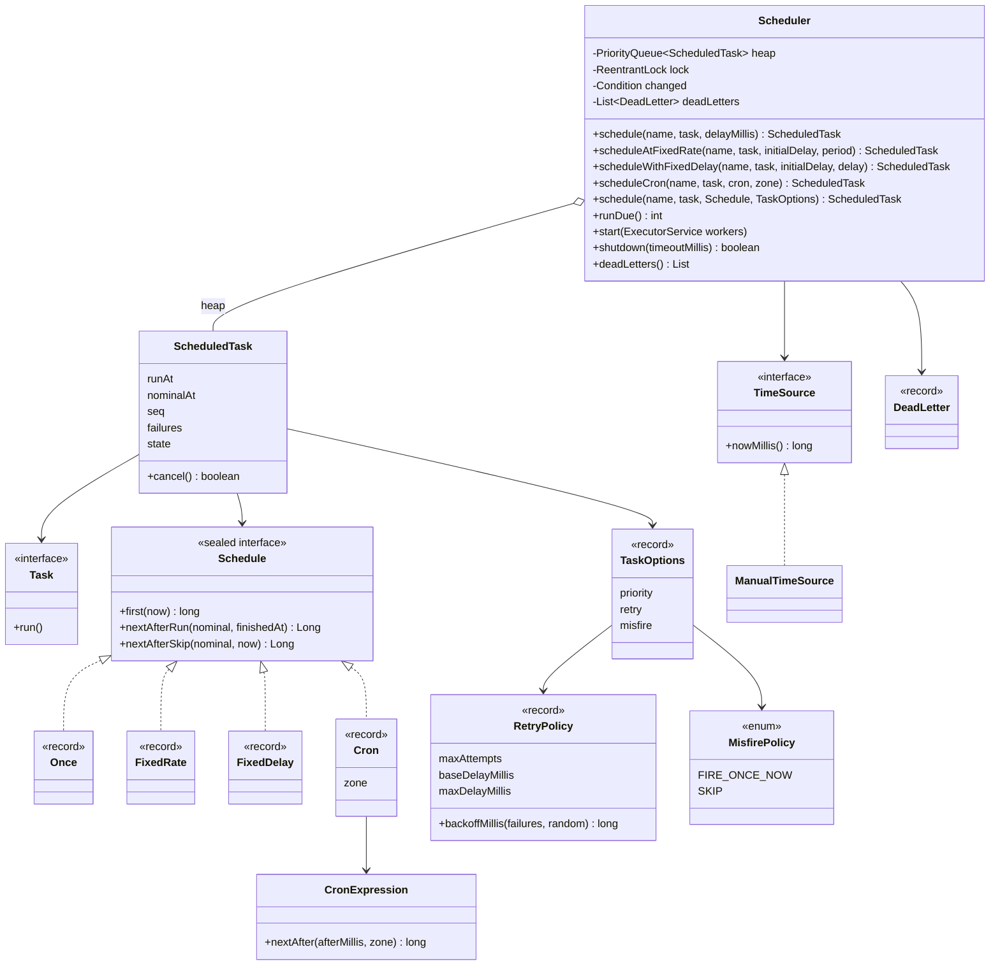

# LLD Interview: Design a Task Scheduler (cron-like, in-process)

> "Design a scheduler that runs tasks after a delay, at a fixed rate, or on a cron schedule. Tasks can fail and should be retried. Then make it correct under concurrency, time zones, and restarts."

A classic LLD question that looks like "wrap a `PriorityQueue`" and turns out to be about **time**. It teaches the ideas inside `cron`, Kubernetes CronJobs, `ScheduledExecutorService` and Quartz: a **min-heap of deadlines**, a **dispatcher that sleeps exactly until the next one** (and must be woken when an earlier task arrives), **worker pools**, **retries with backoff and jitter**, **fixed-rate vs fixed-delay**, **cron + time zones + daylight saving time**, **misfires**, and later **persistence and many instances** (L6). It's the LLD stepping stone to the Distributed Job Scheduler HLD interview (roadmap #16, coming later).

> 💡 **Terms in one line each** (details in the files):
> **min-heap**: a structure that always keeps the smallest item (here: the earliest task) on top. **Dispatcher**: the one thread that waits for the next due task. **Worker pool**: threads that actually run tasks. **Backoff / jitter**: wait longer after each failure / randomise that wait. **Dead letters (DLQ)**: tasks that failed every attempt, parked for a human. **DST (daylight saving time)**: the twice-a-year clock shift that skips or repeats a local hour. **Misfire**: a run found much later than planned. **`FOR UPDATE SKIP LOCKED`**: a SQL way for many instances to each grab rows nobody else has locked. **Lease**: ownership that expires unless renewed. **Timing wheel**: a ring of time buckets that handles millions of timers in O(1) each. **Monotonic clock**: a clock that only moves forward, unlike wall-clock time.

## How to read this folder

> 👉 **Never thought about what's inside cron? Start with [00-understand-the-product.md](00-understand-the-product.md).** It walks through a cart reminder, a nightly report and a failing webhook, and shows the heap + dispatcher + worker-pool mechanism.

| File | Level | What "good" looks like |
|---|---|---|
| [00-understand-the-product.md](00-understand-the-product.md) | Everyone, first | Know the features (one-shot, fixed rate/delay, cron, retries, misfires) and why each exists |
| [L4-mid.md](L4-mid.md) | Mid / SDE2 | Clean entities, min-heap by run time with a FIFO tie-break, one dispatcher + worker pool, lazy cancel, injectable clock, correct complexity |
| [L5-senior.md](L5-senior.md) | Senior | Retries with exponential backoff + full jitter → dead letters; fixed-rate vs fixed-delay with no overlap; cron next-fire with time zones and DST; misfire policies; priorities; graceful shutdown; the "dispatcher oversleeps" bug fixed with `Condition` |
| [L6-staff.md](L6-staff.md) | Staff | Surviving restarts (task table), many instances claiming work with `FOR UPDATE SKIP LOCKED` + leases, at-least-once + idempotency keys, timing wheels for millions of timers, wall vs monotonic clocks, lag as the key metric, build vs buy |

## Code (runnable, no dependencies)

| | Run | Files |
|---|---|---|
| ☕ Java 21 | `./java/run.sh` | [java/src/scheduler/](java/src/scheduler/): `Scheduler`, `ScheduledTask`, `Schedule` (Once / FixedRate / FixedDelay / Cron), `CronExpression`, `RetryPolicy`, `TaskOptions`, `MisfirePolicy`, `TimeSource` + `ManualTimeSource`; 14 tests in `SchedulerTests.java`; `Demo.java` prints a timeline |
| 🟨 Node 22 | `cd js && node --test` | [js/scheduler.js](js/scheduler.js), [js/scheduler.test.js](js/scheduler.test.js) (same design; no cron) |

**Design for testability:** the core takes a `TimeSource` (a one-method clock). Tests use `ManualTimeSource` and call `runDue()`, which runs everything due "now" on the calling thread, so almost every test is deterministic and takes microseconds. Only three tests use real threads and real time (wake-up, no-overlap, shutdown), each well under a second.

## Class diagram (matches the code)

## Libraries & concepts used

**Java:** [TreeSet & PriorityQueue](../../libraries/java/treeset-and-priorityqueue.md) · [ScheduledExecutorService](../../libraries/java/scheduled-executor-service.md) · [Executors & threads](../../libraries/java/executors-and-threads.md) · [Locks & synchronized](../../libraries/java/locks-and-synchronized.md) · [Blocking queues & producer-consumer](../../libraries/java/blocking-queues-and-producer-consumer.md) · [Concurrent collections](../../libraries/java/concurrent-collections.md) · [Java time API](../../libraries/java/java-time-api.md) · [Time & Clock](../../libraries/java/time-and-clock.md)

**JS:** [async/await & timers](../../libraries/js/async-await-and-timers.md) · [Event loop & concurrency](../../libraries/js/event-loop-and-concurrency.md) · [node:test runner](../../libraries/js/node-test-runner.md)

**Concepts:** [Timers, delay queues & timing wheels](../../concepts/timers-delay-queues-and-timing-wheels.md) · [Cron & recurring schedules](../../concepts/cron-and-recurring-schedules.md) · [Thread-safety basics](../../concepts/thread-safety-basics.md) · [State machines](../../concepts/state-machines.md) · [Scheduling algorithms](../../concepts/scheduling-algorithms.md) · [Design patterns](../../concepts/design-patterns.md) · [Big-O complexity](../../concepts/big-o-complexity.md) · [UML class diagrams](../../concepts/uml-class-diagrams.md)

**Related (HLD):** [Retries, backoff & DLQ](../../../HLD/concepts/retries-backoff-and-dlq.md) · [Idempotency & delivery semantics](../../../HLD/concepts/idempotency-and-delivery-semantics.md) · [Distributed locks & leases](../../../HLD/concepts/distributed-locks-and-leases.md) · [Observability](../../../HLD/concepts/observability.md) · [PostgreSQL](../../../HLD/technologies/postgresql.md) · [Kafka](../../../HLD/technologies/kafka.md)

## The core insight

1. **A scheduler is a priority queue of deadlines plus one thread that sleeps until the earliest one.** Min-heap by `runAt` (FIFO tie-break with a sequence number), no polling, and a wake-up signal whenever a new task becomes the earliest.
2. **"When next?" is a policy, not an accident.** Fixed rate plans from the planned start, fixed delay from the finish, cron from the calendar *in a time zone*; misfires, DST gaps and overlaps each get an explicit, tested rule.
3. **Never overlap, never lose silently.** A recurring task re-enters the heap only after its run finishes; failures retry with backoff + jitter and end in a dead-letter list, and lag (start − planned) is the number to alert on.
