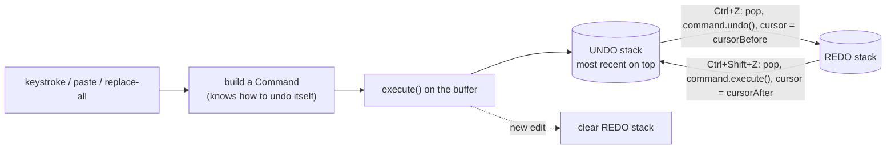

# Start Here: What Is a Text Editor With Undo/Redo? (Before the Interview)

> You use one all day: IntelliJ, VS Code, vim on a server, the commit-message editor, even the `kubectl edit` window. You press Ctrl+Z dozens of times an hour without thinking about it. This interview asks you to build the thing behind that key: **a document you can change at a cursor, and a history that can walk those changes backwards and forwards**, cheaply, even when the file is huge.
>
> Time: ~10 minutes. Then: [L4](L4-mid.md) → [L5](L5-senior.md) → [L6](L6-staff.md).

---

## 1. The problem as a story: the editor that ate the laptop

A teammate builds an internal "config editor" web tool. The first version is the simplest thing that works:

```java
String doc = Files.readString(path);
List<String> history = new ArrayList<>();          // for undo

void onKey(int cursor, char c) {
    history.add(doc);                              // save a full copy, so Ctrl+Z can go back to it
    doc = doc.substring(0, cursor) + c + doc.substring(cursor);
}
void undo() { doc = history.remove(history.size() - 1); }
```

It works on a 2 KB YAML file. Then someone opens a **50 MB log file** to annotate an incident, and three things go wrong:

1. **Undo eats the memory.** Every keystroke stores a full copy of the document (a **snapshot**: a complete copy of the state at one moment). 50 MB × 1,000 keystrokes = **50,000 MB = 50 GB**. The JVM (Java Virtual Machine, the process running the Java code) dies with `OutOfMemoryError` long before that.
2. **Every keystroke is slow.** A Java `String` is **immutable** (it can never be changed; "changing" it builds a new one). `substring + c + substring` copies all 50 MB on every key. Even a `StringBuilder` (a growable, changeable char array) has to **shift** every character after the cursor one slot to the right: typing in the middle moves ~25 MB per key. In [Big-O](../../concepts/big-o-complexity.md) terms (a way to say how cost grows with input size) that's **O(n)** per keystroke: cost proportional to the file size `n`.
3. **Undo feels wrong.** You type "hello" and press Ctrl+Z. One letter disappears, not the word. Press it four more times. Then you press Ctrl+Z after jumping to another line and the cursor stays where it is, so you can't even see what was undone.

The fixes, which are what this interview is about:

- Store **what changed** ("inserted `hello` at 120"), not the whole document. To undo, apply the **inverse** ("delete 5 chars at 120"). That's the **Command pattern** (L4).
- Group keystrokes into human-sized steps, and restore the cursor on undo (L5).
- Store the text in a structure where editing at the cursor doesn't shift the whole file: a **gap buffer**, **piece table** or **rope** (L5).
- For huge files and crashes: don't load the whole file, and keep a **journal** of edits so nothing is lost (L6).

---

## 2. Where you've seen this

| Place | What you saw |
|---|---|
| **IntelliJ / VS Code** | Ctrl+Z undoes a word or a burst of typing, not one letter. After undo, the cursor jumps back to where the change was. Edit → Redo (Ctrl+Shift+Z) re-applies it |
| **vim** | `u` undoes, Ctrl+R redoes. vim also keeps an **undo tree** (a history that branches instead of being thrown away, L6): `:undolist`, `g-` / `g+`, even `:earlier 10m` ("the file as it was 10 minutes ago") |
| **Google Docs** | File → Version history: named versions of the whole document, plus live undo while you type. Two people typing at once is a different, harder problem ([Collaborative Editor HLD](../../../HLD/interviews/collaborative-editor/README.md)) |
| **Photoshop** | The History panel: a list of steps ("Brush Tool", "Crop"), click one to go back. It keeps a limited number of states, set in Preferences, because each step can hold big image data |
| **`git revert <sha>`** | Doesn't delete the commit: it creates a **new commit that applies the inverse change**. Exactly the "undo = apply the inverse" idea (see [git object store](../../../under-the-hood/git-object-store.md)) |
| **Database `ROLLBACK`** | The database keeps an **undo log** (the old value of every row it changed) to put things back. See [undo & redo logs](../../concepts/undo-logs-and-redo-logs.md) and the [KV store LLD](../kv-store/README.md) |
| **`kubectl rollout undo`** | Goes back to the previous ReplicaSet revision. Kubernetes keeps `revisionHistoryLimit` (default 10) old revisions: a **bounded history**, same as an editor's undo limit |
| **Terraform plan / apply** | Not undo, but the same shape: describe a change as data first, then execute it |

---

## 3. The features, one situation at a time

### 3.1 Insert and delete at the cursor
You click after "Hello" and type ", world". The **cursor** (the blinking position between two characters, stored as a number 0..length) decides where text goes. Backspace deletes the character before it; the Delete key, the one after it.

👉 Interview: *a `TextBuffer` with `insert(pos, text)` and `delete(pos, len)`; `InsertCommand` and `DeleteCommand` (L4).*

### 3.2 Selection
You drag over "world". A **selection** is a range between an **anchor** (where the drag started) and the cursor. Typing now **replaces** the selection; Backspace deletes it.

👉 Interview: *typing over a selection = delete + insert, undone as one step (L5).*

### 3.3 Cut, copy, paste
Copy puts the selected text in a **clipboard** (a holding area for text). Copy changes nothing, so it must **not** appear in undo. Cut = copy + delete. Paste inserts the clipboard text, replacing the selection if there is one.

👉 Interview: *which actions are commands (cut, paste) and which aren't (copy, cursor moves) (L4).*

### 3.4 Undo and redo
Ctrl+Z steps back; Ctrl+Shift+Z steps forward again. Two **stacks** (last-in-first-out lists): undo pops from one and pushes onto the other.

👉 Interview: *two stacks of commands, each command knows its inverse (L4).*

### 3.5 A new edit after undo kills redo
You undo three times, then type "x". Redo is now greyed out. The three undone steps were made against a text that no longer exists, so replaying them would be wrong.

👉 Interview: *clear the redo stack on every new command (L4); vim's undo tree keeps them instead (L6).*

### 3.6 One undo step per word, not per letter
You type "hello" quickly. Ctrl+Z removes "hello" in one go. If you paused for a few seconds, or clicked elsewhere, the next typing is a separate step. This is **coalescing** (merging many small edits into one undo step).

👉 Interview: *merge adjacent single-char inserts within a time window; break on cursor jump or a new word (L5).*

### 3.7 The cursor comes back on undo
You typed something at line 40, scrolled to line 900, pressed Ctrl+Z. The editor jumps back to line 40 so you **see** what was undone.

👉 Interview: *each command stores `cursorBefore` / `cursorAfter` (L4, L5).*

### 3.8 Find and replace all
You rename `userId` to `accountId` in 37 places. One Ctrl+Z should bring back all 37, not one.

👉 Interview: *a **composite** command (`MacroCommand`) holding 74 small commands, undone in reverse order (L5).*

### 3.9 Big files
You open a 2 GB log in vim or VS Code. It opens in seconds and typing in the middle is instant. The editor did **not** copy 2 GB into a `StringBuilder`.

👉 Interview: *gap buffer vs piece table vs rope (L5); memory-mapped and lazily loaded files (L6).*

### 3.10 Saving, and surviving a crash
The laptop dies mid-edit. VS Code and vim reopen with your unsaved work (VS Code's "hot exit" backups, vim's `.swp` swap file). Saving never leaves a half-written file.

👉 Interview: *autosave journal of commands, write to a temp file + atomic rename (L6). See [file I/O & fsync](../../libraries/java/file-io-and-fsync.md).*

---

## 4. The key mechanism: two stacks of commands



A worked example, starting from an empty document:

| Action | Text | Undo stack (top first) | Redo stack |
|---|---|---|---|
| type "Hello" | `Hello` | Insert("Hello"@0) | |
| type " world" | `Hello world` | Insert(" world"@5), Insert("Hello"@0) | |
| Ctrl+Z | `Hello` | Insert("Hello"@0) | Insert(" world"@5) |
| type "!" | `Hello!` | Insert("!"@5), Insert("Hello"@0) | *(cleared)* |

Each entry is a few bytes plus the text it touched, not a copy of the document.

---

## 5. Try it yourself (real, 10 minutes)

1. **IntelliJ or VS Code:** type a sentence quickly, press Ctrl+Z: see how much disappears. Type a word, wait 5 s, type another, undo again. Click elsewhere and type; undo: the cursor jumps back. Do a Replace All (Ctrl+R in IntelliJ, Ctrl+H in VS Code) and undo it once.
2. **vim's undo tree** (any Linux box: `vim /tmp/x.txt`):
   ```
   ione<Esc>     then   u        " undo
   itwo<Esc>              " new branch: 'one' is NOT lost in vim
   :undolist              " shows the branches (leaf numbers)
   g-  g-  g+             " walk the history by time, across branches
   :earlier 1m            " the text as it was a minute ago
   ```
3. **Feel the O(n) insert** in `jshell` (Java's interactive shell):
   ```java
   var sb = new StringBuilder("x".repeat(50_000_000));      // a 50 MB document
   long t = System.nanoTime();
   for (int i = 0; i < 1_000; i++) sb.insert(25_000_000 + i, 'a');   // type 1,000 chars in the middle
   System.out.println((System.nanoTime() - t) / 1_000_000 + " ms");   // ~2,000 ms when this was written: ~2 ms per key
   ```
   Then try `sb.append('a')` 1,000 times: about 40 µs (microseconds, millionths of a second) in total. The cost is the **shift** of ~25 MB per key, not the insert. 2 ms per key sounds fine until a replace-all touches 10,000 places: 10,000 × 2 ms = 20 s.
4. **`git revert`** in any repo: `git revert HEAD` and look at `git show`: the new commit is the inverse diff.
5. **Run this folder's code:** `./java/run.sh` prints a typing session, undo history labels, and a timing table for the three buffers.

---

## 6. From experience to requirements

| What you experienced | Requirement | Type |
|---|---|---|
| Typing, Backspace, Delete | Insert/delete at the cursor; Backspace at 0 does nothing | Functional |
| Dragging over text | Selection; typing or pasting replaces it | Functional |
| Clipboard | Cut, copy, paste; copy is not undoable | Functional |
| Ctrl+Z / Ctrl+Shift+Z | Unlimited-feeling undo and redo | Functional |
| Redo greyed out after typing | New edit clears the redo stack | Functional |
| "Undo removes a word" | Coalesce typing bursts; break on pause, cursor jump, new word | Functional |
| Cursor jumps back | Undo/redo restore the cursor | Functional |
| Replace all | One undo step for the whole operation | Functional |
| Undo history menu | Each step has a readable label | Functional |
| 50 MB log file | Keystroke cost independent of file size; history memory proportional to edits, not file size | Non-functional |
| Long sessions | Bounded history (oldest steps dropped) | Non-functional |
| Smooth typing | Keystroke to screen in < 16 ms (one frame at 60 Hz) | Non-functional |
| Laptop crash | No lost work, no half-written file | Non-functional |

---

## 7. Mini glossary

| Term | Meaning in plain words |
|---|---|
| **Buffer** | The in-memory storage holding the document's characters |
| **Cursor** | The current edit position, a number from 0 to length |
| **Selection / anchor** | A highlighted range / the end of it that stays put while the cursor moves |
| **Command** | One edit stored as an object that can `execute()` and `undo()` itself |
| **Inverse operation** | The edit that cancels another (insert ↔ delete) |
| **Snapshot / Memento** | A saved copy of the state, restored as a whole |
| **Undo / redo stack** | Last-in-first-out lists of done / undone commands |
| **Coalescing** | Merging small consecutive edits into one undo step |
| **Composite / macro command** | A command made of several commands, undone as one |
| **Undo tree** | History that keeps branches instead of discarding redo (vim) |
| **Gap buffer** | An array with an empty "gap" at the cursor so typing there is cheap |
| **Piece table** | The original text + an append-only buffer of typed text + a list of slices |
| **Rope** | A balanced tree of string chunks |
| **O(n)** | Cost grows in proportion to the size of the input |
| **Atomic rename** | Replacing a file in one step, so readers see the old or the new, never half |

➡️ **Now build it:** [L4-mid.md](L4-mid.md)
