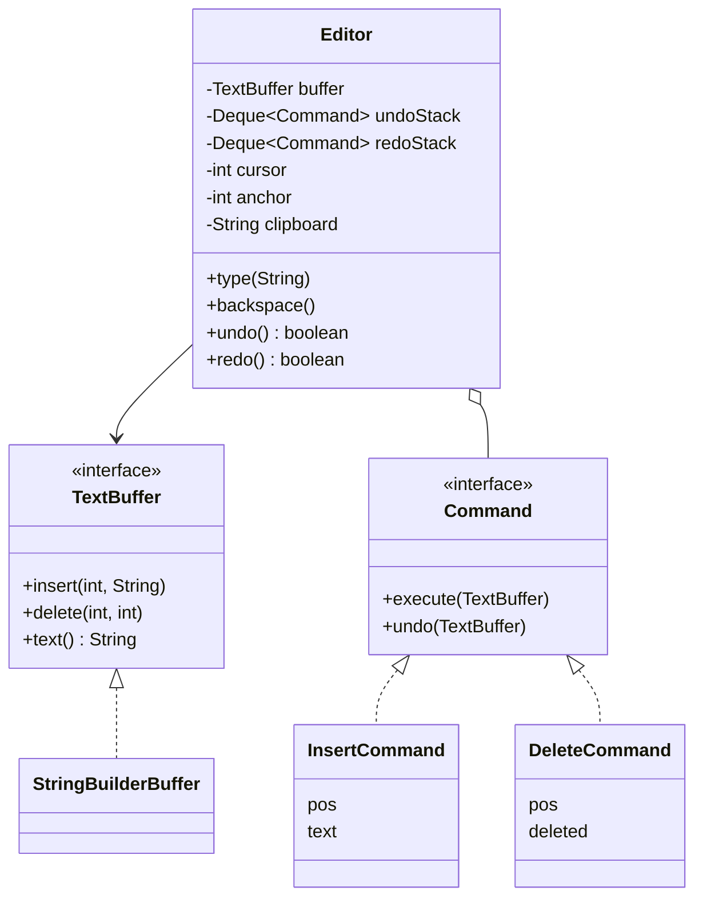
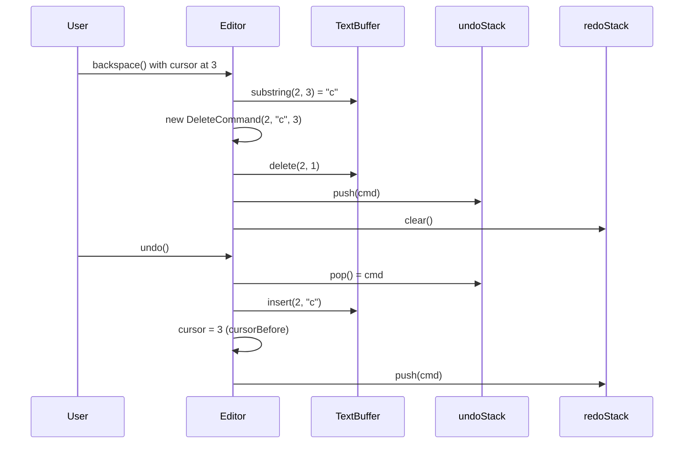

# Text Editor with Undo/Redo — L4 (Mid-level / SDE2) LLD Interview

> **Level expectation:** model the editor with clean classes: a **text buffer**, a **cursor**, and every edit as a **Command** object with `execute()` and `undo()`. Undo/redo with **two stacks**, and you know why a **new edit clears redo**. You can explain why storing **inverse operations** beats storing **full copies**, with numbers, and that a `StringBuilder` buffer makes typing in the middle **O(n)**.

> 🆕 Never thought about what Ctrl+Z does inside an editor? Read [00-understand-the-product.md](00-understand-the-product.md) first.

Legend: **🧑‍💼 Interviewer** · **🧑‍💻 Candidate** · **📝 Note** = commentary for you.

---

## 1. Clarifying requirements

**🧑‍💼 Interviewer:** Design a simple text editor that supports typing, deleting, and undo/redo.

**🧑‍💻 Candidate:** Some questions first:
- **Plain text or rich text?** Bold, fonts, images change the model a lot.
- **One cursor or many?** Multi-cursor editing (several cursors typing the same thing at once, VS Code's Alt+Click) multiplies every operation.
- **Selection and clipboard?** Cut/copy/paste in scope?
- **How much undo?** Unlimited, or a fixed number of steps?
- **Undo granularity:** one step per keystroke, or per word like IDEs do?
- **File size:** a commit message, or a 50 MB log?
- **Single user?** Two people editing at once is a different problem.

**🧑‍💼 Interviewer:** Plain text, one cursor, one user. Selection and clipboard yes. Undo per keystroke is fine for now; we'll talk about grouping later. Files up to a few MB.

**🧑‍💻 Candidate:**

**Functional:** type text at the cursor; Backspace and Delete; move the cursor; select a range; cut, copy, paste; undo and redo any number of steps; after undo, a new edit discards the redo history.

**Non-functional:** undo/redo memory proportional to the size of the *edits*, not the document; each keystroke fast enough to feel instant (well under one screen frame, ~16 ms); single-threaded (all edits come from one UI thread, like every desktop editor).

> 📝 **Note:** "Single user?" is the question that shows you know where the cliff is. Collaborative editing (Google Docs) needs **operational transformation** (rewriting each remote edit's positions to account for edits made at the same time) or **CRDTs** (data types where every character has its own ID, so edits merge in any order) ([Collaborative Editor HLD](../../../HLD/interviews/collaborative-editor/README.md)); naming it and scoping it out is the right L4 move.

---

## 2. Core entities

**🧑‍💻 Candidate:**

| Entity | Responsibility |
|---|---|
| `TextBuffer` (interface) | Stores characters: `insert(pos, text)`, `delete(pos, len)`, `charAt`, `length`, `text`. Knows nothing about cursors or undo |
| `StringBuilderBuffer` | First implementation, backed by a `StringBuilder` |
| `Editor` | Owns the buffer, the **cursor** (an `int` from 0 to length), an optional **selection** (an anchor position plus the cursor), the clipboard, and the two stacks. Turns user actions into commands |
| `Command` (interface) | One edit as an object: `execute(buffer)`, `undo(buffer)`, plus the cursor before and after |
| `InsertCommand` | Remembers `pos` and `text`. Undo = delete `text.length()` chars at `pos` |
| `DeleteCommand` | Remembers `pos` and the **deleted text**. Undo = insert it back |

Two things are deliberately **not** commands: moving the cursor and copying. They don't change the document, so Ctrl+Z shouldn't step through them.

This is the **Command pattern** ([design patterns](../../concepts/design-patterns.md), more in [command & memento](../../concepts/command-and-memento.md)): a request turned into an object, so it can be stored, undone, replayed or logged. You've used the same idea in infra: a Terraform plan is "the change as data" before it's applied.

---

## 3. Interfaces

```java
public interface TextBuffer {
    void insert(int pos, String text);   // 0 <= pos <= length()
    void delete(int pos, int len);
    char charAt(int index);
    int length();
    String text();
}

public sealed interface Command permits InsertCommand, DeleteCommand, MacroCommand {
    void execute(TextBuffer buffer);
    void undo(TextBuffer buffer);        // exactly reverses execute()
    int cursorBefore();                  // restored on undo
    int cursorAfter();                   // restored on redo
}

public final class Editor {
    public void type(String s);
    public void backspace();
    public void deleteForward();
    public void moveTo(int pos);
    public void select(int from, int to);
    public void cut();  public void copy();  public void paste();
    public boolean undo();               // false if nothing to undo
    public boolean redo();
    public String text();  public int cursor();
}
```

`sealed` means only the listed classes may implement `Command`, so the compiler knows every kind of command ([sealed interfaces](../../libraries/java/sealed-interfaces-and-pattern-matching.md)). The commands are **records** (Java's compact immutable data classes, [records & immutability](../../libraries/java/records-and-immutability.md)): a command describes a past edit, and the past shouldn't change.

---

## 4. Class diagram



Notation: [UML class diagrams](../../concepts/uml-class-diagrams.md). The full design (gap buffer, piece table, `MacroCommand`) is in the [README](README.md#class-diagram-matches-the-code).

---

## 5. Deep dives

### 5.1 The commands

**🧑‍💻 Candidate:**

```java
public record InsertCommand(int pos, String text, int cursorBefore) implements Command {
    public void execute(TextBuffer b) { b.insert(pos, text); }
    public void undo(TextBuffer b)    { b.delete(pos, text.length()); }
    public int cursorAfter()          { return pos + text.length(); }
}

public record DeleteCommand(int pos, String deleted, int cursorBefore) implements Command {
    public void execute(TextBuffer b) { b.delete(pos, deleted.length()); }
    public void undo(TextBuffer b)    { b.insert(pos, deleted); }
    public int cursorAfter()          { return pos; }
}
```

**🧑‍💼 Interviewer:** Where does `deleted` come from?

**🧑‍💻 Candidate:** The editor reads it from the buffer **before** creating the command: `new DeleteCommand(cursor - 1, buffer.substring(cursor - 1, cursor), cursor)`. After the delete runs, the text is gone; a `DeleteCommand(pos, len)` that only stored a length could never be undone. This is the same rule as a database **undo log**: save the old value before you overwrite it ([undo & redo logs](../../concepts/undo-logs-and-redo-logs.md)).

> 📝 **Note:** "Delete stores only a length" is the most common L4 bug in this question. Insert can get away with a length on undo; delete can't.

### 5.2 Two stacks

```java
private final Deque<Command> undoStack = new ArrayDeque<>();   // ArrayDeque: a fast stack; push/pop at the head
private final Deque<Command> redoStack = new ArrayDeque<>();

private void run(Command c) {             // every NEW edit goes through here
    c.execute(buffer);
    cursor = c.cursorAfter();
    undoStack.push(c);
    redoStack.clear();                    // the old "future" no longer applies
}

public boolean undo() {
    Command c = undoStack.poll();         // poll = pop, but returns null when empty
    if (c == null) return false;
    c.undo(buffer);
    cursor = c.cursorBefore();            // show the user where the change was
    redoStack.push(c);
    return true;
}

public boolean redo() {
    Command c = redoStack.poll();
    if (c == null) return false;
    c.execute(buffer);
    cursor = c.cursorAfter();
    undoStack.push(c);                    // NOT run(): redo must not clear the redo stack
    return true;
}
```



**🧑‍💼 Interviewer:** Why clear redo on a new edit? Can't we keep it?

**🧑‍💻 Candidate:** A redo command stores positions relative to the text *as it was* when it was undone. Say I undo "insert 'world' at 6", then type "X" at 0. Redo would insert "world" at 6, but position 6 now means something different: everything shifted by one. Replaying it blindly corrupts the text. So the linear model throws it away. vim keeps it as a branch of an **undo tree** (L6); that only works because vim walks back to the branch point first, never replays onto a different text.

> 📝 **Note:** Explaining *why* redo is cleared (positions are only valid against the exact text they were recorded on) is the seed of operational transformation. Saying it here is a strong signal.

### 5.3 Inverse operations vs snapshots, with numbers

**🧑‍💼 Interviewer:** Why not just save a copy of the text before each edit? Much simpler.

**🧑‍💻 Candidate:** It is simpler, and for a 1 KB text field it's fine. For our size:

| | Snapshot per edit | Command per edit |
|---|---|---|
| Memory per step | The whole document: 5 MB | ~40 bytes of object overhead + the edited text (1 char = a few bytes) |
| 1,000 keystrokes | 1,000 × 5 MB = **5,000 MB** | 1,000 × ~50 B = **~50 KB** |
| Time per step | Copy 5 MB: milliseconds | Nothing extra |
| Undo | Swap in the saved copy | Apply the inverse |

So history memory grows with **what the user typed**, not with the **file size**. Snapshots win when the inverse is hard to compute (a "sort lines" or "reformat file" action) or the state is tiny; that's the **Memento** pattern, in L5.

### 5.4 The first buffer and its cost

**🧑‍💻 Candidate:** `StringBuilderBuffer` wraps a `StringBuilder`: a `char` array (or `byte` array with **compact strings**: since Java 9, text that's all Latin-1, the 256-character Western European set, uses 1 byte per char) with spare capacity at the end.

```java
public void insert(int pos, String text) { sb.insert(pos, text); }   // shifts everything after pos
public void delete(int pos, int len)     { sb.delete(pos, pos + len); }
```

**🧑‍💼 Interviewer:** What does a keystroke cost?

**🧑‍💻 Candidate:** Appending at the end is **amortised O(1)** (usually instant; occasionally the array doubles, and averaged over many appends that's still constant per append). Inserting at position `pos` must shift all `n - pos` characters after it: **O(n)** ([Big-O](../../concepts/big-o-complexity.md)). It's one `System.arraycopy`, a **memmove** (the CPU's bulk memory copy), so it's fast per byte. Measured in `Demo.java`: typing 100,000 characters one by one into the middle of a 1,000,000-character document took **1,149 ms** with `StringBuilder` and **9 ms** with a gap buffer. In `jshell` on a 50 MB document, 1,000 middle inserts took ~2 s: about 2 ms per key. That's within a frame budget for one keystroke, but a replace-all with 10,000 hits would be 10,000 × 2 ms = 20 s. The fix (gap buffer, piece table, rope) is L5; the point here is that the `TextBuffer` interface lets us swap it without touching any command.

> 📝 **Note:** At L4 it's enough to name the O(n) cost and design the interface so it can be replaced. Knowing *which* structure to swap in is the L5 bar.

---

## 6. Follow-ups

**🧑‍💼 Interviewer:** How do cut, copy and paste fit?

**🧑‍💻 Candidate:** Copy only writes the clipboard: not a command. Cut = copy + `DeleteCommand` of the selection. Paste = `InsertCommand` of the clipboard at the cursor; if there's a selection, it's a delete *and* an insert, and the user expects one undo for both. That needs a command made of commands (L5's `MacroCommand`).

**🧑‍💼 Interviewer:** Undo of the typing "hello" takes five Ctrl+Z. Users complain.

**🧑‍💻 Candidate:** Merge consecutive single-character inserts that are adjacent and close in time into one command: **coalescing**. The `InsertCommand` at the top of the stack becomes "hello" instead of five commands. Details (time window, word boundary, cursor jump) are L5.

**🧑‍💼 Interviewer:** What if undo throws halfway?

**🧑‍💻 Candidate:** Commands only call `insert` and `delete` with positions that were valid when they were recorded, and the stacks guarantee they replay against the same text. So an exception means a bug, not a user error. I'd surface it loudly rather than swallow it, since the document may now be inconsistent with the history; L6 covers testing this with random edit sequences.

**🧑‍💼 Interviewer:** Is this thread-safe?

**🧑‍💻 Candidate:** No, on purpose. Desktop editors apply edits on one UI thread (Swing's event dispatch thread, the single thread Java's Swing toolkit runs all screen code on; or the browser's main thread). Background work (syntax highlighting, search) reads a snapshot or posts results back to that thread.

---

## 7. What the interviewer was evaluating (L4)

- [ ] Asked about rich text, multi-cursor, file size and multi-user, and scoped them
- [ ] Separated storage (`TextBuffer`) from history (`Command`, stacks) from user actions (`Editor`)
- [ ] Command with `execute` / `undo`; delete captures the text before deleting
- [ ] Two stacks; redo cleared on a new edit, and why; redo doesn't clear redo
- [ ] Cursor restored on undo and redo
- [ ] Inverse operations vs snapshots with memory arithmetic
- [ ] Knows `StringBuilder.insert` in the middle is O(n), and the interface allows replacing it

## 8. Common mistakes at this level

| Mistake | Why it's wrong |
|---|---|
| Snapshot of the whole document per keystroke | Memory = file size × edits; dies on big files |
| `DeleteCommand` storing only `pos` and `len` | Nothing to put back on undo |
| Keeping the redo stack after a new edit | Replays positions against a text they weren't recorded on: corruption |
| `redo()` going through the same path as a new edit | It clears the redo stack, so a second redo does nothing |
| Copy and cursor moves on the undo stack | Ctrl+Z appears to do nothing; users press it again and lose real edits |
| Editor logic inside the buffer (or vice versa) | Can't swap the buffer; can't test history without a real buffer |
| Using `String` and `+` for the document | A new full copy on every keystroke |

➡️ Next: [L5-senior.md](L5-senior.md)
