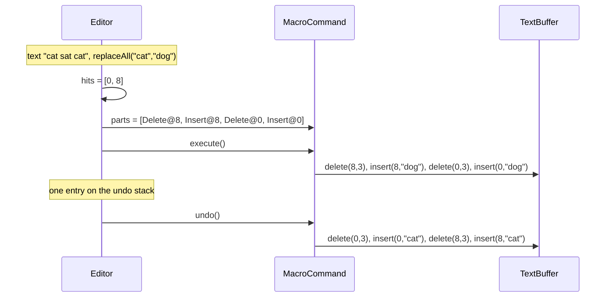
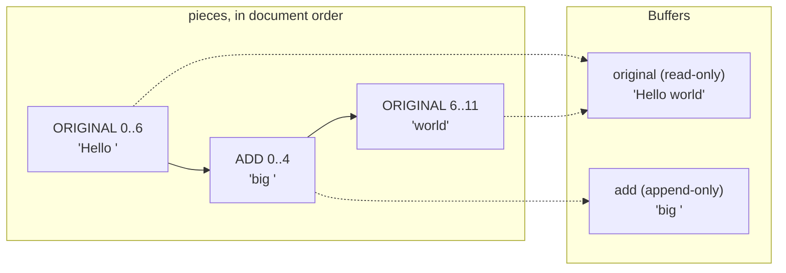

# Text Editor with Undo/Redo — L5 (Senior) LLD Interview

> **Level expectation:** take the L4 editor and make undo **feel right**: know when a **Memento** (snapshot) beats a **Command**, **coalesce** keystrokes into word-sized steps with clear rules, wrap replace-all in a **composite** command, **bound** the history, restore the **cursor**. Then switch to storage: explain the **gap buffer**, **piece table** and **rope**, their costs, who uses which, and how to answer "go to line 50,000" fast. All with deterministic tests. Read [L4-mid.md](L4-mid.md) first.

Legend: **🧑‍💼 Interviewer** · **🧑‍💻 Candidate** · **📝 Note** = commentary for you.

---

## 1. Requirements (what's new vs L4)

**🧑‍💻 Candidate:**
- **Word-sized undo:** typing "hello world" quickly gives two undo steps, not eleven.
- **Composite edits:** replace-all, paste over a selection and typing over a selection are each **one** undo step.
- **Bounded history:** at most N steps (configurable); the oldest are forgotten.
- **Cursor restore:** undo puts the cursor where the change was.
- **Big documents:** typing anywhere in a 50 MB file must not cost O(file size) per key (O(n): cost proportional to the size `n`, see [Big-O](../../concepts/big-o-complexity.md)).
- **Go to line N** quickly.

---

## 2. History deep dives

### 2.1 Command vs Memento: when snapshots win

**🧑‍💼 Interviewer:** L4 said "store inverses, not snapshots". Is that always right?

**🧑‍💻 Candidate:** No. A **Command** stores the change and knows its inverse. A **Memento** stores a snapshot of the state, captured and restored by the object itself, so outsiders can't poke inside it ([command & memento](../../concepts/command-and-memento.md), [design patterns](../../concepts/design-patterns.md)).

| | Command (inverse op) | Memento (snapshot) |
|---|---|---|
| Memory per step | Size of the edit | Size of the state |
| Undo cost | Apply the inverse: proportional to the edit | Swap in the saved state |
| Needs an inverse? | Yes, and it must be exactly right | No |
| Good for | Text inserts/deletes | "Sort lines", "Reformat file", rich-text style changes across many runs, image filters (Photoshop's history keeps image data for steps like a blur) |
| Risk | A subtly wrong `undo()` silently corrupts text | Memory blow-up on big state |

The two mix well: a `SnapshotCommand` whose `undo()` restores a saved copy of **only the affected region** ("lines 10–400 before sort"). Big state with many steps uses **checkpoints + commands**: a full snapshot every K steps, commands in between. Same trade-off as a database's periodic snapshot plus write-ahead log ([durability, WAL & snapshots](../../concepts/durability-wal-and-snapshots.md)), and git stores full snapshots cheaply by sharing unchanged pieces ([git object store](../../../under-the-hood/git-object-store.md)).

> 📝 **Note:** Not being dogmatic is the L5 signal: "Command by default, Memento for operations whose inverse is expensive or error-prone, and a region snapshot as the middle ground."

### 2.2 Coalescing: one undo step per word

**🧑‍💼 Interviewer:** Define exactly when two keystrokes become one undo step.

**🧑‍💻 Candidate:** **Coalescing** = merging a new small edit into the command already on top of the undo stack. My rules ([Editor.java](java/src/editor/Editor.java)), all must hold:

| Rule | Why |
|---|---|
| New edit is a **single typed character** | Paste or multi-char input is its own step |
| Top of the undo stack is an `InsertCommand` | You don't merge typing into a delete or a replace-all |
| New char lands exactly at `last.end()` | Adjacent: still the same burst of text |
| Less than **1 s** since the previous keystroke (the window is configurable) | A pause usually means a new thought |
| No cursor move, undo, redo or other command in between (`mayCoalesce` flag) | A click elsewhere starts a new step |
| Not "first letter after a space" | `"hello "` + `"w"` starts a new word |

```java
private boolean canCoalesce(InsertCommand cmd, long now) {
    if (!mayCoalesce || cmd.text().length() != 1) return false;
    if (!(undoStack.peek() instanceof InsertCommand last)) return false;   // pattern matching on the sealed type
    if (last.end() != cmd.pos()) return false;
    if (now - lastTypedAtMillis > coalesceWindow.toMillis()) return false;
    boolean lastEndsWithSpace = Character.isWhitespace(last.text().charAt(last.text().length() - 1));
    return !(lastEndsWithSpace && !Character.isWhitespace(cmd.text().charAt(0)));
}
```

When it merges, `last.append(c)` returns a **new** record "hell" + "o" (records are immutable, [records](../../libraries/java/records-and-immutability.md)) that replaces the top of the stack, and the redo stack is cleared as for any new edit.

**🧑‍💼 Interviewer:** How do you test "1 second" without a flaky test?

**🧑‍💻 Candidate:** Time comes from an injected `java.time.Clock` ([time & Clock](../../libraries/java/time-and-clock.md)). Tests use a `ManualClock` that only moves when told. `coalescingBreaksAfterATimeGap` types "abc" 100 ms apart, advances 2 s, types "def": two steps, and undo leaves "abc". `eachWordIsItsOwnUndoStep` checks the history labels are `["Typing \"world\"", "Typing \"hello \""]`. `coalescingBreaksOnCursorJump` checks that even moving back to the exact same spot starts a new step: simpler to reason about than "was it really a jump?".

> 📝 **Note:** Real editors differ in the details (some group by word, some by time, some break on newline). Stating *your* rules as a table and testing each one matters more than matching any one editor.

### 2.3 Composite commands: replace-all as one step

**🧑‍💻 Candidate:** `MacroCommand` holds a list of commands and is itself a `Command`: the **Composite** pattern (a group that is used exactly like a single item).

```java
public record MacroCommand(String label, List<Command> parts, int cursorBefore, int cursorAfter) implements Command {
    public void execute(TextBuffer b) { for (Command c : parts) c.execute(b); }
    public void undo(TextBuffer b) { for (int i = parts.size() - 1; i >= 0; i--) parts.get(i).undo(b); }   // REVERSE order
}
```

Undo must run in reverse: each part's positions are valid only against the text its own `execute()` saw.

**🧑‍💼 Interviewer:** Replace "cat" with "tiger" in "cat cat". The second "cat" moves after the first replacement. How do you get positions right?

**🧑‍💻 Candidate:** Find all hits in the original text, then build the parts **from the last hit to the first**. Replacing at position 4 doesn't shift position 0, so every recorded position stays valid. The alternative is tracking a running offset; going backwards removes that bookkeeping. The same composite gives **paste over a selection** (delete selection + insert) and **typing over a selection**. Test `replaceAllIsOneUndoStep` uses replacements both longer and shorter than the search text.



### 2.4 Bounded history

**🧑‍💼 Interviewer:** Unlimited undo for an editor open for a week?

**🧑‍💻 Candidate:** The undo stack is an `ArrayDeque` (a double-ended queue: fast add/remove at both ends). New commands go on the head; when the size passes `maxHistory`, `removeLast()` drops the **oldest**. Test `boundedHistoryDropsOldest`: max 3, five edits, undo everything → the first two edits stay.

A count limit is a proxy. What we actually care about is memory: one step can be a single char or a 10 MB paste. A better budget is **bytes**: sum the text held by each command and drop the oldest until under, e.g., 50 MB. Arithmetic: 10,000 typing steps × ~60 bytes ≈ 600 KB, nothing; one 10 MB paste-then-delete keeps 10 MB in the `DeleteCommand`. So: count limit for simplicity, byte limit for safety. Kubernetes does the same with `revisionHistoryLimit`.

### 2.5 Cursor and selection restoration

Every command records `cursorBefore` and `cursorAfter`. Undo sets `cursor = cursorBefore`, redo sets `cursor = cursorAfter`, so the user always **sees** the change (test `cursorRestoredOnUndoAndRedo`: the user scrolls to the top, undoes, and the cursor goes back to position 4). A coalesced command keeps the **first** keystroke's `cursorBefore`. Production editors also restore the **selection**: undoing "delete selection" re-selects the restored text. That's one more field (`selectionBefore`) on the command; I kept the code to cursor only.

---

## 3. The buffer: three data structures

**🧑‍💼 Interviewer:** The 50 MB file. `StringBuilder` shifts ~25 MB per keystroke. What do real editors use?

### 3.1 Gap buffer (Emacs)

**🧑‍💻 Candidate:** One array with an empty **gap** at the cursor. Typing writes into the gap: O(1). Moving the edit point moves the gap, copying only the characters between the old and new position.

```
                         (_ = free slot in the gap, · = a space character)
"Hello| world"   →   [H e l l o _ _ _ _ _ _ · w o r l d]      gapStart=5, gapEnd=11
type "!"         →   [H e l l o ! _ _ _ _ _ · w o r l d]      gapStart=6, gapEnd=11
move to 0        →   [_ _ _ _ _ H e l l o ! · w o r l d]      gapStart=0, gapEnd=5: copied 6 chars
```

```java
private void moveGap(int pos) {
    if (pos < gapStart) {                       // gap moves left: chars [pos, gapStart) jump to the right side
        int n = gapStart - pos;
        System.arraycopy(buf, pos, buf, gapEnd - n, n);
        gapStart = pos; gapEnd -= n;
    } else if (pos > gapStart) {                // gap moves right
        int n = pos - gapStart;
        System.arraycopy(buf, gapEnd, buf, gapStart, n);
        gapStart = pos; gapEnd += n;
    }
}
```

Insert at the gap: **amortised O(1)** (when the gap fills, the array doubles; averaged over many inserts that's constant). Moving: **O(distance)**. People edit near where they just edited, so most moves are short. Weakness: a jump from line 1 to the end of a 50 MB file copies 50 MB once, and multi-cursor edits far apart move the gap back and forth. Emacs has used a gap buffer for decades.

### 3.2 Piece table (VS Code, historically MS Word)

Two buffers that are **never edited in place**, plus a list of **pieces** (slices) saying what to read in order:



Insert = append the typed text to `add`, split one piece, splice a new one in. Delete = shrink or split pieces. **No document text is ever moved.** Consecutive typing extends the last add piece instead of adding one per key (test `pieceTableNeverTouchesOriginalAndMergesTyping`: four keystrokes, still three pieces).

Why it's attractive: the original file can stay on disk or memory-mapped (L6), and since nothing is overwritten, an old version is just an old piece list: cheap snapshots for undo. The cost: finding the piece for a position. My code scans an `ArrayList` (O(pieces)); **VS Code** stores pieces in a **red-black tree** (a self-balancing binary search tree), giving O(log pieces) lookups, which it calls a "piece tree" (VS Code blog, "Text Buffer Reimplementation", 2018). The piece table goes back to the Bravo editor at Xerox PARC in the 1970s and was used by early Microsoft Word (widely reported; I haven't checked a primary source for Word).

### 3.3 Rope (xi-editor, Zed)

A **rope** is a balanced tree whose leaves hold short strings (say up to 1 KB) and whose inner nodes store the total length of their left subtree. Find position `i` by walking down: O(log n). Insert = split a leaf, add one, rebalance. It came from the paper "Ropes: an Alternative to Strings" (Boehm, Atkinson, Plass, 1995). xi-editor (2016) is built on a rope; Zed uses a rope built on its own "SumTree", a B-tree-like structure (a wide balanced tree with many children per node) (from Zed's engineering blog; I haven't verified the details). Ropes shine when edits are spread everywhere (multi-cursor, search-replace) and because tree nodes can be **shared** between versions (a new version reuses every untouched subtree, a **persistent** data structure), an old version is kept almost for free: good for undo and for background threads reading a stable snapshot.

### 3.4 Comparison

| | `StringBuilder` | Gap buffer | Piece table (list / tree) | Rope |
|---|---|---|---|---|
| Insert at cursor | O(n) shift | O(1) amortised | O(pieces) / O(log pieces) | O(log n) |
| Insert far away | O(n) | O(distance) gap move | same as above | O(log n) |
| `charAt(i)` | O(1) | O(1) | O(pieces) / O(log pieces) | O(log n) |
| Load a 2 GB file | Copy all of it | Copy all of it | Nothing copied: one piece pointing at the file | Build the tree: O(n) |
| Old versions for undo | Copy | Copy | Keep an old piece list | Share nodes |
| Code complexity | Trivial | Small (~100 lines) | Medium | Highest (balancing) |
| Used by | Small text fields | Emacs | VS Code (tree), early MS Word | xi, Zed, Helix (via the `ropey` library) |

Measured (`Demo.java`, one run, not asserted in tests): typing 100,000 chars one at a time into the middle of a 1,000,000-char document: `StringBuilder` 1,149 ms, `GapBuffer` 9 ms (it copied 500,000 chars once to move the gap to the middle, then never again), `PieceTable` 14 ms (3 pieces). More in [gap buffers, piece tables & ropes](../../concepts/gap-buffers-piece-tables-and-ropes.md).

> 📝 **Note:** You don't need to code a rope in the interview. Draw the gap buffer, explain the piece table with the two-buffer picture, name the rope's O(log n), and pick one for the stated access pattern.

### 3.5 Line index: "go to line 50,000"

Every structure above is indexed by **character offset**, but users think in lines. Scanning for `\n` is O(n). Keep a **line index**: a sorted array of the offsets where each line starts. Go-to-line is an array lookup; finding the line of an offset is a binary search, O(log lines). Each edit shifts the offsets after it, which is O(lines) in an array; VS Code's piece tree avoids that by storing line-break counts inside tree nodes, and a rope can do the same in its inner nodes.

---

## 4. Follow-ups

**🧑‍💼 Interviewer:** Multi-cursor: type "x" with 3 cursors.

**🧑‍💻 Candidate:** One `MacroCommand` with three inserts, applied from the **last cursor to the first** (same trick as replace-all) so earlier positions don't shift. All cursors move; one undo step.

**🧑‍💼 Interviewer:** Where does SOLID show up here?

**🧑‍💻 Candidate:** Open/closed (add behaviour by adding classes, not editing old ones) and dependency inversion (depend on interfaces, not concrete classes) ([SOLID](../../concepts/solid-principles.md)): `Editor` depends on the `TextBuffer` interface, so adding a rope touches no command; a new edit type is a new `Command` class. The sealed interface trades a bit of openness for compiler-checked `switch`es over command kinds.

---

## 5. What the interviewer was evaluating (L5)

- [ ] Command vs Memento with a real criterion; region snapshots and checkpoints as middle ground
- [ ] Coalescing rules stated precisely and tested with an injected clock
- [ ] Composite command; reverse-order undo; replace-all built back-to-front
- [ ] Bounded history (count, ideally bytes) dropping the oldest
- [ ] Cursor (and ideally selection) restored on undo/redo
- [ ] Gap buffer mechanics and costs; piece table two-buffer model; rope's O(log n)
- [ ] A comparison with "who uses what" and a choice justified by access pattern
- [ ] Line index for go-to-line

## 6. Common mistakes at this level

| Mistake | Why it hurts at L5 |
|---|---|
| Undoing macro parts in forward order | Later parts' positions are wrong when earlier ones are reverted first |
| Replace-all positions computed left to right without offsets | Every replacement after the first lands in the wrong place |
| Coalescing by time only | Clicking elsewhere and typing within 1 s merges two unrelated edits |
| Coalescing that forgets to clear redo | The merge is a new edit too |
| History bounded by count only | One huge paste can still hold hundreds of MB |
| "Use a rope, it's always best" | More code and slower `charAt` than a gap buffer for single-cursor typing |
| Piece table with a piece per keystroke | Millions of pieces; extend the last add piece |
| Searching `\n` from the start for every go-to-line | O(n) per jump on a 50 MB file |

⬅️ Previous: [L4-mid.md](L4-mid.md) · ➡️ Next: [L6-staff.md](L6-staff.md)
