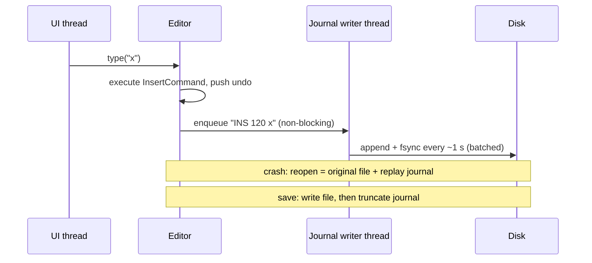
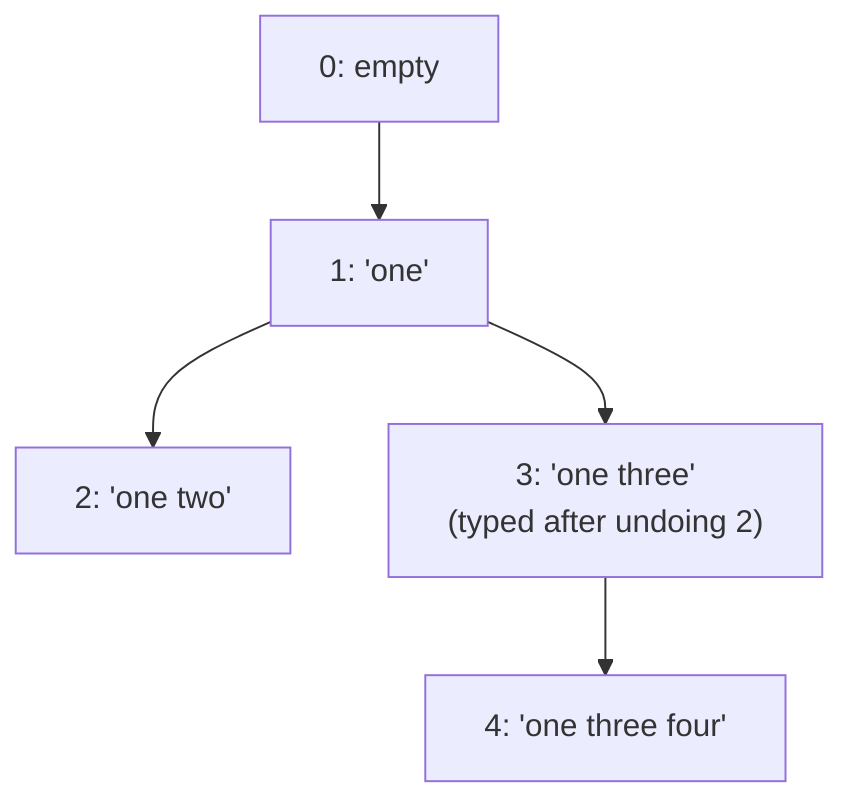

# Text Editor with Undo/Redo — L6 (Staff) LLD Interview

> **Level expectation:** the L5 editor is correct for one person and a few MB. Now: *"Our editor must open 5 GB log files, never lose work when the laptop dies, keep undo across restarts, and next year two people will edit the same file."* You reason about **huge files** (memory mapping, lazy loading), **crash safety** (journal, atomic save), **persistent undo**, **undo trees**, **why the command model breaks with two writers**, **selective undo**, **latency budgets**, **property-based testing** and **extensibility**, and you say what not to build. Read [L5-senior.md](L5-senior.md) first.

Legend: **🧑‍💼 Interviewer** · **🧑‍💻 Candidate** · **📝 Note** = commentary for you.

---

## 1. The new problems

**🧑‍💼 Interviewer:** Your L5 design works. What breaks first?

**🧑‍💻 Candidate:** Four assumptions in L5 are false at this scale:
1. **"The file fits in memory."** A 5 GB log doesn't fit comfortably in a JVM heap (the memory area Java objects live in), and reading it all takes seconds before the first frame.
2. **"Work lives in memory until save."** A crash, kernel panic or `kill -9` loses everything since the last save.
3. **"History dies with the process."** Users expect to reopen a file and still undo.
4. **"Positions are stable."** A command says "insert at 120". With a second writer, 120 means something else by the time it arrives.

---

## 2. Very large files

**🧑‍💻 Candidate:** Arithmetic first. 5 GB as Java `char`s (2 bytes each) is 10 GB of heap; even as Latin-1 bytes it's 5 GB, and reading it at ~1 GB/s from SSD (solid-state disk) is 5 s before anything appears. The user wants to see line 1 in under a second and maybe jump to the end. So: **don't load it, don't copy it.**

- **Memory-map the file.** `FileChannel.map()` asks the OS to make the file appear as a region of memory; pages (4 KB blocks) are read from disk only when touched, and the OS page cache (the kernel's in-memory copy of recently used file blocks) keeps hot ones. One Java mapping is limited to 2 GB (`MappedByteBuffer` uses `int` offsets), so map in chunks. See [file I/O & fsync](../../libraries/java/file-io-and-fsync.md).
- **Piece table over a read-only original.** This is why the piece table fits big files: the "original" buffer **is** the mapped file, never written; all edits live in the small add buffer and the piece list. Opening = one piece covering 5 GB. That's O(1) to open.
- **Lazy line index.** Counting newlines in 5 GB takes seconds, so build the line index in the background, chunk by chunk, and show "line ?" in the status bar until it's done. Jumping to 50% of the file works by byte offset immediately.
- **Danger: the file changes underneath.** If another process truncates a mapped file, touching a vanished page crashes the access (`SIGBUS` on Linux, which Java surfaces as an `InternalError`). Log files being written while you read them are exactly this case. Options: watch the file and reload, open a private copy (copy-on-open, slow for 5 GB), or treat the file as append-only and only map up to the size seen at open.
- **Render only what's visible.** 60 lines on screen, so only those are laid out and highlighted (**virtualization**: drawing just the visible window of a huge list).

> 📝 **Note:** "Opening is O(1) with a piece table over a memory-mapped original, and the risk is the file changing underneath" is the L6 answer. Most candidates stop at "use a rope".

---

## 3. Persistence and crash recovery

### 3.1 Never lose work: a journal of commands

**🧑‍💻 Candidate:** Commands are already a precise, small description of every change, so they double as a **write-ahead journal** (a WAL: an append-only log written before the change is considered safe, [durability, WAL & snapshots](../../concepts/durability-wal-and-snapshots.md)):

- **Batch the `fsync`** (the call that forces data from the OS cache onto the disk). One per keystroke at ~1–10 ms each would blow the latency budget; once a second means a crash loses at most ~1 s of typing. That's the same durability-vs-latency knob as `appendfsync everysec` in Redis.
- **Never on the UI thread.** The editor hands the record to a writer thread through a queue.
- **Each record carries the base**: a hash of the file it applies to. Replaying onto a different file version would corrupt it.
- **Checkpoint**: on save, the journal is truncated. VS Code's "hot exit" and vim's `.swp` swap file solve the same problem (their exact formats differ from this).

### 3.2 Saving without ever leaving half a file

Writing over the original in place means a crash mid-write leaves a truncated file: worse than losing the edits. The safe sequence:

1. Write the full content to `notes.txt.tmp` in the **same directory** (rename only works atomically within one filesystem).
2. `fsync` the temp file (its bytes are on disk).
3. **Rename** `notes.txt.tmp` → `notes.txt`. On POSIX filesystems (POSIX: the Unix standard Linux and macOS follow) rename is **atomic**: any reader sees the old file or the new one, never a mix. In Java: `Files.move(tmp, target, ATOMIC_MOVE)`.
4. `fsync` the **directory**, so the rename itself survives a power cut.

Then delete the journal. If a mapped original is being replaced, re-map after the rename, since the old mapping still points at the old file's data.

### 3.3 Undo across sessions

**🧑‍💼 Interviewer:** The user closes the editor, reopens tomorrow, presses Ctrl+Z.

**🧑‍💻 Candidate:** Persist the undo stack (the command records) next to the file, with a **hash of the text it applies to**. On open, if the file's hash matches, load the history; if anyone changed the file outside the editor, discard it, because every stored position may now be wrong. vim does this with `:set undofile` (an undo file per edited file, ignored when the text doesn't match). Bound it by bytes, and keep it out of the repo (`.gitignore`), since undo history can contain text the user deleted on purpose, like a pasted password.

---

## 4. Undo tree vs linear history

**🧑‍💻 Candidate:** Linear history throws away the redo branch on a new edit (L4). An **undo tree** keeps it:

Each node is a state; each edge is a command. Undo walks to the parent; redo needs a choice of child (vim takes the most recent; `g-` / `g+` walk all states **by time**, `:undolist` lists the leaves, `:earlier 10m` jumps by clock time). Moving between branches = undo up to the common ancestor, then redo down the other branch, so every command still replays against the exact text it was recorded on. Emacs takes a third route: undo is itself recorded as an edit, so nothing is ever lost, but the history gets confusing.

| | Linear (most editors) | Undo tree (vim, Emacs `undo-tree` package) |
|---|---|---|
| Lost history | Redo branch after a new edit | Nothing |
| Memory | Bounded by one path | Grows with every branch: needs pruning |
| UX | Obvious | Powerful, needs a visualiser |

My choice for a mainstream editor: linear for Ctrl+Z, plus a separate **local history** of saved snapshots (like IntelliJ's Local History) for "I want the version from an hour ago".

---

## 5. Two writers: where the command model breaks

**🧑‍💼 Interviewer:** Next year two people edit the same document. Can we send each other our commands?

**🧑‍💻 Candidate:** Not as they are. Text is "abc". Alice inserts "X" at 0; Bob, at the same moment, deletes the char at 2 ("c"). Alice receives "delete at 2" and deletes "b", because her "X" shifted everything right. Positions are only valid against the exact text they were recorded on: the same reason L4 clears redo.

Two families of fixes ([Collaborative Editor HLD](../../../HLD/interviews/collaborative-editor/README.md)):
- **Operational transformation (OT)**: before applying a remote operation, **transform** it against the concurrent local ones ("delete at 2" becomes "delete at 3" because an insert happened before position 2). Google Docs is built on OT.
- **CRDTs** (conflict-free replicated data types): give every character a unique, stable ID instead of a position, so "delete char #b7" means the same thing everywhere, in any order.

And undo changes meaning: Ctrl+Z must undo **my** last change, not Bob's, even if Bob typed after me. That's **selective undo**.

---

## 6. Selective undo

Undoing a change that isn't the most recent: "revert the rename I did 10 steps ago, keep everything after it". The inverse of step 10 was recorded against the text *before* steps 11–20, so it must be **transformed** through them first, exactly like OT. If a later step touched the same text (step 15 edited inside the renamed word), the undo **conflicts** and the editor must refuse or ask. That's precisely `git revert <old-sha>` and its merge conflicts ([git object store](../../../under-the-hood/git-object-store.md)). Building this for single-user editing is rarely worth it; it falls out almost for free once you have OT or a CRDT for collaboration.

---

## 7. Performance budget

**🧑‍💻 Candidate:** One frame at 60 Hz is 1000 ms / 60 = **16.7 ms**; at 120 Hz, 8.3 ms. Keystroke-to-pixel must fit, with headroom:

| Step | Budget | How |
|---|---|---|
| Buffer edit + push command | < 0.1 ms | Gap buffer / piece tree; coalescing appends to a small string |
| Line index update | < 0.5 ms | Incremental: only lines after the edit shift, stored as counts in tree nodes |
| Syntax highlighting (colouring keywords, strings, comments) | < 3 ms | Incremental re-parse of the changed region only; full re-highlight in the background |
| Layout + paint | < 8 ms | Visible lines only |
| Journal | 0 ms on the UI thread | Queue to a writer thread |

Track **p99 keystroke latency** (the 99th percentile: the slowest 1 in 100 keystrokes) as a metric, the same way you'd alert on p99 request latency, because users notice the occasional 100 ms stall, not the average. GC pauses (garbage collector stopping the program to free memory) are the classic stall in a JVM editor: allocating one `String` per keystroke is fine, copying the document is not.

---

## 8. Testing with properties

**🧑‍💻 Candidate:** Example tests ("type abc, undo, expect ab") miss the bugs that matter: an off-by-one in one rare combination. **Property-based testing** checks rules that must hold for **any** input, using many random inputs:

| Property | In this folder |
|---|---|
| Every buffer agrees with a trivial reference (`StringBuilder`) after any edit sequence | `randomEditsAllBuffersAgreeWithStringBuilder`: 2,000 random edits, 3 buffers |
| Undo everything = the original text; redo everything = the final text | `randomEditorSessionUndoesBackToOriginal`: typing, selections, cut/paste, replace-all, undo/redo, pauses |
| Same session on different buffers = same text and cursor at every step | same test, checked after each of 2,000 steps |
| `undo(execute(s)) == s` for every command | implied by the above |

**Seeded** randomness (`new Random(42)`) makes a failure replayable. Production libraries add **shrinking** (automatically cutting a failing 2,000-step sequence down to the 3 steps that matter): jqwik for Java, fast-check for JS. I also checked the tests can fail: changing `DeleteCommand.undo()` to re-insert at the cursor instead of the original position fails `undo backspace: expected abcdef but was abdcef`; an off-by-one in `GapBuffer.moveGap()` fails `expected Hello, world but was Hello,l worl`; removing `redoStack.clear()` fails `a new edit clears the redo stack`.

> 📝 **Note:** "How do you know your undo is right?" is a favourite L6 question. "Undo-all returns the original, over thousands of random sessions, on every buffer" is a crisp answer.

---

## 9. Plugins and extensions

**🧑‍💻 Candidate:** Extensions (formatters, refactorings, AI completions) must edit **through commands**, never by writing to the buffer directly, or undo breaks: the history no longer describes the text. The API gives them an edit builder; everything they do in one call becomes one `MacroCommand` and one undo step. VS Code's extension API works this way (`TextEditor.edit()` with options for where undo stops go). Two more rules: an extension's edit is rejected if the document changed since it read it (a version number check, like **optimistic locking**: don't lock, but refuse the write if someone else changed the data since you read it), and long-running extensions run off the UI thread (VS Code runs them in a separate process) so a slow plugin can't freeze typing. Macro recording is then free: record the commands, replay them.

---

## 10. Curveballs

**🧑‍💼 Interviewer:** "Undo is slow after a long session."

**🧑‍💻 Candidate:** Probably a `MacroCommand` with thousands of parts (a replace-all on a big file) applied one `insert`/`delete` at a time on an O(n) buffer: 10,000 × 2 ms = 20 s. Either switch buffers, or give replace-all a **region snapshot** undo (Memento for that one command, L5).

**🧑‍💼 Interviewer:** "Build vs buy?"

**🧑‍💻 Candidate:** For a product, embed a proven editor component (Monaco, the editor inside VS Code; CodeMirror, a browser editor library; Scintilla, a C++ editing component used by Notepad++) and spend the effort on the domain features. Build the buffer and history yourself only when the editor **is** the product.

---

## 11. What the interviewer was evaluating (L6)

- [ ] Arithmetic for huge files; memory mapping, lazy line index, piece table over a read-only original; the "file changes underneath" risk
- [ ] Journal of commands with batched fsync off the UI thread; atomic save (temp, fsync, rename, fsync dir)
- [ ] Persistent undo guarded by a content hash
- [ ] Undo tree vs linear, with a reasoned choice
- [ ] Why positions break with two writers; OT vs CRDT at a high level; per-user and selective undo
- [ ] A latency budget per stage; p99, not average
- [ ] Property-based tests with invariants, seeds, and proof the tests can fail
- [ ] Extensions edit through commands; build vs buy

## 12. Common mistakes at this level

| Mistake | Why it hurts at L6 |
|---|---|
| Reading a 5 GB file into the heap | Seconds to open, gigabytes of memory, GC pauses |
| `fsync` on every keystroke, on the UI thread | Typing stutters at disk speed |
| Saving by overwriting the file in place | A crash mid-save truncates the user's file |
| Reloading persistent undo without checking the file hash | Undo corrupts a file changed by `git pull` |
| Sending raw position-based commands between users | Edits land in the wrong place |
| Global undo in a shared document | Ctrl+Z removes a colleague's work |
| Plugins writing to the buffer directly | History and text disagree; undo corrupts |
| Only example-based tests for undo | Rare off-by-ones ship |

⬅️ Previous: [L5-senior.md](L5-senior.md) · 🏠 [Problem overview](README.md)
