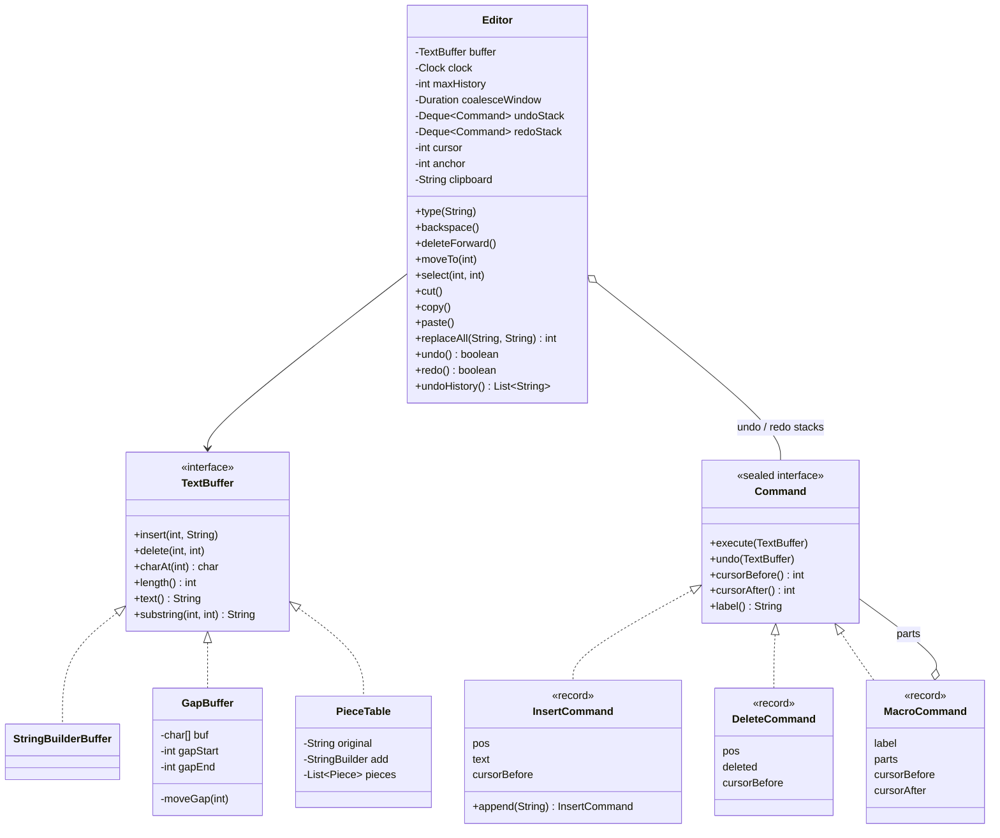

# LLD Interview: Design a Text Editor with Undo/Redo (like IntelliJ / VS Code / vim)

> "Design the core of a text editor: insert and delete at a cursor, cut/copy/paste, and undo/redo. Then make it fast for big files."

A classic LLD question with two halves that interviewers move between: **the history** (how undo/redo works) and **the storage** (how the text is kept so that typing in the middle of a big file is cheap). It teaches the **Command pattern** (each edit is an object that can undo itself), why **inverse operations beat snapshots**, the **two-stack** undo/redo model and why a new edit clears redo, **coalescing** keystrokes into word-sized undo steps, **composite** commands for replace-all, **bounded history**, and the three classic text structures: **gap buffer** (Emacs), **piece table** (VS Code, historically MS Word) and **rope**. At L6: **huge files**, **crash recovery with a journal and atomic save**, **undo trees**, **why undo breaks when two people edit** (the bridge to collaborative editing), and **property-based testing**.

> 💡 **Terms in one line each** (details in the files):
> **Buffer**: the in-memory storage of the document's characters. **Cursor**: the edit position, a number 0..length. **Command pattern**: an action stored as an object with `execute()` and `undo()`. **Inverse operation**: the edit that cancels another (insert ↔ delete). **Memento**: a saved snapshot of an object's state, restored as a whole. **Coalescing**: merging consecutive small edits into one undo step. **Composite / macro command**: several commands undone as one. **Gap buffer**: an array with an empty gap at the cursor so typing there is O(1). **Piece table**: a read-only original + an append-only "add" buffer + a list of slices. **Rope**: a balanced tree of text chunks, O(log n) edits anywhere. **O(n)**: cost grows with the size of the input. **Undo tree**: history that keeps branches instead of discarding them. **Journal / WAL**: an append-only file of changes written before they're considered done. **Atomic rename**: replacing a file in one step, so nobody ever sees half of it.

## How to read this folder

> 👉 **Never thought about what Ctrl+Z actually does? Start with [00-understand-the-product.md](00-understand-the-product.md).** It walks through an internal config editor that dies on a 50 MB log file, and shows the two-stack mechanism with a worked example.

| File | Level | What "good" looks like |
|---|---|---|
| [00-understand-the-product.md](00-understand-the-product.md) | Everyone, first | Know the features (cursor, selection, clipboard, undo/redo, redo cleared, word-sized undo, cursor restore, replace-all, big files, crash safety) and why each exists |
| [L4-mid.md](L4-mid.md) | Mid / SDE2 | Entities (`TextBuffer`, `Editor`, `Command`, `InsertCommand`, `DeleteCommand`); Command pattern with `execute` / `undo`; two stacks; redo cleared on a new edit; delete must capture the text *before* deleting; inverse operations vs snapshots with numbers; `StringBuilder` as the first buffer and its O(n) middle insert |
| [L5-senior.md](L5-senior.md) | Senior | Memento vs Command (when snapshots win); coalescing rules (time window, adjacency, word boundary, cursor jump); `MacroCommand` for replace-all and typing over a selection; bounded history; cursor/selection restore; gap buffer, piece table, rope with a comparison table; line index for "go to line" |
| [L6-staff.md](L6-staff.md) | Staff | Huge files (memory mapping, lazy loading, piece table over a read-only original); crash recovery (journal of commands, autosave, temp file + fsync + atomic rename); persistent undo; undo tree vs linear; why command undo breaks with two users (transform, link to the collaborative editor HLD); selective undo; 16 ms budget; property-based tests; plugins as commands |

## Code (runnable, no dependencies)

| | Run | Files |
|---|---|---|
| ☕ Java 21 | `./java/run.sh` | [java/src/editor/](java/src/editor/): `TextBuffer` interface with `StringBuilderBuffer`, `GapBuffer`, `PieceTable`; sealed `Command` with records `InsertCommand`, `DeleteCommand`, `MacroCommand`; `Editor` (cursor, selection, clipboard, undo/redo stacks, coalescing with an injected `Clock`, bounded history, replace-all); `ManualClock`; 18 tests in `EditorTests.java` (each buffer passes the same contract tests; two seeded random-session tests); `Demo.java` with a timing table |
| 🟨 Node 22 | `cd js && node --test` | [js/editor.js](js/editor.js), [js/editor.test.js](js/editor.test.js): `GapBuffer` and `Editor` with private `#fields`, undo/redo, coalescing with an injected `now()`, replace-all, bounded history (8 tests, including a seeded random-edit property test) |

**Design for testability:** time comes from an injected `java.time.Clock` ([time & Clock](../../libraries/java/time-and-clock.md)), so "typed 2 seconds later" is exact and no test sleeps. The buffer is an interface, so every contract test loops over all three implementations. Two **property tests** (tests that check a rule over many random inputs instead of one hand-picked example) run 2,000 seeded random edits: all buffers must agree with `StringBuilder`, and undoing every step must return the exact original text. Breaking one line of `GapBuffer.moveGap()` or of `DeleteCommand.undo()` makes the tests fail (checked).

Sample demo output (timings are from one run on the machine used to write this; yours will differ):

```
--- Typing "Hello world" one key every 120 ms ---
  text="Hello world|"  (| = cursor at 11)  undo=2 redo=0
  undo history (newest first): [Typing "world", Typing "Hello "]
--- 3 s pause, then "!!" ---
  undo history: [Typing "!!", Typing "world", Typing "Hello "]
--- Replace all "l" -> "L" (one undo step) ---
  text="worLd|HeLLo "  (| = cursor at 5)  undo=5 redo=0
  undo history: [Replace all "l", Paste, Delete "world", Typing "world", Typing "Hello "]
--- Timing: typing 100,000 chars one by one into the middle of a 1,000,000-char document ---
  StringBuilderBuffer    1149 ms  (every insert shifts ~500,000 chars)
  GapBuffer                 9 ms  (chars copied by gap moves: 500,000)
  PieceTable               14 ms  (pieces: 3)
```

## Class diagram (matches the code)



## Libraries & concepts used

**Java:** [Records & immutability](../../libraries/java/records-and-immutability.md) · [Sealed interfaces & pattern matching](../../libraries/java/sealed-interfaces-and-pattern-matching.md) · [Time & Clock](../../libraries/java/time-and-clock.md) · [File I/O & fsync](../../libraries/java/file-io-and-fsync.md)

**JS:** [Classes & private fields](../../libraries/js/classes-and-private-fields.md) · [node:test runner](../../libraries/js/node-test-runner.md)

**Concepts:** [Command & Memento](../../concepts/command-and-memento.md) · [Gap buffers, piece tables & ropes](../../concepts/gap-buffers-piece-tables-and-ropes.md) · [Design patterns](../../concepts/design-patterns.md) · [Undo & redo logs](../../concepts/undo-logs-and-redo-logs.md) · [Durability, WAL & snapshots](../../concepts/durability-wal-and-snapshots.md) · [Big-O complexity](../../concepts/big-o-complexity.md) · [SOLID principles](../../concepts/solid-principles.md) · [State machines](../../concepts/state-machines.md) · [UML class diagrams](../../concepts/uml-class-diagrams.md)

**Related:** [Collaborative Editor (HLD)](../../../HLD/interviews/collaborative-editor/README.md) (what changes when two people edit at once) · [KV Store with transactions (LLD)](../kv-store/README.md) (the same undo-log idea for `ROLLBACK`) · [How git stores objects](../../../under-the-hood/git-object-store.md) (snapshots done cheaply by sharing unchanged parts)

## The core insight

1. **Store the change, not the world.** An undo history of inverse operations costs memory proportional to what you *typed*, not to the size of the file. Snapshots (Memento) are the right tool only when the inverse is hard to compute or the state is small.
2. **History is a user-experience feature, not just a data structure.** The two stacks are easy; what makes undo feel right is the rules around them: clear redo on a new edit, merge a typed word into one step, treat replace-all as one step, put the cursor back.
3. **The buffer and the history are separate decisions.** Commands only call `insert` and `delete`, so the storage can go from `StringBuilder` to a gap buffer or piece table without touching undo. Pick the storage from the access pattern: edits clustered at a cursor (gap buffer), huge files and cheap history (piece table), edits everywhere and concurrency (rope).
