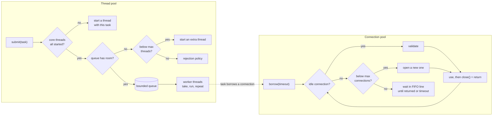

# Start Here: What Are Thread Pools and Connection Pools? (Before the Interview)

> You configure them all the time: `server.tomcat.threads.max`, `spring.datasource.hikari.maximum-pool-size`, `@Async`, `Executors.newFixedThreadPool(8)`. You've probably also been paged for one: "HikariPool-1 - Connection is not available, request timed out after 30000ms". This interview asks you to build the thing behind those settings: a **bounded set of expensive resources** that many callers share, with a **queue** for whoever has to wait and **rules** for what happens when the wait gets too long.
>
> Time: ~10 minutes. Then: [L4](L4-mid.md) → [L5](L5-senior.md) → [L6](L6-staff.md).

---

## 1. The problem as a story: the Black Friday outage

An order service handles each HTTP request like this, because it was the simplest thing that worked:

```java
new Thread(() -> {
    Connection db = DriverManager.getConnection(url, user, pass);   // a brand-new DB connection
    // ... run two queries, write the response ...
    db.close();
}).start();
```

At 50 requests per second it's fine. On Black Friday traffic hits 3,000 requests per second, and three things break in the same minute:

1. **Threads are expensive to create.** Each `new Thread` asks the operating system (OS) for a real thread: a **syscall** (a call from our program into the OS kernel, much slower than a normal method call), plus a **stack**: the memory where a thread keeps its method calls and local variables. On 64-bit Linux the JVM (Java Virtual Machine) reserves about **1 MB** of address space per thread stack by default (`-Xss`); real memory is used as the stack grows. With 3,000 requests each waiting 2 s on the database, you have ~6,000 threads alive. The CPU spends its time **context-switching** (pausing one thread and resuming another) instead of doing work, and eventually: `OutOfMemoryError: unable to create native thread`.
2. **Database connections are even more expensive.** Opening one means a **TCP handshake** (the 3-message exchange that sets up a network connection), often a **TLS** handshake (encryption setup), then authentication. That's several milliseconds before the first query. PostgreSQL also starts a whole new **backend process** (a separate OS process on the DB server) for every connection.
3. **The database has a hard limit.** PostgreSQL's default `max_connections` is **100**. Connection 101 gets `FATAL: sorry, too many clients already`. Now *every* request fails, including the cheap ones, and the outage spreads to every other service that uses this database.

The fix is the same idea twice:

- A **thread pool** keeps a fixed number of threads alive and feeds them tasks from a queue. Creating a thread happens once, not per request.
- A **connection pool** keeps a fixed number of open database connections and lends them out. A request **borrows** one for 5 ms and **returns** it.

Both answer the same question: *"There are N expensive things and M callers who want them, with M much bigger than N. Who gets one, who waits, for how long, and what happens to the rest?"*

---

## 2. Where you've seen this

| Place | What you saw |
|---|---|
| **Tomcat** (Spring Boot's default web server) | `server.tomcat.threads.max` (default 200): the thread pool that runs your controllers. `server.tomcat.accept-count` (default 100) is the queue of connections waiting when all 200 are busy |
| **`ExecutorService`** | `Executors.newFixedThreadPool(8)`: the JDK's thread pool. Under the hood it's a `ThreadPoolExecutor`. See [executors & threads](../../libraries/java/executors-and-threads.md) |
| **Spring `@Async`** | Runs a method on a pool. Spring Boot's default executor has 8 core threads and an **unbounded queue**, which (as you'll see in 3.4) means its "max threads" setting never matters |
| **HikariCP** | Spring Boot's default **JDBC** connection pool (JDBC = Java's standard API for talking to SQL databases). `maximumPoolSize` (default 10), `connectionTimeout` (default 30 s), `maxLifetime` (default 30 min), `leakDetectionThreshold`. See [HikariCP & JDBC pools](../../libraries/java/hikaricp-and-jdbc-pools.md) |
| **pgbouncer / RDS Proxy** | A connection pool that runs as a **separate process** between many apps and PostgreSQL, so 1,000 app connections share 100 real ones (L6) |
| **Node.js** | Your JavaScript runs on one thread, but Node has a hidden pool: **libuv** (the C library under Node) runs file I/O, DNS lookups and some crypto on a thread pool of **4 threads by default** (`UV_THREADPOOL_SIZE`). See [worker threads & the libuv pool](../../libraries/js/worker-threads-and-libuv-pool.md) |
| **Kubernetes** | `replicas: 50` × `maximum-pool-size: 20` = 1,000 connections, against a database that allows 100. The pool size you pick is per pod; the database sees the sum (L6) |
| **`jstack` output** | Thread names like `http-nio-8080-exec-17`, `pool-3-thread-2`, `HikariPool-1 housekeeper`: every one of those is a pool's worker |

---

## 3. The features, one situation at a time

### 3.1 Bounded workers: "never more than N at once"
The service runs on 4 CPU cores. 6,000 threads don't make it faster, they make it thrash. A pool with a fixed number of **worker threads** caps how much runs at once.

👉 Interview: *N worker threads looping "take a task, run it" (L4).*

### 3.2 A queue for the overflow
A burst of 500 tasks arrives; 8 workers are busy. The other 492 wait in a **queue** and run as workers free up. Callers get a **Future** (a handle to a result that isn't ready yet: you can `get()` it later) so they aren't stuck waiting.

👉 Interview: *`BlockingQueue` (a queue whose `take()` waits until an item exists) plus `submit()` returning a Future (L4). See [blocking queues & producer-consumer](../../libraries/java/blocking-queues-and-producer-consumer.md).*

### 3.3 Rejection when full
The queue is also bounded, say 1,000 slots. A traffic spike fills it. Now you must choose: **throw** (the caller returns HTTP 503 "try later"), **run it on the caller's own thread** (the caller slows down, so it submits less: **back-pressure**, a slow consumer pushing back on a fast producer), or **drop** the new task, or **drop the oldest** one.

👉 Interview: *rejection policies Abort / CallerRuns / Discard / DiscardOldest (L5). See [back-pressure](../../concepts/back-pressure.md).*

### 3.4 Core vs max threads, and the surprise
`ThreadPoolExecutor` has `corePoolSize` (threads kept even when idle) and `maximumPoolSize` (the ceiling). Most people expect: "busy? add threads up to max, then queue". The real order is: **core threads first, then the queue, and extra threads only when the queue is full.** So with an unbounded queue (which `newFixedThreadPool` and Spring's default `@Async` executor use), the queue is never full and **max is never used**.

👉 Interview: *the exact `execute()` decision order, and why an unbounded `LinkedBlockingQueue` makes `maximumPoolSize` useless (L5).*

### 3.5 Keep-alive: shrinking after the spike
After the spike, 30 extra threads sit idle. **Keep-alive** says: an extra thread (above core) that has been idle for 60 s exits. Core threads stay.

👉 Interview: *`poll(keepAlive)` instead of `take()` for extra threads (L5).*

### 3.6 Graceful shutdown vs "stop now"
Kubernetes sends **SIGTERM** (the "please stop" signal) during a deploy and waits 30 s (`terminationGracePeriodSeconds`) before killing the pod. You want queued emails to still be sent: `shutdown()` stops accepting new tasks but finishes queued ones. If time runs out, `shutdownNow()` **interrupts** running tasks (sets a flag that blocking calls like `sleep` or `take` react to by throwing `InterruptedException`) and hands back the tasks that never started.

👉 Interview: *poison pill vs interrupt (L4), `shutdown` / `shutdownNow` / `awaitTermination` (L4, L5).*

### 3.7 A task throws an exception
One task hits a `NullPointerException`. The worker thread must not die with it, or after 8 bad tasks your 8-thread pool is empty. And the caller must be able to find out what went wrong.

👉 Interview: *catch around `task.run()`, exceptions stored in the Future (L4).*

### 3.8 Borrowing and returning connections
A request needs the database for 5 ms out of a 50 ms request. It **borrows** a connection, runs its query, and **returns** it. `connection.close()` on a pooled connection doesn't close anything: it gives the connection back.

👉 Interview: *`borrow()` / `release()`, a wrapper whose `close()` returns it, try-with-resources (L5).*

### 3.9 Waiting with a timeout, and fairness
All 10 connections are busy. A new request waits, but not forever: after `connectionTimeout` it fails fast with a clear error instead of hanging. And if 50 requests are waiting, the one that has waited longest should go next (**fairness**, FIFO: first in, first out), or some unlucky requests wait forever while newcomers jump the line.

👉 Interview: *timed waits on a `Condition`, a FIFO line of waiters with direct hand-off (L5). See [locks & synchronized](../../libraries/java/locks-and-synchronized.md).*

### 3.10 Stale and broken connections
The database restarted at 04:00. Your 10 idle connections are now dead sockets, and the first query on each fails. The pool should **validate** a connection before lending it (JDBC's `isValid()`, or `SELECT 1`) and replace broken ones.

👉 Interview: *validation on borrow, replacing broken connections (L5).*

### 3.11 Max lifetime
Firewalls, load balancers and the database itself silently drop connections that live too long (a cloud **NAT**, the box that maps private IPs to public ones, may forget an idle connection after a few minutes). HikariCP retires every connection after `maxLifetime` (30 min by default), with a little random **jitter** (a small random offset) so they don't all expire in the same second.

👉 Interview: *retire on return or in housekeeping, never under the user's feet (L5).*

### 3.12 Leak detection
A developer forgot to close a connection on an error path. Every time that path runs, the pool loses one connection forever, and three days later the service is "mysteriously" timing out. **Leak detection** logs a warning with the **stack trace of the borrower** (the chain of method calls that borrowed it) when a connection is held longer than a threshold.

👉 Interview: *record the borrow time and stack, a housekeeping check (L5).*

---

## 4. The key mechanism: one task, one borrow



The two pools are often chained: a request runs on a **Tomcat worker thread**, which borrows a **Hikari connection**. If the thread pool has 200 threads and the connection pool has 10, then up to 190 threads can be waiting for a connection at any moment. Sizing one without the other is a classic mistake (L5, L6).

---

## 5. Try it yourself (real, 10 minutes)

1. **A thread pool in `jshell`** (Java's interactive shell, ships with the JDK):
   ```java
   var pool = java.util.concurrent.Executors.newFixedThreadPool(2);
   for (int i = 0; i < 5; i++) { int n = i; pool.submit(() -> System.out.println(n + " on " + Thread.currentThread().getName())); }
   // only pool-1-thread-1 and pool-1-thread-2 ever appear
   var f = pool.submit(() -> { throw new IllegalStateException("boom"); });
   f.get();          // ExecutionException: the exception was kept inside the Future
   pool.shutdown();
   ```
2. **Your database's limit** (any PostgreSQL you can reach, e.g. `docker run -e POSTGRES_PASSWORD=x -p 5432:5432 postgres`):
   ```sql
   SHOW max_connections;                       -- 100 on a default install
   SELECT count(*) FROM pg_stat_activity;      -- how many connections exist right now
   SELECT application_name, state, count(*) FROM pg_stat_activity GROUP BY 1, 2;   -- 'idle' = pooled, waiting
   ```
3. **HikariCP metrics in Spring Boot** (with `spring-boot-starter-actuator` and `management.endpoints.web.exposure.include=metrics`):
   ```sh
   curl localhost:8080/actuator/metrics/hikaricp.connections.active
   curl localhost:8080/actuator/metrics/hikaricp.connections.pending    # threads WAITING for a connection
   ```
4. **See the pool threads** of any running JVM:
   ```sh
   jps                                    # list Java processes and their PIDs
   jstack <pid> | grep '^"' | head -40    # thread names: http-nio-8080-exec-*, HikariPool-1 housekeeper, ...
   ```

---

## 6. From experience to requirements

| What you experienced | Requirement | Type |
|---|---|---|
| 6,000 threads, OOM | Fixed number of reusable worker threads | Functional |
| Burst of tasks | Bounded queue; `submit()` returns a Future | Functional |
| Queue full | Configurable rejection policy, rejections counted | Functional |
| Spike, then quiet | Grow from core to max; shrink back after keep-alive | Functional |
| Deploys | Graceful `shutdown()`, abrupt `shutdownNow()`, `awaitTermination()` | Functional |
| Task throws | Worker survives; exception reaches the caller via the Future | Functional |
| DB `max_connections` | At most `maxSize` connections per pool | Functional |
| All connections busy | Borrow waits with a timeout, FIFO-fair | Functional |
| DB restarted | Validate on borrow; replace broken connections | Functional |
| Firewall drops old connections | Max lifetime with jitter | Functional |
| Forgotten `close()` | Leak detection with the borrower's stack trace | Functional |
| 3,000 req/s | Borrow/submit fast path in microseconds; slow work (create, validate, close) outside locks | Non-functional |
| Many threads | Thread-safe; no lost or duplicated connections or tasks | Non-functional |
| On-call | Metrics: active, idle, queued/pending, wait time, rejected, timeouts | Non-functional |

---

## 7. Mini glossary

| Term | Meaning in plain words |
|---|---|
| **Thread pool** | A fixed set of reusable threads that run tasks from a queue |
| **Worker** | One pool thread, looping "take a task, run it" |
| **Core / max pool size** | Threads kept even when idle / the ceiling the pool may grow to |
| **Keep-alive** | How long an extra (above-core) thread may sit idle before it exits |
| **Rejection policy** | What happens when the queue is full and all threads are busy |
| **Future** | A handle to a result that will exist later; `get()` waits for it |
| **Poison pill** | A special task meaning "stop", put in the queue to shut a worker down |
| **Interrupt** | A flag on a thread that blocking calls react to by throwing `InterruptedException` |
| **Connection pool** | A set of open connections lent out and returned, instead of opened per use |
| **Borrow / release** | Take a connection from the pool / give it back |
| **Connection timeout** | How long a borrower waits before giving up |
| **Validation** | A cheap check that a connection still works before lending it |
| **Max lifetime** | Age after which a connection is closed and replaced |
| **Leak** | A borrowed connection that is never returned |
| **Fairness** | Waiters are served in arrival order (FIFO) |
| **Back-pressure** | A slow consumer making a fast producer slow down |
| **pgbouncer** | A separate connection-pool process in front of PostgreSQL |

➡️ **Now build it:** [L4-mid.md](L4-mid.md)
