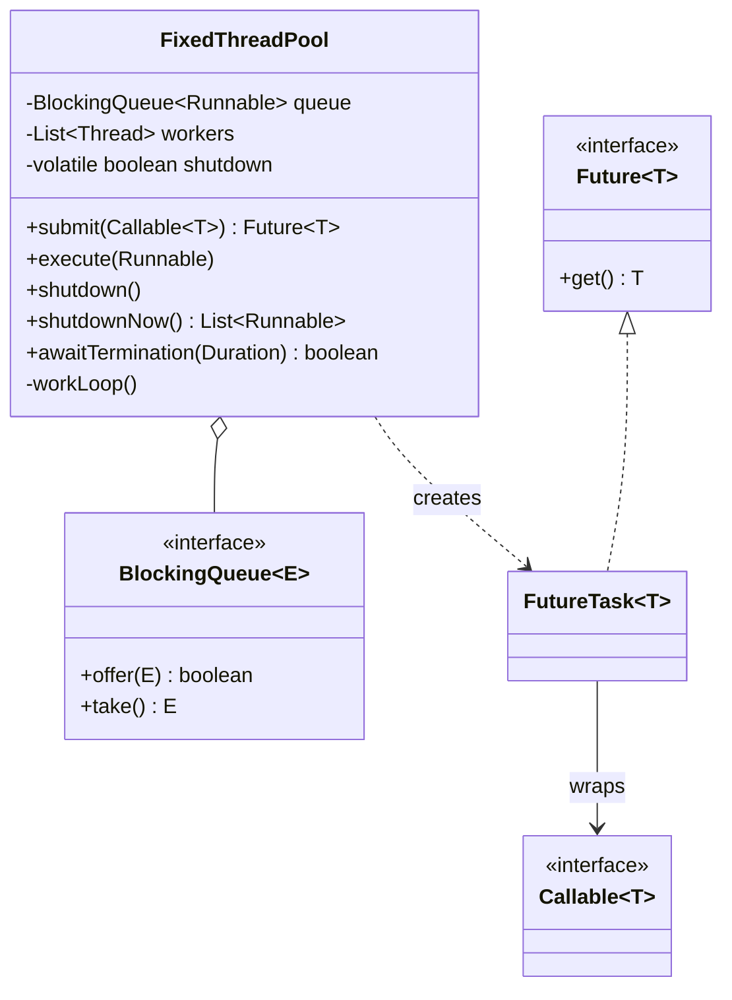
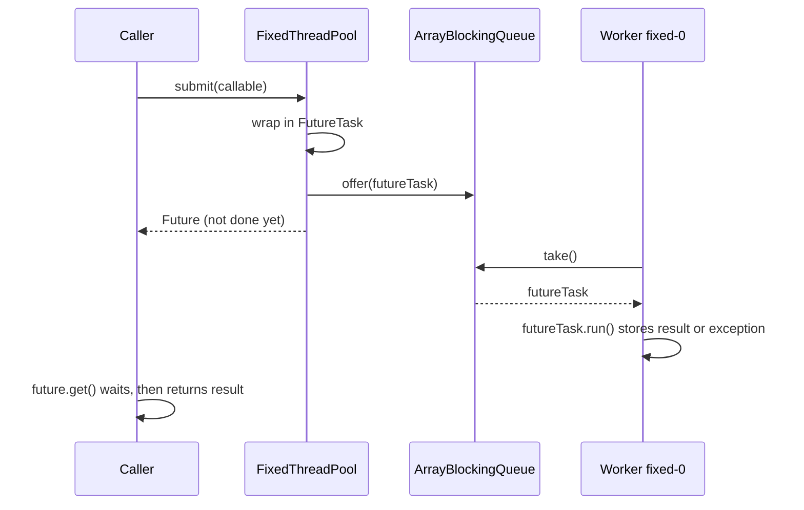

# Thread Pool — L4 (Mid-level / SDE2) LLD Interview

> **Level expectation:** build a **fixed-size thread pool** from scratch: a `BlockingQueue` of tasks and N worker threads that loop "take, run". `submit()` returns a **Future**. A failing task must **not kill its worker**. **Shutdown** must be correct (no lost tasks, no hung threads), and you can compare a **poison pill** with **interrupts**. You can explain why "a new thread per task" falls over.

> 🆕 Never thought about what's behind `Executors.newFixedThreadPool`? Read [00-understand-the-product.md](00-understand-the-product.md) first.

Legend: **🧑‍💼 Interviewer** · **🧑‍💻 Candidate** · **📝 Note** = commentary for you.

---

## 1. Clarifying requirements

**🧑‍💼 Interviewer:** Design a thread pool. Callers hand it tasks; it runs them on a limited number of threads.

**🧑‍💻 Candidate:** Some questions first:
- **Fixed or growing?** Is the number of threads fixed, or should it grow under load and shrink after?
- **Results:** do callers need a result or an exception back, or is it fire-and-forget?
- **Queue:** may the queue grow without limit, or is it bounded? If bounded, what happens when it's full?
- **Shutdown:** must queued tasks finish on shutdown, or can they be dropped?
- **Ordering or priorities?** Plain FIFO (first in, first out) is fine?

**🧑‍💼 Interviewer:** Fixed size for now. Callers want results. Bounded queue; just reject when full. Shutdown should finish queued work, and there should also be a "stop now". FIFO.

**🧑‍💻 Candidate:**

**Functional:** `new FixedThreadPool(threads, queueCapacity)`; `submit(Callable<T>)` returns `Future<T>`; `execute(Runnable)`; reject when the queue is full or the pool is shut down; `shutdown()` (finish queued work), `shutdownNow()` (interrupt and return pending tasks), `awaitTermination(timeout)`.

**Non-functional:** thread-safe for many submitters; no task runs twice or gets lost; a task exception never kills a worker; memory bounded by `queueCapacity`.

> 📝 **Note:** Asking "bounded or unbounded queue?" early is the strongest signal at this level. An unbounded queue just moves the out-of-memory crash from "too many threads" to "too many queued tasks".

---

## 2. Core entities

**🧑‍💻 Candidate:** First, why a pool at all instead of `new Thread(task).start()`:

| Thread per task | Pool of N threads |
|---|---|
| Creating a thread is a **syscall** (a call into the OS kernel) plus a stack reservation (~1 MB of address space by default on 64-bit Linux): tens of microseconds or more per task | Threads are created once and reused |
| Unbounded: 5,000 concurrent tasks = 5,000 threads, lots of **context switching** (the CPU pausing one thread to run another) | At most N run at once; the rest wait in a queue |
| A spike can end in `OutOfMemoryError: unable to create native thread` | Memory is bounded: N stacks + queue capacity |
| No place to count, name, or shut down threads | One object to monitor and stop |

| Piece | Responsibility |
|---|---|
| `FixedThreadPool` | Owns the queue and the workers; `submit`, `shutdown` |
| Task queue | An `ArrayBlockingQueue<Runnable>`: a **bounded** queue whose `take()` blocks (waits) until a task exists. See [blocking queues & producer-consumer](../../libraries/java/blocking-queues-and-producer-consumer.md) |
| Worker | A thread running a loop: `take()` a task, run it, repeat |
| `FutureTask<T>` | The JDK class that wraps a `Callable`, runs it, and stores the result *or the exception* for `Future.get()` |

This is the **producer-consumer** pattern: callers produce tasks into a queue, workers consume them.

---

## 3. Interfaces

```java
public interface Callable<T> { T call() throws Exception; }   // JDK: a task that returns a value

public final class FixedThreadPool {
    public FixedThreadPool(int threads, int queueCapacity);
    public <T> Future<T> submit(Callable<T> task);    // throws RejectedExecutionException if full or shut down
    public void execute(Runnable task);               // fire-and-forget
    public void shutdown();                           // no new tasks; finish queued ones
    public List<Runnable> shutdownNow();              // interrupt workers; return tasks that never started
    public boolean awaitTermination(Duration timeout) throws InterruptedException;
}
```

`Future<T>` is the JDK interface for "a result that isn't ready yet": `get()` blocks until done, `get(timeout)` gives up, `isDone()`, `cancel()`. These are exactly the JDK's `ExecutorService` methods, so callers already know them ([executors & threads](../../libraries/java/executors-and-threads.md)).

---

## 4. Class diagram



Notation: [UML class diagrams](../../concepts/uml-class-diagrams.md). The full design with core/max threads, rejection policies and the connection pool is in the [README](README.md#class-diagram-matches-the-code).

---

## 5. Deep dives

### 5.1 The worker loop

**🧑‍💻 Candidate:**

```java
public final class FixedThreadPool {
    private static final Runnable POISON = () -> {};          // "please exit" marker (5.4)
    private final BlockingQueue<Runnable> queue;
    private final List<Thread> workers = new ArrayList<>();
    private volatile boolean shutdown;

    public FixedThreadPool(int threads, int queueCapacity) {
        queue = new ArrayBlockingQueue<>(queueCapacity);
        for (int i = 0; i < threads; i++) {
            Thread t = new Thread(this::workLoop, "fixed-" + i);    // name threads: thread dumps and logs show the name
            workers.add(t);
            t.start();
        }
    }

    private void workLoop() {
        while (true) {
            Runnable task;
            try {
                task = queue.take();                 // sleeps (no CPU) until a task arrives
            } catch (InterruptedException e) {
                return;                              // shutdownNow(): exit
            }
            if (task == POISON) return;              // shutdown(): exit after the queued work ahead of it
            try {
                task.run();
            } catch (Throwable t) {                  // a bad task must not kill the worker (5.3)
                System.err.println("task failed: " + t);
            }
        }
    }
}
```

`volatile` on `shutdown` makes a write by one thread immediately visible to all others ([thread-safety basics](../../concepts/thread-safety-basics.md)). An idle worker parked in `take()` uses no CPU: the queue's internal lock and **condition** (a "wait here until signalled" list) put it to sleep, and `offer()` wakes exactly one.

### 5.2 `submit()` and the Future

```java
public <T> Future<T> submit(Callable<T> task) {
    FutureTask<T> f = new FutureTask<>(task);
    execute(f);
    return f;
}

public void execute(Runnable task) {
    if (shutdown) throw new RejectedExecutionException("pool is shut down");
    if (!queue.offer(task)) throw new RejectedExecutionException("queue full");   // offer = don't wait
}
```



**🧑‍💼 Interviewer:** Why `offer` and not `put`?

**🧑‍💻 Candidate:** `put` waits for space, so a full queue would freeze the caller (maybe a Tomcat request thread) with no timeout. `offer` returns `false` immediately and we reject. At L5 the "what to do when full" becomes a pluggable policy, including "run it on the caller's thread".

I could write my own Future (a result field, an exception field, a `CountDownLatch(1)`, a one-shot gate that `get()` waits on). `FutureTask` already does exactly that, handles cancellation, and is what the JDK uses, so I reuse it. If callers want to chain work ("when done, then…"), `CompletableFuture.supplyAsync(task, pool)` works with any executor ([CompletableFuture](../../libraries/java/completablefuture.md)).

### 5.3 A task throws

**🧑‍💼 Interviewer:** A task throws `NullPointerException`. What happens?

**🧑‍💻 Candidate:** Two cases:
- **Via `submit()`**: `FutureTask.run()` catches the exception and stores it. `future.get()` throws `ExecutionException` with the NPE as its **cause**. The worker never sees it. The catch: if nobody calls `get()`, the error is **silently lost**. That's the most common thread-pool bug in production code ("my task just stopped and there's nothing in the logs").
- **Via `execute()`**: the exception reaches the worker loop. Without my `try/catch`, it would end the `while` loop and the thread would die. After 8 bad tasks, an 8-thread pool has **zero workers** and every new task waits forever in the queue. So the worker catches `Throwable`, reports it, and carries on.

The JDK's `ThreadPoolExecutor` chose differently: the worker thread does die (the exception goes to the thread's uncaught-exception handler, which prints it), but the pool **replaces** it with a new thread. Same outcome, more expensive. Test `workerSurvivesTaskExceptions` checks both paths, and the same thread name before and after (when I removed the catch, it failed with `expected fixed-1 but was fixed-2`).

> 📝 **Note:** Say the "silently lost if nobody calls `get()`" part out loud. Interviewers love it because almost everyone has been bitten by it.

### 5.4 Shutdown: poison pill vs interrupt

**🧑‍💼 Interviewer:** How do workers stop?

**🧑‍💻 Candidate:** They're blocked in `take()`, so I must wake them. Two tools:

| | Poison pill | Interrupt |
|---|---|---|
| How | Put one special `POISON` task per worker in the queue | Call `thread.interrupt()`; `take()` throws `InterruptedException` |
| Queued tasks | Run first: the pill sits **behind** them (FIFO), so it's graceful by construction | Not run: the worker leaves immediately |
| Running task | Finishes normally | Gets interrupted too, *if* it blocks on something interruptible (`sleep`, `wait`, `take`, interruptible I/O). A pure CPU loop ignores it unless it checks `Thread.interrupted()` |
| Weakness | Needs a free queue slot per worker: with a full bounded queue, `put(POISON)` waits until workers make room | Cooperative: a task that swallows `InterruptedException` keeps running |
| Use for | `shutdown()` | `shutdownNow()` |

```java
public void shutdown() throws InterruptedException {
    shutdown = true;                                   // reject new work first
    for (int i = 0; i < workers.size(); i++) queue.put(POISON);   // put = wait for room behind queued tasks
}

public List<Runnable> shutdownNow() {
    shutdown = true;
    List<Runnable> pending = new ArrayList<>();
    queue.drainTo(pending);                            // tasks that never started go back to the caller
    workers.forEach(Thread::interrupt);
    return pending;
}

public boolean awaitTermination(Duration timeout) throws InterruptedException {
    long deadline = System.nanoTime() + timeout.toNanos();
    for (Thread t : workers) {
        long left = deadline - System.nanoTime();
        if (left <= 0) return false;
        t.join(Math.max(1, left / 1_000_000));          // join = wait for that thread to finish
    }
    return workers.stream().noneMatch(Thread::isAlive);
}
```

The runnable version ([SimpleThreadPool.java](java/src/pool/SimpleThreadPool.java)) uses interrupts for both: `shutdown()` interrupts only **idle** workers (those not inside a task), so queued work still drains. That's how `ThreadPoolExecutor` does it, and it avoids the "pill needs a free slot" problem.

### 5.5 A race in `execute()`

**🧑‍💼 Interviewer:** Look at `execute()` again. Can a task be accepted and never run?

**🧑‍💻 Candidate:** Yes. Thread A checks `shutdown == false`, then gets paused. Thread B calls `shutdown()` and enqueues the pills. Thread A resumes and `offer`s its task **behind** the pills. The workers exit; the task sits in the queue forever, and its Future never completes. This is a **check-then-act** race: the check and the action aren't one atomic step.

Fix: make "check the state + enqueue" and "set the state" mutually exclusive with one lock ([locks & synchronized](../../libraries/java/locks-and-synchronized.md)). `SimpleThreadPool.execute()` holds `mainLock` for exactly that, and `shutdown()` takes the same lock to change the state.

> 📝 **Note:** Finding a race in your own code before the interviewer does is a strong L4 signal. Check-then-act is the pattern to look for.

---

## 6. Follow-ups

**🧑‍💼 Interviewer:** How many threads?

**🧑‍💻 Candidate:** Depends on what tasks do. CPU-bound work (compression, JSON parsing): about the number of cores, since more threads just take turns on the same cores. I/O-bound work (waiting on a database or HTTP): more, because threads spend most of their time waiting. L5 has the formula. `Runtime.getRuntime().availableProcessors()` gives the core count, and in a container it respects the CPU limit.

**🧑‍💼 Interviewer:** Isn't this just `Executors.newFixedThreadPool`?

**🧑‍💻 Candidate:** Nearly, with one important difference: `newFixedThreadPool` uses an **unbounded** `LinkedBlockingQueue`. Under sustained overload it never rejects; the queue grows until the heap runs out. In production I'd use `new ThreadPoolExecutor(...)` with a bounded queue and an explicit rejection policy.

**🧑‍💼 Interviewer:** And with Java 21 virtual threads?

**🧑‍💻 Candidate:** **Virtual threads** are threads managed by the JVM (Java Virtual Machine) instead of the OS; they're so cheap that "one per task" (`Executors.newVirtualThreadPerTaskExecutor()`) is the recommended style for I/O-bound work, and you don't pool them. But the things *behind* them (DB connections, a partner API's rate limit) are still scarce. That's L6.

**🧑‍💼 Interviewer:** And in Node?

**🧑‍💻 Candidate:** Node runs JavaScript on one thread (the **event loop**, see [event loop & concurrency](../../libraries/js/event-loop-and-concurrency.md)); waiting for I/O doesn't hold a thread. So the Node version is a **concurrency limiter**: "at most N async tasks in flight" ([js/pool.js](js/pool.js), `createLimiter`).

---

## 7. What the interviewer was evaluating (L4)

- [ ] Explained why thread-per-task fails (creation cost, memory per thread, unbounded concurrency)
- [ ] Asked about bounded vs unbounded queue and full-queue behaviour
- [ ] `BlockingQueue` + N workers looping `take()`; idle workers use no CPU
- [ ] `submit()` returns a Future; reused `FutureTask` (or built a correct one)
- [ ] Worker survives task exceptions; knew that `submit()` hides exceptions until `get()`
- [ ] Shutdown: poison pill vs interrupt, graceful vs now, `awaitTermination`
- [ ] Spotted (or fixed when asked) the check-then-act race between `execute` and `shutdown`

## 8. Common mistakes at this level

| Mistake | Why it's wrong |
|---|---|
| Busy-waiting: `while (queue.isEmpty()) {}` | Burns a full CPU core per idle worker; `take()` sleeps instead |
| Unbounded queue "so nothing is rejected" | Overload becomes an `OutOfMemoryError` minutes later, and latency grows without limit |
| No `try/catch` around `task.run()` | Each failing `execute()` task kills a worker until none are left |
| `submit()` and never calling `get()` | Exceptions vanish silently |
| `put()` in `execute()` | Callers block forever when the queue is full |
| Swallowing `InterruptedException` inside tasks | `shutdownNow()` can't stop them; restore the flag with `Thread.currentThread().interrupt()` |
| `stop()` / `Thread.stop` to kill workers | Deprecated and unsafe: it can leave shared objects half-updated |
| Checking `shutdown` and enqueuing without a lock | Tasks accepted after shutdown, never run |

➡️ Next: [L5-senior.md](L5-senior.md)
