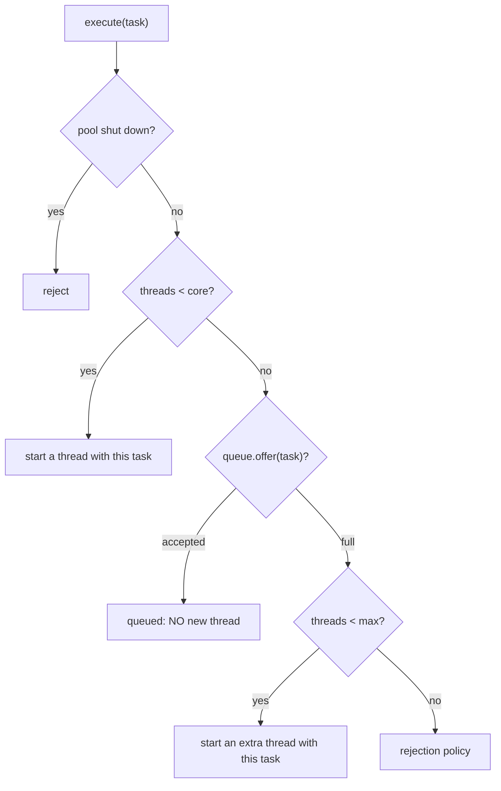
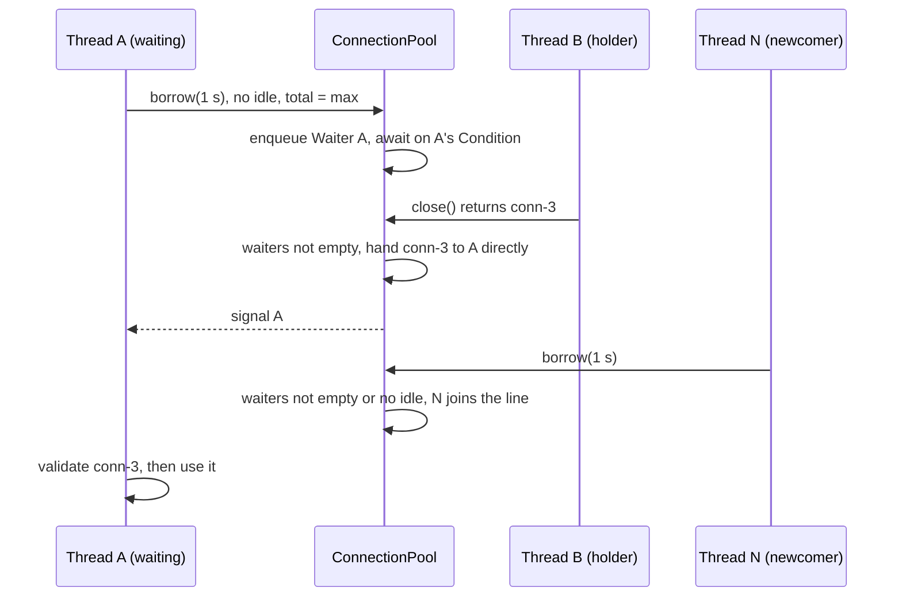
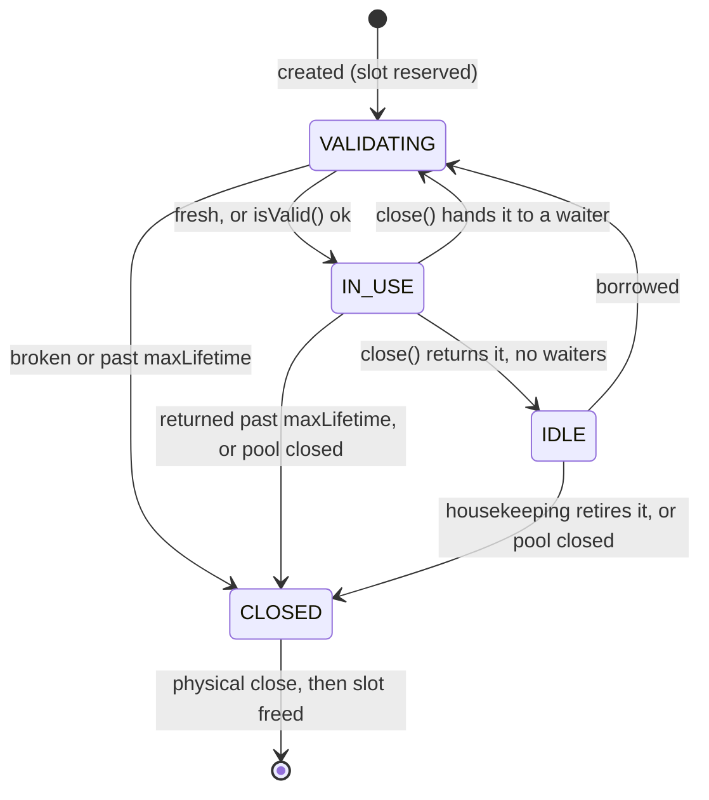

# Thread Pool & Connection Pool — L5 (Senior) LLD Interview

> **Level expectation:** take the L4 pool and make it behave like `ThreadPoolExecutor`: **core / max / keep-alive** with the exact `execute()` order (and the "max only kicks in when the queue is full" gotcha), a **bounded queue** with four **rejection policies** (CallerRuns as back-pressure), and **sizing with numbers** (Little's law, the CPU vs I/O formula). Then the interviewer switches to a **connection pool**: borrow with timeout, **FIFO-fair** waiting, validation, **max lifetime with jitter**, **leak detection**, and a per-connection state machine. All with deterministic tests. Read [L4-mid.md](L4-mid.md) first.

Legend: **🧑‍💼 Interviewer** · **🧑‍💻 Candidate** · **📝 Note** = commentary for you.

---

## 1. Requirements (what's new vs L4)

**🧑‍💻 Candidate:**
- **Elastic size:** `corePoolSize` threads always, up to `maxPoolSize` under load, extra threads exit after `keepAlive` idle.
- **Bounded queue + rejection policy** chosen by the caller, rejections counted.
- **Shutdown** that drains queued work without poison pills; `shutdownNow` interrupts; `awaitTermination`.
- **Stats** for dashboards: threads, active, queued, completed, failed, rejected.
- Then a **connection pool**: at most `maxSize` connections, `borrow(timeout)`, fair waiting, validation, max lifetime, leak detection.

---

## 2. Thread pool deep dives

### 2.1 Core, max, keep-alive, and the order that surprises everyone

**🧑‍💼 Interviewer:** `core=2, max=8`, a queue of 1,000. Traffic spikes. How many threads do you get?

**🧑‍💻 Candidate:** Two. `execute()` decides in this order (same as `ThreadPoolExecutor`, see [executors & threads](../../libraries/java/executors-and-threads.md)):



Extra threads appear **only when the queue is full**. With 1,000 slots, 1,000 tasks have to pile up (and wait) before thread number 3 is born. And with an **unbounded** `LinkedBlockingQueue`, `offer()` never fails, so `maxPoolSize` is dead configuration. Two famous places this bites:
- `Executors.newFixedThreadPool(n)`: unbounded queue (harmless there, core = max anyway, but it never rejects).
- Spring Boot's default `@Async` executor: 8 core threads, unbounded queue. Setting `max-size: 50` changes nothing.

**Why this order?** It favours **reusing** threads over creating them: the queue absorbs short bursts cheaply, and threads are only added when the burst is longer than the queue. If you want "threads first, then queue" (Tomcat does), you need a queue whose `offer()` refuses while the pool can still grow: Tomcat's `TaskQueue` does exactly that, and a `SynchronousQueue` (zero capacity: `offer` only succeeds if a worker is waiting right now) does it in `Executors.newCachedThreadPool()`.

Test `growsBeyondCoreOnlyWhenQueueIsFullThenAborts` walks it step by step with `core=1, max=3, queue=2` and tasks blocked on a **latch** (a `CountDownLatch`: a one-shot gate threads wait on until it's opened): task 1 → 1 thread; tasks 2–3 → queued, still 1 thread; task 4 → 2 threads; task 5 → 3; task 6 → rejected. Mutating `execute()` to grow before queuing makes it fail with `expected 1 but was 3`. Test `unboundedStyleQueueNeverUsesMaxThreads` submits 200 tasks to `core=2, max=8, queue=10,000`: largest pool size stays 2.

**Keep-alive:** a worker that is "extra" (pool size > core at that moment) waits with `queue.poll(keepAlive)` instead of `take()`. If the poll times out, it removes itself, but the check-and-remove happens **under the pool lock**, so two idle extras can't both leave and drop the pool below core. (`ThreadPoolExecutor.allowCoreThreadTimeOut(true)` lets core threads time out too.) Test `keepAliveShrinksBackToCore` grows to 3 and waits for the *state* "1 thread" rather than sleeping a fixed time.

> 📝 **Note:** Drawing this flowchart from memory and naming the unbounded-queue consequence is probably the single most recognisable L5 thread-pool signal.

### 2.2 Rejection policies: what "full" means for the caller

**🧑‍💻 Candidate:** It's a **Strategy** ([design patterns](../../concepts/design-patterns.md)): one interface, interchangeable behaviours. In the code it's an enum where each constant has its own `reject()` ([RejectionPolicy.java](java/src/pool/RejectionPolicy.java)):

| Policy | Caller when full | Loses | Use when |
|---|---|---|---|
| `ABORT` (JDK default) | Gets `RejectedExecutionException` | Nothing silently: caller decides (HTTP 503, retry later) | Request paths that should **fail fast** |
| `CALLER_RUNS` | Runs the task **itself**, synchronously | Nothing | Batch producers (a Kafka consumer, a file importer): the producer slows to the pool's speed |
| `DISCARD` | Returns as if accepted | The new task | Truly optional work (a cache warm-up, a best-effort metric) |
| `DISCARD_OLDEST` | Oldest **queued** task dropped, new one queued | The oldest task | "Latest value wins": e.g. UI refresh, position updates |

**CallerRuns is back-pressure** ([back-pressure](../../concepts/back-pressure.md)): while the producer thread is busy running a task, it isn't producing more. The queue drains, and the producer resumes. No configuration, no extra threads. The trap: if the caller is a **Tomcat request thread** or an **event-loop thread** (a single thread serving many connections, as in Netty or Node), CallerRuns makes that thread do slow work, which can stall unrelated requests. Use it where the caller *is* the producer you want to slow down. Test `callerRunsExecutesOnCallerThread` checks the task ran on `main`.

Two details I chose on purpose:
- The policy runs **outside** the pool lock. CallerRuns may run for seconds; holding the lock would block every other `execute()`.
- My DISCARD policies **cancel** the dropped `FutureTask`. `ThreadPoolExecutor` doesn't: its Discard policies just drop the task, so a caller blocked in `future.get()` waits **forever**. Test `discardCancelsNewTask` checks `get()` throws `CancellationException` instead.

Every rejection increments a counter ([atomics](../../libraries/java/atomics-and-cas.md): an `AtomicLong`, safe to bump from many threads without a lock). A non-zero rejection rate is an alert, not a log line.

### 2.3 Shutdown without poison pills

**🧑‍💻 Candidate:** States: `RUNNING → SHUTDOWN → TERMINATED`, or `→ STOP → TERMINATED` for `shutdownNow`. A [state machine](../../concepts/state-machines.md) makes the rules explicit:
- `shutdown()`: state = SHUTDOWN, then **interrupt only idle workers**. Idle ones are parked in `take()`; they wake, see SHUTDOWN, and since the queue may still have tasks, they keep draining until it's empty.
- How do we know a worker is idle? Each worker holds a small lock **while running a task**. `shutdown()` does `tryAcquire()` on it: success = idle → interrupt. I used a `Semaphore(1)` (a counter of permits; with one permit it works as a lock that any thread can release) rather than a `ReentrantLock` (a lock the *same* thread may take twice) on purpose: if a task itself calls `shutdown()`, a re-entrant lock would let it "succeed" on its own worker and interrupt itself. `ThreadPoolExecutor`'s `Worker` is non-reentrant for the same reason.
- Before each task a worker clears any stale interrupt (one meant for an idle worker must not hit the next task), unless the state is STOP.
- `shutdownNow()`: state = STOP, interrupt **all** workers, `drainTo` the queue and return it.
- The last worker to exit flips the state to TERMINATED and signals a **Condition** (a wait-list tied to a lock) that `awaitTermination` waits on.

Tests `gracefulShutdownFinishesQueuedTasks` (4 tasks done, a 5th rejected, not terminated while one still runs) and `shutdownNowInterruptsAndReturnsPending` (3 tasks returned, the running one saw the interrupt).

### 2.4 Sizing, with numbers

**🧑‍💼 Interviewer:** How many threads should the pool have?

**🧑‍💻 Candidate:** Two tools.

**Little's law**: in a steady system, *items inside* = *arrival rate* × *time each spends inside* (L = λ × W). It needs no assumptions about the traffic shape. For a pool: busy workers = task rate × task duration.
- 400 requests/s, each takes 100 ms on a worker → 400 × 0.1 = **40 workers busy on average**. A pool of 20 means the queue grows without bound; a pool of 60 leaves headroom for bursts.

**The CPU vs I/O formula** (from *Java Concurrency in Practice*, Goetz et al., 2006, section 8.2):

N_threads = N_cpu × U_cpu × (1 + W/C)

where U_cpu is the target CPU utilisation (0–1) and W/C is the ratio of **wait** time to **compute** time per task.
- CPU-bound (W/C ≈ 0): 8 cores × 1.0 × 1 = **8 threads**. More just adds **context switches** (the OS pausing one thread to run another, which costs CPU and cache warmth).
- I/O-bound: each task computes 10 ms and waits 90 ms on HTTP. 8 × 0.8 × (1 + 90/10) = 8 × 0.8 × 10 = **64 threads**.

The formula tells you how many threads keep the **CPU** busy. It says nothing about what the waits are waiting **for**. 64 threads each holding a database connection need a 64-connection pool and a database that's happy with that. Which is the connection pool question.

More on sizing: [resource pools & sizing](../../concepts/resource-pools-and-sizing.md).

---

## 3. Connection pool deep dives

**🧑‍💼 Interviewer:** Same idea, different resource. Design a database connection pool.

**🧑‍💻 Candidate:** Same skeleton (a bounded set of expensive things, a waiting line, lifecycle rules), but the resource is **lent and returned** instead of running tasks, and it can **go bad**. Interfaces ([Connector.java](java/src/pool/Connector.java), [ConnectionPool.java](java/src/pool/ConnectionPool.java)):

```java
public interface Connector<C> {          // for JDBC: getConnection, isValid(timeout), close
    C create() throws Exception;
    boolean isValid(C connection);
    void close(C connection);
}

public final class ConnectionPool<C> implements AutoCloseable {
    public PooledConnection<C> borrow(Duration timeout) throws TimeoutException, InterruptedException;
    public void housekeep();             // retire old idle connections, report leaks
    public Stats stats();
    public void close();
}

try (PooledConnection<Db> pc = pool.borrow(Duration.ofSeconds(1))) {   // close() = RETURN to pool
    pc.get().query("...");
}
```

Generic over `C` so tests use a `FakeConn` with a `broken` flag: no database needed. `PooledConnection.close()` returns it once; a second `close()` is a no-op (an `AtomicBoolean.compareAndSet(false, true)` lets exactly one caller through), and `get()` after close throws, because using a connection someone else now holds is a nasty, data-corrupting bug. HikariCP (the JDBC connection pool Spring Boot uses by default) does the same with a proxy around `java.sql.Connection` ([HikariCP & JDBC pools](../../libraries/java/hikaricp-and-jdbc-pools.md)).

### 3.1 Borrow: reuse, create, or wait in line



Under one lock ([locks & synchronized](../../libraries/java/locks-and-synchronized.md)):
1. If **nobody is waiting** and there's an idle connection → take it. Idle ones are a stack (LIFO: last in, first out), so this is the most recently returned, "warmest" one, and rarely used ones age out.
2. Else if `total < maxSize` → reserve a slot (`total++`) and **create outside the lock**.
3. Else → join the **FIFO line** with my own `Condition` and wait with `awaitNanos(remaining)`. On timeout: leave the line, count it, throw `TimeoutException` (HikariCP: `SQLTransientConnectionException ... request timed out after 30000ms`).

`total` counts idle + in use + being created + being closed, and is the number that never exceeds `maxSize`. Mutating step 2 to skip the max check makes `maxSizeRespectedAndBorrowTimesOut` fail (`expected TimeoutException but nothing was thrown`).

### 3.2 Fairness: direct hand-off

**🧑‍💼 Interviewer:** You used `new ReentrantLock(true)`. Isn't a fair lock enough?

**🧑‍💻 Candidate:** No. A **fair lock** only orders who gets the *lock* next. Picture: A has waited 900 ms. B returns a connection and signals A. Before A re-acquires the lock, newcomer N (already queued on the lock) gets in, sees an idle connection, and takes it. A goes back to waiting: **barging**. Under load, unlucky waiters time out while newcomers succeed instantly.

So I **hand the connection directly** to the first waiter (`waiter.entry = conn; signal()`), and a newcomer may only take an idle connection if **nobody is in line**. The line is an `ArrayDeque` of waiters, served with `pollFirst()`. Test `waitersAreServedInFifoOrder` queues A, B, C, D (waiting for each to be *in line* before starting the next) and expects exactly `[A, B, C, D]`. Mutating `pollFirst` to `pollLast` fails with `expected [A, B, C, D] but was [D, C, B, A]`.

Fairness costs throughput (a hand-off wakes a sleeping thread instead of serving a running one), which is why `ReentrantLock` and `Semaphore` default to unfair. For a connection pool, predictable wait times are worth it. HikariCP's `ConcurrentBag` also hands connections to waiters through a hand-off queue (a `SynchronousQueue`).

> 📝 **Note:** "A fair lock is not a fair pool" is a subtle point. Explaining barging in one sentence is a strong signal.

### 3.3 Slow work outside the lock, and close before free

**🧑‍💻 Candidate:** Creating a connection takes milliseconds; `isValid()` is a network round trip; `close()` may block. None of it happens while holding the pool lock, or one slow database call would freeze every borrower. The lock only protects **bookkeeping**: the idle stack, the in-use set, the waiter line, `total`.

One ordering rule I got wrong at first: when a connection dies, **close it first, then free its slot**. The other order lets a waiter create a replacement while the old one is still open: for a moment, `maxSize + 1` connections exist on the database. Test `concurrentStressNeverExceedsMaxAndLosesNothing` tracks the maximum number of *physically open* fake connections across 16 threads × 500 borrows, with some connections breaking mid-use: it must stay ≤ 4.

### 3.4 Validation and broken connections

**🧑‍💼 Interviewer:** The database restarted. What happens to your idle connections?

**🧑‍💻 Candidate:** They're dead sockets. On borrow I call `isValid()`; if it fails (or throws), I close it, free the slot, and loop: take the next idle one, or create a new one. The caller never sees the broken one (test `brokenConnectionReplacedOnBorrow`). Fresh connections skip validation.

Cost: one round trip per borrow. HikariCP skips validation for a connection used within the last ~500 ms (its `aliveBypassWindowMs`, from the HikariCP source; check your version), and uses JDBC's built-in `Connection.isValid()` (added in JDBC 4) instead of a test query. Alternatives: validate idle connections in the background ("idle test", HikariCP's `keepaliveTime`), or validate on return.

### 3.5 Max lifetime, with jitter

**🧑‍💻 Candidate:** Each connection gets `retireAt = createdAt + maxLifetime − random(0..jitter)`.
- **Idle** connections past `retireAt` are closed by housekeeping.
- **In-use** connections are **never** closed under the user. They're retired when returned (test `maxLifetimeRetiresConnections`: idle one closed, busy one closed only on `close()`).
- **Jitter**: without it, 20 connections created at startup all expire in the same second, 20 reconnects hit the database at once, and borrowers wait. HikariCP subtracts a small random amount (up to 2.5% of `maxLifetime`, per its source code) per connection. Set `maxLifetime` a few seconds below any limit imposed by the database, a proxy, or a firewall's idle timeout.

Time comes from an injected `java.time.Clock` ([Time & Clock](../../libraries/java/time-and-clock.md)); tests use `ManualClock.advance(31 min)` and call `housekeep()` directly. No sleeping.

### 3.6 Leak detection

**🧑‍💻 Candidate:** On borrow, record `borrowedAt` and, if leak detection is on, `new Throwable("borrowed by " + thread)`: creating a `Throwable` captures the current **stack trace** (the chain of method calls), i.e. *who* borrowed it. `housekeep()` reports any connection held longer than `leakThreshold`, **once per borrow**, to a listener outside the lock. Test `leakDetectionReportsBorrowerOnce` checks the report's stack contains the test method's name. Sample from the demo:

```
WARN leak? connection #1 held for 3 s, borrowed at:
    at pool.Demo.forgetfulRepository(Demo.java:89)
    at pool.Demo.connectionPoolStory(Demo.java:68)
```

Capturing a stack costs a few microseconds per borrow, so it's off by default (HikariCP's `leakDetectionThreshold=0`). Leak detection only **reports**; it doesn't reclaim. Taking a connection back from code that may still use it would be worse than the leak. In production, `startHousekeeping(every)` runs it on a [scheduled executor](../../libraries/java/scheduled-executor-service.md); HikariCP's thread is literally named `HikariPool-1 housekeeper`.

### 3.7 One connection's life



The `ConnState` enum in the code has exactly these four states. Closing the pool closes idle connections immediately, wakes all waiters with "pool closed" (test `closeClosesIdleAndRejectsBorrowers`), and closes in-use ones as they come back.

---

## 4. Testing strategy

| Test | Covers |
|---|---|
| `runsAllTasksAndCompletesFutures` | Results via Future, exactly-once, fixed size |
| `growsBeyondCoreOnlyWhenQueueIsFullThenAborts`, `unboundedStyleQueueNeverUsesMaxThreads` | The `execute()` order; the unbounded-queue gotcha; ABORT |
| `callerRunsExecutesOnCallerThread`, `discardCancelsNewTask`, `discardOldestDropsQueueHead` | The other three policies |
| `workerSurvivesTaskExceptions` | `submit` vs `execute` failures; same worker thread afterwards |
| `gracefulShutdownFinishesQueuedTasks`, `shutdownNowInterruptsAndReturnsPending`, `keepAliveShrinksBackToCore` | Lifecycle |
| `borrowAndReleaseReusesSameConnection`, `maxSizeRespectedAndBorrowTimesOut`, `waitersAreServedInFifoOrder` | Reuse, limit, timeout, fairness |
| `brokenConnectionReplacedOnBorrow`, `maxLifetimeRetiresConnections`, `leakDetectionReportsBorrowerOnce` | Validation, lifetime, leaks (ManualClock) |
| `doubleCloseIsHarmless`, `closeClosesIdleAndRejectsBorrowers`, `concurrentStressNeverExceedsMaxAndLosesNothing` | Wrapper safety, pool close, invariants under contention |

**Determinism:** thread-pool tests block tasks on a latch, so "workers busy, queue full" is a state we build, not a race. Where a test must wait for another thread (a waiter joining the line, a thread timing out), it spins until the **state** is reached, with a 5 s safety limit, instead of sleeping a guessed time. Mutation checks done: LIFO waiters, no max check, no catch in the worker, and "grow before queuing" each make a test fail. All 19 passed 20 runs in a row, and 10 more pinned to a single CPU.

---

## 5. Follow-ups

**🧑‍💼 Interviewer:** Tomcat has 200 threads, Hikari has 10 connections. Problem?

**🧑‍💻 Candidate:** Up to 190 request threads can be blocked in `borrow()`. That's fine if DB time is a small part of each request (Little's law: 400 req/s × 15 ms of DB time = 6 connections busy on average). It's a problem when the DB slows down: every thread ends up waiting for a connection, the Tomcat pool is exhausted too, and even endpoints that don't touch the DB stop responding. Fixes: a `connectionTimeout` much shorter than 30 s for user-facing paths, and a **bulkhead**: a separate, smaller limit per dependency (L6).

**🧑‍💼 Interviewer:** A borrower is interrupted while waiting. Anything to watch?

**🧑‍💻 Candidate:** A connection may have been handed to it in the same instant. If it just throws `InterruptedException`, that connection is lost forever. My `acquire()` checks: if a connection was handed over, give it back (to the next waiter or the idle stack); if a create slot was granted, free it; then rethrow.

**🧑‍💼 Interviewer:** Could you use a `Semaphore` instead of your waiter line?

**🧑‍💻 Candidate:** Yes: `new Semaphore(maxSize, true)` (fair) for permits, and a concurrent deque for idle connections. Simpler, and fine. The hand-off version gives me per-waiter control (hand a *specific* connection, grant a create slot) and makes the FIFO guarantee easy to test.

---

## 6. What the interviewer was evaluating (L5)

- [ ] `execute()` order (core → queue → max → reject) and the unbounded-queue consequence; keep-alive under the lock
- [ ] Four rejection policies with use cases; CallerRuns as back-pressure and its trap; counted rejections
- [ ] Shutdown via state machine + interrupting idle workers; non-reentrant worker lock; `awaitTermination`
- [ ] Sizing with Little's law and N_cpu × U × (1 + W/C), with numbers
- [ ] Connection pool: borrow/return wrapper, double-close safe, timeout with a clear error
- [ ] Fairness via FIFO hand-off; knows a fair lock alone allows barging
- [ ] Slow I/O outside the lock; close-before-free; validation; max lifetime with jitter; leak detection with stack
- [ ] Deterministic concurrency tests (latches, manual clock, wait-for-state)

## 7. Common mistakes at this level

| Mistake | Why it hurts at L5 |
|---|---|
| Believing max threads are used before queuing | Configs with unbounded queues and a "max" that never applies |
| `CALLER_RUNS` on request or event-loop threads | Slow background work now runs on the latency-critical path |
| `DISCARD` with `submit()` | `future.get()` hangs forever on a dropped task |
| Creating or validating connections while holding the pool lock | One slow DB call blocks every borrower |
| Freeing the slot before closing the old connection | Briefly more connections than the DB allows |
| Fair lock and nothing else | Barging: some waiters time out while newcomers get served |
| Closing a connection past `maxLifetime` while it's in use | Queries fail mid-transaction |
| Leak detection that reclaims connections | The "leaker" may still be using it: two users, one connection |
| Pool sized by guess | Use Little's law and the wait/compute ratio, then verify with metrics |

⬅️ Previous: [L4-mid.md](L4-mid.md) · ➡️ Next: [L6-staff.md](L6-staff.md)
