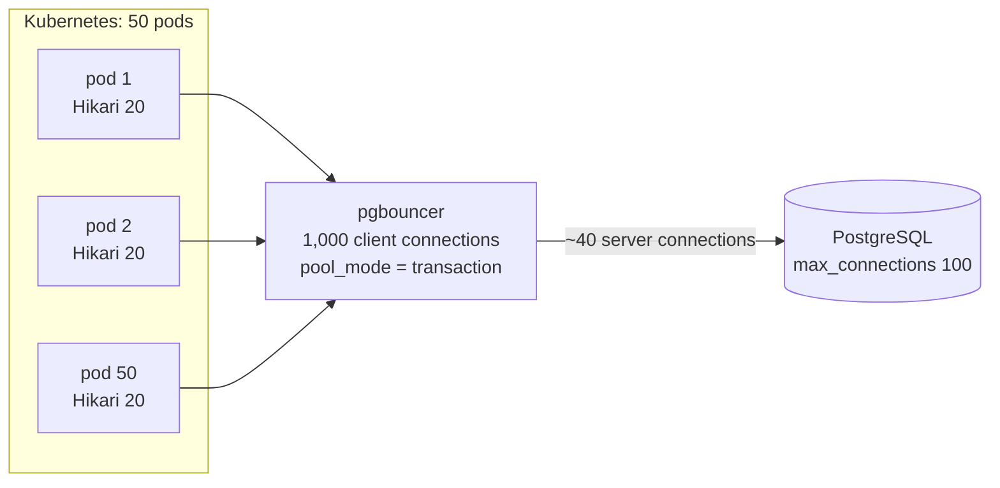

# Thread Pool & Connection Pool — L6 (Staff) LLD Interview

> **Level expectation:** the L5 pools are correct inside one JVM. Now: *"We run 50 pods of this service against one PostgreSQL. During deploys and failovers we get connection storms and timeouts, and someone wants to switch everything to virtual threads."* You reason about **connections across the fleet** with arithmetic, **proxy pooling** (pgbouncer, RDS Proxy) and its trade-offs, **pool sizing** from the database's side, what **virtual threads** change and what they don't, **bulkheads**, **observability**, **failure modes** like failover reconnect storms, and **what not to build**. Read [L5-senior.md](L5-senior.md) first.

Legend: **🧑‍💼 Interviewer** · **🧑‍💻 Candidate** · **📝 Note** = commentary for you.

---

## 1. The new problems

**🧑‍💼 Interviewer:** Your L5 pool is fine. What changes when there are 50 copies of it?

**🧑‍💻 Candidate:** The pool size is configured **per pod**, but the database feels the **sum**. Three things a single pool can't see:
1. **The fleet total.** Replicas × pool size, plus every other service, cron job and human with `psql` on the same database.
2. **Correlated events.** Deploys, autoscaling and database failovers hit every pool at the same moment. Pools that behave well alone stampede together.
3. **The real bottleneck moves.** More threads or more connections don't make a database with 16 cores do more work. Past a point they make it slower.

---

## 2. Fleet arithmetic

**🧑‍💻 Candidate:** PostgreSQL ([PostgreSQL](../../../HLD/technologies/postgresql.md)) starts one **backend process** (a separate OS process) per connection, each with its own memory, so `max_connections` (default **100**) is a real resource limit, not a politeness setting.

| Situation | Connections | Arithmetic |
|---|---|---|
| Steady state | **1,000** | 50 pods × pool 20 |
| Rolling deploy, `maxSurge: 25%` | **1,260** | k8s rounds 25% of 50 up to 13 extra pods: 63 × 20 |
| HPA scales to 80 pods (HPA = Kubernetes' horizontal pod autoscaler) | **1,600** | 80 × 20 |
| Plus a batch service (10 pods × 10) and admin tools | **+100 or more** | |

Meanwhile, how many connections are actually **busy**? Little's law (busy = rate × time each is held, see [L5](L5-senior.md#24-sizing-with-numbers)): 4,000 transactions/s × 5 ms each = **20 busy connections** on average. So ~1,000 connections are open to serve ~20 at a time. The other 980 are idle, each still a process holding memory on the database server.

**Raising `max_connections` to 2,000** is the tempting fix. It treats the symptom: each connection costs memory, and thousands of backends make the database's own bookkeeping (snapshots, lock tables) slower. The fix is to **multiplex**: many client connections share few server connections.

> 📝 **Note:** Doing this table out loud, including the deploy surge, is the L6 signal. Most outages here happen during deploys, not at steady state.

---

## 3. Sizing from the database's side

**🧑‍💼 Interviewer:** So how big should the pools be?

**🧑‍💻 Candidate:** Start from what the **database** can do in parallel, then divide.

The HikariCP wiki page "About Pool Sizing" gives a starting point it attributes to the PostgreSQL project:

> connections = (core_count × 2) + effective_spindle_count

where `core_count` is the database server's CPU cores and `effective_spindle_count` is roughly the number of disks that can seek in parallel (close to 0 if the working set is cached in memory). For a 16-core database on SSDs with the working set cached in memory: 16 × 2 + 0 = **32 active connections** for the whole database. It's a rule of thumb for **actively working** connections, not a law; the wiki's point is that a **small** pool with a queue in front beats a large one, because a CPU core can only run one query at a time and the rest just context-switch and contend for locks.

Then: 32 ÷ 50 pods ≈ **less than 1 per pod**. That's the arithmetic that says "you need a proxy", or fewer, larger pods. More in [resource pools & sizing](../../concepts/resource-pools-and-sizing.md).

---

## 4. Proxy pooling: pgbouncer and RDS Proxy

**🧑‍💻 Candidate:** A **connection proxy** is a connection pool running as its own process: apps connect to it (cheap: pgbouncer handles thousands of client connections), and it lends a small set of real server connections. **RDS Proxy** is AWS's managed version. The key setting is **when** a server connection is lent and taken back:

| Mode | Server connection is yours for | Multiplexing | Breaks |
|---|---|---|---|
| **Session** (pgbouncer's default) | The whole client connection | None while the client stays connected (Hikari keeps them open, so it barely helps) | Nothing |
| **Transaction** | One transaction | High: 1,000 clients on ~40 servers | Anything that lives **across transactions** on one connection: `SET` session variables, session-level advisory locks (app-defined locks owned by a session), `LISTEN/NOTIFY` (PostgreSQL's built-in pub/sub), temporary tables, and (historically) **prepared statements** |
| **Statement** | One statement | Highest | Multi-statement transactions entirely |

**Prepared statements** (a query parsed and planned once on the server, then run many times with new parameters) live on one server connection. In transaction mode your next transaction may land on a different server connection, where that statement doesn't exist: `prepared statement "S_1" does not exist`. The PostgreSQL JDBC driver switches to server-side prepared statements after a statement runs 5 times (`prepareThreshold`), so this shows up "randomly" under load. Fixes: `prepareThreshold=0` in the JDBC URL, or a pgbouncer version with protocol-level prepared statement support (added in pgbouncer 1.21, 2023, via `max_prepared_statements`; verify for your version). RDS Proxy has a similar concept called **pinning**: when it sees session state it can't track, it pins (dedicates) that server connection to the client, and multiplexing silently stops.

**Two layers of pools** then: Hikari in the pod (saves the app → pgbouncer handshake, keeps borrow fast) and pgbouncer (protects the database). Size Hikari small (5–10) and let pgbouncer's `default_pool_size` be the real limit.

---

## 5. Virtual threads: what changes and what doesn't

**🧑‍💼 Interviewer:** Java 21 has virtual threads. Can we delete all our thread pools?

**🧑‍💻 Candidate:** Mostly the **thread** pools for I/O-bound work, yes. A **virtual thread** is scheduled by the JVM onto a few **carrier** (OS) threads; when it blocks on I/O, it's unmounted and the carrier runs another one. Millions are cheap, so the advice is: one virtual thread per task (`Executors.newVirtualThreadPerTaskExecutor()`), and **don't pool them**. Spring Boot 3.2+ can run Tomcat and `@Async` on them (`spring.threads.virtual.enabled=true`).

What does **not** change:
- **The database is still the limit.** Before, 200 Tomcat threads capped concurrent requests at 200. With virtual threads, 10,000 requests can be in flight, and all of them call `borrow()`. The connection pool becomes the *only* limiter, so `connectionTimeout`s and `pending` spike. Keep the connection pool; add an explicit **`Semaphore`** (a counter of permits: `acquire()` waits when none are left) around expensive dependencies, so excess work waits or fails fast in a place you chose.
- **Pinning (Java 21).** A virtual thread that blocks **inside a `synchronized` block** can't unmount: it *pins* its carrier thread. Enough pinned threads and all carriers are stuck. Older JDBC drivers and pools used `synchronized` around I/O. JDK 24 (JEP 491; a JEP is a JDK Enhancement Proposal) removed most `synchronized` pinning; on 21, run with `-Djdk.tracePinnedThreads=full` to find it and prefer `ReentrantLock` in your own code.
- **ThreadLocal caches** (one expensive object per thread) multiply by millions. See [thread-local & context propagation](../../concepts/thread-local-and-context-propagation.md).
- **CPU-bound work** still wants a pool of ~N_cpu platform threads. Virtual threads help waiting, not computing.

> 📝 **Note:** "Virtual threads remove the thread limit, which removes the accidental back-pressure Tomcat's 200 threads gave us. Put the limit back explicitly, at the scarce resource" is the sentence the interviewer wants.

---

## 6. Bulkheads: one pool per dependency

**🧑‍💼 Interviewer:** The payment provider gets slow. Why does the whole service go down?

**🧑‍💻 Candidate:** Because payment calls share the request thread pool with everything else. Each slow call holds a thread for 30 s; soon all 200 are waiting on payments and `/health` can't get a thread, so Kubernetes restarts healthy pods. A **bulkhead** (named after the walls that stop one flooded ship compartment from sinking the rest) gives each dependency its **own** bounded pool or semaphore: payments get 20 concurrent calls; the 21st fails fast with a fallback. See [resilience patterns](../../../HLD/concepts/resilience-patterns.md).

| Dependency | Isolation | Limit | When full |
|---|---|---|---|
| Orders DB | Hikari pool | 10 per pod | Fail after 2 s `connectionTimeout` → 503 |
| Payment API | Semaphore / dedicated pool | 20 | Fail fast → "payment pending" flow |
| Recommendations | Small pool, `DISCARD` | 5 | Skip the widget |

Same rule for timeouts: a bulkhead without a **call timeout** just fills up and stays full.

---

## 7. Observability: what to graph and alert on

**🧑‍💻 Candidate:** Pools fail **silently**: requests just get slower. So every pool exports ([observability](../../../HLD/concepts/observability.md)):

| Metric | Thread pool | Connection pool (HikariCP name) | Alert when |
|---|---|---|---|
| Size / max | `poolSize`, `largest` | `hikaricp.connections`, `.max` | Total across fleet > 80% of `max_connections` |
| Active | `active` | `hikaricp.connections.active` | Active = max for minutes (**saturation**) |
| Waiting | `queued` | `hikaricp.connections.pending` | Pending > 0 sustained |
| Wait time | (time in queue) | `hikaricp.connections.acquire` (timer) | p99 (99th percentile: the slowest 1%) wait > 10% of request budget |
| Hold time | task duration | `hikaricp.connections.usage` (timer) | p99 hold climbing: slow queries or leaks |
| Failures | `rejected`, `failed` | `hikaricp.connections.timeout` | Any rejection or timeout on a user path |

**Saturation** (how full a resource is: active ÷ max, plus anything waiting) is the leading indicator; latency is the lagging one. The **wait-time histogram** is the most useful single graph: it shows the pool is too small (or the DB too slow) before users notice. For `ThreadPoolExecutor`, Micrometer's (the metrics library Spring Boot uses) `ExecutorServiceMetrics` exports the equivalents (`executor.active`, `executor.queued`, ...). On the database side, `SELECT state, count(*) FROM pg_stat_activity GROUP BY state` shows the fleet total and how much of it is idle.

---

## 8. Failure modes

**🧑‍💼 Interviewer:** The primary database fails over to a replica. Walk me through the next 30 seconds.

**🧑‍💻 Candidate:**
1. All 1,000 connections break **at once**. In-flight queries fail; idle connections fail validation on next borrow.
2. Every pool in every pod creates replacements in the same second: a **thundering herd** (everyone retrying at the same moment) of 1,000 TCP + TLS + auth handshakes against a database that just started. Some time out, and pools retry immediately: a reconnect storm that can keep the new primary overloaded.
3. Some pods still resolve the old primary's IP: the JVM caches **DNS** (name → IP lookups) and AWS RDS failover works by changing the DNS record. Set `networkaddress.cache.ttl` low (e.g. 5–30 s).

Mitigations:
- **Jittered exponential backoff** on connection creation: wait 100 ms, 200 ms, 400 ms… each multiplied by a random factor, so pods spread out instead of retrying in lockstep. See [retries, backoff & DLQ](../../../HLD/concepts/retries-backoff-and-dlq.md).
- **Jitter on `maxLifetime`** (L5) for the same reason in steady state.
- A **proxy** absorbs it: app → pgbouncer connections survive; only ~40 server connections reconnect.
- **Fail fast** with short `connectionTimeout` on user paths, and a **circuit breaker** (stop calling a dependency for a while after repeated failures) so threads don't pile up waiting for a dead database.

**Other classics:** a **long transaction** holding a connection during a remote HTTP call (one slow partner = pool exhausted; move the call outside the transaction); Spring's `spring.jpa.open-in-view` (on by default, with a startup warning) keeping a connection for the whole web request; **pool deadlock**: a task holds connection 1 and waits for connection 2 while every other task does the same, with pool size N and N such tasks, nobody progresses (see [deadlocks & lock ordering](../../concepts/deadlocks-and-lock-ordering.md)). The same happens to thread pools when a task submits a subtask to its *own* full pool and waits on its Future.

---

## 9. Build vs buy

**🧑‍💻 Candidate:** In production: **always** `ThreadPoolExecutor` (or virtual threads) and **HikariCP** (or the driver/framework's pool, or pgbouncer/RDS Proxy as a layer). They handle details this exercise skipped: Hikari's lock-free `ConcurrentBag` with thread-local fast paths, proxied `Statement`s that are closed with their connection, rollback of an open transaction and reset of auto-commit and isolation level on return, JMX (the JVM's built-in management interface) and Micrometer metrics, years of edge-case fixes. Building them yourself is how you **understand** their settings, and what each graph in section 7 means, not something to ship. What *is* yours to own: the **numbers** (per-pod size × replicas vs the database), the **timeouts**, the **bulkheads**, and the **alerts**.

---

## 10. Curveballs

**🧑‍💼 Interviewer:** "Hikari says `Connection is not available, request timed out after 30000ms`, but the DB CPU is 10%."

**🧑‍💻 Candidate:** The DB isn't busy, so connections are **held but idle**: a leak (turn on `leakDetectionThreshold`), a transaction wrapping a slow remote call, or `open-in-view`. Check `hikaricp.connections.usage` p99 and `pg_stat_activity` for `idle in transaction` sessions: a connection that started a transaction and is doing nothing.

**🧑‍💼 Interviewer:** "We doubled the pool size and latency got worse."

**🧑‍💻 Candidate:** More concurrent queries than the database has cores: they contend for CPU, locks and I/O, and each one takes longer. Little's law in reverse: same throughput, longer time inside. Shrink the pool, add a queue in front (which the pool already is), and fix the slow queries.

---

## 11. What the interviewer was evaluating (L6)

- [ ] Fleet arithmetic: replicas × pool size, deploy surge, autoscaling, vs `max_connections`
- [ ] Busy vs open connections with Little's law; why raising `max_connections` is the wrong fix
- [ ] Sizing from the DB side (HikariCP wiki formula as a starting point), small pools
- [ ] pgbouncer / RDS Proxy; session vs transaction pooling; prepared statements and session state; pinning
- [ ] Virtual threads: drop thread pools for I/O, keep connection pools, add semaphores; pinning in Java 21
- [ ] Bulkheads per dependency with timeouts
- [ ] Metrics: active / idle / pending, wait-time histogram, saturation alerts, rejections and timeouts
- [ ] Failover reconnect storm, DNS caching, jittered backoff, circuit breakers, pool deadlock
- [ ] Build vs buy, and owning the numbers

## 12. Common mistakes at this level

| Mistake | Why it hurts at L6 |
|---|---|
| Sizing the pool per pod without multiplying by replicas | Deploys and autoscaling exhaust `max_connections` |
| "Bigger pool = more throughput" | Past the DB's cores it's more contention and higher latency |
| Transaction pooling without checking session features | Random prepared-statement and `SET` bugs under load |
| Virtual threads with no explicit limit | 10,000 concurrent `borrow()`s; timeouts everywhere |
| One shared pool for all dependencies | One slow dependency takes the whole service down |
| Retrying connection creation without jitter | Reconnect storm after every failover |
| Only alerting on errors | Saturation shows up minutes before errors do |
| Writing your own pool for production | Re-living bugs HikariCP fixed years ago |

⬅️ Previous: [L5-senior.md](L5-senior.md) · 🏠 [Problem overview](README.md)
