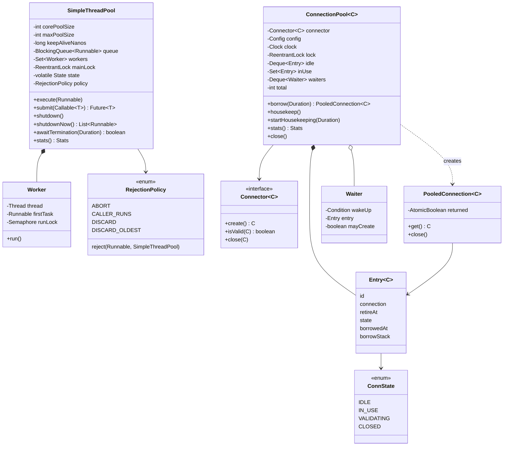

# LLD Interview: Design a Thread Pool and a Connection Pool (like ThreadPoolExecutor / HikariCP)

> "Design a thread pool: callers submit tasks, a limited number of threads run them. Then: same idea for database connections. Make both safe under many threads, and well-behaved when they're full."

Two classic LLD questions that are really one: **a bounded set of expensive resources, a queue for whoever has to wait, and lifecycle rules**. The interviewer usually starts with the thread pool and moves to the connection pool at L5. It teaches the ideas inside `ThreadPoolExecutor` and HikariCP: **producer-consumer with a `BlockingQueue`**, workers that **survive failing tasks**, **graceful vs abrupt shutdown**, the surprising **core → queue → max** growth order, **rejection policies** (CallerRuns as back-pressure), **sizing with Little's law**, and for connections **borrow with timeout, FIFO-fair hand-off, validation, max lifetime with jitter and leak detection**. At L6: **fleet arithmetic** (pods × pool size vs `max_connections`), **pgbouncer** and transaction pooling, **virtual threads**, bulkheads and failover storms.

> 💡 **Terms in one line each** (details in the files):
> **Worker**: a pool thread looping "take a task, run it". **Core / max pool size**: threads always kept / the ceiling. **Keep-alive**: how long an extra thread may idle before exiting. **Rejection policy**: what happens when the queue is full and all threads are busy. **Future**: a handle to a result that will exist later. **Poison pill**: a special task meaning "stop". **Back-pressure**: a slow consumer making a fast producer slow down. **Little's law**: busy items = arrival rate × time each spends inside. **Borrow / release**: take a connection from the pool / give it back. **Validation**: a cheap check that a connection still works. **Max lifetime**: age after which a connection is replaced. **Leak**: a borrowed connection never returned. **Fairness**: waiters served in arrival order. **pgbouncer**: a separate pooling process in front of PostgreSQL. **Virtual thread**: a cheap JVM-managed thread (Java 21) that doesn't hold an OS thread while waiting.

## How to read this folder

> 👉 **Never wondered what's behind `maximum-pool-size`? Start with [00-understand-the-product.md](00-understand-the-product.md).** It walks through a Black Friday outage caused by a thread and a connection per request, and shows the submit → queue → worker and borrow → validate → use → return paths.

| File | Level | What "good" looks like |
|---|---|---|
| [00-understand-the-product.md](00-understand-the-product.md) | Everyone, first | Know the features (bounded workers, queue, rejection, core/max, keep-alive, shutdown, borrow/return, timeouts, validation, max lifetime, leaks, fairness) and why each exists |
| [L4-mid.md](L4-mid.md) | Mid / SDE2 | Why not thread-per-task; `BlockingQueue` + N workers; `submit` → `Future` via `FutureTask`; worker survives exceptions (and `submit` hides them until `get()`); poison pill vs interrupt; `shutdown` / `shutdownNow` / `awaitTermination`; the check-then-act race |
| [L5-senior.md](L5-senior.md) | Senior | `ThreadPoolExecutor` semantics: core → queue → max → reject, the unbounded-queue gotcha, keep-alive; four rejection policies; sizing with Little's law and N_cpu × U × (1 + W/C); then a connection pool: borrow with timeout, FIFO hand-off (a fair lock isn't enough), validation, close-before-free, max lifetime with jitter, leak detection, per-connection state machine |
| [L6-staff.md](L6-staff.md) | Staff | Fleet arithmetic (50 pods × 20 = 1,000 vs `max_connections` 100, deploy surge), HikariCP's sizing advice, pgbouncer / RDS Proxy and session vs transaction pooling, virtual threads (drop thread pools, keep connection pools, add semaphores, pinning), bulkheads, metrics and saturation alerts, failover reconnect storms, build vs buy |

## Code (runnable, no dependencies)

| | Run | Files |
|---|---|---|
| ☕ Java 21 | `./java/run.sh` | [java/src/pool/](java/src/pool/): `SimpleThreadPool` (core/max/keep-alive, bounded queue, `submit` → `FutureTask`, `shutdown` / `shutdownNow` / `awaitTermination`, stats), `RejectionPolicy` (ABORT / CALLER_RUNS / DISCARD / DISCARD_OLDEST), `ConnectionPool<C>` + `Connector<C>` + `PooledConnection<C>` (FIFO hand-off, validation, max lifetime with jitter, leak detection, `housekeep()`), `ManualClock`; 19 tests in `PoolTests.java`; `Demo.java` |
| 🟨 Node 22 | `cd js && node --test` | [js/pool.js](js/pool.js), [js/pool.test.js](js/pool.test.js): an async `ResourcePool` (Promise-based acquire, FIFO waiters, timeout, validation, max) and `createLimiter(n)` (at most n async tasks at once), since Node runs JavaScript on one thread (8 tests) |

**Design for testability:** thread-pool tests block tasks on a `CountDownLatch`, so "all workers busy, queue full" is a state the test builds, not a race. Connection-pool time comes from an injected `java.time.Clock` (`ManualClock`), so max lifetime and leak thresholds are exact, and `housekeep()` is called directly instead of waiting for a background thread. Where a test must wait for another thread, it waits for a **state** (e.g. "3 waiters in line"), never for a guessed number of milliseconds. The connector is an interface, so tests use a fake connection with a `broken` flag.

Sample demo output:

```
--- Thread pool: core=2, max=4, queue=4, CALLER_RUNS ---
  after task 2: threads=2 queued=0 rejected=0
  after task 6: threads=2 queued=4 rejected=0
  after task 7: threads=3 queued=4 rejected=0
  after task 8: threads=4 queued=4 rejected=0
  task 9: pool saturated -> ran on the CALLER thread 'main' (the producer is slowed down: back-pressure)
--- Connection pool: maxSize=2, maxLifetime=30 min, leakThreshold=2 s ---
  request 2 uses conn-1 (reused, no new TCP connection)
  request 3 timed out after 100 ms: pool exhausted (in HikariCP: connectionTimeout)
  WARN leak? connection #1 held for 3 s, borrowed at:
      at pool.Demo.forgetfulRepository(Demo.java:89)
```

## Class diagram (matches the code)



## Libraries & concepts used

**Java:** [Executors & threads](../../libraries/java/executors-and-threads.md) · [Blocking queues & producer-consumer](../../libraries/java/blocking-queues-and-producer-consumer.md) · [Locks & synchronized](../../libraries/java/locks-and-synchronized.md) · [Atomics & CAS](../../libraries/java/atomics-and-cas.md) · [CompletableFuture](../../libraries/java/completablefuture.md) · [Concurrent collections](../../libraries/java/concurrent-collections.md) · [Time & Clock](../../libraries/java/time-and-clock.md) · [ScheduledExecutorService](../../libraries/java/scheduled-executor-service.md) · [HikariCP & JDBC pools](../../libraries/java/hikaricp-and-jdbc-pools.md)

**JS:** [Event loop & concurrency](../../libraries/js/event-loop-and-concurrency.md) · [async/await & timers](../../libraries/js/async-await-and-timers.md) · [Worker threads & the libuv pool](../../libraries/js/worker-threads-and-libuv-pool.md) · [node:test runner](../../libraries/js/node-test-runner.md)

**Concepts:** [Resource pools & sizing](../../concepts/resource-pools-and-sizing.md) · [Thread-safety basics](../../concepts/thread-safety-basics.md) · [Back-pressure](../../concepts/back-pressure.md) · [Deadlocks & lock ordering](../../concepts/deadlocks-and-lock-ordering.md) · [Design patterns](../../concepts/design-patterns.md) · [State machines](../../concepts/state-machines.md) · [Thread-local & context propagation](../../concepts/thread-local-and-context-propagation.md) · [Timers, delay queues & timing wheels](../../concepts/timers-delay-queues-and-timing-wheels.md) · [UML class diagrams](../../concepts/uml-class-diagrams.md)

**Related:** [Logging Framework (LLD)](../logging-framework/README.md) (its async appender is a one-worker pool with the same back-pressure choices) · [Resilience patterns](../../../HLD/concepts/resilience-patterns.md) · [Observability](../../../HLD/concepts/observability.md) · [Retries, backoff & DLQ](../../../HLD/concepts/retries-backoff-and-dlq.md) · [PostgreSQL](../../../HLD/technologies/postgresql.md)

## The core insight

1. **A pool is a promise about a limit.** Threads, connections and the database behind them are finite. A pool turns "unlimited callers" into "N at a time, the rest wait in a bounded line, and here's exactly what happens when the line is full". Every setting (core, max, queue size, timeout, rejection policy) is part of that promise; an unbounded queue or an infinite timeout quietly breaks it.
2. **Read the configuration the way the code reads it.** `ThreadPoolExecutor` queues before it grows; a fair lock still lets newcomers barge; `submit()` hides exceptions until `get()`; a dropped Future may never complete. Knowing the real behaviour is what makes the settings (and the incidents) make sense.
3. **The limit that matters is the one at the scarce resource, summed across the fleet.** Size from the database's capacity and Little's law, multiply by replicas and deploy surge, put a proxy in front when the numbers don't fit, and keep an explicit limit even when virtual threads make threads free.
