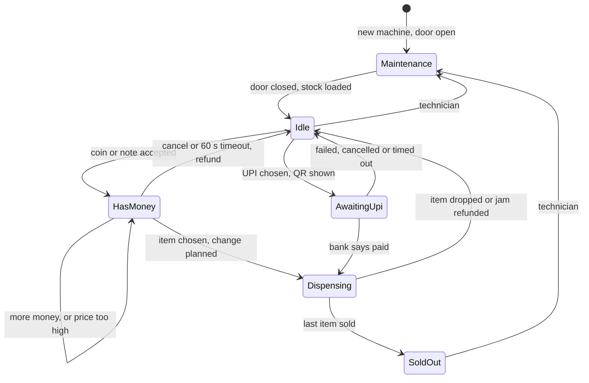

# Start Here: What Is a Vending Machine, Really? (Before the Interview)

> You've bought a bottle of water from one, at an office, a metro station or a hospital corridor. This interview asks you to write the software inside it: a small computer that takes your money, decides what to do with every button press, spins a motor, and must **never** keep your money without giving you something (an item or a refund). It is the classic interview for the **State pattern** (a design where each situation the machine can be in gets its own class) and a surprisingly deep lesson in **giving change with a limited number of coins**.
>
> Time: ~10 minutes. Then: [L4](L4-mid.md) → [L5](L5-senior.md) → [L6](L6-staff.md).

---

## 1. The problem as a story: the 3rd-floor snack machine

The office has a snack machine next to the pantry. It takes ₹1, ₹2, ₹5, ₹10 and ₹20 coins and ₹10, ₹20, ₹50 and ₹100 notes. Over one week, the facilities team gets these complaints:

1. **"It ate my ₹20."** Asha put in a note, pressed B1, the spiral turned, and the chikki got stuck on the edge. No snack, no refund.
2. **"It couldn't give me ₹6 back."** The machine had one ₹5 and three ₹2 coins. It tried the ₹5 first, then had no ₹1, and gave up. But 2 + 2 + 2 = 6 was sitting right there.
3. **"It said B2 but it was empty."** The display showed cold coffee; the slot was empty; the machine took the money anyway.
4. **"Two of us pressed at once."** Ravi pressed A2 while Meera, behind him, hit A2 too. The log showed two vends for one payment (the second came free).
5. **"I put in ₹10 and got a call."** Arjun walked away. Ten minutes later someone else walked up, saw "Balance ₹10", and bought a ₹10 biscuit with it.
6. **"I paid by UPI, the app says debited, nothing came out."** The bank's confirmation arrived after the machine had given up waiting.

Every one of these is a bug in *the order of decisions*: what the machine allows in which situation, and when money actually changes hands. That's what a good design fixes.

---

## 2. Where you've seen this

| Place | What you saw |
|---|---|
| **Office snack / drinks machine** | Coins, notes, a coin-return cup, a "SOLD OUT" light per slot, sometimes an "EXACT CHANGE ONLY" light |
| **Metro ticket / token vending machines** | Choose destination, pay cash or card/UPI, get a token and change. The fare is known before you pay |
| **ATMs** | A strict sequence: card → PIN → amount → cash. If the cash doesn't come out but your account is debited, the bank reverses it automatically later |
| **Parking pay stations** | Insert ticket → shows fee → pay → change and an exit ticket |
| **Office coffee machines** | Select → pay (or swipe an employee card) → "Brewing..." (busy: buttons ignored) → "Take your cup" |
| **At work: Kubernetes pod phases** | `Pending → Running → Succeeded / Failed`. A pod can't go from `Succeeded` back to `Running`. That's a **state machine**: a fixed set of states and the allowed moves between them |
| **At work: deployment rollouts** | `Progressing → Complete`, or `Progressing → Failed → rollback`. `kubectl rollout status` watches it |

The vending machine is the same idea as pod phases, but with money attached. Getting a transition wrong in Kubernetes restarts a pod; getting it wrong here loses someone's ₹20.

---

## 3. The features, one situation at a time

### 3.1 Select an item, insert money
Asha wants chikki (₹14) from slot B1. Classic machines ask for money first, then the button; many newer ones (and every UPI flow) ask for the item first so they can show the price. Our design takes cash first, and pressing a button with no money just shows the price.

👉 Interview: *which events are allowed in which state? This is the State pattern.*

### 3.2 Change, and why it's harder than it looks
Asha pays ₹20 for ₹14. The machine owes ₹6, and it can only give out the coins it physically has. "Biggest coin first" (the **greedy** approach) fails when counts are limited: one ₹5 + three ₹2 can make ₹6 (2+2+2), but greedy grabs the ₹5 and is stuck at ₹1. (Why, and the fix: [coin change & dynamic programming](../../concepts/coin-change-and-dynamic-programming.md).)

👉 Interview (L4 → L5): *greedy change-making, then why it fails, then a correct algorithm.*

### 3.3 Cancel and refund
Ravi inserts ₹10 note + ₹2 + ₹2, then changes his mind. He should get back **the same note and coins**, not "₹14 in whatever coins we have". The machine holds inserted money in **escrow** (a holding area: not yet the machine's, not yet returned) until a sale completes.

👉 Interview: *where does inserted money live, and what happens to it on each exit path?*

### 3.4 "EXACT CHANGE ONLY"
When the coin tubes run low, the machine lights this up **before** anyone pays. And when Meera inserts a ₹100 note that no item could ever be bought with (because no change is possible for any of them), the machine pushes it straight back instead of taking it and then failing.

👉 Interview: *decide before accepting money, not after.*

### 3.5 Sold out: one slot or the whole machine
B2 is empty: pressing B2 says "sold out, choose another" and keeps your balance. When every slot is empty, the whole machine goes to SOLD OUT and refuses money.

### 3.6 Card / UPI: another way to pay
Priya picks A2 and chooses UPI. The screen shows a **QR code** (a square barcode her phone scans) for exactly ₹15. Her bank app pays, and a few seconds later the payment provider tells the machine "paid" through a **callback** (a message the provider sends to us when something happens, instead of us asking). Callbacks can arrive **twice**, **late**, or **never**.

👉 Interview (L5/L6): *payment methods as a sealed type; UPI as an asynchronous, pending payment with an idempotency key.*

### 3.7 The jam
The spiral turns, but the packet catches on the edge. Real machines have a **drop sensor** (an infrared beam across the delivery chute) that sees whether something fell. No drop seen → refund, and don't count the item as sold (it's still physically there).

👉 Interview (L5): *the order of side effects: when do we take the money, decrement stock and pay change?*

### 3.8 Timeout refund
Arjun's ₹10 sits there. After **60 s** with no button press, the machine returns it. The next person starts from zero.

👉 Interview (L5): *a timer inside a state machine, tested without waiting 60 s (an injectable clock).*

### 3.9 Admin: restock, collect cash, maintenance mode
The technician opens the door, refills slots, loads coins into the change tubes, takes the notes out, and clears jams. While the door is open, customers are refused ("Out of service"). He can't open it in the middle of someone's purchase.

👉 Interview: *maintenance as its own state; admin operations only allowed there.*

### 3.10 Power failure mid-vend
The power trips while the motor is turning. When the machine restarts, was the item delivered? Was the money taken? A machine with only in-memory state doesn't know.

👉 Interview (L6): *write down what you're about to do before you do it (a journal), and reconcile after a restart.*

---

## 4. The key mechanism: one state at a time



- The machine is in **exactly one** state. Each state answers each event (insert, select, cancel, tick, bank callback) in its own way: in `Idle` a button shows the price; in `HasMoney` it buys; in `Dispensing` it is ignored ("Busy").
- **Money moves only at the end.** While in `HasMoney` the coins sit in escrow. The sale is planned (item available? change possible?) *before* the motor turns, and committed *after* the drop sensor confirms.
- This is the **State pattern** (one class per state, see [design patterns](../../concepts/design-patterns.md)) on top of a **finite state machine** ([state machines](../../concepts/state-machines.md)).

---

## 5. Try it yourself (real, 10 minutes)

1. **Watch a real state machine (Kubernetes)**, on any test cluster (e.g. `kind` or `minikube`, tools that run a small cluster on your laptop):
   ```sh
   kubectl run demo --image=busybox --restart=Never -- sh -c "sleep 5; exit 0"
   kubectl get pods -w        # watch: Pending -> ContainerCreating -> Running -> Completed
   kubectl delete pod demo
   ```
   Every line is a state transition. Notice there's no way back from `Completed` (shown for the `Succeeded` phase).
2. **Watch a pending payment (UPI).** Pay any small amount by UPI and open the transaction in your app. You'll sometimes see **"Pending"** or "Processing" before "Success". If a payment fails after money is debited, banks reverse it automatically; the RBI (Reserve Bank of India) sets deadlines for this (its 2019 "turn around time" circular said T+1 for UPI, i.e. by the day after the transaction; check the current rule). That pending state is exactly what the machine must handle.
3. **Make greedy fail in `jshell`** (Java's interactive shell, ships with the JDK):
   ```java
   int[] coins = {5, 2};          // rupee coins in the machine, biggest first
   int[] have  = {1, 3};          // one ₹5, three ₹2
   int left = 6;                  // change owed: ₹6
   for (int i = 0; i < coins.length; i++) { int take = Math.min(have[i], left / coins[i]); left -= take * coins[i]; System.out.println("take " + take + " x ₹" + coins[i]); }
   System.out.println("still owed: ₹" + left);
   // take 1 x ₹5 / take 0 x ₹2 / still owed: ₹1   (but 2+2+2 works)
   ```
4. **Next time you use a snack machine**, press a button before inserting money (it usually shows the price), and look for the coin-return lever and the "EXACT CHANGE" light.

---

## 6. From experience to requirements

| What you experienced | Requirement | Type |
|---|---|---|
| Pick an item, pay, get it | Select + insert coins/notes; vend when balance ≥ price | Functional |
| ₹20 for a ₹14 item | Pay change from the coins actually in the machine | Functional |
| One ₹5 + three ₹2, owe ₹6 | Change-making must succeed whenever *any* combination works | Functional |
| Changed my mind | Cancel returns the **exact** coins and notes inserted | Functional |
| Low coins | "Exact change only" shown before paying; refuse money that can't lead to a sale | Functional |
| Empty slot / empty machine | Per-slot sold out keeps the balance; whole machine sold out refuses money | Functional |
| Paid by UPI | UPI (and card) as other payment methods; duplicate/late callbacks handled | Functional |
| Snack stuck | Jam detected → refund, stock unchanged | Functional |
| Walked away | Refund after 60 s of inactivity | Functional |
| Technician visit | Restock, load coins, collect notes, only in maintenance mode | Functional |
| Two people pressing | One payment → at most one item, even with simultaneous presses | Non-functional |
| Never "ate my money" | Money conserved: in = returned + kept, kept = revenue | Non-functional |
| Power cut | Recover to a known state after restart | Non-functional |
| Tests run fast | Injectable clock and fake dispenser: no real waits or hardware in tests | Non-functional |

---

## 7. Mini glossary

| Term | Meaning in plain words |
|---|---|
| **Paise** | 1/100 of a rupee. We store all money as whole paise (`long`), so ₹14.50 = 1450 |
| **Denomination** | A kind of coin or note: ₹5 coin, ₹100 note |
| **Escrow** | Money inserted but not yet kept or returned; sits apart until the sale finishes |
| **Change float** | Coins the machine keeps in its tubes to give change |
| **Greedy change** | Always take the biggest coin that fits; simple, can fail with limited coins |
| **State machine** | A fixed set of states plus the allowed moves between them |
| **State pattern** | Code design: one class per state, each handling events its own way |
| **Drop sensor** | An infrared beam across the chute that sees whether an item fell |
| **Jam** | The motor ran but nothing fell |
| **UPI** | India's instant bank-to-bank payment system (scan a QR, approve in your app) |
| **Callback** | A message the payment provider sends us when the payment's status changes |
| **Idempotency key** | A unique ID per payment so a repeated message is recognised and applied only once |
| **Maintenance mode** | Door open; only the technician's operations are allowed |
| **Audit log** | An append-only list of every event and its outcome, for disputes and debugging |

➡️ **Now build it:** [L4-mid.md](L4-mid.md)
