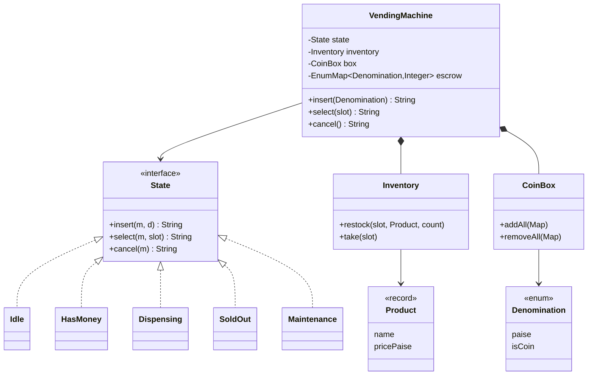
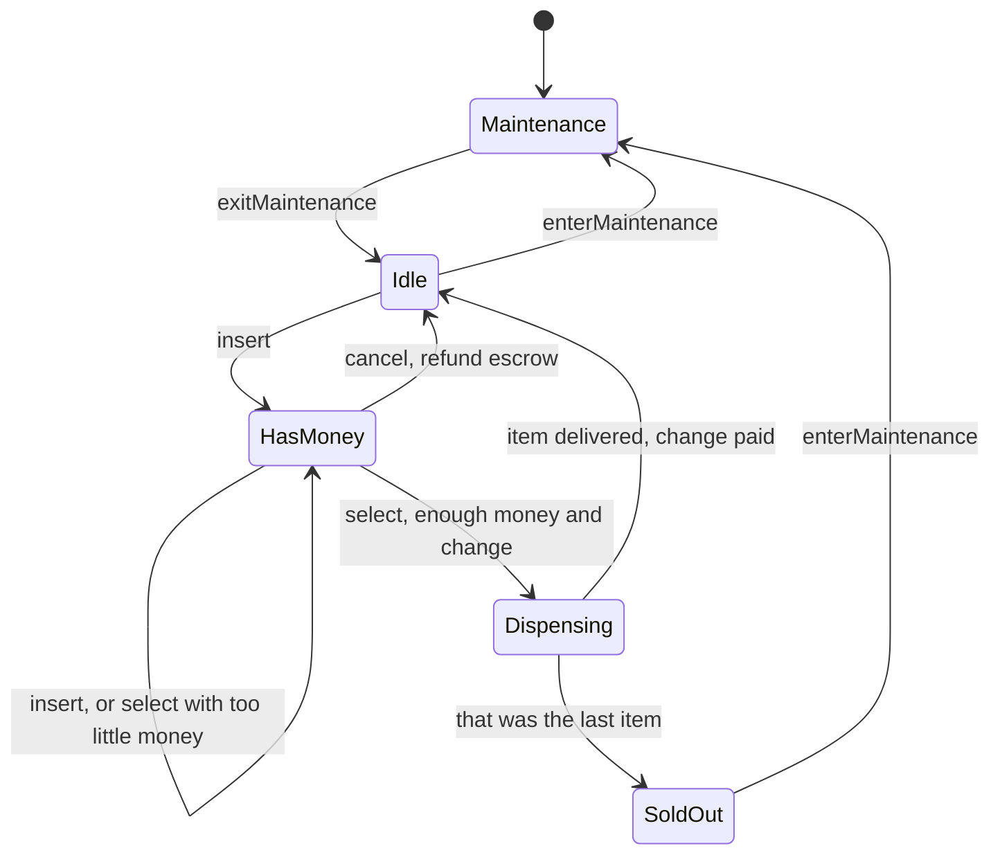

# Vending Machine — L4 (Mid-level / SDE2) LLD Interview

> **Level expectation:** turn the machine into clean classes (denominations, products, slots, coin box, the machine), represent money exactly, model the machine's behaviour with the **State pattern** instead of a pile of booleans, give change from a **limited** coin box, and draw the class and state diagrams. Explain why each piece is an enum, record or class.

> 🆕 Never thought about what's inside a vending machine? Read [00-understand-the-product.md](00-understand-the-product.md) first.

Legend: **🧑‍💼 Interviewer** · **🧑‍💻 Candidate** · **📝 Note** = commentary for you.

---

## 1. Clarifying requirements

**🧑‍💼 Interviewer:** Design a vending machine.

**🧑‍💻 Candidate:** Some questions first:
- Which money does it take? Coins only, or notes too? Does it give change, and from what?
- How are items organised: slots with a code like `A1`, one product type per slot?
- Order of actions: money first, then the button? Or button first?
- Cancel and refund? Card or UPI payments?
- Is there a technician mode for restocking and taking out cash?
- One customer at a time? (It's one physical front panel.)

**🧑‍💼 Interviewer:** Indian coins ₹1, ₹2, ₹5, ₹10, ₹20 and notes ₹10, ₹20, ₹50, ₹100. Change in coins only, from what's in the machine. Slots like `A1`. Money first, then the button. Cancel, yes. Ignore UPI for now. Yes to a maintenance mode. One customer at a time, but assume buttons can be mashed.

**🧑‍💻 Candidate:**

**Functional:** `insert(coin/note)`, `select(slot)`, `cancel()`; give change; per-slot "sold out"; maintenance: restock, load coins, collect notes.

**Non-functional:** money is exact (no rounding errors); the machine never keeps money without vending or refunding; easy to add a state or a payment method later; testable without hardware.

> 📝 **Note:** "Change from what's in the machine" is the question that turns this from a toy into a real problem. Without it, change is just `balance - price`; with it, it's an algorithm (section 5.4, and properly at L5).

---

## 2. Core entities

**🧑‍💻 Candidate:** Nouns from the problem → classes ([OOP modelling](../../concepts/oop-modeling.md)):

| Noun | Kind | Why |
|---|---|---|
| `Denomination` | **enum** | A fixed set (₹1 coin … ₹100 note); each knows its value in paise and whether it's a coin |
| `Product` | **record** | A value: "Masala chips, ₹15". Two equal records are the same product |
| `Inventory` | class | Slot code → product + count (+ jammed flag at L5). Changes all day |
| `CoinBox` | class | How many of each denomination are inside; never negative |
| `ChangeMaker` | stateless helper | Picks which coins to give back |
| `State` | **interface** + one class per state | `Idle`, `HasMoney`, `Dispensing`, `SoldOut`, `Maintenance` |
| `VendingMachine` | class | The one entry point the buttons call; owns everything above |

An **enum** is a type with a fixed list of named values; Java enums can carry fields and methods ([enums & EnumMap](../../libraries/java/enums-and-enummap.md)). A **record** is a short immutable data class: fields, constructor, `equals` and `hashCode` generated ([records & immutability](../../libraries/java/records-and-immutability.md)).

```java
public enum Denomination {
    COIN_1(100, true), COIN_2(200, true), COIN_5(500, true), COIN_10(1_000, true), COIN_20(2_000, true),
    NOTE_10(1_000, false), NOTE_20(2_000, false), NOTE_50(5_000, false), NOTE_100(10_000, false);
    private final long paise; private final boolean coin;
    ...
}
public record Product(String name, long pricePaise) {}
```

**🧑‍💼 Interviewer:** Why `long` paise and not `double` rupees?

**🧑‍💻 Candidate:** `double` is binary floating point: `0.1 + 0.2` is `0.30000000000000004`, so sums of prices drift and `==` comparisons fail. **Paise** (1/100 rupee) as a `long` integer makes every sum and comparison exact ([splitting money & rounding](../../concepts/splitting-money-and-rounding.md)). `BigDecimal` (Java's exact decimal type) also works and is what you'd use with taxes or percentages ([BigDecimal & money](../../libraries/java/bigdecimal-and-money.md)); here we only add and subtract whole amounts, so `long` is simpler. The same rule applies in JavaScript, where every number is a double ([money & numbers in JS](../../libraries/js/money-and-numbers-in-js.md)).

**🧑‍💼 Interviewer:** Why not `class Coin` with subclasses `OneRupee`, `TwoRupee`...?

**🧑‍💻 Candidate:** They'd differ only in *data* (a value), not *behaviour*. That's one enum field. Same reasoning as `VehicleType` in the [parking lot](../parking-lot/README.md).

---

## 3. Interfaces

```java
public final class VendingMachine {
    public VendingMachine(String machineId, Dispenser dispenser, TimeSource clock);
    // customer: never throw; return what the display shows
    public String insert(Denomination d);
    public String select(String slot);
    public String cancel();
    // technician: throw IllegalStateException unless in maintenance
    public String enterMaintenance();  public String exitMaintenance();
    public void restock(String slot, Product p, int count);
    public void loadCoins(Denomination coin, int count);
    public Map<Denomination, Integer> collectCash();
}
public interface Dispenser { boolean dispense(String slot, Product p); }   // true = drop sensor saw the item
```

Customer events return a display message rather than throwing, because a customer pressing the "wrong" button is normal, not an error. A technician calling `restock` with the door closed is a programming error, so it throws.

---

## 4. The State pattern: why, and what it looks like

**🧑‍💼 Interviewer:** Start simple. Why not just `if (balance > 0) ... else ...` in each method?

**🧑‍💻 Candidate:** Let me write the "boolean soup" version to show the problem:

```java
// ❌ each method re-checks every flag, in a slightly different order
public String select(String slot) {
    if (inMaintenance) return "Out of service";
    if (dispensing) return "Busy";
    if (soldOut) return "SOLD OUT";
    if (balance == 0) return showPrice(slot);
    ...
}
```

Four booleans (`inMaintenance`, `dispensing`, `soldOut`, `hasMoney`) = 2⁴ = 16 combinations, and most are nonsense (`dispensing && inMaintenance`). Each of the 5+ methods must handle all of them, and a new mode (say UPI) doubles the combinations again. Bugs live in the combination someone forgot.

A **state machine** replaces the flags with **one field** whose value is one of a few named states ([state machines](../../concepts/state-machines.md)). The **State pattern** goes one step further: each state is a **class**, and the machine forwards every event to the current state object ([design patterns](../../concepts/design-patterns.md#state--behaviour-depends-on-a-lifecycle-state)):

```java
sealed interface State permits Idle, HasMoney, Dispensing, SoldOut, Maintenance {
    default String insert(VendingMachine m, Denomination d) { return m.bounce(d, "Busy"); }   // default: refuse
    default String select(VendingMachine m, String slot)    { return "Busy"; }
    default String cancel(VendingMachine m)                 { return "Nothing to cancel"; }
}
final class Idle implements State {
    public String insert(VendingMachine m, Denomination d) { return m.acceptCash(d); }    // -> HasMoney
    public String select(VendingMachine m, String slot)    { return m.priceCheck(slot); } // just show the price
}
final class HasMoney implements State {
    public String insert(VendingMachine m, Denomination d) { return m.acceptCash(d); }
    public String select(VendingMachine m, String slot)    { return m.sellForCash(slot); } // -> Dispensing
    public String cancel(VendingMachine m)                 { return m.refundEscrow("Cancelled"); }
}
// VendingMachine: public String select(String slot) { return state.select(this, slot); }
```

| Approach | Good | Bad |
|---|---|---|
| Boolean flags | Nothing to set up | 2ⁿ combinations, logic smeared across methods |
| `enum` + `switch` per method | One field; compiler can check every case | Each method has a switch over all states; fine for small machines |
| **State pattern** | Each state's rules in one small class; default methods refuse everything not overridden; adding a state = adding a class (**open/closed**: extend without editing existing code, see [SOLID](../../concepts/solid-principles.md)) | More classes; the shared data (balance, stock) must live in the machine |

The states here hold **no data**: balance, stock and coins live in `VendingMachine`, and the states decide *what is allowed*. So each state can be a single shared instance (`State.IDLE`). A `sealed` interface (only the listed classes may implement it, see [sealed interfaces](../../libraries/java/sealed-interfaces-and-pattern-matching.md)) documents the full set of states.

> 📝 **Note:** Interviewers ask "why not if/else?" to see whether you can name the cost (combinations, scattered rules) rather than just "it's a pattern". It's also fine to say "for three states I'd use an enum + switch"; the State pattern earns its keep here because each state behaves very differently.

---

## 5. Class and state diagrams



Notation: [UML class diagrams](../../concepts/uml-class-diagrams.md). `*--` (composition) means the machine owns its inventory and coin box; they don't exist without it.



### 5.1 Escrow: where inserted money lives

**🧑‍💻 Candidate:** Inserted coins go into an **escrow** map (`EnumMap<Denomination,Integer>`: a map keyed by an enum, stored as a small array), not the coin box. Then:
- **Cancel** returns exactly those pieces: the customer who inserted a ₹10 note gets the note back, not a ₹10 coin.
- **Sale** moves escrow into the box and takes the change out of the box.

### 5.2 A sale, step by step

```java
String sellForCash(String slot) {
    if (!inventory.sellable(slot)) return name + " sold out: choose another or cancel";
    long balance = total(escrow);
    if (balance < price) return "Insert " + rupees(price - balance) + " more";
    var change = ChangeMaker.greedy(balance - price, coinsAvailable());     // L5 replaces this with exact()
    if (change.isEmpty()) return "Cannot return change: choose another, add exact money, or cancel";
    state = DISPENSING;                       // motor runs; on success: stock--, escrow -> box, change out
    ...
}
```

Note the order: check stock → check money → check change → *then* spin the motor. Everything that can say "no" says it before anything physical happens.

### 5.3 Sold out

A per-slot "sold out" keeps the customer in `HasMoney` (they can choose another or cancel). When the last item of the whole machine sells, the machine moves to `SoldOut`, which refuses money outright.

### 5.4 Giving change: greedy

**🧑‍💻 Candidate:** Take the largest coin that fits, as many as we have, then the next ([greedy algorithms](../../concepts/greedy-algorithms.md)):

```java
static Optional<Map<Denomination, Integer>> greedy(long amount, Map<Denomination, Integer> available) {
    var out = new EnumMap<Denomination, Integer>(Denomination.class);
    for (Denomination d : coinsLargestFirst(available)) {
        int take = (int) Math.min(available.get(d), amount / d.paise());
        if (take > 0) { out.put(d, take); amount -= take * d.paise(); }
    }
    return amount == 0 ? Optional.of(out) : Optional.empty();
}
```

₹20 for ₹15 chips → owe ₹5 → one ₹5 coin. Cost: O(d) for d coin types (5), i.e. time grows in step with the number of coin types, see [Big-O](../../concepts/big-o-complexity.md). With an *unlimited* supply of Indian coins (1, 2, 5, 10, 20), greedy always gives the fewest coins. Only coins are change: notes go into a one-way stacker.

**🧑‍💼 Interviewer:** Is greedy always right with a real coin box?

**🧑‍💻 Candidate:** No. With one ₹5 and three ₹2 and ₹6 owed, greedy takes the ₹5 and is stuck at ₹1, though 2+2+2 works. The fix is a small **dynamic-programming** search (fill a table of best answers for every smaller amount, then build up) ([coin change & dynamic programming](../../concepts/coin-change-and-dynamic-programming.md)); I'd do that next ([L5](L5-senior.md#31-change-making-greedy-fails-with-a-real-coin-box)).

> 📝 **Note:** At L4, spotting that greedy *can* fail with limited counts is a strong signal even if you implement greedy first. Not knowing it is fine; claiming greedy is always optimal is the mistake.

---

## 6. Follow-ups

**🧑‍💼 Interviewer:** Two people press `A2` at the same instant. What happens?

**🧑‍💻 Candidate:** Every public method takes the same lock (`synchronized`: only one **thread**, an independent line of execution such as one button handler, at a time runs code guarded by that lock, see [locks & synchronized](../../libraries/java/locks-and-synchronized.md)). The first press moves to `Dispensing` and the second one sees `Dispensing` ("Busy") or, once the sale is done, `Idle` with zero balance ("insert money"). One payment, one item. L5 refines this so the slow motor doesn't run while holding the lock ([thread-safety basics](../../concepts/thread-safety-basics.md)).

**🧑‍💼 Interviewer:** How do you test it without a machine?

**🧑‍💻 Candidate:** `Dispenser` is an interface: tests pass `(slot, p) -> true` (always drops) or `-> false` (jam). The machine never touches hardware directly.

---

## 7. What the interviewer was evaluating (L4)

- [ ] Clarified money types, change source, order of actions, maintenance
- [ ] Money as integer paise; denominations as an enum with values
- [ ] `Product` record vs `Inventory` / `CoinBox` classes, with reasons
- [ ] Explained why boolean flags fail; used the State pattern (or enum + switch) with one current state
- [ ] Escrow for inserted money; cancel returns the same pieces
- [ ] Checked stock, money and change before dispensing
- [ ] Greedy change from a limited coin box, and knew it can fail
- [ ] Class diagram and state diagram

## 8. Common mistakes at this level

| Mistake | Why it's wrong |
|---|---|
| `double` rupees | Rounding errors; `0.1 + 0.2 != 0.3` |
| Booleans `hasMoney`, `isDispensing`, `inMaintenance` | 2ⁿ combinations, most invalid; rules scattered |
| A subclass per coin | Differences are data, not behaviour: use an enum |
| `change = balance - price` and done | Ignores which coins actually exist in the machine |
| Adding inserted coins straight to the coin box | Cancel can't return the exact pieces; tubes and escrow get mixed up |
| Dispensing, then discovering change is impossible | The item is gone; now you either keep money or give it away |
| Throwing exceptions for wrong button presses | A customer pressing the wrong button is normal; show a message |

➡️ Next: [L5-senior.md](L5-senior.md)
