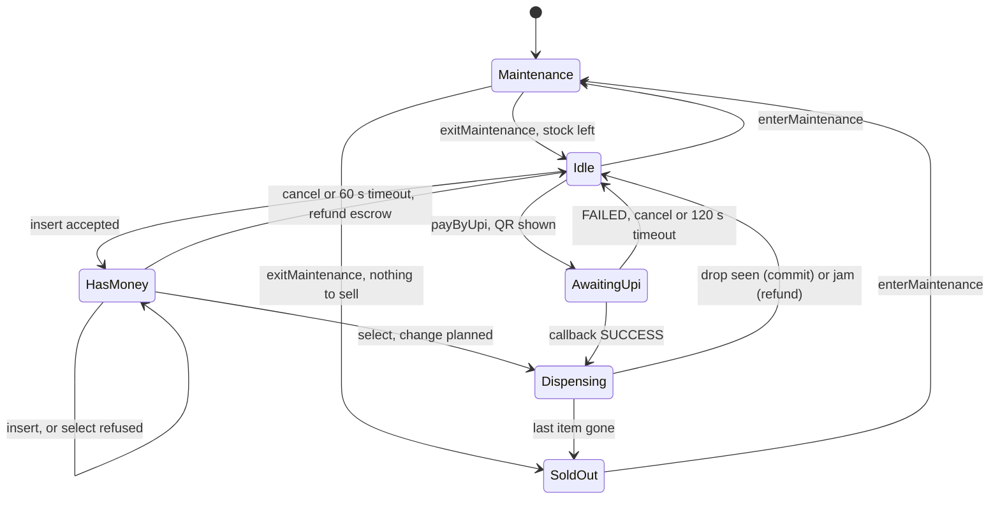
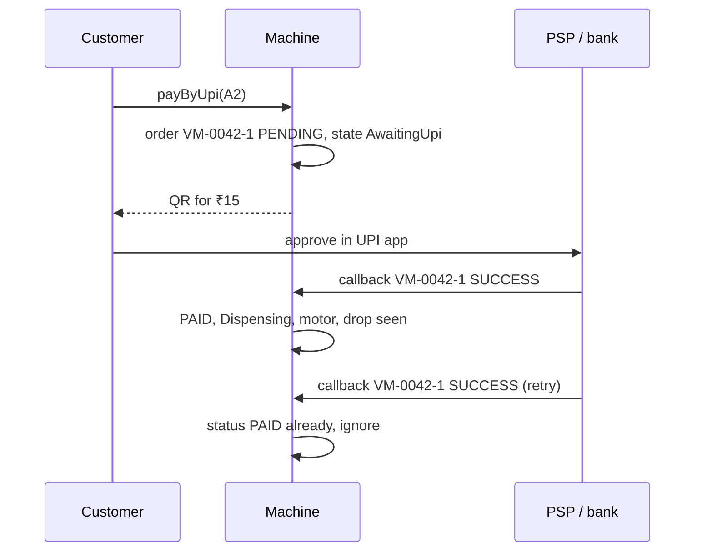

# Vending Machine — L5 (Senior) LLD Interview

> **Level expectation:** take the L4 State-pattern machine and make it **correct with real money and real hardware**: change-making that never fails when an answer exists (greedy doesn't), "exact change only" decided **before** taking money, a sale that is planned before the motor turns and committed only after the drop sensor confirms, refunds on every failure path, safe concurrent button presses, an inactivity timeout tested without waiting, card/UPI as other payment types (UPI is asynchronous and its callbacks can repeat), and an audit log. Read [L4-mid.md](L4-mid.md) first.

Legend: **🧑‍💼 Interviewer** · **🧑‍💻 Candidate** · **📝 Note** = commentary for you.

---

## 1. Requirements (what's new vs L4)

**🧑‍💻 Candidate:**
- Change-making that succeeds whenever **any** combination of available coins works.
- "Exact change only": warn before payment; never accept money that can't lead to a sale.
- **Jam handling:** the **drop sensor** (an infrared beam across the chute) didn't see the item → refund, stock unchanged.
- **Timeout:** refund after 60 s without activity.
- **UPI** payments: the bank confirms later through a **callback** (a message the payment provider sends us); callbacks may be duplicated or late.
- Concurrent presses never double-vend; every event is recorded in an **audit log** (an append-only list of what happened, for disputes).

---

## 2. The full state machine



Six states, written with the State pattern from L4 (one class per state, see [state machines](../../concepts/state-machines.md) and [design patterns](../../concepts/design-patterns.md)); every state has a default "refuse" for events it doesn't handle (coins inserted in a refusing state are pushed straight back to the coin cup). `select` before inserting money is allowed in `Idle` and just shows the price: a deliberate, documented choice (test `invalidEventsAreRefusedNotCrashed`).

---

## 3. Deep dives

### 3.1 Change-making: greedy fails with a real coin box

**🧑‍💼 Interviewer:** Your L4 greedy change. Show me where it breaks.

**🧑‍💻 Candidate:** Chikki costs ₹14, the customer inserts a ₹20 coin, the tubes hold **one ₹5 and three ₹2** (no ₹1). We owe ₹6.

| Approach | Steps | Result |
|---|---|---|
| Greedy (largest first) | take ₹5 (₹1 left) → ₹2 too big → no ₹1 | **fails**, though an answer exists |
| Exact | try combinations within the counts | **2 + 2 + 2** ✓ |

Greedy is optimal for a **canonical** coin system (one where "largest first" always gives the fewest coins, like 1, 2, 5, 10, 20) **with unlimited coins**. A machine has *counts*. Greedy also fails for non-canonical sets even with unlimited coins: with coins {1, 3, 4} and 6 owed, greedy gives 4+1+1 (3 coins) instead of 3+3 (2 coins). Details in [coin change & dynamic programming](../../concepts/coin-change-and-dynamic-programming.md) and [greedy algorithms](../../concepts/greedy-algorithms.md).

**Fix: bounded dynamic programming.** **Dynamic programming (DP)** means solving a problem by filling a table of answers to smaller sub-problems. "Bounded" means each coin can be used at most as many times as we have it. `best[a]` = fewest coins that make `a` rupees; we add one coin type at a time:

```java
int[] best = new int[target + 1]; Arrays.fill(best, INF); best[0] = 0;   // target in ₹1 units
for (int i = 0; i < coins.size(); i++) {
    int value = rupeesOf(coins.get(i)), have = available.get(coins.get(i));
    int[] next = best.clone();                                // "use none of this coin"
    for (int a = 0; a <= target; a++) {
        if (best[a] == INF) continue;
        for (int k = 1; k <= have && a + k * value <= target; k++)
            if (best[a] + k < next[a + k * value]) { next[a + k * value] = best[a] + k; take[i][a + k * value] = k; }
    }
    best = next;
}
// best[target] == INF -> impossible; otherwise walk take[][] backwards to list the coins
```

- **Cost** ([Big-O](../../concepts/big-o-complexity.md)): O(amount × total coins). ₹100 of change in ₹1 units = 101 entries; 5 coin types × up to 20 coins each = 100 → about 10,000 steps. Microseconds, even on a machine's small CPU.
- It returns the **fewest coins**, which also preserves small coins for future change. Test: ₹30 from {₹20 ×1, ₹10 ×3, ₹5 ×4} → 20 + 10.
- Working in ₹1 units (the greatest common divisor of the coin values) keeps the table small; an amount that isn't a multiple of ₹1 is impossible.

**Mutation check done** (deliberately break the code and confirm a test goes red, proving the test can catch that bug): making `exact()` call `greedy()` fails `changeMakerGreedyVsExact` ("exact finds 2+2+2: expected {COIN_2=3} but was empty") and, with that test skipped, `machineGivesChangeWhereGreedyFails` (no chikki sold). The JS version fails 2 tests under the same mutation.

> 📝 **Note:** Backtracking (try the largest coin, undo if stuck) also works and is fine to propose. Its worst case is exponential, but for 5 coin types it's tiny. The senior signal is the concrete counterexample plus "here is an algorithm that is always right".

### 3.2 "Exact change only": decide before taking the money

**🧑‍💼 Interviewer:** The tubes are empty and someone inserts a ₹100 note. What now?

**🧑‍💻 Candidate:** If we accept it and only discover at `select` that no change is possible, the customer has wasted time, and a weaker design might keep the money. So three layers, all before money is kept:

| When | Check | Example |
|---|---|---|
| **Before anyone pays** | `exactChangeOnly()` light: can we return every amount from ₹1 to ₹10? | Empty tubes → light ON |
| **On each insert** | Is there at least one in-stock product the new balance can still lead to? (Price above balance = "can add more", or change for it is makeable.) If none, push the coin/note straight back | ₹100 note, items ₹14–₹35, no coins → ₹65–₹86 change impossible → note returned (`deadEndNoteRejectedBeforeAccepting`) |
| **On select** | Exact change for *this* item; if impossible, refuse, keep the balance in escrow so the customer can choose another, add exact money, or cancel | ₹20 note accepted (water ₹20 needs no change); chips ₹15 refused; cancel returns the same note (`saleRefusedWhenChangeImpossibleThenCancelRefunds`) |

The change pool includes coins in **escrow** (inserted in this session, not yet kept): a customer who inserts ₹10 + ₹5 + ₹5 for ₹15 chips can get one of their own ₹5 coins back.

### 3.3 Ordering side effects: plan, act, commit

**🧑‍💼 Interviewer:** The motor turns, nothing falls. Walk me through what the machine has done with the money so far.

**🧑‍💻 Candidate:** Nothing, by design. A **side effect** is anything that changes the world outside the function: coins moving, stock changing, the motor turning. I order them so a failure at any step leaves nothing to undo:

1. **Plan** (under the lock, no physical action): item sellable? balance ≥ price? exact change exists? Store all of it in an immutable `Sale(slot, product, payment, change)`.
2. **Act**: spin the motor and read the drop sensor.
3. **Commit** only if the item dropped: stock −1, escrow → box, change out of the box into the coin cup, revenue += price.
4. **Compensate** if it didn't: return the escrow (cash) or refund the UPI payment, mark the slot jammed (the item is still physically inside). Stock unchanged, box unchanged (test `jamRefundsAndKeepsStock`).

This "do, then commit or compensate" shape is a tiny **saga** (a sequence of steps where each failure has an undo action, see [sagas & distributed transactions](../../../HLD/concepts/sagas-and-distributed-transactions.md)).

| Order | If the motor jams | Verdict |
|---|---|---|
| Give change, then dispense | Change already in the cup; refund only `price`; customer gets odd coins back, box shrank | Messy |
| Dispense, *then* compute change | Item is out; if change turns out impossible, we either keep money or give the item free | Wrong |
| **Plan change → dispense → pay change** | Nothing moved yet: refund the escrow exactly | ✅ |

The plan stays valid while the motor runs because the `Dispensing` state refuses every other event, including maintenance: nobody can take coins out of the tubes in between.

### 3.4 Concurrency: one lock, and the motor outside it

**🧑‍💼 Interviewer:** Four people press `A2` at once. Show me it vends once.

**🧑‍💻 Candidate:** Every event goes through one method:

```java
private String handle(String event, Function<State, String> action) {
    Sale sale; String msg;
    synchronized (lock) {                        // one event at a time
        msg = action.apply(state);               // may move to DISPENSING and set saleForMotor
        sale = saleForMotor; saleForMotor = null; // only the caller that started the sale runs the motor
    }
    if (sale == null) return msg;
    boolean dropped = dispenser.dispense(sale.slot(), sale.product());   // 1-3 s, NO lock held
    synchronized (lock) { return finishSale(sale, dropped); }
}
```

- Under the lock, the first press moves `HasMoney → Dispensing`. The other three see `Dispensing` ("Busy: dispensing") or, later, `Idle` with zero balance. Test `concurrentPressesDispenseOnce`: 4 threads released by one latch (a `CountDownLatch`: threads wait until it is counted down to zero), 200 rounds, exactly one motor run and one ₹5 change each round.
- **Why release the lock during the motor?** Holding a lock (which only one thread may own at a time) across slow I/O (input/output with hardware or the network) means every button press, coin and `tick()` blocks for 3 s, piling up threads. The `Dispensing` **state** protects the sale instead of the lock: the machine stays responsive ("Busy") while it's busy. Test `dispensingStateRefusesInputWhileMotorRuns` freezes the motor on a latch and checks that a second press is refused and a coin bounces.
- The alternative is the **single-writer principle**: one controller thread owns all state, and buttons, coin validator and bank callbacks put events on a queue it drains in order ([single-writer principle](../../concepts/single-writer-principle.md)). Real embedded controllers often look like that (one main loop). Same guarantees, no locks in the logic; the cost is an extra thread and a queue. See [thread-safety basics](../../concepts/thread-safety-basics.md) and [locks & synchronized](../../libraries/java/locks-and-synchronized.md).

### 3.5 Timeouts with an injectable clock

**🧑‍💻 Candidate:** Each accepted coin records `lastActivityMillis`. A `tick()` event (once a second on hardware) asks the current state; `HasMoney.tick` refunds after 60 s, `AwaitingUpi.tick` closes the order after 120 s. Time comes from an injected `TimeSource` (a one-method clock interface, see [time & Clock](../../libraries/java/time-and-clock.md)), so test `inactivityTimeoutRefunds` jumps 59 s (no refund), then 1 s more (refund), in microseconds. A second coin at 40 s resets the timer.

### 3.6 Payment methods: sealed `Payment`, UPI as an asynchronous payment

**🧑‍💻 Candidate:** A sale records *how* it was paid, because refunds differ:

```java
public sealed interface Payment permits Payment.Cash, Payment.Upi {
    long amountPaise();
    record Cash(Map<Denomination, Integer> inserted) implements Payment { ... }   // refund = these exact pieces
    record Upi(String idempotencyKey, long amountPaise) implements Payment {}     // refund = ask the bank
}
String refund(Payment p) {
    return switch (p) {                 // no default: adding Card makes this fail to compile until handled
        case Payment.Cash c -> { returnEscrow(); yield "returned " + rupees(c.amountPaise()); }
        case Payment.Upi u  -> { markRefunded(u.idempotencyKey()); yield "refunded to UPI"; }
    };
}
```

`sealed` + a `switch` with **pattern matching** (each `case` checks the type and names the variable) means the compiler lists every payment kind for us ([sealed interfaces & pattern matching](../../libraries/java/sealed-interfaces-and-pattern-matching.md)). A card would be a third record (authorise, then capture after the drop; release the authorisation on a jam).

**UPI is asynchronous.** The machine shows a QR, and the **PSP** (payment service provider: the company that connects the machine to the UPI network) calls back later:



The order ID is the **idempotency key**: a unique ID that lets us recognise a repeated message and apply it only once ([idempotency & delivery semantics](../../../HLD/concepts/idempotency-and-delivery-semantics.md)). Per order we keep a status, and each callback is checked against it:

| Status when callback arrives | SUCCESS | FAILED |
|---|---|---|
| `PENDING` | → `PAID`, start the sale | → `FAILED`, back to Idle |
| `PAID` / `REFUNDED` | duplicate: ignore | contradicting late message: ignore |
| `ABANDONED` (timeout/cancel) or `FAILED` | money arrived for a closed order: **refund**, → `REFUNDED` | ignore |

Tests: `upiSuccess`, `upiDuplicateCallbackIsIdempotent` (one item, charged once; unknown key ignored), `upiFailureAndLatePaymentRefund` (late success refunded exactly once). Cash is refused while a QR is on screen: mixing two payments in one sale doubles the refund cases for no benefit.

### 3.7 Audit log

**🧑‍💻 Candidate:** Every event appends `AuditEntry(at, fromState, toState, event, result)`, including refused ones. When a customer says "it ate my ₹20", the log shows `HasMoney -> Dispensing select A1` then `drop sensor A1: NOTHING seen, Jam in A1: returned ₹20`. It's the single-machine version of a **ledger** (an append-only record you can rebuild totals from, see [ledgers & event sourcing](../../concepts/ledgers-and-event-sourcing.md)); L6 makes it durable and ships it to a server.

---

## 4. Testing strategy

| Test | Covers |
|---|---|
| `happyPathExactAmount`, `changeIsReturned`, `cancelReturnsTheExactCoinsInserted` | Basic flow, escrow, change |
| `changeMakerGreedyVsExact`, `machineGivesChangeWhereGreedyFails` | The counterexample, fewest coins, notes never used as change |
| `deadEndNoteRejectedBeforeAccepting`, `saleRefusedWhenChangeImpossibleThenCancelRefunds` | Exact-change-only layers |
| `soldOutSlotAndSoldOutMachine`, `invalidEventsAreRefusedNotCrashed`, `technicianOperationsOnlyInMaintenance` | State rules |
| `jamRefundsAndKeepsStock`, `inactivityTimeoutRefunds` | Compensation and timers |
| `upiSuccess`, `upiDuplicateCallbackIsIdempotent`, `upiFailureAndLatePaymentRefund` | Async payments |
| `dispensingStateRefusesInputWhileMotorRuns`, `concurrentPressesDispenseOnce` | Concurrency (latches, no sleeps) |
| `moneyIsConservedOverRandomSessions` | 50 seeded random sessions (inserts, selects, cancels, random jams): **cash inserted = cash handed back + growth of the box**, box growth = revenue, counts never negative |

The last one is **property-based** thinking: instead of checking one example, generate many random sequences and check a rule that must always hold. It's the test most likely to catch a refund path someone forgets.

---

## 5. Follow-ups

**🧑‍💼 Interviewer:** The coin validator says "₹10" but it was a fake coin. Your problem?

**🧑‍💻 Candidate:** Partly: the validator (a hardware module that measures size, weight and metal) decides; we trust its output. But the audit log plus reconciliation (counted cash vs logged sales, L6) is how fakes are noticed afterwards.

**🧑‍💼 Interviewer:** Why does `Dispensing` exist if the lock already serialises events?

**🧑‍💻 Candidate:** Because the lock is *released* during the motor. Without the state, a second `select` during those 3 s would see `HasMoney` with the same escrow and start a second sale. With an async motor in Node (`await dispenser(...)`), it's the same: the `await` is where other events run, and the state is what stops them.

---

## 6. What the interviewer was evaluating (L5)

- [ ] A concrete greedy counterexample with limited coins; bounded DP (or backtracking) with complexity
- [ ] Exact-change decisions before money is kept: light, dead-end insert check, select-time refusal that keeps escrow
- [ ] Plan → act → commit/compensate; change planned before the motor; jam refunds, stock unchanged
- [ ] One lock or single writer; motor outside the lock, protected by the `Dispensing` state; a deterministic concurrency test
- [ ] Timeout via an injected clock
- [ ] Sealed `Payment`; UPI pending → paid/failed; idempotent, late and duplicate callbacks
- [ ] Audit log; money-conservation property test; mutation check

## 7. Common mistakes at this level

| Mistake | Why it hurts at L5 |
|---|---|
| "Greedy is optimal for Indian coins" | Only with unlimited coins; real tubes have counts |
| Computing change after dispensing | Item gone, change impossible: keep money or give it away |
| Holding the lock while the motor runs | Every press and tick blocks for seconds |
| Releasing the lock without a `Dispensing` state | A second press starts a second sale on the same money |
| Treating every UPI callback as new | Duplicate callback = second item free |
| Ignoring a SUCCESS for an abandoned order | Customer debited, nothing delivered, no refund |
| `Thread.sleep(60_000)` in tests | Slow and flaky; inject the clock |
| Refunding "₹20 in any coins" on cancel | Customer inserted a note and gets coins; drains the change float |

⬅️ Previous: [L4-mid.md](L4-mid.md) · ➡️ Next: [L6-staff.md](L6-staff.md)
