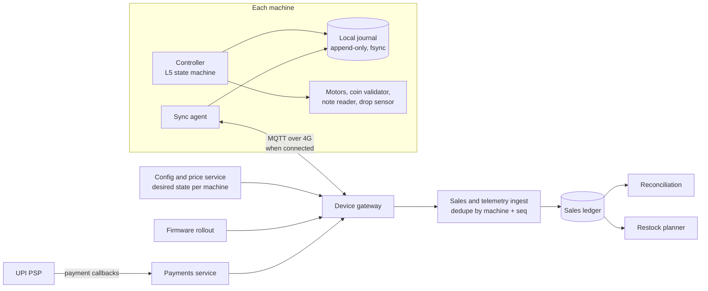

# Vending Machine — L6 (Staff) LLD Interview

> **Level expectation:** the L5 machine is correct on its own. Now: *"We operate 10,000 machines across offices, metro stations and hospitals in 40 cities. Networks drop, power cuts happen, prices change, firmware (the software inside each machine) needs updates, cash goes missing, and drivers restock on fixed routes."* You reason about what lives on the machine vs the server, offline-first operation, getting money right across both (reconciliation), safe rollout of config and firmware, payments over flaky networks, fraud signals, using sales data, testing hardware state machines, and what to buy instead of build. Read [L5-senior.md](L5-senior.md) first.

Legend: **🧑‍💼 Interviewer** · **🧑‍💻 Candidate** · **📝 Note** = commentary for you.

---

## 1. The new problems

**🧑‍💼 Interviewer:** You have one good machine. What changes at 10,000?

**🧑‍💻 Candidate:** The per-machine logic stays; what changes is everything *around* it:
1. **We can't see them.** Is A2 empty at Andheri station? Is machine 4,117 even powered on?
2. **We can't touch them.** A price change or a bug fix must reach 10,000 boxes without a technician visit, and without bricking any.
3. **The network is unreliable.** Basements, metro tunnels, a SIM card running out of data. The machine must keep selling offline.
4. **Money crosses two worlds.** Cash is physical (counted by a driver), UPI is digital (settled by a bank). Both must match what the machines logged.
5. **Operations cost money.** Every truck visit costs fuel and a driver's time; visiting a full machine is waste, missing an empty one is lost sales.

---

## 2. Rough numbers

| Quantity | Arithmetic | Result |
|---|---|---|
| Vends per day | 10,000 machines × 100 vends | **1,000,000 / day** |
| Average vend rate | 1,000,000 ÷ 86,400 s | **≈ 12 / s** (peak at lunch maybe 5× ≈ 60 / s) |
| Heartbeats (a small "I'm alive" message, every 5 min) | 10,000 × (24 × 60 ÷ 5 = 288) | **2.88 M / day ≈ 33 / s** |
| Sales data | 1,000,000 × ~300 bytes per event | **≈ 300 MB / day** |
| Cash handled | say 60% cash × 1 M vends × ₹25 average | **≈ ₹1.5 crore / day** (1 crore = 10 million) |

So the throughput is tiny: one small service and one Postgres (a relational database) could ingest it. The hard parts are **correctness under disconnection**, **safe change**, and **money**. Saying that explicitly is the staff signal: don't design a Kafka cluster (a distributed log for very high event rates) for 12 events per second.

---

## 3. The shape of the system



**MQTT** is a lightweight publish/subscribe messaging protocol built for small devices on bad networks: the device keeps one connection to a **broker** (a server that relays messages), and it can resume after drops. The **PSP** (payment service provider) is the company connecting us to UPI.

The rule: **the machine is the source of truth for what happened at the machine; the server is the source of truth for what should happen (prices, config, firmware).** Like Kubernetes: the API server holds the **desired state** (`spec`), the kubelet on each node reports the **actual state** (`status`), and each side reconciles towards the other.

---

## 4. Offline-first: the journal

**🧑‍💼 Interviewer:** The machine has been offline for two days. What does it do?

**🧑‍💻 Candidate:** Keeps selling cash items (UPI needs the network, so the UPI button greys out). Every event is appended to a **local journal** on flash storage (memory chips that keep data without power) before it takes effect, with a per-machine **sequence number** (1, 2, 3...). The L5 audit log becomes this journal ([ledgers & event sourcing](../../concepts/ledgers-and-event-sourcing.md)).

- **Power failure mid-vend.** Before spinning the motor, write `VEND_INTENT(seq, slot, payment, change)` and **fsync** it (force the write to physical storage, not just the OS's memory buffer, see [durability, WAL & snapshots](../../concepts/durability-wal-and-snapshots.md)). After the drop sensor: `VEND_DONE` or `VEND_JAM`. On boot, an intent without an outcome means "we don't know": refund (the coins are still in the escrow holder on most coin mechanisms), mark the slot for inspection, and flag it for reconciliation. Favour the customer: a ₹20 loss is cheaper than a complaint.
- **Sync.** When connected, the sync agent uploads journal entries in batches. The server stores them keyed by `(machine_id, seq)` with a unique constraint, so a batch re-sent after a timeout is harmless: the key is a natural **idempotency key** ([idempotency & delivery semantics](../../../HLD/concepts/idempotency-and-delivery-semantics.md)). A gap in `seq` (got 1–500 and 503) tells the server something is missing; it asks for 501–502.
- **Clocks.** Machine clocks drift and reset after power loss. Order by `seq`, not time; store the machine's timestamp *and* the server's receive time.

---

## 5. Remote prices and config

**🧑‍💼 Interviewer:** Marketing wants cold coffee at ₹30 instead of ₹35 in Mumbai from Monday.

**🧑‍💻 Candidate:** Prices are **config**, versioned and pushed as desired state: `{version: 42, effectiveFrom: Monday 00:00 IST, prices: {B2: 3000}}`. The machine applies a new version **only in `Idle`** (never while someone has money in), journals `CONFIG_APPLIED v42`, and reports its version back. The server dashboard shows "9,870 on v42, 130 behind" (mostly offline machines; they catch up on reconnect). Each sale records the price it was sold at, so later reports don't depend on "what the price was then".

Rollout like a deployment: 1% of machines (a **canary**: a small group that gets the change first so problems show up early) → watch refund and error rates for a day → 10% → 100%. A bad config (price ₹3 instead of ₹30, a typo in paise) is the most likely incident; validate on the server (price within ±50% of last, multiple of ₹1) before it ships.

---

## 6. Reconciliation: does the cash match?

**🧑‍💻 Candidate:** **Reconciliation** means comparing two independent records of the same money and explaining every difference. For each machine, between two cash collections:

```
expected notes  = Σ notes accepted in logged cash sales since last collection
expected coins  = coins in tubes at last visit + coins accepted − change paid − coins refunded
actual          = what the driver's sealed bag contains, counted at the depot (+ tube levels read by the machine)
```

| Difference | Likely cause |
|---|---|
| Actual < expected, one route | Theft (driver or break-in); check door-open events |
| Actual < expected, small, many machines | Validator accepting fakes or miscounting |
| Actual > expected | Sales not yet synced (offline), or journal lost |
| UPI: PSP settlement ≠ logged UPI sales | Missed callbacks, unrefunded late payments |

UPI reconciles against the PSP's daily **settlement report** (the file listing every payment and refund it moved). The industry also has a standard machine audit format, **DEX/EVA-DTS** (a text file of counters per product and coin, read by a handheld at the machine); I know it exists but haven't verified its current version details.

---

## 7. Firmware updates without bricking machines

**🧑‍💻 Candidate:** A **bricked** machine (one that won't boot after a bad update) needs a technician visit: ₹ and days of lost sales. So:
- **A/B partitions:** two copies of the firmware on flash. Install the new one on the inactive slot, reboot into it, and run a **health check** (motors respond, validator talks, journal readable, server reachable). Fail → the bootloader (the tiny program that starts the main firmware) switches back to the old slot automatically. Same idea as a Kubernetes rollout stopping when a readiness probe (its check that a pod can take traffic) fails.
- **Staged rollout:** canary → 10% → 100%, with automatic pause if jam rate, refund rate or crash count rises. Never more than a few % of a single city at once (**blast radius**: how much breaks if this goes wrong).
- **Install only in `Idle` or `Maintenance`**, at night, with the journal flushed. The update itself is a small state machine: `DOWNLOADED → VERIFIED (signature check) → INSTALLED → BOOTED → HEALTHY | ROLLED_BACK`.
- **Signed images**: the machine verifies a cryptographic signature (proof, checkable with our public key, that we built this file) before installing, so nobody can push their own firmware.

---

## 8. UPI over flaky networks

**🧑‍💼 Interviewer:** The customer approves UPI, the bank debits them, and the machine's 4G drops.

**🧑‍💻 Candidate:** The PSP calls *our server*, not the machine. The payments service records `PAID` and pushes it to the machine. Cases:

| Situation | Handling |
|---|---|
| Machine online | Push arrives in < 1 s, vend as in L5 |
| Machine offline at callback | Server holds the order `PAID, NOT_DELIVERED`; the machine's 120 s UPI timeout closes the order locally |
| Machine reconnects, syncs `ORDER_ABANDONED` | Server sees PAID + ABANDONED → **auto-refund** via the PSP's refund API, keyed by the order ID |
| Callback never arrives | Server polls the PSP's **status-check API** (an endpoint that answers "what happened to order X?") for orders PENDING > 2 min; final answer decides refund |
| Vend done offline? | Never: UPI vends need a confirmed `PAID` at the machine; no confirmation, no motor |

This is a **saga** with a compensating refund ([sagas & distributed transactions](../../../HLD/concepts/sagas-and-distributed-transactions.md)). Auto-refund also has a regulatory side: RBI rules set deadlines and compensation for failed digital payments where the customer was debited (its 2019 turnaround-time circular; check the current version). So the refund timer is a business requirement, not a nice-to-have.

---

## 9. Fraud and tamper signals

| Signal | Possible meaning |
|---|---|
| Door opened outside a scheduled visit | Break-in or unscheduled access |
| Jam-refunds concentrated on one slot / one time of day | Someone triggering the sensor to get refunds, or a real mechanical fault |
| Spike in validator rejections | Fake coins ("slugs") being tried |
| Tilt / shake sensor events | Rocking the machine to drop items |
| Cash shortfall pattern following one driver | Internal theft |
| Many UPI orders abandoned, then paid late | Customers gaming the refund path, or a PSP latency problem |

These are metrics and alerts, not code in the machine: ship the raw events, detect centrally ([observability](../../../HLD/concepts/observability.md)).

---

## 10. Restocking from sales data

**🧑‍💻 Candidate:** Per slot, sales rate (items/day, by weekday) → **days until empty**. A machine needs a visit when any important slot empties before the next planned route, the note stacker is nearly full, or the coin float is low (the "exact change only" light costs sales). Pick tomorrow's machines by expected lost sales, then solve the route. The full problem is a **vehicle routing problem** (find the cheapest set of routes visiting all chosen stops), which is NP-hard (no known fast exact algorithm), so use heuristics or an off-the-shelf solver (e.g. Google OR-Tools). The driver's handheld gets a **pick list** (exactly what to load for each machine), so trucks carry the right stock.

---

## 11. Testing hardware state machines

| Technique | What it catches |
|---|---|
| **Simulator** (fake `Dispenser`, coin validator, clock, network) | Logic bugs; runs thousands of sessions in seconds, as in our tests |
| **Property-based / model-based tests** (generate random event sequences from the state diagram, check invariants like money conservation) | Paths nobody thought to write a test for |
| **Fault injection**: cut power after every journal write, drop every Nth network message, duplicate callbacks | Recovery and idempotency bugs |
| **Hardware-in-the-loop rig**: a real controller and motor board on a bench, driven by scripts | Timing, sensor noise, driver bugs |
| **Field canary** | Things only real sites show (heat, dust, cheap SIMs) |

---

## 12. Build vs buy

| Piece | Option | Note |
|---|---|---|
| Machine + controller | Buy from a vending OEM (original equipment maker) | They speak standard peripheral protocols (MDB, a common bus between controller and coin/card devices) |
| Cashless + telemetry | Vending telemetry/cashless vendors (e.g. Nayax, Cantaloupe) | Dashboards, card readers, DEX collection out of the box |
| UPI | A payment aggregator / PSP | Never integrate with banks directly |
| Device messaging | Managed MQTT (e.g. AWS IoT Core) or a self-run broker | Device identity, certificates, offline queues |
| Firmware OTA (over-the-air updates) | Existing OTA frameworks (e.g. Mender, SWUpdate) with A/B support | Rollback is hard to get right yourself |
| **Build** | Pricing/config service, reconciliation, restock planning, fraud rules | This is where our business is different |

---

## 13. Curveballs

**🧑‍💼 Interviewer:** "Machine 4,117 shows 0 sales today."

**🧑‍💻 Candidate:** Distinguish *quiet* from *broken*: last heartbeat age (offline?), last journal seq (selling but not syncing?), door/maintenance state, sold out, "exact change only" stuck on. A **dead man's switch** alert (fires when expected activity *doesn't* happen): a busy site with no vend in 4 hours during office time.

**🧑‍💼 Interviewer:** A city-wide price typo went out: everything at ₹1.

**🧑‍💻 Candidate:** Roll back the config version (machines keep the previous one and switch on command); the canary stage should have caught it from the revenue-per-vend metric. Sales at ₹1 are recorded with their price, so finance sees the exact loss.

---

## 14. What the interviewer was evaluating (L6)

- [ ] Numbers showing throughput is trivial; focus on disconnection, change safety, money
- [ ] Machine = truth for events, server = truth for desired config; desired vs reported state
- [ ] Offline journal with fsync'd vend intent; power-cut recovery policy; idempotent sync by `(machine, seq)`
- [ ] Config applied only in Idle; canary rollout; server-side validation
- [ ] Cash and UPI reconciliation with explained differences
- [ ] A/B firmware with health check and automatic rollback; signed images; staged rollout
- [ ] UPI saga: server-side callbacks, status polling, auto-refund for paid-but-not-delivered
- [ ] Fraud signals as central analytics; restock planning from sales rates; layered testing; build vs buy

## 15. Common mistakes at this level

| Mistake | Why it hurts at L6 |
|---|---|
| Machine asks the server before every vend | Every network blip stops cash sales |
| Pushing price changes that apply mid-transaction | Customer inserts ₹35, price becomes ₹30, unclear refund |
| Sync without sequence numbers | Retries double-count sales; gaps go unnoticed |
| Firmware update with no rollback path | One bad build = thousands of truck visits |
| Trusting timestamps from machines | Clocks reset; order by sequence |
| No refund path for "paid but abandoned" UPI | Debited customers, regulatory exposure |
| Building telemetry, cashless and OTA in-house first | Years of solved problems; build the business-specific parts |
| Designing for millions of events per second | 12 per second; spend the effort on correctness |

⬅️ Previous: [L5-senior.md](L5-senior.md) · 🏠 [Problem overview](README.md)
