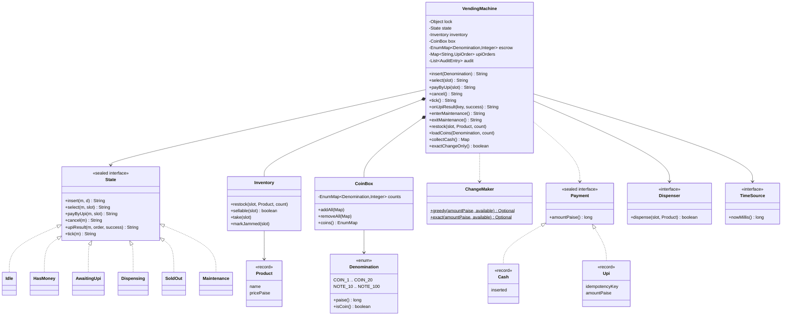

# LLD Interview: Design a Vending Machine

> "Design the software for a vending machine. It accepts coins and notes, sells items from slots, gives change, and supports cancel. Then: what if it can't make change, the item jams, two buttons are pressed at once, or the customer pays by UPI?"

The classic interview for the **State pattern**, and a good one because the states are real (you can stand in front of the machine and see them). Under the surface it teaches four lessons that come back in much bigger systems: **money as integers**, **change-making with a limited coin supply** (greedy is wrong; bounded dynamic programming is right), **ordering side effects** (plan → act → commit, refund on failure), and **payments that arrive late or twice** (idempotency). L6 takes it to a fleet of 10,000 machines: offline-first sync, reconciliation, firmware rollout. It pairs with the Video Streaming HLD interview (roadmap #10): the same "explicit states and transitions" thinking.

> 💡 **Terms in one line each** (details in the files):
> **State pattern**: one class per state; each class handles events its own way. **Escrow**: inserted money held apart until the sale finishes. **Paise**: 1/100 rupee; we store money as whole paise in a `long`. **Greedy change**: biggest coin first; fails with limited coins. **Bounded DP (dynamic programming)**: fill a table "fewest coins for each amount" without using more coins than we have. **Drop sensor**: an infrared beam that sees whether the item fell. **UPI callback**: the payment provider's message saying "paid" or "failed". **Idempotency key**: a unique ID that makes a repeated message harmless. **Reconciliation**: comparing two independent records (cash counted vs sales logged) to find gaps. **Telemetry**: data a device reports about itself (sales, faults, temperature). **Firmware**: the software running inside a device.

## How to read this folder

> 👉 **Haven't thought about what's inside a vending machine? Start with [00-understand-the-product.md](00-understand-the-product.md).** It walks through a week of complaints about an office snack machine and shows the state diagram.

| File | Level | What "good" looks like |
|---|---|---|
| [00-understand-the-product.md](00-understand-the-product.md) | Everyone, first | Know the features (change, cancel, exact change only, jams, UPI, timeouts, maintenance) and why each exists |
| [L4-mid.md](L4-mid.md) | Mid / SDE2 | Clean entities (enum denominations in paise, Product record, inventory, coin box), State pattern instead of an if/else maze, greedy change from a limited coin box, class + state diagrams |
| [L5-senior.md](L5-senior.md) | Senior | Greedy counterexample → bounded DP; refuse dead-end money before accepting; plan change before the motor, commit after the drop sensor, refund on jam; one lock + a Dispensing state (motor runs outside the lock); timeout with an injected clock; sealed `Payment` with UPI pending → paid/failed and idempotent callbacks; audit log; money-conservation tests |
| [L6-staff.md](L6-staff.md) | Staff | 10,000 machines: telemetry, remote price/config rollout, offline-first sales journal and sync, cash reconciliation, firmware updates with rollback, tamper/fraud signals, UPI over flaky networks, restock routing from sales data, testing hardware state machines, build vs buy |

## Code (runnable, no dependencies)

| | Run | Files |
|---|---|---|
| ☕ Java 21 | `./java/run.sh` | [java/src/vending/](java/src/vending/): `VendingMachine`, `State` (Idle, HasMoney, AwaitingUpi, Dispensing, SoldOut, Maintenance), `ChangeMaker` (greedy + exact), `CoinBox`, `Inventory`, `Denomination`, `Product`, `Payment` (Cash, Upi), `Dispenser`, `TimeSource` + `ManualTimeSource`; 18 tests in `VendingTests.java`; `Demo.java` prints one morning at the machine plus its audit log |
| 🟨 Node 22 | `cd js && node --test` | [js/vending.js](js/vending.js), [js/vending.test.js](js/vending.test.js) (same design; the motor is an `await`, 9 tests) |

**Design for testability:** the hardware (`Dispenser`) and the clock (`TimeSource`) are interfaces. Tests pass a lambda that returns `false` to simulate a jam, a dispenser blocked on a latch (a `CountDownLatch`: a gate threads wait at until it is opened) to freeze the machine mid-vend, and a `ManualTimeSource` to jump 60 s ahead instantly. Only two tests use real threads, both deterministic (latches, no sleeps).

## Class diagram (matches the code)

## Libraries & concepts used

**Java:** [Enums & EnumMap](../../libraries/java/enums-and-enummap.md) · [Records & immutability](../../libraries/java/records-and-immutability.md) · [Sealed interfaces & pattern matching](../../libraries/java/sealed-interfaces-and-pattern-matching.md) · [BigDecimal & money](../../libraries/java/bigdecimal-and-money.md) · [Locks & synchronized](../../libraries/java/locks-and-synchronized.md) · [Time & Clock](../../libraries/java/time-and-clock.md)

**JS:** [Money & numbers in JS](../../libraries/js/money-and-numbers-in-js.md) · [Classes & private fields](../../libraries/js/classes-and-private-fields.md) · [node:test runner](../../libraries/js/node-test-runner.md)

**Concepts:** [State machines](../../concepts/state-machines.md) · [Design patterns](../../concepts/design-patterns.md) · [Coin change & dynamic programming](../../concepts/coin-change-and-dynamic-programming.md) · [Greedy algorithms](../../concepts/greedy-algorithms.md) · [Splitting money & rounding](../../concepts/splitting-money-and-rounding.md) · [Single-writer principle](../../concepts/single-writer-principle.md) · [Thread-safety basics](../../concepts/thread-safety-basics.md) · [Ledgers & event sourcing](../../concepts/ledgers-and-event-sourcing.md) · [OOP modelling](../../concepts/oop-modeling.md) · [SOLID principles](../../concepts/solid-principles.md) · [Big-O complexity](../../concepts/big-o-complexity.md) · [UML class diagrams](../../concepts/uml-class-diagrams.md)

**Related (HLD):** [Idempotency & delivery semantics](../../../HLD/concepts/idempotency-and-delivery-semantics.md) · [Sagas & distributed transactions](../../../HLD/concepts/sagas-and-distributed-transactions.md) · [Observability](../../../HLD/concepts/observability.md)

**Related LLD interviews:** [Parking lot](../parking-lot/README.md) (entities, enums vs inheritance, fees) · [Elevator system](../elevator-system/README.md) (another hardware state machine) · [Splitwise](../splitwise/README.md) (money as integer paise)

## The core insight

1. **The machine is a state machine; write it as one.** Six named states, each a small class that says what it does with each event. Impossible situations (vending with no money, maintenance mid-sale) become impossible by construction, not by a forgotten `if`.
2. **Change-making is an algorithm question hiding in a design question.** Greedy is optimal only for a canonical coin set with unlimited coins; a real coin box has *counts*, so use bounded DP, and refuse money that can't lead to a sale *before* accepting it.
3. **Plan, act, then commit, and every exit path returns the money.** Escrow holds the customer's exact coins; change is planned before the motor; money and stock move only after the drop sensor confirms; jams, timeouts, cancels and late UPI payments all refund. A conservation test proves it.
